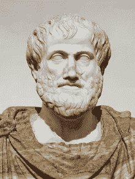

# 我为什么会涉足数据科学？

> 原文：<https://towardsdatascience.com/why-did-i-ever-get-into-data-science-aa69d3c74d19?source=collection_archive---------18----------------------->

## 我不是一个“数字迷”

莱斯·安德森在 [Unsplash](https://unsplash.com?utm_source=medium&utm_medium=referral) 上的照片

# 当你开心的时候，时间过得很快

我一直是一个[反思自己行为](https://medium.com/@erickleppen01/when-i-stopped-procrastinating-2c8988a93cd2)并试图从中吸取教训的人。我在数据科学团队担任产品分析师的新职业生涯已经超过 90 天了，所以我认为是时候做一些反思和思考了，为什么我决定颠覆我美好而稳定的生活，走上一条艰苦工作、奋斗和数字的漫长道路。

# 它从数据开始

我决定转变生活的核心是我对数据的热爱。我喜欢收集它。我喜欢清理它。我喜欢看着它。我喜欢和数据打交道！我对数据的热爱源于两个种子:

> 我喜欢股票市场。我找到了一份软件技术支持的工作。

## 两颗种子发芽了

小时候，我记得听到父母一直在谈论市场。我爸爸总是播放新闻，并在早餐时看报纸上的每日报价。我在年轻的时候接触了股票市场这个创造财富的引擎，我对通过拥有一家公司的一部分来赚钱的想法着迷了。我还没有成为一个伟大而富有的投资者，但我确实尝试过一段时间的日内交易，并接受了一群交易者的指导。他们让我接触到一些昂贵的数据…

大约一年前，我在一家软件公司找到了一份技术支持的工作，在那里我学习了 SQL 的基础，对计算机科学有了兴趣，并接触了软件开发生命周期。随着我对 SQL 的热爱，我开始在家里创建数据库。

> 我的第一个用例:收集昂贵的股票数据！

[每天，我都会从他们允许我访问的 feed 中手动抓取数据](https://medium.com/@erickleppen01/embracing-manual-data-collection-9ebccbac578d?)。我会把它转储到一个 SQL 数据库中，试图过滤掉噪音，揭示高概率交易。总的来说，它产生了一些好的结果，但当市场环境发生变化时，我的结果就乱了套。

> 我意识到，比起每天交易，我更喜欢创建一个算法来排列和分析我的股票数据。

# 朝着正确方向的努力

在我变得更加精通 SQL 之后不久，我尝试了一下 Python。我看了几个 YouTube 教程，用 [BeautifulSoup](https://www.crummy.com/software/BeautifulSoup/bs4/doc/) 从雅虎搜集了股票数据。我觉得这很酷，但我并不太喜欢。没过多久，我就开始看到“数据科学”这几个字到处冒出来。我想，“我喜欢数据，我喜欢科学，我应该看看这个！”

## 我认识谁？

当时我已经在这家软件公司工作了大约 6 年，我知道我们有一个数据科学团队，所以我决定看看经理是否有兴趣进行一次非正式的聊天。我告诉他我对数据的热情和学习更多数据科学的愿望，我担心我会失败，因为我的背景是技术写作和软件支持，而不是计算机科学和统计...

> 本质上，他让我相信我的背景没有我的好奇心和求知欲重要。

几个月后，在读了几本关于机器学习的入门书籍后，我报名参加了一个分析编码训练营，作为训练自己学习编码的一种手段。MOOCs 是一种很好的学习方式，尤其是如果你有基础的话，但一开始我无法专注足够长的时间来获得很多东西。[如果你正在考虑一个编码营，看看我写的关于我的经历的文章](/enter-analytics-from-boot-camp-to-working-in-data-science-8a5a6f563d7d)。

由 pxhere.com 提供

# 倒带时间很快

当我大约 26 或 27 岁时，我的生活发生了重大转变:

> 我决定认真对待我的激情。

例如，我认识很多人，他们从一个爱好跳到另一个爱好，或者总是被最新的闪亮的东西分心。我没有那样做，而是决定看看我能把我关心的几个爱好推进到什么程度:

[流放之路](https://www.pathofexile.com/)
计算机
写作
数据……*数据科学？*

## 学习编码

我为自己建立的心智框架让我坚持自己的热情并认真对待它们，结合新兵训练营的课堂环境和我的 SQL 经验，让我茁壮成长。我第一个告诉你，我的 python 代码还在新手水平，可能有点超越；不管怎样，我几乎每天都在家里和工作中专心致志地编码，*努力达到下一个级别*。我从新兵训练营毕业才大约六个月，我不仅在一个数据科学团队找到了一份工作，还对通过[媒体和我的博客](https://medium.com/@erickleppen01)与世界分享我的编码项目产生了热情！

# 来回答这个问题

在进入数据科学并失眠[研究算法和我可以用来聚集](/k-means-clustering-chardonnay-reviews-using-scikit-learn-nltk-9df3c59527f3)客户使用数据的新方法之前，我有一个相当甜蜜的生活:很少抱怨，稳定的关系，体面的钱…那么什么给了呢？

> 我看到了成为一个不断发展的领域的一部分的机会，在这个领域中，我可以探索我的激情，并与聪明和志同道合的人在一起。

虽然我不是数据科学家，但我可以和已经成为或想要成为数据科学家的人一起工作，我认为这很棒。不要误解我，我也和许多其他有趣的人一起工作，我努力维持我在公司任职期间建立的友谊。对某件事感到陌生，但有一个希望看到我成功的支持网络，这种感觉很好。这就是我大部分时间在工作和与妻子相处时的感受！

## 剥洋葱皮

除了机会、对数据的热爱和对编码的奉献，我的数据科学决定还有另一个组成部分…我对[修辞理论](https://plato.stanford.edu/entries/aristotle-rhetoric/)的兴趣在大学里激起，并让我走上了获得科学和技术通信学位的道路。

> 数据科学和数据分析为我提供了新的工具，我可以用这些工具来启发观众。

[亚里斯多德](https://plato.stanford.edu/entries/aristotle-rhetoric/)

# 包装东西

虽然标题有点“点击诱饵”，但在我在数据科学团队度过头 90 天后，我不得不反思我为什么会涉足数据科学。虽然感觉要学的信息太多了，但我很高兴自己完成了这个转变。总的来说，是我对数据的热爱、对学习的执着、支持性的关系，以及我的激情组合，让我这个不喜欢数字的人变成了一个从事数据科学的人。查看我的 GitHub 和关于我最新项目的文章:

 [## 弯曲游戏-概述

### 在 GitHub 上注册你自己的个人资料，这是托管代码、管理项目和构建软件的最佳地方…

www.github.com](https://www.github.com/bendgame) 

# 谢谢大家！

*   *如果你喜欢这个，* [*关注我的 Medium*](https://medium.com/@erickleppen) *了解更多*
*   [*通过订阅*](https://erickleppen.medium.com/membership) 获得完全访问权限并帮助支持我的内容
*   *我们连线上*[*LinkedIn*](https://www.linkedin.com/in/erickleppen01/)
*   *用 Python 分析数据？查看我的* [*网站*](https://pythondashboards.com/)

[**—埃里克·克莱彭**](http://pythondashboards.com/)

 [## Python 中的仪表盘，适用于初学者和使用 Dash 的其他人

### 使用 Python 中的 Dash 初学者教程构建一个基本的和高级的仪表板

medium.com](https://medium.com/swlh/dashboards-in-python-for-beginners-and-everyone-else-using-dash-f0a045a86644)  [## 成为数据科学领域新产品分析师的 4 个成功秘诀

### 帮助我在数据科学领域获得早期成功并战胜冒名顶替综合症的 4 个技巧

medium.com](https://medium.com/swlh/4-tips-for-finding-success-as-a-new-product-analyst-in-data-science-30b01e18fa86)