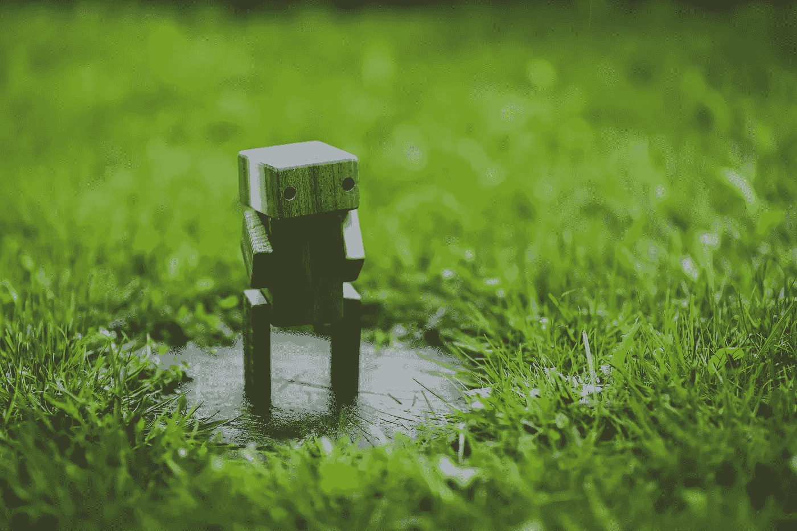
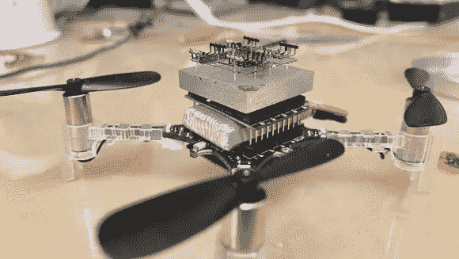

# 为什么数字技术公司要做机器人研究

> 原文：<https://towardsdatascience.com/why-digital-based-technology-companies-do-robotics-research-ff3ef3025d98?source=collection_archive---------51----------------------->

## 在家实现人工智能的目标

> 通过让自主代理与世界互动来学习如何学习。为什么像脸书和谷歌这样的大型科技公司雇佣机器人专家来给他们多余的会议室带来活力。

这最初发表在我的机器人学免费时事通讯上&自动化，民主化的自动化。

 [## 自动化大众化

### 一个关于机器人和人工智能的博客，让它们对每个人都有益，以及即将到来的自动化浪潮…

robotic.substack.com](https://robotic.substack.com/) 

你在哥哥的另一间技术办公室里闲逛，看到一个中等大小的会议室，里面全是机器人。当你拜访朋友，在他们的广告技术创业公司的办公室里尝试新的微型咖啡馆时，这不是你所期望的(嗯，当访问者被允许时)，但这正日益成为现实。

大型科技公司在探索性研究上投入了大量资金(T2，每年 100-200 亿美元，在最大的公司中)，并持有更多资金以备不时之需(苹果、微软、谷歌、亚马逊和脸书共持有[5500 亿美元现金](https://www.fool.com/investing/2020/05/04/5-tech-stocks-with-enough-cash-to-outlast-the-covi.aspx))。就数十亿美元而言，雇佣几个机器人研究人员只是沧海一粟。它也收集了更多的顶尖人才，但我认为这比我考虑的更有助于短期发展。

机器人作为一个行业的前景在未来十年(或者更快，取决于疫情的延续，正如我详细写的)将产生近乎指数级的影响。科技公司希望抓住的部分是那些在你家里实现其算法的机器人。正如我在[中所写的，推荐是一个游戏](https://democraticrobots.substack.com/p/recommendations-are-a-game-a-dangerous)和[自动化](https://democraticrobots.substack.com/p/automated-how-algorithms-shape-a)，

> *一个* ***推荐系统和这些平台的总主题*** *是:*如果我们能预测用户想做什么，那么我们就能把那个特性做成我们的系统。

将这种情况扩展到占据你生活和家庭空间的代理，问题就变得复杂了:如果它能出现并询问你过得如何 ***，那么关闭你的数据或关闭你的应用*就无法逃脱设备。****

我是这些技术的大力支持者，但是为什么大公司在这个领域大量投资的框架(一个重要原因)是重要的。自主代理可以在家中获得更多、更多的巨大收益——包括为独居的高危人群提供安全，帮助做家务，在对话中与你的数字生活(电子邮件)互动，等等。我们需要确保我们的建设是正确的。

来源 Pexels。

# 具身人工智能

给予自主代理人与物理世界互动的能力。

我认为这是一个更加微妙的话题，而不仅仅是翻译人工智能和机器学习的最先进方法——通过身体互动进行学习是我们体验的第一种学习类型。孩子们通过触摸了解新的物体，以及它们如何与他们正在萌芽的生命互动。

尝试在硬件中学习的任务有不同的限制:样本更有价值(我们不能永远运行硬件)，结果可以直观地解释(与人类的操作方式很好地联系起来)，以及学习可能存在的更多证据。我们试图模仿自然，因为它是可行的，但是没有理由机器智能不能远远超越我们人类的学习方式。

构建为硬件**设计的人工智能系统**调整目标和方法，为我们每天都在交互的更多数字人工智能方法创建一个反馈回路，如计算机视觉和自然语言处理。 ***我会继续打开这个盒子*** 学习机器人将如何与传统的机器学习研究协同工作。

所以，我想扩展一下具身 AI 的定义: ***学习如何学习*** *，通过让自主智能体拥有与世界互动的新方式。*

总结一下——[了解脸书在机器人技术方面的努力](https://ai.facebook.com/blog/advancing-ai-by-teaching-robots-to-learn/)、[脸书的室内探索项目(Habitat)](https://aihabitat.org/) 、微软的[公共](https://www.microsoft.com/en-us/ai/ai-lab-intelligent-robotics)、[研究](https://www.microsoft.com/en-us/research/group/air/)网站、苹果的招聘信息，或者[谷歌大脑的机器人团队](https://research.google/teams/brain/robotics/)。亚马逊在这件事上的目标要直接得多(物流、送货、接管更多行业等)。

来源—作者。我正在研究如何安全地让四旋翼飞行器(上图)在人们家里学习飞行。

# 家用机器人的发展前景

这是体现人工智能的地点、时间和方式——我们需要进一步思考的问题。

1.  家用机器人的神秘世界:我们需要解释为什么一些机器人公司给他们的玩具配上人脸是如此疯狂。此外，提问:为什么支援机器人针对的是最脆弱的目标——儿童和老人？
2.  *不要把你的机器人局限于你的世界观*:我们怎样才能改变我们训练和制造机器人的方式，让它们更广泛地发挥作用？
3.  *给算法密钥*:是什么限制了 Alexa et。不要变得非常有用，不要过度安排时间，不要例行采购，等等？不仅仅是隐私问题。
4.  当个人机器人不再糟糕的时候:把所有的部分组合在一起将是一个挑战

来源-作者。