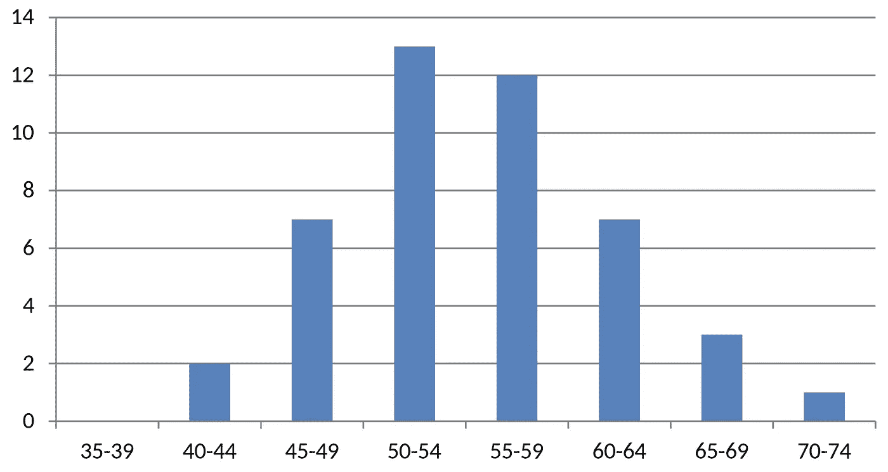
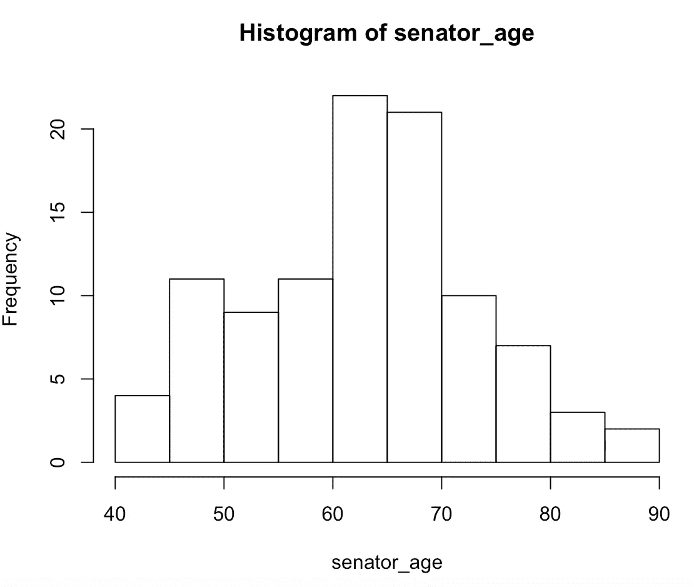
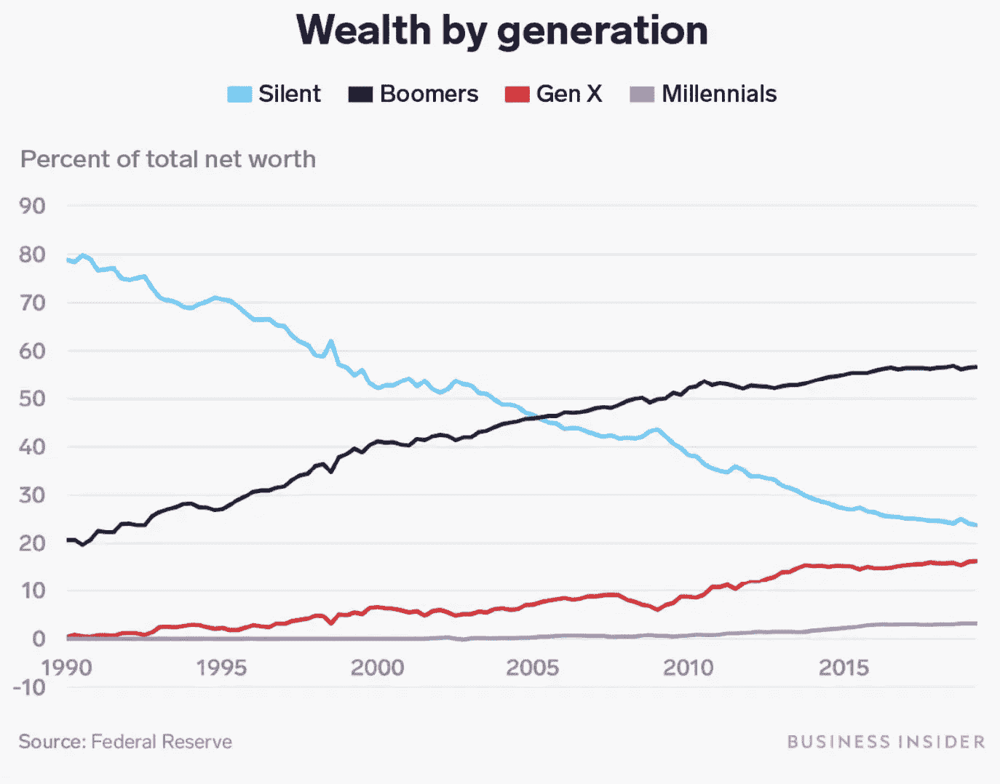
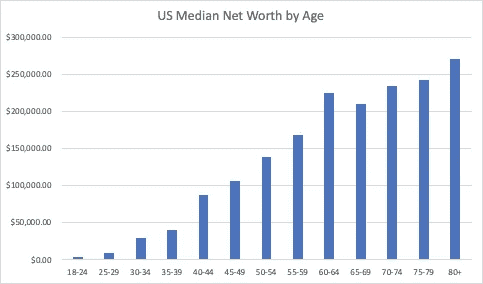
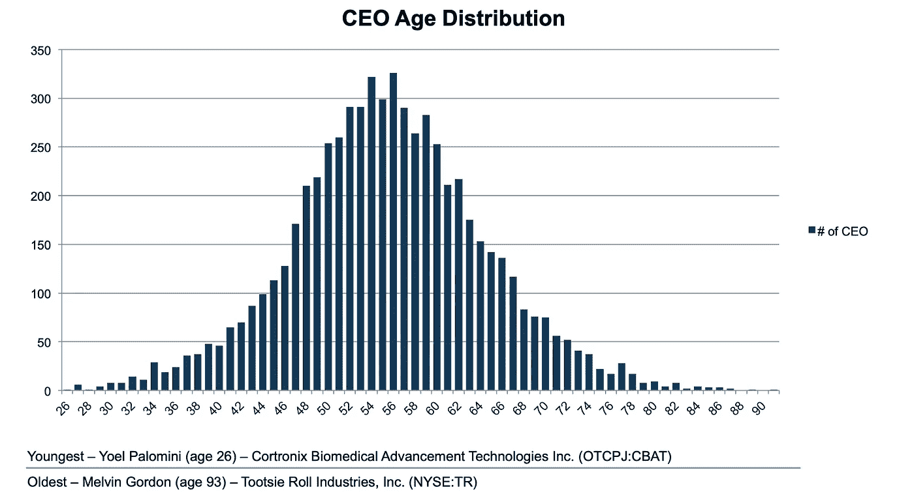
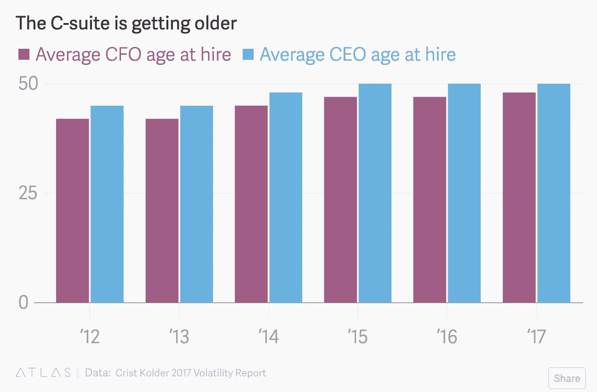
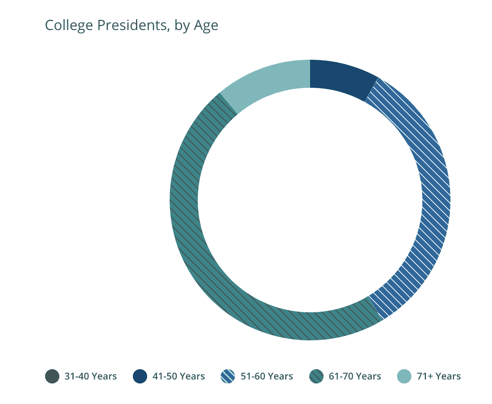

# 为什么婴儿潮一代还在经营一切？

> 原文：<https://towardsdatascience.com/why-do-boomers-still-run-everything-242779108b56?source=collection_archive---------9----------------------->

## 关于婴儿潮一代占社会主导地位的数据

弗拉德·萨尔古在 [Unsplash](https://unsplash.com?utm_source=medium&utm_medium=referral) 上拍摄的照片

既然伊丽莎白·沃伦已经退出了民主党初选，我们知道我们的下一任总统要么是一位超重的 73 岁现任总统(唐纳德·川普)，一位认知能力下降的前副总统(乔·拜登——77 岁)，要么是一位刚刚从心脏病发作中康复的老年参议员(伯尼·桑德斯——78 岁)。

这种令人遗憾的事态只是一个更广泛趋势的最新和最明显的例子——婴儿潮一代[拒绝](https://www.thejakartapost.com/news/2019/11/22/step-aside-boomers-heres-jokowis-new-millennials-team.html)到[步](https://www.telegraph.co.uk/news/religion/10116001/Its-time-we-baby-boomers-stepped-aside.html) [到社会的一边](https://www.telegraph.co.uk/news/religion/10116001/Its-time-we-baby-boomers-stepped-aside.html)。随着现代医学的进步，人们的寿命越来越长，更重要的是工作时间越来越长。这对个人来说很好，但对世界来说却有可怕的后果。以下是婴儿潮一代仍然占据主导地位的 5 个领域，它们阻碍了新一代人和整个人类的进步。

# 1.政治

下面是显示美国总统当选时年龄的直方图。最后一个例外是唐纳德·特朗普，他在 70 岁时进入椭圆形办公室。在特朗普之前，大多数总统(包括像华盛顿、林肯和罗斯福这样的伟人)都是在 50 出头或 50 多岁时就职的。

[https://en . Wikipedia . org/wiki/List _ of _ presidents _ of _ the _ United _ States _ by _ age](https://en.wikipedia.org/wiki/List_of_presidents_of_the_United_States_by_age)

如果民主党在 2020 年获胜，我们最终会有一个头发比 Wilco 音乐会还要白的男人，他的手机可能被编程为使用最大尺寸的字体。虽然年龄只是一个数字，但我认为我们希望总司令的年龄低于 70 岁。

看看政府的其他部门，我们会发现它们同样陈旧过时。现任美国参议员的平均年龄是 63 岁，超过四分之一的人超过 70 岁。

我们的民选官员无法应对现代世界的挑战，这有什么好奇怪的？我们取笑 Ted Stephens 在 2006 年称互联网为“一系列管子”，但我们认为我们现在的代表现在知道得更多吗？技术正在改变我们生活的方方面面，而负责监管技术的人甚至不知道如何下载 Chrome。

# 2.经济

从有线电视到早餐麦片，很多人都在谈论 T2 的千禧一代是如何扼杀一切的。报道不足的是，这有多少应归咎于婴儿潮一代。如果我们看看年轻一代的钱有多少，难怪他们会吝啬在苹果蜂的夜晚。

通过控制政府，婴儿潮一代能够利用他们的政治权力来保护他们的经济利益。2008 年后，联邦政策主要倾向于保护金融资产(股票、债券、房地产等)的价值。).我不认为婴儿潮一代的政治家创造了导致婴儿潮一代资产升值的政策是巧合。通过优先考虑现状和不进行任何结构性改革，美国的不平等已经达到惊人的水平，国家的大部分财富都集中在已经很富有和非常老的人手中。年轻选民中社会主义的[崛起是这种情况的自然结果。](https://progressivebrief.com/millennial-takeover-of-the-media-means-interest-in-socialism-is-here-to-stay/)

数据来自[https://dqydj . com/按年龄划分的资产净值计算器-美国/](https://dqydj.com/net-worth-by-age-calculator-united-states/)

# 3.商业

金融资产的牛市不仅对婴儿潮一代的政治家有利，对婴儿潮一代的首席执行官也是好事。对于美国大公司的领导人来说，平均年龄已经上升到 56 岁，许多人现在已经 70 多岁了。

[https://www . alvarezandmarsal . com/sites/default/files/files/Age-CEO-CFO-COO . pdf](https://www.alvarezandmarsal.com/sites/default/files/files/Age-CEO-CFO-COO.pdf)

此外，趋势显示，高管年龄持续增长。

就我个人而言，我不会把这归咎于某些道德上的失败，比如高管拒绝退休。然而，我确实担心这种古老的血统会减缓经济的发展。新公司成立率处于历史低点。企业似乎越来越[陷入短期思维](https://clsbluesky.law.columbia.edu/2017/10/18/is-corporate-short-termism-on-the-rise-in-the-u-s/)，为下一个季度而不是未来十年做计划。

即使在专业人士中，平均年龄也上升了。现在 30%的医生都超过 60 岁了。律师事务所没有扩大年轻合伙人的队伍。我们到处都能看到老年人使用旧的思维方式，并且没有为新的问题做好计划。

# 4.大学

如果年轻人控制了竞争机构，婴儿潮一代对企业和政府的统治就不会如此令人担忧。例如，美国大学系统是国家的一个独立支柱，通过研究项目和技术发展为我们的经济成功提供基础。

唉，我们在这里也看到了下降。在这十年里，大学被各种问题所困扰，比如学费飞涨、管理人员激增，以及研究中的治理问题，这些问题导致了像[复制危机](https://en.wikipedia.org/wiki/Replication_crisis)这样的事情。

这可能是巧合，但所有这些负面趋势都与大学校长的老龄化相吻合。美国教育委员会的研究表明，绝大多数大学校长都超过了 60 岁。

[https://www.aceacps.org/summary-profile/#demographics](https://www.aceacps.org/summary-profile/#demographics)

大学是未来伟大想法诞生的地方。同样是那些在 60 年代抗议像越南战争这样的重大问题的婴儿潮一代，现在正在对学生们穿什么样的万圣节服装实施严格的规定。

# 5.报刊

我们社会的第四等级传统上被赋予了控制过度权力的责任。鲍勃·伍德沃德和卡尔·伯恩斯坦一起揭露水门事件时 29 岁(1972 年 28 岁)。同年，亨特·S·汤普森 35 岁，他写下了开创性的“[竞选中的恐惧和厌恶](https://en.wikipedia.org/wiki/Fear_and_Loathing_on_the_Campaign_Trail_%2772)”。我们最著名的记者现在年纪大了很多，作品也少了很多。

例如,《纽约时报》一半的专栏作家——塑造国家叙事的人——是婴儿潮一代。像保罗·克鲁格曼(67 岁)和托马斯·弗里德曼(66 岁)这样的老人把 NYT 观点作家的平均年龄提高到 53 岁以上。虽然《纽约时报》仍会报道重大新闻，但当今的重大事件往往由局外人来处理。充满高薪婴儿潮一代的新闻机构积极地[错误地对待伊拉克](https://en.wikipedia.org/wiki/Friedman_Unit)和[对国家安全局窃听事件](https://en.wikipedia.org/wiki/NSA_warrantless_surveillance_(2001%E2%80%932007))坐视不管，而不是向公众报道。

当“灰色女士”让新贵出版物失去流量，并吸收他们最优秀的人才时，很明显，整个新闻业被老一辈人所控制。将财富和权力集中在老年人身上的同样的结构性问题，也将人们的注意力集中到了由旧领导人领导的旧机构。

# 最后的想法

2020 年的世界正在快速变化。美国正在失去经济和政治实力，技术进步正在彻底改变每个行业，气候变化和病毒性流行病等全球性问题威胁着我们的生活方式。我认为这些新问题需要新鲜血液来面对。

去年流行的“ [Ok Boomer](https://en.wikipedia.org/wiki/OK_Boomer) ”模因不是对老年人的肤浅批评，而是对我们社会的权力结构存在严重问题的最终承认。我们所依赖的系统和机构在物理上和隐喻上都僵化了。它们导致了影响到每个人的问题，从大学生到退休老人。只有用新的思维和新的想法，我们才有希望面对我们面临的挑战。