# 为什么 GANs 需要这么多噪音？

> 原文：<https://towardsdatascience.com/why-do-gans-need-so-much-noise-1eae6c0fb177?source=collection_archive---------10----------------------->

## 形象化甘人如何在低维潜在空间中学习

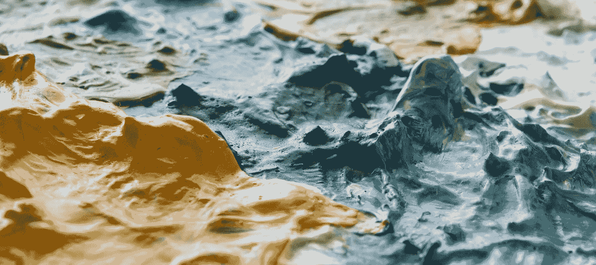

图片来源:[像素](https://www.pexels.com/photo/acrylic-art-chaos-chaotic-989580/)

生成对抗网络(GANs)是一种在给定一组旧的“真实”样本的情况下生成新的“虚假”样本的工具。这些样本实际上可以是任何东西:手绘数字、脸部照片、表现主义绘画，你能想到的都有。为此，GANs 学习原始数据集背后的底层分布。在整个训练过程中，生成器逼近这个分布，而鉴别器告诉它哪里出错了，两者通过军备竞赛交替改进。为了从分布中抽取随机样本，给发生器随机噪声作为输入。但是，你有没有想过为什么 GANs 需要随机输入？常见的答案是“所以它们不会每次都生成相同的东西”，这是真的，但答案比这稍微微妙一些。

# 随意采样

在我们继续 GANs 之前，让我们绕道考虑从正态分布中抽样。假设你想用 Python 来做这件事，但是你从来没有读过`numpy`文档，也不知道`np.random.normal()`的存在。相反，你所要做的就是`random.random()`，它在区间(0，1)内均匀地产生值。

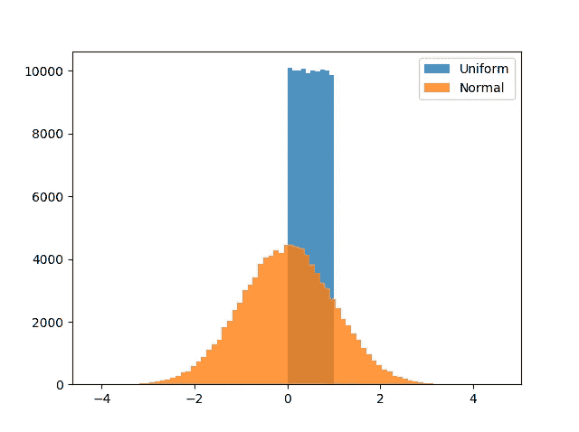

图 1:从我们的输入均匀分布(蓝色)和目标正态分布(橙色)中抽取的 100k 个样本的直方图。

简而言之，我们希望将图 1 中的蓝色分布转换成橙色分布。幸运的是，有一个函数可以做到这一点:*逆累积分布函数*，也称为[分位数函数](https://en.wikipedia.org/wiki/Quantile_function)。图 2 中所示的(非反转)累积分布函数(CDF)描述了对于某些指定的 *x* ，从所讨论的分布中抽取的任何随机值将等于或小于 *x* 的概率。

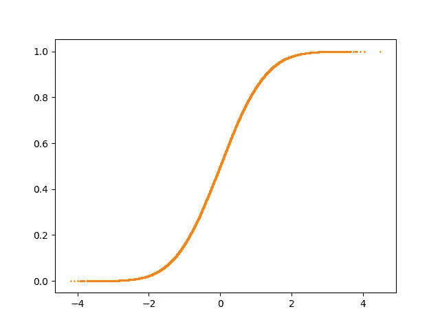

图 2:标准正态分布的 CDF。

例如，在图 2 中的点 *x=0* ，y = 0.5；这意味着 50%的分布低于零。CDF 的一个便利特性是输出范围从 0 到 1，这正是我们从`random.random()`函数中获得的输入！如果我们将 CDF 倒置(翻转过来)，我们得到分位数函数:

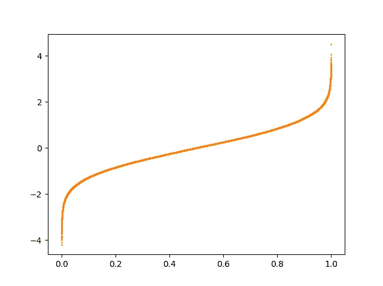

图 3:标准正态分布的分位数函数。

这个函数给出了分位数(我们的 *x* ，范围从 0 到 1)和正态分布中相应值之间的精确关系，允许我们直接从正态分布中采样。即 *f(random.random()) ~ N(0，1)，*其中**输入空间中的每个点对应输出空间中的一个唯一点**。

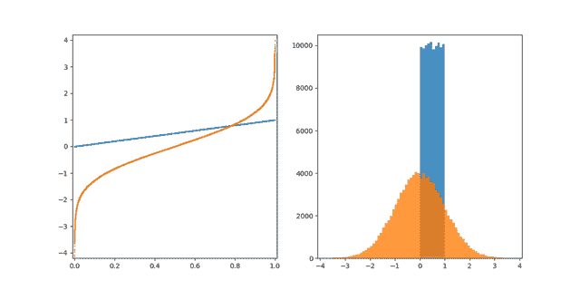

图 4:说明使用分位数函数将均匀分布(蓝色)映射到正态分布(橙色)的动画。

## 这和甘斯有什么关系？

在上面的场景中，我们拥有分位数函数，但是如果我们没有，并且必须学习从输入空间到输出空间的映射，那该怎么办呢？这正是 GANs 要解决的问题。在[之前的文章](/training-a-gan-to-sample-from-the-normal-distribution-4095a11e78de)中，我举例说明了如何使用 GANs 从正态分布中取样，如果你处于数据紧急状态，并且没有可用的分位数函数。在这种情况下，我发现更有帮助的是，不要把 GANs 想象成随机采样的工具，而是把某个 *k* 维*潜在*维(输入)空间映射到某个 *p* 维*样本*维(输出)空间的函数，然后可以用它把潜在空间的样本转换成样本空间的样本。在这种情况下，很像分位数函数，没有随机性。

头脑中有了地图，让我们考虑如何从 2D 正态分布中抽取随机样本，仅将 0 到 1 之间的 1D 随机样本作为输入。

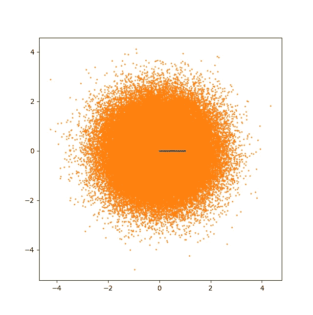

图 5:2D 正态分布(橙色)和 1D 均匀分布(蓝色)，各有 100k 个样本。

我们如何将蓝线中的 100k 个样本映射到橙色斑点中的 100k 个样本？没有什么好办法。当然，我们可以使用[阿砣曲线](https://en.wikipedia.org/wiki/Space-filling_curve)，但是这样我们就失去了有用的属性，即输入空间中的点靠在一起会导致输出空间中的点靠在一起，反之亦然。正是由于这个原因，**GAN 的潜在空间的维数必须等于或超过其样本空间的维数。**这样，函数就有足够的自由度将输入映射到输出。

但为了好玩，让我们想象一下，当只有一维输入的 GAN 被赋予学习多维分布的任务时会发生什么。希望结果不会让你吃惊，但是看起来很有趣。

# 2D 高斯

让我们从图 5 所示的问题开始:将 0 到 1 之间的 1D 范围映射到 2D 正态(或“高斯”)分布。我们将使用一个典型的普通 GAN 架构(代码在文章末尾)。

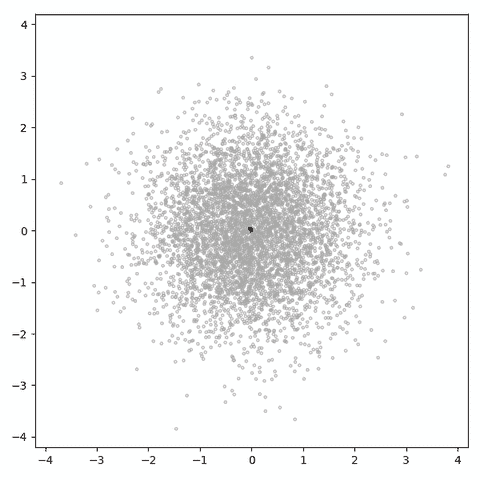

图 6:潜在维度为 1 的 GAN 试图学习 2D 高斯分布。灰点是从真实分布中抽取的样本，红点是生成的样本。每一帧都是一个训练步骤。

如你所见，这可怜的东西不知所措。只有一个自由度，它几乎不能探索样本空间。更糟糕的是，因为生成的样本在 1D 流形中是如此密集(这张 gif 中的灰点和红点一样多！)，鉴别器能够偷懒，从来不需要努力从假货中辨别出真正的点，因此生成器不能获得非常有用的信息(当然也不足以学习空间填充曲线，即使它有这个能力！).

图 6 显示了前 600 个训练步骤。30k 后，结果如下:

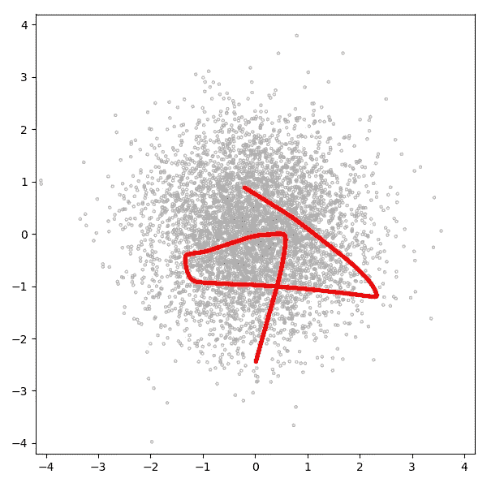

图 GAN 在 30k 训练步骤后从图 6 中学习到的分布。

这是一个可爱的小曲线，但几乎不是高斯分布。GAN 在 30k 步后完全无法学习映射。作为背景，让我们考虑当给定 2D、3D、10D 和 100D 潜在空间以映射到上述分布时，具有相同架构和训练例程的 GAN 的表现如何:

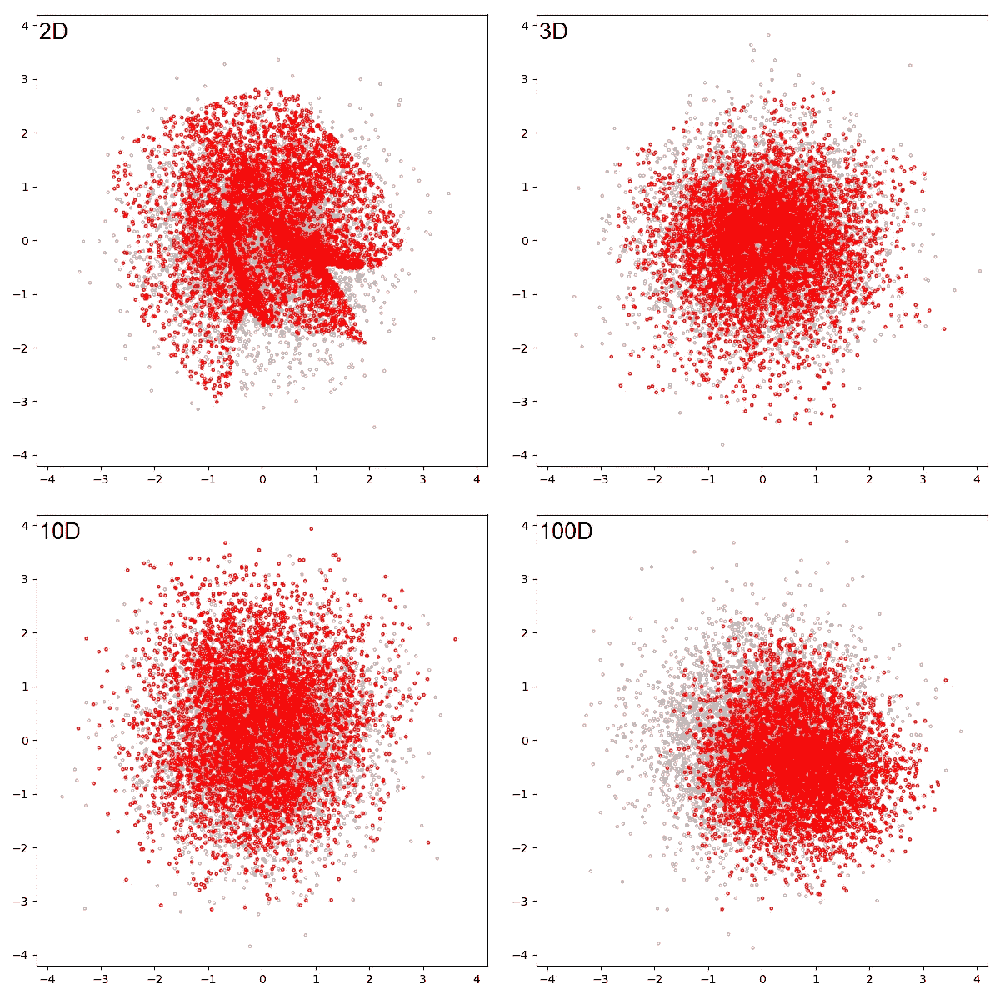

图 30k 训练步骤后，具有 2D、3D、10D 和 100D 潜在空间的 GANs 的输出

2D 潜在空间 GAN 比上面的 1D GAN 好得多，但是仍然离目标分布很远，并且有几个明显的缺陷。3D 和 10D 潜在空间产生具有视觉上令人信服的结果的 GAN，而 100D GAN 产生似乎是具有正确方差但错误均值的高斯分布。但是，我们应该记住，在这个特殊的问题上，高维 GANs 是作弊的，因为许多均匀分布的平均值近似正态分布。

# 八个高斯人

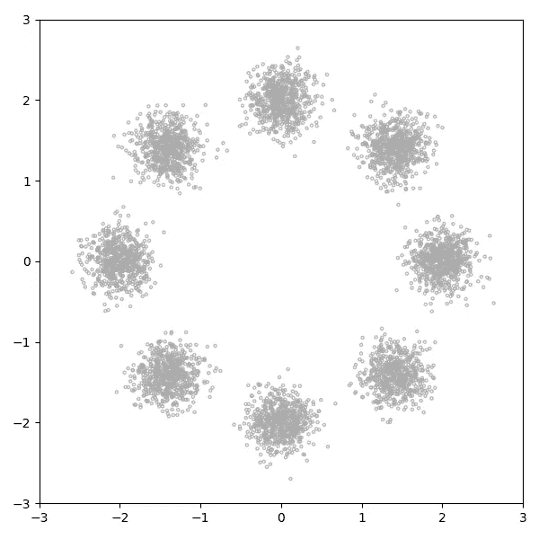

图 9:八个高斯分布

八高斯分布(图 9)就像它听起来的那样:八个 2D 高斯分布围绕原点排列成一个圆，每个高斯分布的方差足够小，几乎不会重叠，并且协方差为零。虽然样本空间是 2D，但该分布的合理编码有三个维度:第一维是离散的，描述模式(编号为 1 到 8)，另外两个分别描述该模式的 *x* 和 *y* 位移。

我用 *latent_dim=1* 对一个 GAN 进行了八步高斯分布 600 步的训练，结果如下:

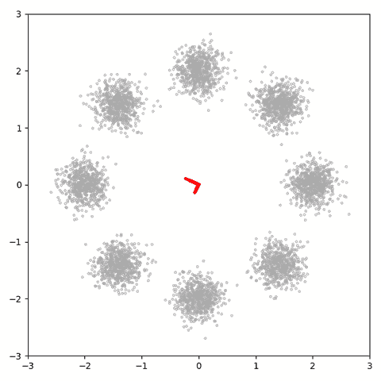

图 10:一个潜在维度为 1 的 GAN 试图学习八高斯分布。灰点是从真实分布中抽取的样本，红点是生成的样本。每一帧都是一个训练步骤。

正如所料，GAN 努力学习有效的映射。30k 步后，这是学习到的分布:

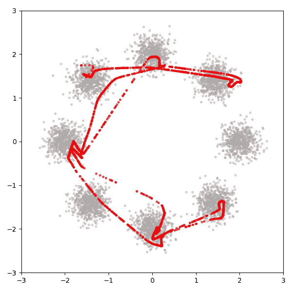

图 11:GAN 在 30k 训练步骤后从图 10 中学习到的分布。

GAN 显然很难将 1D 潜在空间映射到这个 3D 分布:最右边的模式被忽略，模式之间产生了相当数量的样本，样本不是正态分布的。为了进行比较，让我们考虑 30k 步后的另外四个 gan，潜在维度分别为 2、3、10 和 100:

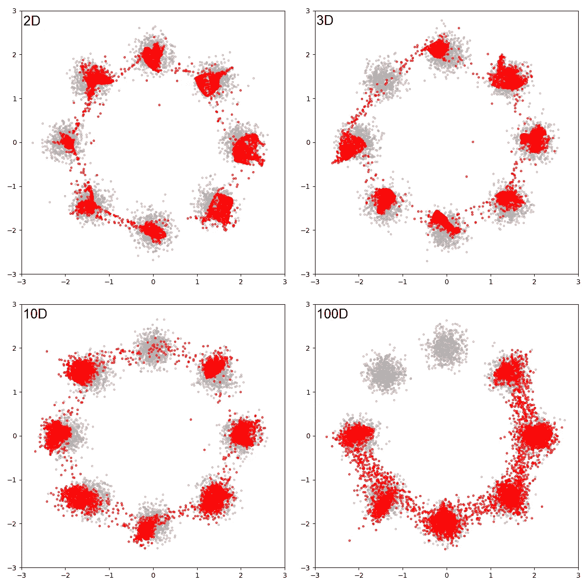

图 12:30k 训练步骤后，具有 2D、3D、10D 和 100D 潜在空间的 GANs 的输出

如果不实际测量真实分布和学习分布之间的 KL 差异，很难判断哪个是最好的(soon™️将在后续文章中推出！)，但低维 GANs 似乎在模式间的负空间产生的样本更少。更有趣的是，2D GAN 没有显示模式崩溃，3D 和 10D GAN 仅显示轻微的模式崩溃，而 100D GAN 在两种模式下都无法产生样本。

# 螺旋形

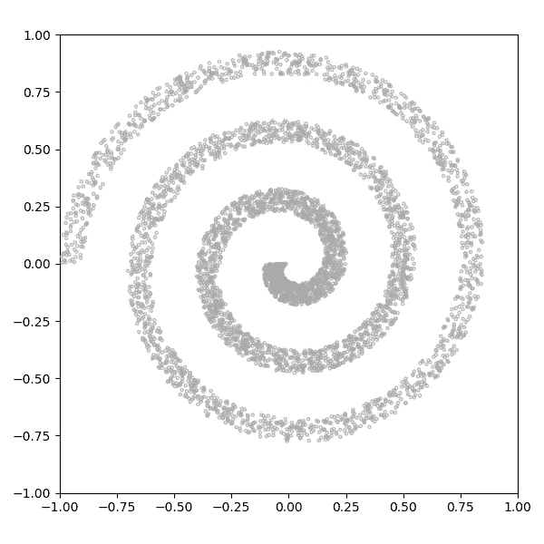

图 13:螺旋分布。随着螺旋从圆向外延伸，密度分布减小，并且在臂的横向上密度是均匀的

图 13 所示的螺旋分布在某些方面比八高斯分布简单。GAN 只有一种模式(虽然拉长和扭曲)，不会被迫离散化其连续输入。可以用两个维度有效地描述它:一个描述沿螺旋的位置，另一个描述螺旋内的横向位置。

我用 *latent_dim=1* 训练了一个 GAN 600 步，结果如下:

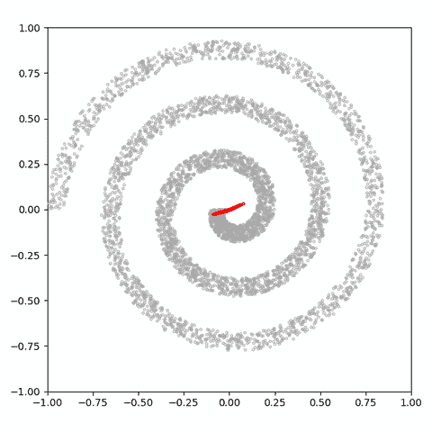

图 14:潜在维度为 1 的 GAN 试图拟合螺旋分布。灰点是从真实分布中抽取的样本，红点是生成的样本。每一帧都是一个训练步骤。

同样，GAN 努力学习有效的映射。30k 步后，这是学习到的分布:

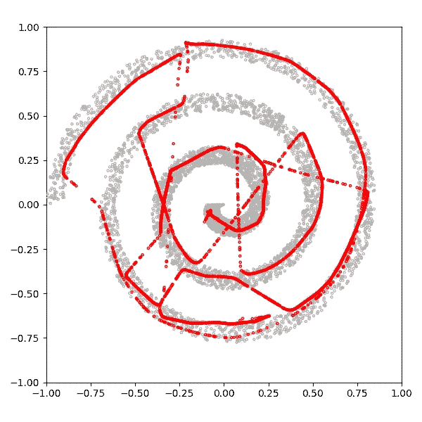

图 15:GAN 在 30k 训练步骤后从图 14 中学习到的分布。

类似于八高斯分布的情况，GAN 在映射螺旋分布方面做得很差。省略了螺旋的两个区域，并且在负空间中生成了许多样本。我在[的另一篇文章](/gans-and-inefficient-mappings-f185fdd62a78)中详细讨论了这个低效的映射问题，所以我在这里不再赘述；相反，让我们考虑另外四个 gan，其任务是在 30k 步后学习该分布，同样具有 2、3、10 和 100 的潜在维度:

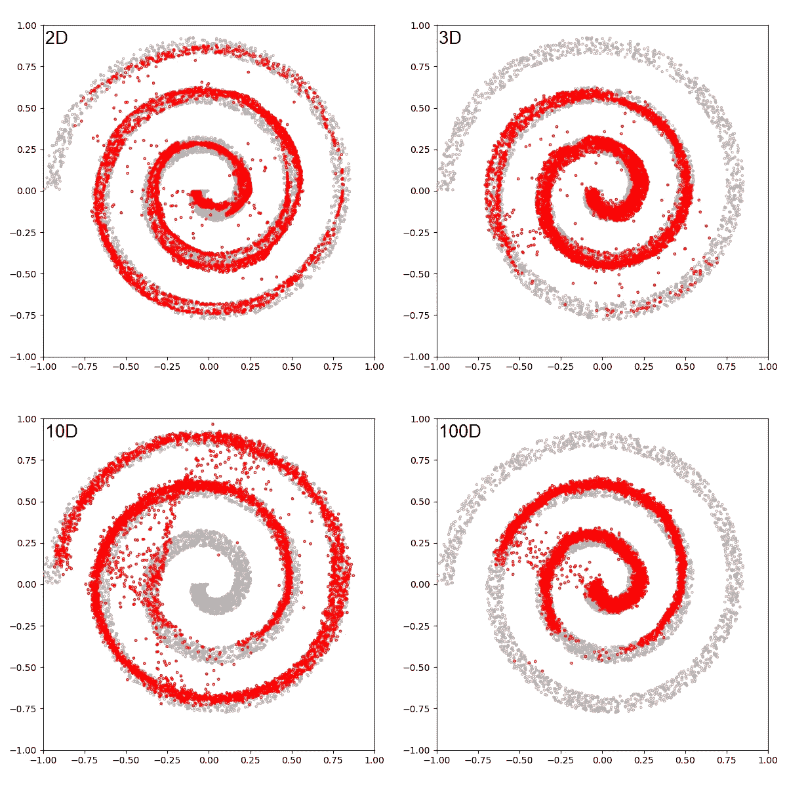

图 16:30k 训练步骤后，具有 2D、3D、10D 和 100D 潜在空间的 GANs 的输出

同样，在没有实际测量 KL 散度的情况下，很难判断哪个是最好的，但是负空间中覆盖范围、均匀性和采样数量的差异是值得考虑的。

# **关闭思路**

人们很容易被 GAN 的热情所吸引，并把它们当作神奇的机器，用随机数作为燃料来弹出新的样本。了解工具的基本工作原理对于有效地使用它和在它出现故障时排除故障是至关重要的。对于 GANs，这意味着理解生成器正在学习从某个潜在空间到某个样本空间的映射，并理解这种学习是如何展开的。将 1D 分布映射到更高维度分布的极端情况清楚地说明了这项任务有多复杂。

本项目中使用的所有代码都可以在以下 GitHub repo 中获得:

 [## ConorLazarou/培养基

### 甘斯和低维潜在空间:可视化甘斯如何学习时，饥饿的随机噪音。

github.com](https://github.com/ConorLazarou/medium/tree/master/12020/visualizing_gan_dimensions)