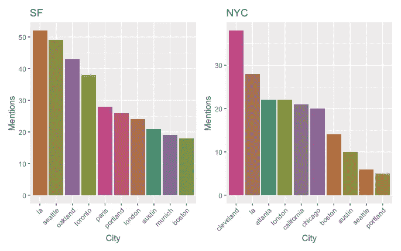
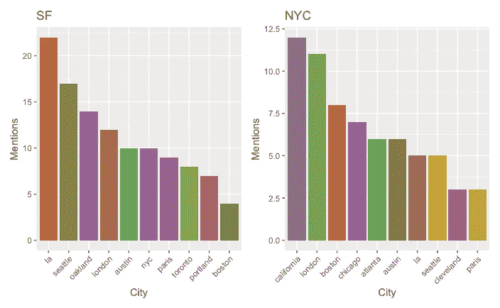
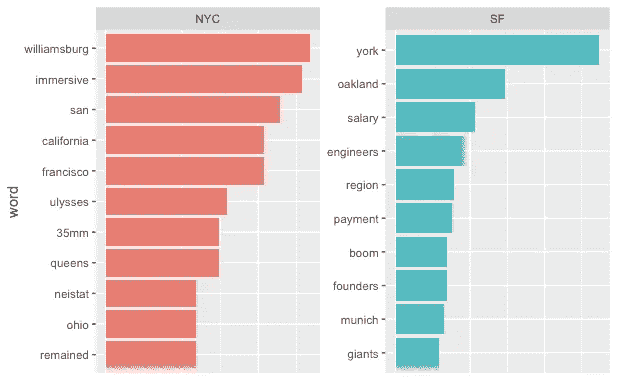
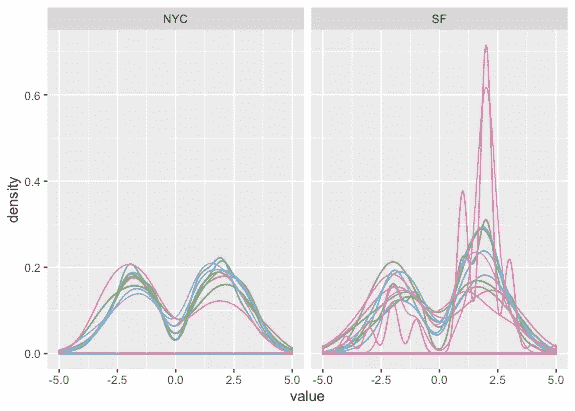

# 为什么人们离开旧金山和纽约？离职技术人员博客帖子分析

> 原文：<https://towardsdatascience.com/why-do-people-leave-san-francisco-and-new-york-city-an-analysis-of-departing-techies-blog-posts-c125b58a0950?source=collection_archive---------31----------------------->

在旧金山或纽约，一个技术兄弟能做的最老套的事情就是离开……并写下自己的经历。

在这两个地方生活过之后，我知道每个地方都有许多人相信他们注定要去这个城市，我想知道“我要离开旧金山”这种陈词滥调的博客帖子实际上有多流行，以及为什么他们会说他们要离开。我对从这两个地方搬走的目的的印象非常简单——人们离开旧金山/纽约是因为那里太贵了，或者他们厌倦了旧金山的单一文化，或者城市基础设施的广泛问题。或者，他们可能更愿意用纽约的金融兄弟来交易旧金山的金融科技加密兄弟。但是这有什么根据吗？如果是这样，我们如何才能发现？

我能想到的回答这些问题的最佳数据集是每个人在离开旧金山或纽约后写的媒体/博客文章。我读过一些，它们听起来很相似，而且很容易刮。

谢天谢地，有两个人已经为旧金山和纽约写了自定义查询(比如“离开旧金山”和“再见旧金山”)的 scrapers(感谢[瑞安·库尔普](https://www.ryanckulp.com/leaving-san-francisco-meta-study/)和[尼克·维图奇](https://nickvitucci.com/blog/leaving-new-york/)！！).他们的数据相当不错，但它只是所有故事中所有单词的聚合。那真的不行，但这是一个很好的开始。在重新搜集和抽查了他们所有的帖子后，我们有所进展。我们现在有 220 个独特的博客帖子，都(至少大致上)与离开旧金山和/或纽约市有关。每个城市大约有 120，000 个单词，大部分是英文的，而且大部分是在过去 5 年里发布的。

现在，我到底想分析什么？我有三个最重要的问题:

*1。人们要搬到哪里去？*

*2。他们为什么要离开旧金山/纽约？*

*3。他们对旧金山/纽约有什么看法？*

## 人们要去哪里？

从大量文本中判断人们去向的最简单方法是统计不同城市的提及次数。这涉及到一些相当基本的正则表达式(当然，我是通过谷歌搜索的，谁真的从头开始做正则表达式呢？)，从各自的博客数据集中删除提及旧金山/纽约的内容，以及一些值得信赖的 tidyverse 工具。由此，我们得到下图。阅读此图的方法是查看标题以确定博主从哪个城市出发，并查看条形图以确定他们要去哪里。所以对于 SF 的博文(左边)，最常提到的就是 LA。

这看起来不对劲。无意冒犯克利夫兰，但无论租金有多便宜，人们都不可能从纽约涌向克利夫兰。这似乎偏向于一两篇反复提到克利夫兰的博文。

下一个最好的努力是只隔离每篇博文中提到的独特城市；由此，我们得到了一个更清晰的故事。

由此看来，似乎旧金山人正在前往其他大中城市，其中 4 个在西海岸(洛杉矶、西雅图、奥克兰、波特兰)，2 个在东海岸(波士顿、纽约)，3 个在国际(伦敦、巴黎、多伦多)。只有 1 个位置在美国中部(奥斯汀)。

纽约看起来相当相似，提到加利福尼亚的次数比旧金山提到纽约的次数多。纽约市还包括了我认为会出现在科幻小说列表中的城市(亚特兰大+芝加哥),奥斯汀在提及频率列表中也表现强劲。克利夫兰榜上有名，但正如预测的那样，使用这种方法排名大幅下降。

这对我来说有足够的意义来证明停在这里是正确的。美国最昂贵的两个城市的人们大多搬到其他稍微便宜的地方，并经常在这两个城市之间调换。“在科技行业工作只是每隔几年就在旧金山和纽约之间搬来搬去，直到你想买房时搬到奥斯汀”这句格言似乎是有道理的。

## 人为什么会离开？

每个在这两个城市生活过的人(或者，老实说，任何了解这两个城市的人)可能都对人们离开这两个城市的原因有一些很好的猜测。他们非常昂贵，肮脏，并且有严重的居住问题(主要是旧金山)。对于年轻的专业人士来说，忽略这些缺点可能很容易，但对于想安定下来的专业人士来说，每年 3 万英镑的学前学费可能会赶走许多人。

确定目的的一种方法是从每个文档中搜索重要的单词或短语，并试图用它来代表人们离开的原因。确定一个单词或短语在一段文本中有多重要的最直接的方法被称为 tf-idf，它代表词频-逆文档频率。基本上，您获取文档中每个术语的频率，并将其与总的术语频率进行比较。我们可以将它视为一种方法，在控制整个博客集的内容的同时，确定单个博客帖子中最重要的词是什么。使用 tf-idf 返回一个代表重要性的数字，它是为下面的每组博客绘制的(横条越大，这个词在博客中的重要性越大)。

我们看到很多地点出现在这些结果中。对于纽约市，我们看到了纽约市周围的一些地方，人们可能会从曼哈顿(昆斯区威廉斯堡)搬到那里，同时验证了早期提到旧金山和加利福尼亚州的独特城市图。我们还看到了著名的 YouTuber Casey Neistat(他最近离开了纽约前往加利福尼亚，关于他离开的博客在数据集中)，俄亥俄州(来自克利夫兰痴迷的随机博客)，以及几个我不完全理解的随机单词(尤利西斯和 35mm，希望是相机而不是手枪)。

旧金山的 tf-idf 结果更令人惊讶。有几个地方提到人们已经离开或正在讨论(纽约，奥克兰)，但关于技术场景的谈话都在这些结果上。创始人，工程师，boom，薪资，支付都打了前几名的成绩。我猜想旧金山关于离开的博客会关注这个城市的负面，但是我们没有看到。

## **感知**

在看到 tf-idf 的结果后，我想知道人们对这个国家最大和最昂贵的城市最常见的负面评价是什么，以及每个正面和负面词汇在每个城市的分布情况。

查看给定文本的情感有几种方法，最常见的一种是将每篇文章中的单词与情感词典进行匹配，情感词典要么有该单词是积极的、消极的还是中性的，要么有一个描述该单词积极或消极程度的数字(5 表示最积极，-5 表示最消极，等等)。在尝试了每种方法后，我发现了每个出发点的积极和消极词汇的分布。

同样，这些结果相当令人惊讶。旧金山图表中有一些非常积极的帖子，但即使除去这些，大多数“我要离开旧金山”的博客都是积极的多于消极的，而纽约的分布更加均匀。这也证实了之前 tf-idf 分析的结果，旧金山的问题可能会让人们离开这个城市，但他们似乎不会在博客上谈论这个问题。

出于我希望显而易见的原因，我不想浏览和阅读数百篇听起来极其相似的博客文章。但相反，我通过计算正面/负面占总博客帖子的百分比，阅读了一些最正面/负面的故事。看看这个比例，我们发现一个相当令人愉快的正面帖子是关于一个软件工程师离开旧金山去多伦多，一个[的帖子是一个作家](https://medium.com/@geoffgates/goodbye-new-york-city-you-bitch-ae92c8b6a1d5)从纽约搬到洛杉矶，还有可能是我读过的最[负面的“离开纽约”博客](https://medium.com/@geoffgates/goodbye-new-york-city-you-bitch-ae92c8b6a1d5)。

我没有对这一点下结论，而是用 OpenAI 的 GPT-2 文本生成算法从我们提取的一组帖子中写了一篇“我要离开纽约”的博文。它是这样写的:

“我的行李已经收拾好了，我正准备把它们拖到外面，拦下一辆出租车，带我去 JFK，这是我最后一次以纽约居民的身份去纽约。我将去洛杉矶，尽管我想多看看我的国家，并和他们保持联系。所以，你们知道，当我回国的时候，我想追随梦想家、倒班工人、艺术家和成就者的脚步，是他们让我们走到了今天。我想和家乡爱我的人保持联系。我想从他们的失败中吸取教训。我要向那些激励过我，激励我达到自己的人致敬。”

更多类似的内容，请在 Twitter 上关注我[或查看我的网站](https://twitter.com/tylerjrichards)！