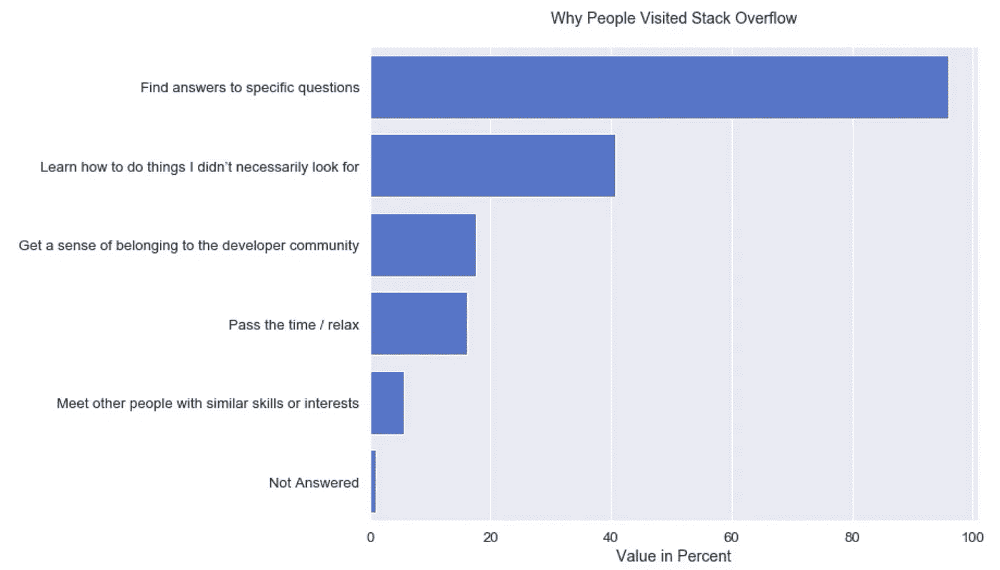
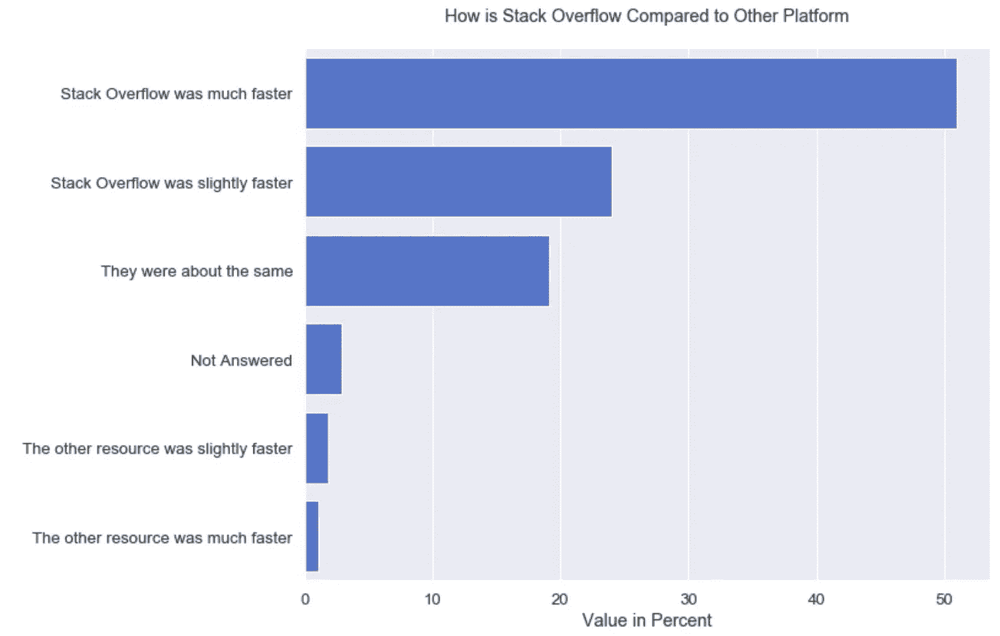

# 为什么有人爱访问栈溢出？

> 原文：<https://towardsdatascience.com/why-do-people-love-to-visit-stack-overflow-8c329866eea6?source=collection_archive---------74----------------------->

## 分析堆栈溢出调查的结果，找出人们为什么喜欢访问堆栈溢出

在 [Unsplash](https://unsplash.com?utm_source=medium&utm_medium=referral) 上由 [Sharon McCutcheon](https://unsplash.com/@sharonmccutcheon?utm_source=medium&utm_medium=referral) 拍摄

Stack Overflow 每年都会举行一次年度开发者调查。这项调查是对全世界编码人员进行的最大、最全面的调查之一。

2019 年是 Stack Overflow 发布年度开发者调查结果的第九年，近 90，000 名开发者参加了这项 20 分钟的调查。这项调查结果涵盖了开发人员的个人资料、工作、技术，以及他们如何与堆栈溢出进行交互和互动。

在这里，我想强调调查中与人们如何处理堆栈溢出相关的部分。尤其是找到人们爱栈溢出的原因。我从调查结果中提取了一个数据集，并使用该数据来回答以下问题:

*   人们多久访问一次 Stack Overflow？
*   开发者为什么要访问堆栈溢出？
*   人们是如何将 Stack Overflow 与其他平台进行比较的？

所以还是用数据看看答案吧！

## 人们多久访问一次 Stack Overflow？

这里我想了解堆栈溢出社区有多活跃。受访者被问及他们访问堆栈溢出的频率。

这个问题的结果是我们可以看到堆栈溢出社区非常活跃。被调查者每天至少访问该网站一次，甚至多次。这是人们爱情堆栈溢出的标志。

## 开发者为什么要访问堆栈溢出？

从上一个问题，我们知道人们喜欢堆栈溢出。所以，我们需要找出人们喜欢它的原因。

看看结果，我们现在知道 Stack Overflow 已经成为一个可以找到特定问题答案的网站。其次是学习如何做他们还不一定需要的事情，成为开发人员社区的一部分，放松，甚至只是为了结识具有类似技能的其他人。

## 人们是如何将 Stack Overflow 与其他平台进行比较的？

谈到寻找特定问题答案的主要原因，在 Stack Overflow 之外还有许多其他网站。但是人们仍然爱栈溢出。所以，下一个问题的目的是要看看人们如何选择堆栈溢出相比，其他网站。

根据调查，超过一半的受访者表示，堆栈溢出比其他人快得多。这成为人们爱栈溢出的主要原因。

## 结论

Stack Overflow 年度开发者调查结果是理解人们为什么喜欢访问 Stack Overflow 的好方法。Stack Overflow 有一个活跃的社区，超过 95%的回答者访问该网站来寻找他们问题的具体问题。与其他资源相比，他们认为堆栈溢出要快得多。这是人们喜欢使用堆栈溢出的主要原因。

对于想要更多了解数据以及如何进行这种分析的你，可以查看 [my GitHub](https://github.com/bimaputra1/StackOverflow-Survey-Exploration) 中的代码。