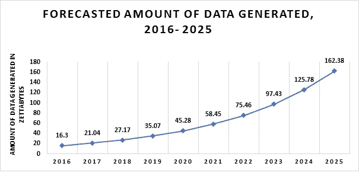
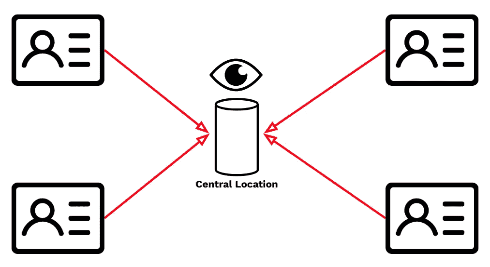
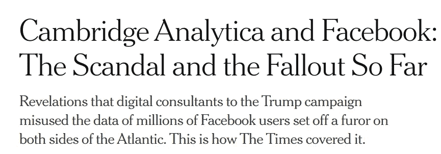
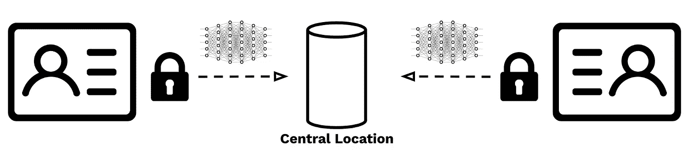

# 为什么我们需要保护隐私的机器学习？

> 原文：<https://towardsdatascience.com/why-do-we-need-privacy-preserving-machine-learning-7480ddf9f114?source=collection_archive---------73----------------------->

## 为什么保护隐私的机器学习越来越受欢迎？组织如何利用这样的系统来改进人工智能模型？

[图像信用](https://unsplash.com/photos/OjSG0E_qcbo)

过去十年，机器学习和人工智能应用领域发展迅速。正如吴恩达正确指出的那样，人工智能确实是改变几乎所有行业的新动力。推动这种增长水平的力量是数据和计算能力。在可预见的未来，生成的数据量和计算能力都将呈指数级增长。由于人工智能模型的结果只与数据一样好，因此获得更多数据将意味着我们可以建立更好的人工智能模型。显然，我们需要更多的数据，但我们也需要足够多样并定期更新的数据。

来源:Dart 咨询公司[1]

## 但是，有什么问题呢？

每当你在网上搜索一些东西，或者向 Alexa 提问，或者使用你从互联网上下载的任何应用程序——甚至进行一些金融交易——你都在向这些公司提供数据。数据，可能是私人的。

> 人们告诉谷歌的事情，他们可能不会告诉任何人。
> 
> —塞思·斯蒂芬斯-达维多维茨(《人人都在说谎》的作者)

来自不同来源的数据被集中在一个中心位置，这导致了主要的隐私问题。

我们的个人数据存储在由组织持有的大型数据库中。这些数据然后被他们用来为我们做个性化的预测。例如，网飞的个性化电影推荐、亚马逊的产品推荐或脸书的广告推荐都使用我们的个人信息。老实说:我们都沉迷于这些个性化的体验。所以，让我们来问一个问题:我们应该用我们的隐私来换取个性化吗？

直到我们读到这样的新闻标题，我们才真正意识到将我们的个人数据提供给公司的坏处:

《纽约时报》文章(2018)

虽然一些应用程序使用数据为我们提供个性化的建议，但也有其他应用程序使用数据来拯救生命，尤其是在医疗领域。医疗保健组织已经转向数字记录保存，并构建了自己的数据基础架构来满足他们的需求。然而，这些组织积累的数据分散在不同的组织中[2]，这就产生了**数据岛**。

尽管弥合这些数据孤岛将极大地改善患者的护理隐私问题和所有权问题，但这是实现这一目标的障碍。由于 GDPR [3]和 CCPA[4]的限制和隐私法，跨越这样的数据孤岛变得不可能。仅仅在这样碎片化的系统中加入 AI 是不够的。

图片来源:[https://unsplash.com/photos/dJ65_bvipik](https://unsplash.com/photos/dJ65_bvipik)

上面讨论了两种不同的情况。第一种被称为 B2C 或企业对消费者环境:每个人都拥有自己的个人数据，并希望这些数据被用来获得个性化体验——但不以侵犯隐私为代价。第二种是 B2B 或企业对企业的设置:大型组织拥有并存储由于隐私问题而孤立的数据，但希望这些数据用于建立更好的模型。在一个完美的世界中，我们可以将所有数据集中到一个中心位置，并用它来构建更好的人工智能系统，并希望这些数据得到负责任的使用。

## 隐私保护方式

然而，还有另一种方式来看待这个问题。我们可以让机器学习模型在不同地点之间传播，而不是让数据从不同来源传播到一个中心位置。

> 我们可以让机器学习模型在不同地点之间传播，而不是让数据从不同来源传播到一个中心位置。

通常，数据科学家在一个中心位置收集和聚合数据，并使用它来训练 ML 模型。但是，由于世界上如此多的数据被锁在这些数据孤岛中，科学家和工程师们一直试图开发不依赖于中央数据源的解决方案。这种思想形成了隐私保护机器学习系统的基础，该系统通常被称为联邦学习(FL)或联邦机器学习(FML)。

在联合设置中，机器学习模型在源处被本地训练，该源可以是数据源或包含私人用户数据的边缘设备。然后，本地训练的模型被发送到中心位置，在那里中心模型被更新。

在联合学习设置中，数据在其原始位置是安全的。只有模型参数会跨位置传输。

这种类型的 ML 训练是由 McMahan 等人[5]为更新谷歌手机中的语言模型而进行的。因此，联合学习可以用于构建 ML 模型，当一些 ML 模型信息在位置之间交换时，让数据留在它的原始位置。交换的信息不会主动泄露个人或敏感信息。

## 使用联合学习的优势

与传统方法相比，使用这种类型的培训有几个优点。首先，也可能是最重要的原因是，数据永远不会离开其原始位置。数据源传递的唯一信息是模型参数。因此，没有人必须说服不同的组织共享他们的数据。第二，通过不移动数据，我们能够减少通信负担。移动模型的成本比移动数据本身要低几个数量级。第三，通过在单个数据位置执行训练，我们能够克服与跨数据源的数据标准化和预处理相关的挑战。数据科学家将不必担心将来自不同来源的数据映射到一种通用格式。

## 结束语

因此，使用联合学习，我们能够获得在不同数据集上训练的健壮模型，同时保持隐私。它在各种类型的行业中越来越受欢迎。然而，联合学习带来了它自己的一系列挑战，如敌对攻击、数据泄漏和模型篡改，这些都是数据科学家需要小心的。

*感谢 Skylar Alexander 和 Kartik Chopra 的编辑和评论。*

[1][http://www . dart consulting . co . in/market-news/artificial-intelligence-market-landscape-key-players-use-cases-ai-growth/](http://www.dartconsulting.co.in/market-news/artificial-intelligence-market-landscape-key-players-use-cases-ai-growth/)
【2】Panch，t .，Mattie，H. &切利，L.A .关于医疗保健中 AI 的“难以忽视的真相”。 *npj 数字。医学。* **2、**77(2019)
【3】GDPR:[https://en . Wikipedia . org/wiki/General _ Data _ Protection _ Regulation](https://en.wikipedia.org/wiki/General_Data_Protection_Regulation)
【4】CCPA:[https://en . Wikipedia . org/wiki/California _ Consumer _ Privacy _ Act](https://en.wikipedia.org/wiki/California_Consumer_Privacy_Act)
【3】h . Brendan McMahan、Eider Moore、Daniel Ramage、Seth Hampson、Blaise Agü era y Arcas、Communication