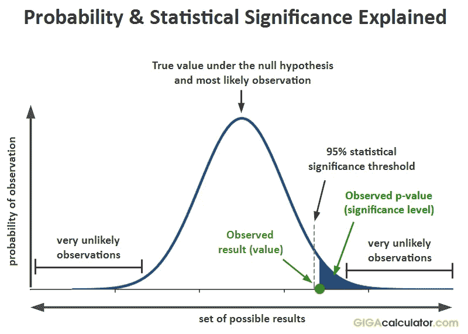

# 我们为什么用 0.05？

> 原文：<https://towardsdatascience.com/why-do-we-use-0-05-8cd43a39edfa?source=collection_archive---------26----------------------->

# 还是不是？

前几天我在读这本书，结果读到一小段试图解释“为什么我们使用. 05？”。突然我想，“哈！”没有多少人确切知道这一点(包括我在阅读之前),因为这个故事既模棱两可又非常有趣。[*]这篇文章在很大程度上依赖于上述书中的解释。]*

不管你做了多少统计，这个问题都没有得到很好的解释。

> "你会在书的末尾找到一些表格，这些表格列出了课程中用于比较的关键值。"—每个统计学教授

好吧，但是为什么？

让我们一起来了解一下。

**简短的回答是:**因为[费希尔](https://en.wikipedia.org/wiki/Ronald_Fisher)先生在他的书中没有太多的篇幅。

但是……我们可以做出一些非常强有力的假设。

我们今天使用的是 Fisher 的使用 p 值来测试证据反对零假设的想法和 [Neyman](https://en.wikipedia.org/wiki/Jerzy_Neyman) + [Person 的](https://en.wikipedia.org/wiki/Egon_Pearson)关于测试零假设反对替代假设的想法的混合。作为一个小事实，尼曼和费舍尔是公认的不太合得来的人(更多关于理论部分的信息[在这里](https://www.researchgate.net/publication/278329349_Fisher_vs_Neyman-Pearson_-_Differences_in_testing))。

尽管试图回答这个问题，但最可能的原因是，在过去，科学家必须将他们的测试统计数据与公布的临界值表进行比较，而这些临界值表必须手工计算……在他的书中，*研究人员的统计方法(Fisher，1925)* 包括了临界值表，**但为了节省时间和空间，作者在本书**中包括了. 05、. 02、. 01 的概率值。现在，因为这些值的临界值很容易获得，而且因为当时的研究人员对 Fisher vs. Neyman-Pearson 方法感到困惑，这导致了一种趋势，即只在 p < 0.05 和 p < 0.01 时报告统计数据是显著的。

然而，大师自己提到“没有一个科学工作者有一个年复一年的固定的重要性水平，在任何情况下，他都拒绝假设；他更愿意根据他的证据和想法来考虑每一个特定的案例”(费希尔，1956)。

在过去的几年里，p 值阈值的误用在所有领域的统计学家和研究人员中掀起了波澜。

见[此处](https://simplystatistics.org/2014/02/14/on-the-scalability-of-statistical-procedures-why-the-p-value-bashers-just-dont-get-it/)、[此处](https://www.ncbi.nlm.nih.gov/pmc/articles/PMC5017929/)、[此处](https://www.nature.com/news/scientific-method-statistical-errors-1.14700?WT.mc_id=PIN_NatureNews)或者寻找这篇文章作为美国统计协会[此处](https://www.tandfonline.com/doi/full/10.1080/00031305.2016.1154108)的回应。如果你有兴趣阅读更多谷歌“NHST”(零假设显著性检验)，这个主题在许多网站上都有很好的讨论。

主要问题是，0.05 被错误地大量采用，但现在当有大量信息可用时，问题在于“[……]大多数进行统计和数据分析的人只上过一两门统计课，很少接受过正式的数据分析培训。”(simplystatitics.com)

# 结论

我们现在经常使用 0.05 是因为:

1.  发现时的可用性；
2.  许多媒体，如学术界或万维网，以这种方式高度传播信息。正如乔治·科布(Mount Holyoke College 数学和统计学荣誉退休教授)所说:

> “我们教授它，因为这是我们的工作；我们这么做是因为这是我们教的东西。”；

附:如果你在做高端研究，你可能想再看看 p 值对你来说到底意味着什么。

资料来源:Gigacalculator.com

如果你有兴趣学习更多关于统计学和 R 的知识，我强烈推荐这本书[这里](https://amzn.to/2Zz9GHe)【附属链接】。如果你对 Python 感兴趣，这里有一个很棒的。

直到下次，继续学习！