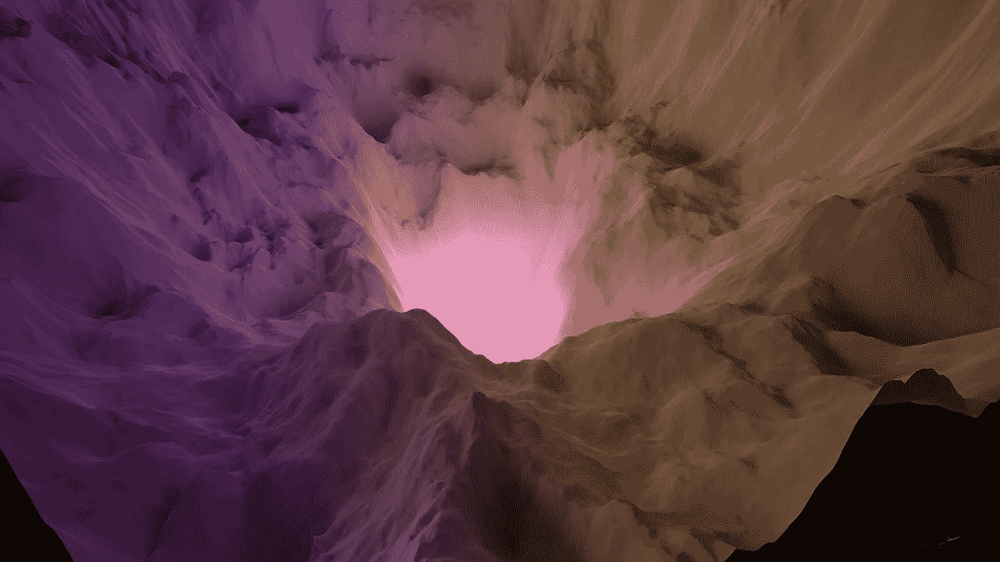

# 为什么深度学习效果这么好？

> 原文：<https://towardsdatascience.com/why-does-deep-learning-work-so-well-6550f3aa22c6?source=collection_archive---------15----------------------->

## [意见](https://towardsdatascience.com/tagged/opinion)

## 机器学习研究缺乏理论支柱

深度卷积神经网络的损失情况(来源:Javier Ideami，losslandscape.com)

现代机器学习研究已经显示出显著的成就。今天，我们可以训练机器检测图像中的物体，从文本中提取意义，阻止垃圾邮件，驾驶汽车，发现新的候选药物，并在国际象棋，围棋和无数其他游戏中击败顶级选手。

很多这些进步都是由深度学习推动的，特别是深度神经网络。然而，深层神经网络背后的理论仍然知之甚少。当然，我们理解单个神经元在做什么的数学，但是我们缺乏整个网络的涌现行为的数学理论。是什么让深度神经网络如此强大？

## 深度学习背后的直觉

我们从数学中得到一些指导。在 1989 年的一篇论文中，时任伊利诺伊大学厄巴纳分校研究员的数学家乔治·西本科(George Cybenko)证明了普适逼近定理:对于任何连续函数 *f* ，都存在一个单层神经网络可以任意好地逼近 *f* ，只要该网络的激活函数是类 sigmoid 的。

通用逼近定理(来源: [Cybenko 1989](http://citeseerx.ist.psu.edu/viewdoc/download?doi=10.1.1.441.7873&rep=rep1&type=pdf)

这是一个相当了不起的结果，[但有一个问题](/why-are-neural-networks-so-powerful-bc308906696c):在实践中，我们不仅想要一个能很好地逼近我们所看到的数据的神经网络。我们还希望它能很好地处理看不见的数据。换句话说，这个定理没有提到过拟合的问题。

由于缺乏完整的理论，我们只能依靠直觉。更深层次的神经网络架构，也就是通常的直觉，概括得更好，过度拟合得更少。他们通过学习表示的层次来实现这一点:例如，在人脸检测中，这些可以是底部的边缘和线条，顶部附近的眼睛，以及层次顶部的完整人脸。即使脸部的一部分被隐藏，网络仍然会从剩余的输入中提取信号，从而更好地进行归纳。

这是一种很好的直觉，它看起来就是实际发生的事情。实验证实，在普通图像和文本任务上，深度神经网络优于浅层神经网络。但这只是一种直觉。我们没有一个完整的数学理论来解释为什么这种直觉应该是正确的。

## 当理论指导直觉时

把这种情况比作物理学。物理学比其他任何学科都更信奉实验和理论的共生。例如，粒子物理学的“标准模型”描述了构成我们宇宙的基本粒子的属性，以及这些粒子是如何相互作用的。该理论然后指导新实验的设计。例如，2012 年在欧洲粒子物理研究所发现希格斯粒子是可能的，因为理论告诉我们去哪里寻找。换句话说，理论指导我们的直觉。

理论也为意外发现提供了保障。当 OPERA 实验的研究人员在 2011 年宣布他们测量到了运动速度超过光速的中微子时，我们从理论上知道这是一个非同寻常的说法，需要仔细审查。事实上，正如后来发现的那样，光纤电缆连接不当，导致了错误的读数。

也许物理学中最重要的概念是*涌现*的概念:用数学方法描述宏观现象的高级理论从描述微观现象的低级理论中涌现出来。例如，当谈论一种气体时，谈论组成这种气体的单个粒子的特性很快就变得不可行了。相反，将宏观量如压力、温度和熵视为基本属性更有意义和有用。统计力学的方程式描述了这些宏观量是如何与基本粒子的状态相关联的。

简而言之，这就是物理学。理论指导直觉。实验证实了理论。较高层次的理论从较低层次的理论中涌现出来，游戏继续进行。

## 建造更好的桥梁:一个类比

塔科马海峡大桥的故事生动地说明了为什么有一个好的理论是如此重要。1940 年 7 月通车后，这座桥开始在风中剧烈摇晃，直到仅仅 4 个月后就轰然倒塌。[一只狗死了](https://www.wsdot.wa.gov/tnbhistory/tubby.htm)。

当桥梁建成时，我们根本没有一个足够好的理论来解释桥梁在生产过程中所受到的空气动力。如今，通过 CFD 模拟，我们可以在建造桥梁之前对其进行压力测试，并防止类似塔科马海峡大桥的事故再次发生。理论使我们能够建造更好的桥梁。

这又把我们带回了正题。今天的机器学习实践很像 1940 年的造桥。深度神经网络似乎工作得惊人地好，但我们缺乏对它们为什么这样做的彻底的数学理解。更糟糕的是，深度学习系统有时会[惊人地](https://www.nature.com/articles/d41586-019-03013-5)失败，我们也不知道为什么。

那么，我们需要的是深度学习的涌现理论:一个超越描述单个神经元做什么的理论，并解释整个网络的涌现行为。

这种涌现理论的一个候选是基于能量的学习，这是 Yann LeCun 和其他人提出的理论框架。该框架引入了描述组合系统能量的标量场。例如，对于由特征和标签组成的数据点，如果标签是正确的，这个标量能量被最小化。LeCun 表明，任何机器学习问题都可以用这种方式重新表述为能量最小化问题。在物理学术语中，这个框架将能量视为机器学习系统的涌现属性。

今天的机器学习研究几乎完全是经验性的。我们需要一个更好的理论来增强我们的直觉，让我们知道下一步该往哪里看，并区分真实信号和偶然发现。也许物理学的成功可以成为一个指南。

 [## 算法是不够的

### 人工智能的下一个突破需要重新思考我们的硬件

towardsdatascience.com](/algorithms-are-not-enough-fdee1d65e536)  [## 知识的极限

### 哥德尔、图灵和关于我们能知道什么和不能知道什么的科学

towardsdatascience.com](/the-limits-of-knowledge-b59be67fd50a)