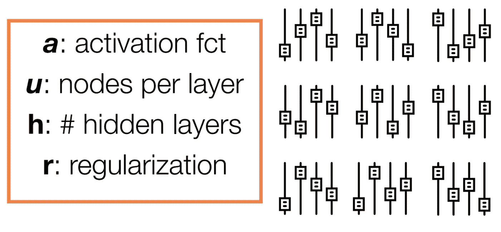
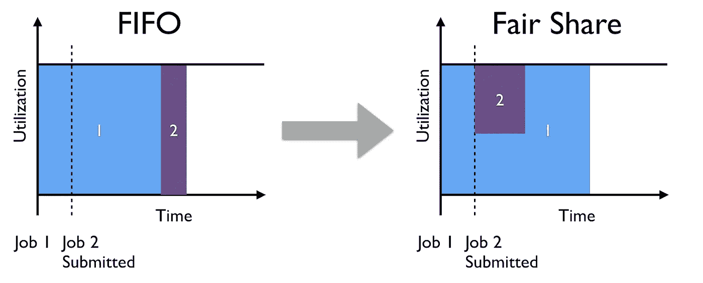
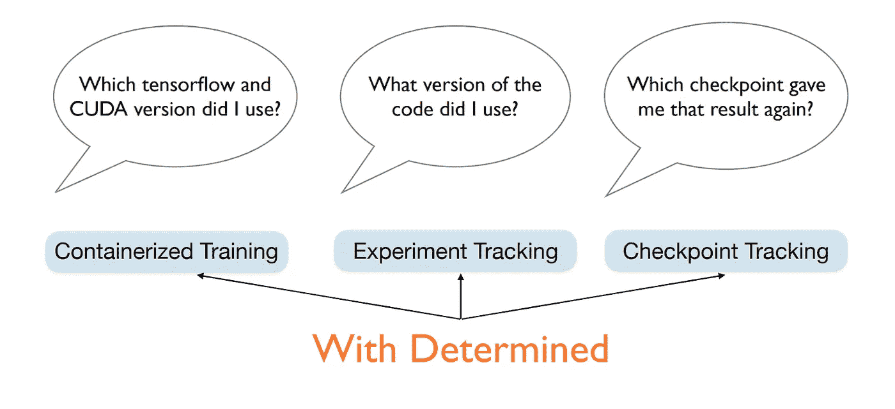
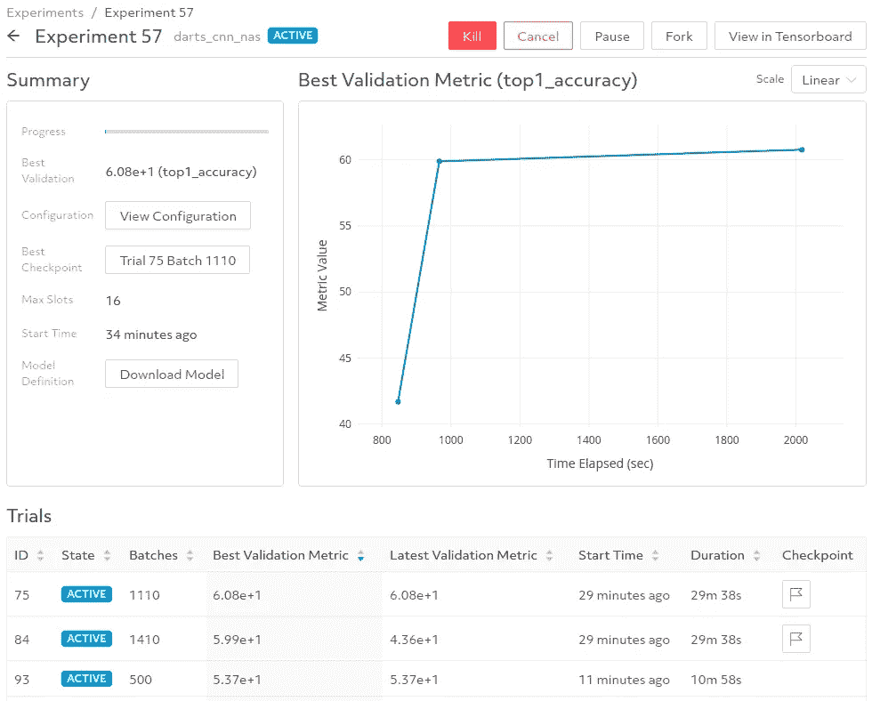
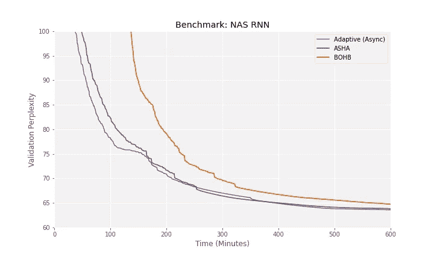
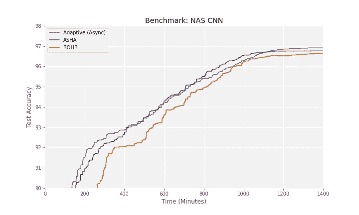

# 为什么没人用高级超参数调优？

> 原文：<https://towardsdatascience.com/why-does-no-one-use-advanced-hyperparameter-tuning-ac139a5bf9e3?source=collection_archive---------38----------------------->

## 从我们在 Determined AI 的集成深度学习训练平台中构建最先进的超参数调整的经验中获得的收获。

[超参数调整](https://en.wikipedia.org/wiki/Hyperparameter_optimization) (HP 调整)是机器学习开发过程中不可或缺的一部分，可以在最大化模型预测性能方面发挥关键作用。因此，超参数调整算法在学术界得到了广泛的研究，[这些算法的许多软件实现可以在网上找到](https://en.wikipedia.org/wiki/Hyperparameter_optimization)。



图 1:一个超参数调整问题的例子，我们考虑深度神经网络的左侧搜索空间。右侧评估了多种配置，以找到最佳设置。(*图片由作者提供。)*

然而，在实现学术研究论文中提出的伪代码和作为端到端机器学习工作流的一部分执行大规模惠普调优之间存在很大差距。即使在众所周知现代惠普调优方法远远优于随机搜索和网格搜索的 ML 研究社区中，[研究人员仍然主要使用这些简单的方法](http://gael-varoquaux.info/science/survey-of-machine-learning-experimental-methods-at-neurips2019-and-iclr2020.html)，因为更高级的方法太难使用。当我从研究生阶段开发 [Hyperband 惠普调优算法](https://arxiv.org/abs/1603.06560)，到在谷歌运行大规模问题的惠普调优算法，再到最近将最先进的(SOTA)惠普调优功能集成到 Determined 的培训平台时，我自己就经历过这种情况。在这篇博文中，我将分享我在整个旅程中获得的见解，以便您可以开始将 SOTA 惠普调优应用于您最紧迫的 ML 问题。

*那么，为什么在实践中使用高级惠普调优技术如此困难呢？*根据我的经验，在端到端 ML 工作流程中应用 SOTA 惠普调优方法的三个主要挑战是:

1.  **解决大问题**:惠普大规模调优与在 scikit-learn 中将惠普调优应用于小数据集截然不同。单个模型可能需要几天或几周的时间来训练，这意味着我们必须利用并行计算，同时最大限度地提高资源效率，以使问题易于处理，包括以分布式方式高效地执行惠普搜索和训练所考虑的模型。
2.  **与后端系统集成**:可扩展的调优算法和训练方法需要在分布式计算实例上执行，这些实例通过网络连接在一起，以交流中间结果。此外，这些实例需要连接到数据存储，以便可以保存和跟踪实验工件的再现性。
3.  **提供明智的用户界面**:实现一个适用于大规模问题的高效惠普调优算法只有在用户能够实际使用的情况下才有用！实际上，SOTA 调优方法比传统的随机或网格搜索要复杂得多，因此，除了最高级的用户之外，对所有人来说，抽象掉这种额外的复杂性是非常重要的。

根据上面的讨论，很明显，HP 调优算法本身只是在实践中应用 HP 调优的一部分；这些挑战需要通过其他同等重要的功能来解决，如分布式培训、集群管理和可用性。这些功能已经在 [Determined 的深度学习集成平台](https://determined.ai/product/)中得到支持，因此用户可以专注于模型开发，而不会陷入与深度学习相关的操作复杂性中。

在接下来的章节中，我将分享我们如何通过利用我们的专业知识和在我们的集成系统中构建现有功能，来应对应用 SOTA 惠普调谐的这些关键挑战。特别是，我将高度概括以下我们认为在实践中对高级惠普调优必不可少的功能:

[**1。缩放到大问题**](#f6e7)

*   [利用大规模并行性的高效调优算法](#0c99)
*   [自动检查点，有效提前停止](#8595)
*   [大型模型分布式训练](http://0b12)

[②**。与后端系统集成**](#0c7e)

*   [自动化集群管理](#d923)
*   [再现性的工件跟踪](#c2ec)

[**3。提供合理的用户界面**](#8d42)

*   [友好的界面设计便于使用](#c774)
*   [用于实验管理的图形网络用户界面](#8079)

# 扩展到大型问题

## 利用大规模并行性的高效调优算法

随着模型越来越大，训练时间越来越长，有效利用大规模并行性的超参数调整算法对于大规模应用至关重要。我们选择惠普调优算法的两个标准是:

1.  **效率**:找到一个高质量的惠普配置需要多少计算量？
2.  **并行**:分布式计算的算法有多合适？例如，有多少计算可以并行完成，以及在出现掉队者和任务失败的情况下，算法的表现如何？

就效率而言，领先的惠普调优算法利用提前停止来降低计算成本；主要思想是分配较少的资源给较差的 HP 设置，以便可以更快地找到高质量的配置。在我研究生学习的过程中，我和我的合作者通过提前停止引入了 [Hyperband 进行高效的 HP 调优。我们的结果显示，Hyperband 比简单的随机搜索快 20 倍以上，并通过击败以前的 SOTA 贝叶斯优化方法展示了 SOTA 性能。从那以后，由于其简单性和理论上的合理性，Hyperband 成为 HP 调优最流行的方法之一。](https://arxiv.org/abs/1603.06560)

对于第二个标准，大规模惠普调优算法需要对现实世界计算集群中常见的干扰(如掉队者和任务失败)具有鲁棒性。在这方面，虽然 Hyperband 算法易于并行化，但随着故障率的增加，该算法中的同步步骤引入了严重的瓶颈。为了解决这个问题，我们最近推出了一种用于大规模并行惠普调优的改进算法，称为异步连续减半(ASHA)，在 MLSys 发表的论文[中实现了 SOTA 性能。](https://arxiv.org/abs/1810.05934)

Determined 通过[我们的自适应惠普调优算法](https://docs.determined.ai/latest/topic-guides/hp-tuning-det/hp-adaptive-asha.html#topic-guides-hp-tuning-det-adaptive-asha)提供 SOTA 惠普调优功能，该算法构建于 ASHA 之上，以提高易用性。我们的自适应算法利用早期停止来评估比随机和网格搜索等强力方法多 100 倍的超参数设置(参见[这篇在 ASHA 的博客文章了解更多细节](https://blog.ml.cmu.edu/2018/12/12/massively-parallel-hyperparameter-optimization/))。作为 ML 实践者，我们很清楚宣称 SOTA 性能是一回事，用真实世界的实验证明它是另一回事。出于好奇，请随意[跳到我们的基准测试结果](#1629)来看看 Determined 的自适应惠普调优算法。

## 自动检查点，高效提前停止

暂停和恢复训练而不浪费太多计算的能力对于最大化基于早期停止的 HP 调优方法的效率是至关重要的；Determined 的自适应 HP 调优算法也不例外。在这一过程中，随着算法自适应地将训练资源分配给更高性能的 HP 设置，数千次试验被暂停和恢复。如果不支持有状态对象的有效保存和恢复，当自适应调整算法决定恢复进一步训练的尝试时，计算的有意义部分将被重复。

为了通过 Determined 的自适应惠普调整算法达到 SOTA 性能，我们支持高效的早期停止，就像我们支持一般容错机器学习一样:通过自动保存模型和其他有状态对象，以便我们可以在失败后恢复训练而不会丢失太多计算。代替确定，用户必须根据存储位置(例如，AWS S3、Google 云存储或分布式文件系统)编写样板代码来正确地保存和恢复模型。要正确做到这一点非常重要，而且分布式培训和[再现性](#c2ec)的相关要求会使这一点变得更加复杂。Determined 为您处理这些更复杂的用例，并允许您指定一个检查点策略来控制您的实验的存储足迹(参见[检查点 gc](https://docs.determined.ai/latest/topic-guides/checkpoints.html#checkpoint-garbage-collection) 和[检查点策略](https://docs.determined.ai/latest/reference/experiment-config.html))。

## 大规模模型的分布式训练

光靠 SOTA 惠普调优不足以进行大规模深度学习，尤其是在[模型需要数千小时训练](https://arxiv.org/pdf/2004.08900.pdf)的情况下；对于用户来说，等待几周或几个月来完成一个实验是很难的。幸运的是，分布式培训可以显著减少培训时间(例如，在药物研发应用中确定的[24 倍加速](https://determined.ai/assets/images/resources/Recursion-Drug-Discovery-with-Determined-Training-Platform.pdf))。

在 Determined 中，自适应惠普调优和分布式培训的结合实现了真正的大规模模型开发，以接近零的样板代码开发前沿人工智能。在 Determined 中启用分布式培训就像切换*单个*实验配置字段一样简单:

```
resources:
    slots_per_trial: 64
```

在这种配置下，HP 调优实验中的每次尝试将使用 64 个 GPU 来训练单个 HP 设置。在幕后，Determined 为您处理与数据分片和模型参数通信相关的复杂性。Determined 还支持[更高级的分布式训练优化选项](https://docs.determined.ai/latest/topic-guides/optimizing-distributed-training.html#advanced-optimizations)，可以进一步加速你的实验。

鉴于 Determined 的自适应 HP 调整算法通常可以在训练单个模型收敛所需的时间内找到高质量的 HP 配置，分布式训练使得 HP 调整即使对于最大的模型也是易处理的。

# 与后端系统集成

## 自动化集群管理

以分布式方式运行大规模 HP 调优实验需要跨多个实例进行协调，以执行 HP 调优算法指示的工作负载。与随机搜索和网格搜索相比，需要将中间结果传递给算法，以便可以更新算法状态来生成未来的工作负载。建立这样一个集群既耗时又繁琐，而且通常需要为每个计算平台提供单独的解决方案。Determined 通过自动在 AWS/GCP 上提供资源来建立一个集群，然后在集群启动后安排实验，从而处理深度学习的许多操作方面。

**资源供应**

在 Determined 中，用户可以用一条命令启动 [AWS](https://docs.determined.ai/latest/topic-guides/aws.html) 或 [GCP](https://docs.determined.ai/latest/how-to/installation/gcp.html) 集群:

```
det-deploy aws/gcp up --cluster-id <> --project-id <>
```

使用该命令，Determined 将创建一个集群，在实例之间建立必要的网络，以便进行 HP 调优和分布式培训。然后，Determined 会根据需要自动放大和缩小实例，以训练活动实验。

用户还可以[利用通常便宜 3 倍的现场/可抢占实例](https://determined.ai/blog/scale-your-model-development-on-a-budget/)，让他们的计算预算更上一层楼。使用现场/可抢占的实例当然有浪费计算的风险，因为当需求增加时它们可以被关闭。有了 Determined，这些风险在很大程度上被我们在上一节中讨论的对保存和恢复实验的内置支持所减轻。

**实验日程**

先进先出(FIFO)调度对于计算集群来说仍然是相当普遍的，这是由于它的简单性和作为工作负载管理器的默认状态，如 [SLURM](https://slurm.schedmd.com/overview.html) 和 [Sun Grid Engine](https://en.wikipedia.org/wiki/Oracle_Grid_Engine) 。然而，由于两个主要原因，这种调度机制不太适合机器学习集群。首先，从资源利用的角度来看，要求用户为每个实验指定静态资源需求可能是次优的。举例来说，考虑一个具有 10 个插槽的集群和一个 HP 调优实验，该实验在探索阶段可以受益于 10 个插槽，但在整个实验过程中平均只需要 4 个插槽。其次，FIFO 调度可能会导致用户之间的群集资源共享不佳，因为单个大型作业可能会使群集饱和并阻塞所有其他用户作业，例如，请参见下图。



图 2:普通 FIFO 调度器与 Determined 使用的公平共享调度器的比较。使用 Determined，大型作业不会阻止其他用户提交的作业的进度。此外，Determined 自适应地将资源分配给作业，以最大化可用利用率，而不是将固定资源分配给每个作业。(*图片作者。)*

通过使用集中的公平共享调度程序，使每个人都能高效工作，同时最大限度地提高集群利用率。调度器自适应地在实验被提交和处理时给它们分配资源。这允许实验在计算资源可用时利用最大程度的并行性。然而，在存在资源争用的情况下，我们的调度程序跨实验共享资源，以允许所有用户取得进展。这种行为对于团队来说尤其可取，因为在任何给定时间，集群都必须处理不同规模的实验，从需要单个 GPU 的笔记本电脑到具有数千次不同试验的惠普调优实验。

# 再现性的伪影跟踪

再现性对于减少错误和建立在他人工作的基础上是很重要的。尽管我们已经看到对机器学习(例如 [1](https://www.wired.com/story/artificial-intelligence-confronts-reproducibility-crisis/) 、 [2](https://sites.google.com/view/icml-reproducibility-workshop/home) )中关于[再现性的挑战的认识不断提高，但是由于在整个模型开发过程中存在大量移动部件，再现性仍然难以实现。此外，由于算法的异步性质，SOTA 并行 HP 调优方法为再现性增加了另一层复杂性。](https://determined.ai/blog/reproducibility-in-ml/)



图 3: Determined 自动跟踪训练中使用的许多工件，只需点击一个按钮即可实现再现性。(*图片作者。)*

Determined 将上面提到的所有实验工件存储在一个托管数据库中，以便于将来访问。这使用户能够执行以下操作:(1)恢复惠普调优实验，并从停止的地方继续；(2)派生一个实验，并使用不同的配置运行；(3)[通过指定检查点 ID，从检查点](https://determined.ai/blog/warm-starting-deep-learning/)进行热启动培训。

# 提供合理的用户界面

## 友好的界面易于使用

我们之前观察到，大多数 ML 研究人员仍然使用简单的 HP 调优方法，如手动、网格或随机搜索，这也许并不令人惊讶，因为使用高级 HP 调优方法会引入显著的复杂性。特别是，在实践中很难应用这些方法，因为

1.  它们具有内部超参数，需要进行配置以获得合适的性能，并且
2.  它们需要修改模型代码来处理外部库中的实现。

在 Determined 的自适应 HP 调整算法中，对于(1)，我们已经通过使用健壮的默认值配置搜索算法来简化用户界面，这些默认值在大范围的 HP 调整实验中运行良好。要在 Determined 中为您的实验使用自适应 HP tuning，只需如下指定实验配置的搜索器部分。

```
searcher:
   name: adaptive_asha
   metric: top1_accuracy
   smaller_is_better: false
   max_trials: 1000
   max_length:
       epochs: 300
```

已确定通过跟踪所有试验的中间性能以便后续重放，实现可重复的 HP 调整。在试验级别，Determined 通过跟踪和保存所有有状态对象(包括随机生成器)来提供容错再现性。这些功能伴随着通过设计使测定可再现的其他组件(见下图)。通过自动跟踪环境、代码和实验工件，Determined 允许用户只需点击一个按钮即可重现惠普调优实验。

通过设计，用于自适应镜像随机搜索和网格搜索的搜索器配置方案，其中主要输入对应于要评估的 HP 设置(即，试验)的数量，以及每次试验训练多长时间。高级用户可以选择指定提前停止模式，更积极的提前停止可能会使用更嘈杂的信号来分配训练资源，从而提供更高的加速。随着[其他惠普调整算法](https://docs.determined.ai/latest/topic-guides/hp-tuning-det/index.html#other-supported-methods)的出现，对自适应行为的更细粒度控制也得到支持。

对于(2)，我们的惠普调优功能与我们的集成系统无缝协作，因此您可以轻松地从训练单个模型转移到跨多台机器调优您的模型的超参数。这仅仅需要[用您想要在实验配置中搜索的超参数和相关范围](https://docs.determined.ai/latest/reference/experiment-config.html#hyperparameters)指定搜索空间。无需处理跨多台机器的调度，也无需修改您的代码来使用不同的惠普调优库。

## 用于实验管理的图形化 web 用户界面

启动惠普调优实验后，监控进度并根据需要进行调整非常重要。作为一名研究人员，我借助于监控日志来检查我的结果，并且通常等到整个 HP 调优实验完成之后才分析结果。有了 Determined，用户可以通过我们的 web UI 监控和管理实验(见下图)。对于给定的实验，该界面显示了迄今为止任何试验所达到的最佳验证性能，并总结了所有评估的超参数设置。用户还可以容易地管理他们的实验，例如，如果已经识别出合适的 HP 设置，则暂停实验，如果需要进一步调整，则恢复实验，并且分叉实验以用修改的搜索空间运行。



图 Determined 用户友好的 web UI 中的实验总结页面。(*图片作者。)*

# 决心付诸行动

让我们将这一切与 Determined 的自适应搜索器的基准测试结合起来，与 [ASHA 论文](https://arxiv.org/pdf/1810.05934.pdf)和 [BOHB](https://arxiv.org/abs/1807.01774) 中使用的参考实现进行比较，后者是另一种流行的惠普调优方法。特别是，我们将使用 ASHA 论文中研究的两个基准，在经过充分研究的搜索空间上进行[神经架构搜索](https://en.wikipedia.org/wiki/Neural_architecture_search) (NAS)。为 Determined 的自适应搜索器复制结果的代码可在这里[获得](https://github.com/determined-ai/determined/tree/master/examples/hp_search_benchmarks)供您跟随。

根据搜索速度和搜索质量来评估 HP 调优方法；即，算法能多快找到高质量的 HP 设置？为了评估这一点，我们跟踪通过搜索方法找到的最佳性能 HP 设置的验证指标，并比较所得的学习曲线。对于下面的两个基准测试，我们对 5 次 HP 调优实验的结果进行了平均，以便进行更可靠的比较。

## 寻找 RNN 建筑

这个搜索空间包括超过 150 亿个可能的架构，对应于语言建模的不同循环单元。我们在 [Penn Treebank 数据集](https://www.microsoft.com/en-us/research/wp-content/uploads/2016/02/rnn_ctxt.pdf)上训练和评估了不同的架构，并随着自适应搜索器的进展记录了最佳验证[困惑](https://en.wikipedia.org/wiki/Perplexity)(越低越好)。下图显示，Determined 的自适应搜索器略优于 ASHA 的参考实现，并在 BOHB 占据主导地位。事实上，在短短两个小时内，Determined 能够通过考虑 300 多种配置，自动找到一个困惑度低于 76 的模型；六个小时后，Determined 研究了大约 1k 种不同的配置，而随机搜索只评估了大约 20 种配置。从这个角度来看，使用可抢占实例评估 1k 配置的成本为 50 美元，而使用按需实例评估 1k 配置的随机搜索成本为 7k 美元。



图 5:在一个用于设计 RNNs 的神经架构搜索任务中，Determined 的自适应 HP 调整算法与 ASHA 的最新研究结果相匹配。该实验使用 16 个 GPU 运行，结果是 5 个 HP 调优实验的平均值。(*图片作者。)*

## 搜索 CNN 架构

该搜索空间包括对应于用于计算机视觉的不同卷积神经网络的超过五万亿(或 10 ⁸)个可能的架构。我们在 [CIFAR-10](https://www.cs.toronto.edu/~kriz/cifar.html) 上训练和评估了不同的架构，并随着自适应搜索器的进展记录了最佳验证精度。下图显示，Determined 的自适应搜索器与 ASHA 的参考实现相匹配，并且在找到一个好的 CNN 架构方面比 BOHB 更快。这里的情况类似于 RNN 搜索领域的情况:20 小时后，Determined 在可抢占的实例上仅用 150 美元就探索了约 1k 种不同的配置，相比之下，随机搜索使用按需实例评估 1k 种配置需要 23k 美元。



图 6:在一个用于设计 CNN 的神经架构搜索任务中，Determined 的自适应 HP 调整算法与 ASHA 的最新研究结果相匹配。该实验使用 16 个 GPU 运行，结果是在 5 HP 调优实验中得到的平均值。(*图片由作者提供。)*

## 坚定地走得更远

让我们继续使用 NAS CNN 基准来演示使用 Determined 的端到端模型开发是什么样子。

在执行惠普调整以确定一个好的 CNN 架构之后，我们需要通过使用多个随机初始化来训练该架构，并在测试集上对其进行评估，从而进一步验证该架构。在一个批处理大小为 96 的 GPU 上，这个步骤通常需要将近 40 个小时。使用 Determined，我们通过将批处理大小增加到 256 并在 2 个 GPU 上并行化，轻松地将时间减少了两倍。请注意，您可以进一步提高并行度，并以更高的加速为目标(例如，在这个 [NLP 示例中，我们使用 Determined 将训练速度提高了 44 倍](https://determined.ai/blog/faster-nlp-with-deep-learning-distributed-training/))。

自适应搜索找到的最佳架构在 CIFAR-10 上的测试精度为 97.21，优于本文(参见表 5)中的 ASHA 基准，并达到或超过许多复杂 NAS 方法的性能(例如[【ENAS】](https://arxiv.org/pdf/1802.03268)、[飞镖](https://arxiv.org/pdf/1806.09055)、 [GHN](https://arxiv.org/pdf/1810.05749) 、 [SNAS](https://arxiv.org/pdf/1812.09926) )。

当您找到您满意的模型时，您可以将它保存到[模型注册表](https://docs.determined.ai/latest/tutorials/model-registry.html#organizing-models)中，用于模型版本控制/跟踪和在下游应用程序中的方便访问:

```
**from** **determined.experimental** **import** Determined

det = Determined() *# Connect to the master* model = det.create_model(
         "nas_cnn",
         description="cnn architectures from the DARTS NAS",
       )
checkpoint = det.get_experiment(exp_id).top_checkpoint()
model_version = model.register_version(checkpoint.uuid)
```

# 我如何开始？

在本帖中，我们分享了 Determined 如何解决在端到端 ML 工作流中应用 SOTA 惠普调谐的关键挑战。我们的基准测试结果显示，使用我们的集成系统进行的惠普调整与 SOTA 研究得出的惠普调整结果相匹配。要尝试我们的 SOTA 惠普调优解决您的问题，请看一下本教程[开始吧！](https://docs.determined.ai/latest/how-to/hyperparameter-tuning.html#hyperparameter-tuning)

上述基准测试还展示了如何将 Determined 应用于 NAS 问题。我们的结果证实了我们之前的工作，表明 [ASHA 是 NAS](https://arxiv.org/pdf/1902.07638.pdf) 的一个强基线。您可以[安装一个确定的集群](https://docs.determined.ai/latest/how-to/install-main.html#install-cluster)并在提供的代码中修改数据加载器，以尝试 NAS 来完成您今天的 ML 任务！

*原载于 2020 年 10 月 8 日*[*https://determined . ai*](https://determined.ai/blog/why-does-no-one-use-advanced-hp-tuning/)*。*