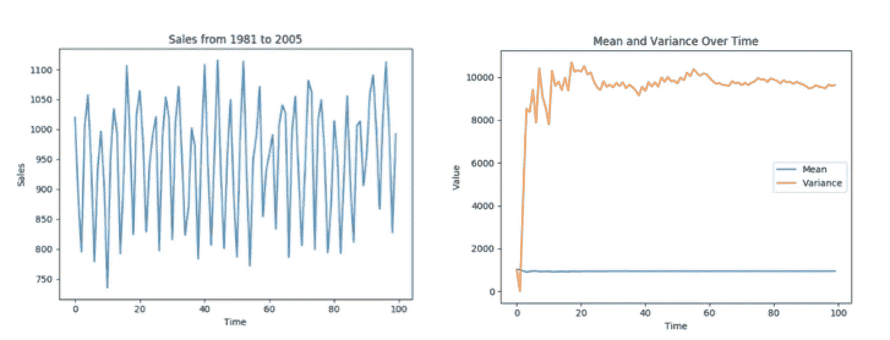
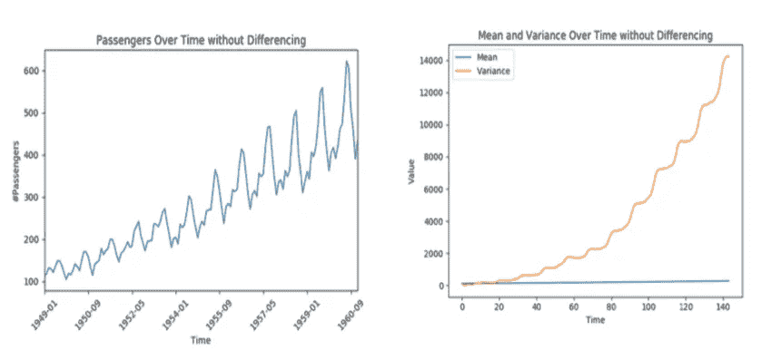
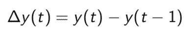
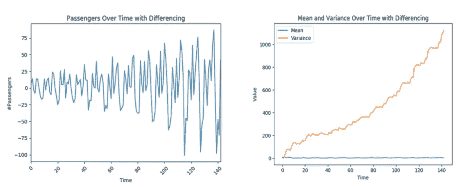
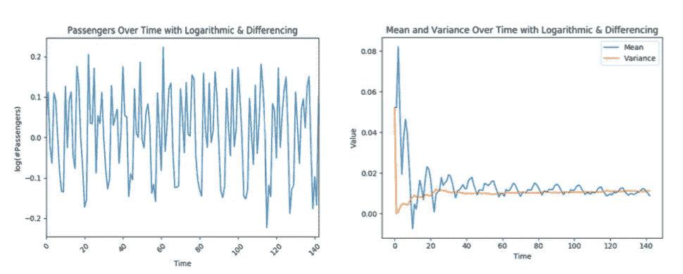

# 为什么平稳性在时间序列分析中很重要？

> 原文：<https://towardsdatascience.com/why-does-stationarity-matter-in-time-series-analysis-e2fb7be74454?source=collection_archive---------3----------------------->


照片由 [Unsplash](https://unsplash.com?utm_source=medium&utm_medium=referral) 上的 [Niklas Kickl](https://unsplash.com/@niklas_kickl?utm_source=medium&utm_medium=referral) 拍摄

## *学习时间序列分析的基本规则*

平稳性是时间序列分析领域中的一个重要概念，对如何感知和预测数据有着巨大的影响。在预测未来时，大多数时间序列模型都假设每个点相互独立。最好的说明是过去实例的数据集是静态的。对于静止的数据，系统的统计特性不会随时间而改变。这并不意味着每个数据点的值必须相同，但是数据的整体行为应该保持不变。从纯粹的视觉评估来看，没有显示趋势或季节性的时间图可以被认为是稳定的。支持平稳性的更多数值因素包括常数均值和常数方差。

> **趋势** =当数据长期增加或减少时
> 
> **季节性** =根据一年、一周或一天中的某个时间，以固定和已知的频率重新出现的模式



静态数据的例子

# 如果数据不是静态的呢？

下图清楚地展示了非平稳数据的样子。左边的图有很强的正趋势，季节性很强。尽管这告诉了我们许多关于数据特征的信息，但它不是静态的，因此不能使用传统的时间序列模型进行预测。我们需要对数据进行转换，以消除不断增加的差异。



一段时间内的乘客数量&一段时间内的平均值和方差

由于数据是不稳定的，您可以执行转换来转换成稳定的数据集。最常见的变换是差分和对数变换。

## 差分变换

差异是一种变换，通过消除时间序列级别的变化来帮助稳定时间序列的平均值，从而消除趋势和季节性。一阶差分变换包括获取当前时间的数据点，并将其与之前的点相减。结果是时间 t 的点之间的差异的数据集。如果一阶差异是平稳的和随机的，那么它被称为“随机行走”模型。



一阶差分变换



一阶差分数据

在这种情况下，差异不会产生预期的结果。即使平均值是稳定的，方差也只是不断增加。在某些情况下，使用二阶差分变换会有效，但我决定尝试对数变换。

## 对数变换

有时，差异不足以消除所有非平稳数据中的趋势。对数变换取每个点的对数，并将数据转换成对数标度。重要的是要记住，对数变换之后必须始终跟随差分变换。



正如你在上面看到的，平均值和方差变得稳定，成为常数。没有趋势或强烈季节性的迹象。

# 扩充迪基-富勒试验

虽然视觉测试是一种快速检测静止物体的方法，但大多数情况下不会像上面那样简单。统计检验允许我们通过检验平稳性来证明我们的假设。ADF 检验，也称为“单位根检验”，是一种统计检验，用于告知零假设可以被拒绝或不能被拒绝的程度。低于阈值(1%或 5%)的 p 值表明我们拒绝零假设。

> **零假设 H0** =如果未能被拒绝，则表明时间序列有单位根，意味着它是非平稳的
> 
> **替代假设 H1** =零假设被拒绝，表明时间序列没有单位根，意味着它是平稳的

在代码中实现这个测试最简单的方法是使用 statsmodels 库中的adfuller()函数。

```
from statsmodels.tsa.stattools import adfullerdef ADF_Cal(x):
    result = adfuller(x)
    ADF_stat = result[0]
    p = result[1]
    print("ADF Statistic: %f" % ADF_stat)
    print("p-value: %f" % p)
    print("Critical Values")
    levels = [.01, .05, .1]
    i = 0
    for key,value in result[4].items():
        print('\t%s: %.3f' % (key,value))
        hyp = p < levels[i]
        if ADF_stat < value:
            cert = (1-levels[i])*100
            print("{}% certain this is staionary".format(cert))
            print('Reject H0: {}'.format(hyp))
            break
        i = i+1
        if i >= 3:
            print("Less than 90% certain that data is stationary")
            print('Reject H0: {}'.format(hyp))print("Calculating ADF test for X...")
ADF_Cal(X)
```

# 结论

总的来说，理解平稳性对于了解如何处理数据至关重要。如果数据是不稳定的，那么某些转换可能有助于将其转换为稳定的数据。差分或对数变换是使数据稳定的常用技术。一种方法并不比另一种好。在做出合理的判断之前，用户需要查看所有的方法和每个结果。使用 ADF 测试等定量工具可以让我们正确理解数据的属性。