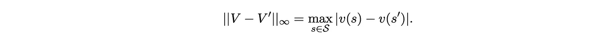

# 为什么存在最优策略？

> 原文：<https://towardsdatascience.com/why-does-the-optimal-policy-exist-29f30fd51f8c?source=collection_archive---------13----------------------->

## 有限 MDP 最优策略存在性的证明

在有限[马尔可夫决策过程](https://en.wikipedia.org/wiki/Markov_decision_process) (MDP)中，最优策略被定义为同时使所有状态的价值最大化的策略。换句话说，如果存在最优策略，那么使状态 *s* 的价值最大化的策略与使状态*s’的价值最大化的策略是相同的。* 但是为什么要有这样的政策存在呢？

萨顿和巴尔托关于强化学习的著名入门书认为最优策略的存在是理所当然的，并没有回答这个问题。我很难相信他们，也很难继续阅读！

在这篇文章中，我将证明有限 MDP 中最优策略的存在性。

# 符号和定义

## 马尔可夫决策过程和策略

有限 MDP 的特征在于状态的有限集合(通常由曲线 *S* 示出)、每个状态的动作的有限集合(通常由曲线 *A* 示出)、以及在即时奖励值 *r* 和下一状态*S’，*给定当前状态 *s* 和当前选择的动作 *a* 的概率分布，表示为 *p*

给定当前状态 *s* ，策略π是在状态 *s* 的可能动作上的概率分布，表示为π *(a|s)。然后，给定一个策略，代理可以在环境中导航(即从一个状态到另一个状态)并通过每次转换获得奖励。*

我们用大写字母表示随机变量，用小写字母表示它们的值。时间加在每个变量上，并带有一个下标。然后，给定一个策略和一个 MDP，并给定初始状态(在时间 *t=1* ) *s* ，对于任何 *T > 1* ，状态、动作和奖励值的联合分布为

## 价值观和贝尔曼方程

给定保单π和贴现因子 0 ≤ γ < 1, the value of each state is defined as

and the value of each pair of state and action as

It is easy to show that the values of states and action-state pairs can be written in a recursive way

These sets of equations are known as the [贝尔曼方程](https://en.wikipedia.org/wiki/Bellman_equation)。

我们以后会用到这个事实

**方程式 1。作为函数状态-动作值的状态值。**

## 最优策略

策略π*是最优策略，当且仅当我们

对于任何状态 *s* 和任何其他策略π。

# 贝尔曼最优方程

我们用曲线 *S* 表示所有可能状态的集合，用曲线 *A(s)表示在状态 *s* 的所有可能动作的集合。*我们用δ表示[克罗内克δ](https://en.wikipedia.org/wiki/Kronecker_delta)，并以下面的定理开始这一部分。

***证明注释:*** 我们用的是 Eq。1 在证明的第 1 行，然后反复使用了这样的事实，即一对状态和动作的值 *(s*，a*)* 大于或等于状态的值 *s*。*

定理 1 说明，每当有一对状态和动作 *(s*，a*)* 的值大于关于策略π的状态*【s *】*，的值时，则在所有状态中都有另一个策略π’优于或等于(根据状态值)π。因此，如果最优策略π*存在，其值应该满足，对于任何状态 *s，*

等式 2。贝尔曼最优方程的紧凑形式。

其中 curvy *A(s)* 代表状态 *s —* 下所有可能动作的集合，人们可以很容易地通过矛盾*来证明这个陈述。*使用贝尔曼方程，我们可以将方程 2 展开为

等式 3。贝尔曼最优方程的扩展形式。

这组非线性方程(与状态数一样多)被称为“贝尔曼最优方程”。所以，如果一个最优策略存在，它的值应该满足这组 equations⁴.

因此，要证明存在最优策略，必须证明以下两个陈述:

1.  贝尔曼最优方程组有解，并且
2.  在所有状态中，它的一个解的值大于或等于其他解的值。

# 解的存在唯一性

在本节中，我们证明贝尔曼最优方程组有一个唯一的**解。通过这样做，我们同时证明了上述两个陈述。**

## 贝尔曼最优算子

给定状态上的一组值，我们将值的向量定义为

它只是一个实值向量，其元素等于不同状态的值。然后，我们将“贝尔曼最优算子” *T* 定义为映射

运算符 *T* 获取一个向量值，并将其映射到另一个向量值。使用这种新的符号，很容易看出等式 2 和 3 等价于

等式 4。贝尔曼最优性方程作为贝尔曼最优性算子的不动点。

这个观察意味着贝尔曼最优方程的解与贝尔曼最优算子的[不动点](https://en.wikipedia.org/wiki/Fixed_point_(mathematics)) s 相同。因此，为了证明 Bellman 最优性方程解的存在唯一性，可以证明 Bellman 最优性算子有唯一的不动点。

为此，我们需要引入另一个概念和另一个定理。

## 压缩映射和 Banach 不动点定理

考虑一个[度量空间](https://en.wikipedia.org/wiki/Metric_space) *(M，d)* ，即 *M* 是一个集合， *d* 是定义在这个集合上的一个[度量](https://en.wikipedia.org/wiki/Metric_(mathematics))，用于计算 *M ⁵.的每两个元素之间的距离*映射 *T: M → M* 是收缩映射，如果存在 *0* ≤ *k < 1* 使得对于 *M* 中的任意 *x* 和 *y* ，我们有

直观上，收缩映射使点之间的距离更近。图 1 展示了在两点上重复应用收缩映射的示例。

图一。压缩映射的一个例子和 Banach 不动点定理的陈述

我们对压缩映射感兴趣的原因是下面这个著名的定理，称为 [Banach 不动点定理](https://en.wikipedia.org/wiki/Banach_fixed-point_theorem)。

**该定理背后的整个思想如图 1 所示:映射后所有点彼此越来越近，因此，通过重复映射，所有点收敛到一点，该点是 *T* 的唯一不动点。**

**因此，要证明 Bellman 最优性方程解的存在唯一性，只需证明存在一个度量，其中 Bellman 最优性算子是一个压缩映射。**

## **Bellman 最优性算子是无穷范数下的压缩映射**

**对于任意一对值向量 *V* 和*V’*，它们的[无穷范数](https://en.wikipedia.org/wiki/L-infinity)定义为**

****

**在这一节中，我们要证明 Bellman 最优性算子是这种范数下的压缩映射。为此，我们首先需要以下引理。**

****

*****证明注释:*** 虽然该引理相当不平凡，但其证明并不困难，只需要初等技巧。我在证明它的过程中得到了一些乐趣，并认为把它的证明留给感兴趣的 readers⁶.作为练习可能是件好事**

**现在，有了引理，我们终于可以进入我们的主要定理。**

****

*****证明注释:*** 从证明的第 2 行到第 3 行，我们用了引理，从第 4 行到第 5 行我们用了绝对值函数的凸性。剩下的就简单了。**

**因此，贝尔曼最优性算子具有唯一的固定 point⁷，并且贝尔曼最优性方程具有唯一的解。很容易证明，在贝尔曼最优性方程的一个解上，任何贪婪策略都有与那个解相等的值。 ***因此，最优政策是存在的！*****

# **结论**

**我们证明了( **1)** 最优策略的值应该满足贝尔曼最优性方程。然后我们证明了(**2)**Bellman 最优性方程的解是 Bellman 最优性算子的不动点。通过证明(**3)**Bellman 最优性算子是无穷范数下的压缩映射，并利用( **4)** Banach 不动点定理，我们证明了(**5)【T21)Bellman 最优性算子存在唯一的不动点。因此，存在同时最大化所有状态值的策略。****

# **承认**

**感谢 [Johanni Brea](https://scholar.google.ch/citations?user=nZ0m0xUAAAAJ&hl=de) 和我的博士顾问 [Wulfram Gerstner](https://lcnwww.epfl.ch/gerstner/) 向我介绍了这个主题，感谢 Mohammad Tinati 和 Kian Kalhor 对这篇文章进行了有益的讨论和校对，感谢 [Berfin 辛塞克](https://scholar.google.com/citations?user=Ysi38KIAAAAJ&hl=en)向我介绍了 Csaba Szepesvári 关于“[强化学习算法](https://sites.ualberta.ca/~szepesva/rlbook.html)”的巨著。**

# **脚注:**

**萨顿和巴尔托的《强化学习:导论》。**

**作为一个现实生活中有点奇怪的例子，如果我们的世界是一个有限的 MDP，如果存在一个最优策略，那么，同样的烹饪方式会让我们(粗略地说)在吃晚餐和第二天在办公室工作时都最快乐。**

**我第一次阅读这篇文章的大部分材料是在 Csaba Szepesvári 的《[强化学习的算法](https://sites.ualberta.ca/~szepesva/rlbook.html)》和 [Johanni Brea](https://scholar.google.ch/citations?user=nZ0m0xUAAAAJ&hl=de) 的博士论文中。**

**⁴很容易证明，在贝尔曼最优方程的一个解上，任何贪婪策略都有与那个解相等的值。**

**⁵:关于度量的定义，你可以看我在[上的文章“相关距离是度量吗？”](https://medium.com/swlh/is-correlation-distance-a-metric-5a383973978f)。**

**⁶ *提示:*不失一般性，假设 *f₁* 的最大值大于 *f₂* 的最大值。然后，将 *f₁* 的最大化器命名为 *a₁、*和…**

**⁷注意到，对于任何有限的 *n* ，范数为无穷大的 *ℝⁿ* 是紧的——参见[这里的](https://sites.wustl.edu/nachbar/course-notes/math/analysis/)关于“[完备性和紧性在 R^N](https://sites.wustl.edu/nachbar/files/2019/09/rncomplete.pdf) 中的一个证明”。**