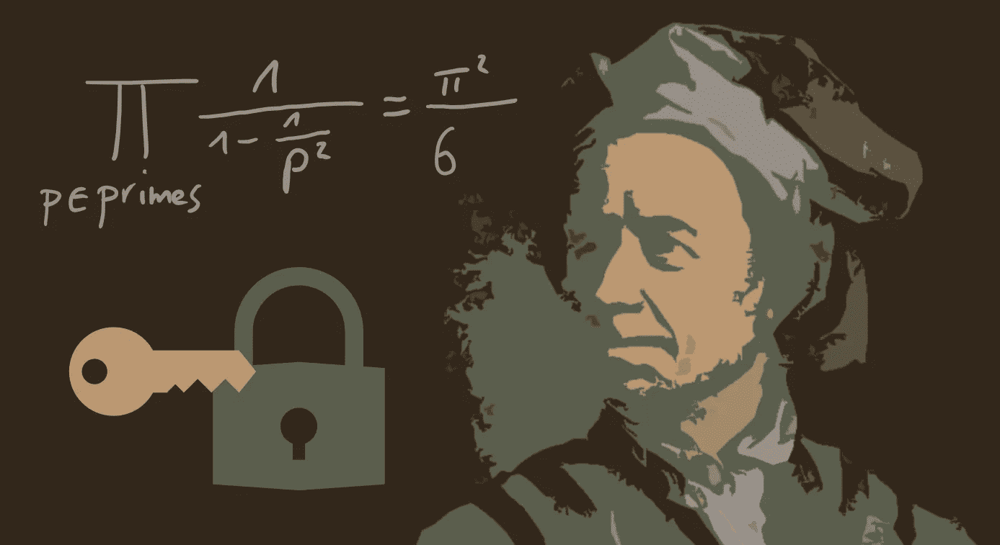
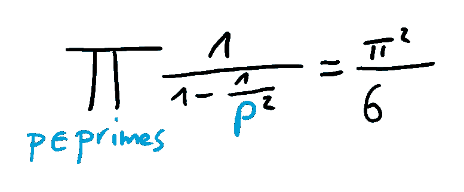
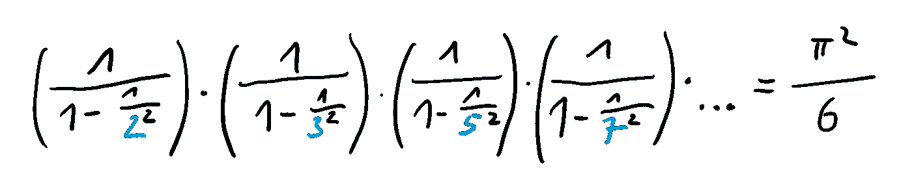

# 为什么欧拉质数公式会扰乱世界

> 原文：<https://towardsdatascience.com/why-eulers-formula-for-primes-could-disrupt-the-world-edc41bd3ba5b?source=collection_archive---------5----------------------->

## 素数的这个鲜为人知但令人敬畏的特性可能会改变你对加密的看法

图片由 F. Zielen 提供(Euler 的原始图片由 J. E. Handmann 提供)

质数是现代加密的基础。原因很简单:直到现在我们还没有理解它们的数学本质。然而，通过揭开素数的神秘面纱，世界将会发生巨大的变化。在这篇文章中，我展示了素数的一个鲜为人知但令人敬畏的性质，它可能会改变你对密码学的看法。不要担心，这将是一个简单易懂的执行层面的阅读。

## 刷新和激励

让我们回顾一下:质数是只能被 1 或数字本身整除的整数，没有余数。例如，5 是质数(约数 1 和 5)，但 6 不是质数(约数 1、2、3 和 6)。

有无穷多个素数，但是到目前为止还没有有效的算法来确定它们。特别地，没有计算第 n 个素数的公式，既不是递归的，即如果我们知道前面的(较小的)素数，我们可以计算一个素数，也不是显式的，即我们可以在不知道前面的素数的情况下直接计算一个素数。

例如，这使得著名的 [RSA 密码系统](https://en.wikipedia.org/wiki/RSA_(cryptosystem))如此安全。加密所需的公钥是基于两个(非常大的)素数的乘积。如果你想得到解密所需的私钥，你“只”需要确定这个乘积的质因数。然而，这目前花费如此多的计算时间，以至于 RSA 实际上是不可解锁的。

但是，如果我们发现一个可以立即计算素数的公式，会发生什么呢？这也能产生非常快速的质因数分解方法，这将意味着今天大多数密码系统的死刑判决。但是有可能找到素数的公式吗？

## 惊人的欧拉乘积

[莱昂哈德·欧拉](https://en.wikipedia.org/wiki/Leonhard_Euler)是世界上有史以来最杰出的数学家之一。18 世纪，他推导出一个公式，今天被称为[欧拉乘积](https://en.wikipedia.org/wiki/Euler_product)。在这里，我们关注他开创性发现的一个特例。请不要停止阅读，即使下一行第一眼看起来像象形文字。

欧拉乘积

我们翻译:等式左边的符号代表一种产品。此外，它是所有素数上的无限乘积，即我们需要用所有素数替换变量 p，并将各项相乘。我们写下来说清楚吧。

欧拉乘积的第一因子

这意味着:如果我们计算上面的乘积，插入所有的质数，我们得到定义明确的结果 pi /6。太棒了，感觉像个谜。请让我告诉你为什么。

## 破坏性后果

我们知道有无穷多个素数，但是我们还没有任何关于素数的封闭而有效的表示(“公式”)。有了计算能力，我们只需确定已知的最大素数[。尽管如此，欧拉已经证明，如果我们根据欧拉乘积将所有的素数相乘，我们可以获得π/6 的值——尽管我们不知道所有的素数！](https://en.wikipedia.org/wiki/Largest_known_prime_number)

依我看，这表明有大量关于质数的知识我们至今还没有发现。如果我们能计算无穷多素数上的欧拉乘积，我们也应该能推导出素数的公式。例如，对于特殊的素数，闭表示是已知的。

这表明我们必须加大数论研究的力度，以揭示素数的真正本质。而可能解开这一探索的人要么被颂扬，要么被迫害。

## 结尾部分

我问自己这样书呆子气的话题会吸引读者吗？我是一个数论迷，然而，这不是我的日常业务，所以我很感谢你的评论。请让我知道，如果你想了解更多关于这个东西或数学以外的东西，也许我会写一个后续。