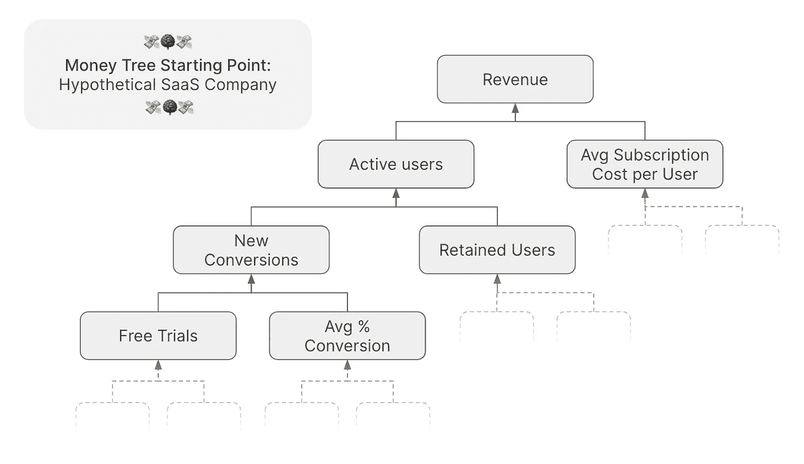
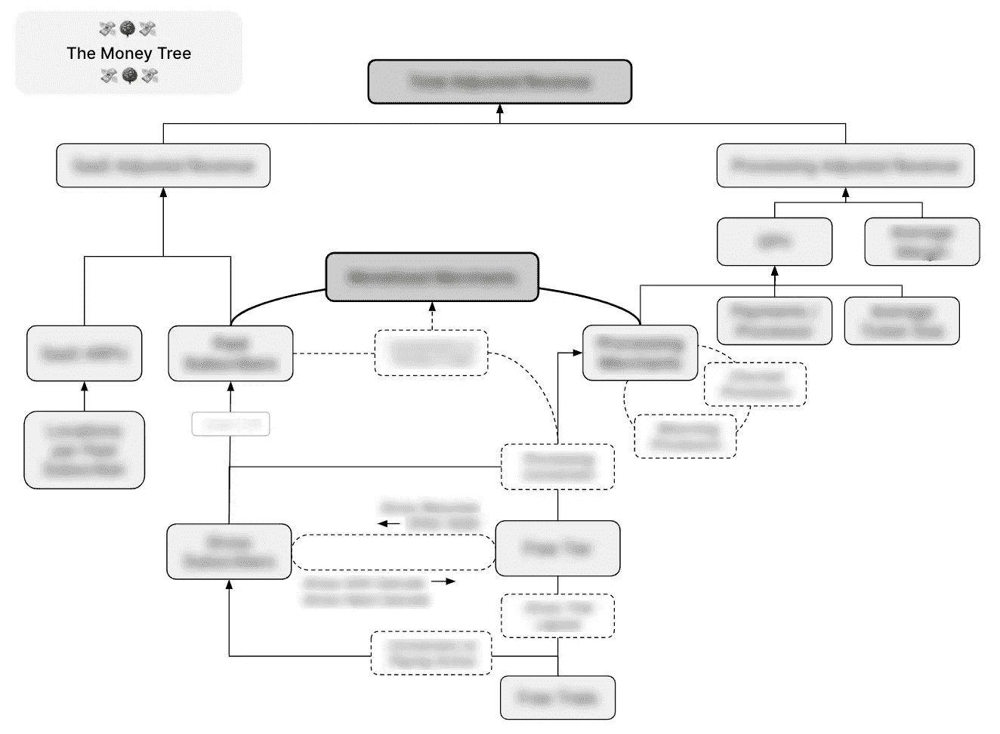
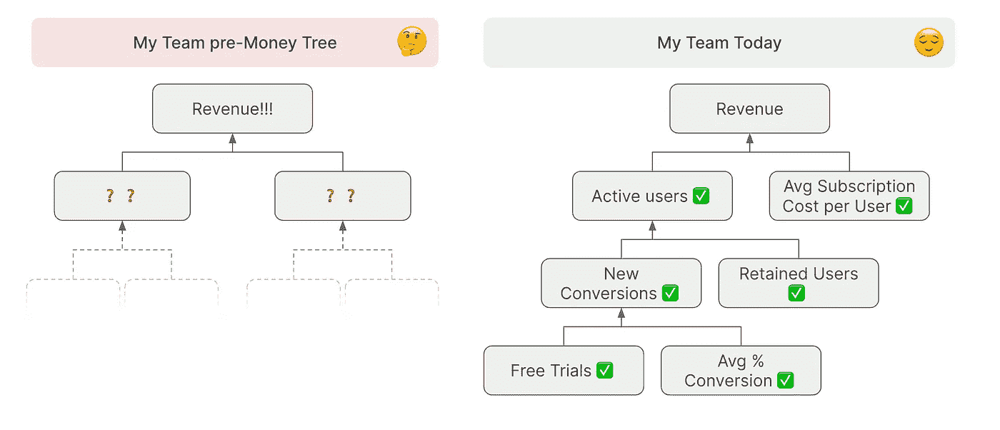
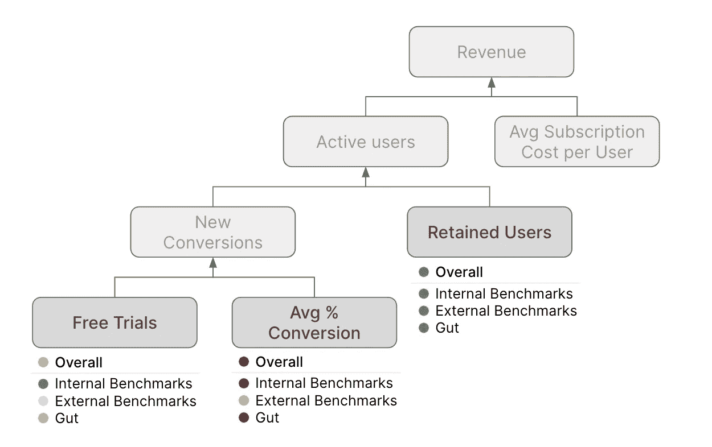

# 为什么每个数据团队都需要一棵“摇钱树”

> 原文：<https://towardsdatascience.com/why-every-data-team-needs-a-money-tree-491a602ea68?source=collection_archive---------37----------------------->

## 这个框架如何团结我的利益相关者支持我的工作

图片由[马太·亨利](https://burst.shopify.com/@matthew_henry?utm_campaign=photo_credit&utm_content=High+Res+Money+Saving+Bank+Picture+%E2%80%94+Free+Images&utm_medium=referral&utm_source=credit)发自[突发](https://burst.shopify.com/piggy-bank?utm_campaign=photo_credit&utm_content=High+Res+Money+Saving+Bank+Picture+%E2%80%94+Free+Images&utm_medium=referral&utm_source=credit)。

当我加入 Square 时，我的产品团队正在跟踪大量指标。人们对它们之间的关系理解不一，对我们应该把精力集中在哪里也没有达成一致。

我的团队需要帮助。

我知道他们需要摇钱树。🤑 🌳

# 什么是摇钱树？

金钱树是一个简单的图表，显示了你的指标如何从你的“漏斗顶端”一路上升到你的最终目标(通常是美元和用户)。

这是一棵摇钱树的样本。

**摇钱树样本。**图片作者。

在现实中，大多数业务比这复杂得多:例如，我的团队的摇钱树的形状如下。

我团队的[修订]金钱树。图片作者。

# 摇钱树是怎么用的？

摇钱树**确保共同理解**是什么推动了你的底线，并**在你最大的机会领域创造一致性**。

## 确保达成共识

大多数“数据人”都很清楚你的许多指标是如何逐步达到你的最终目标的。但是我们的数据不太密集的利益相关者通常不同意我们的理解；他们不住在这里的荒草里。

我知道，当我抛出类似于*“处理流失率下降了”*和*“平均交易利润率上升了”这样的说法时，我的大多数队友都会睁一只眼闭一只眼——没有我们的帮助，他们通常不知道为什么这些事情对他们和我们的底线如此重要。老实说，这些指标在孤立的情况下并不令人兴奋。*

**摇钱树如何确保相互理解。**图片作者。

## 创建对齐

大多数“数据人”可能会想到几个可以改进几个指标的项目。但是在哪个最重要的问题上，你和你的团队一致吗？你将如何团结你的团队支持以增长为中心的努力，而不是产品特性？

换句话说:为什么你的产品经理会选择 A/B 测试你的入职流程，而客户要求的功能有一长串呢？

与你的摇钱树保持一致。分离出基本的行为指标:通常是获取、转化、使用、保留。这些与内部基准、外部基准和您的直觉相比如何？

**通过基准行为指标获得一致性。**图片作者。

一旦你在最大的机会领域上达成一致，你的利益相关者将真正关心你的分析结果和建议付诸行动。

# 概括起来

如果你的保留率是同类中最好的，没有人会关心你的流失分析。

用一棵摇钱树绘制出你的度量标准，对行为度量标准进行基准测试，并为你与利益相关者的共同理解和一致而高兴。😌