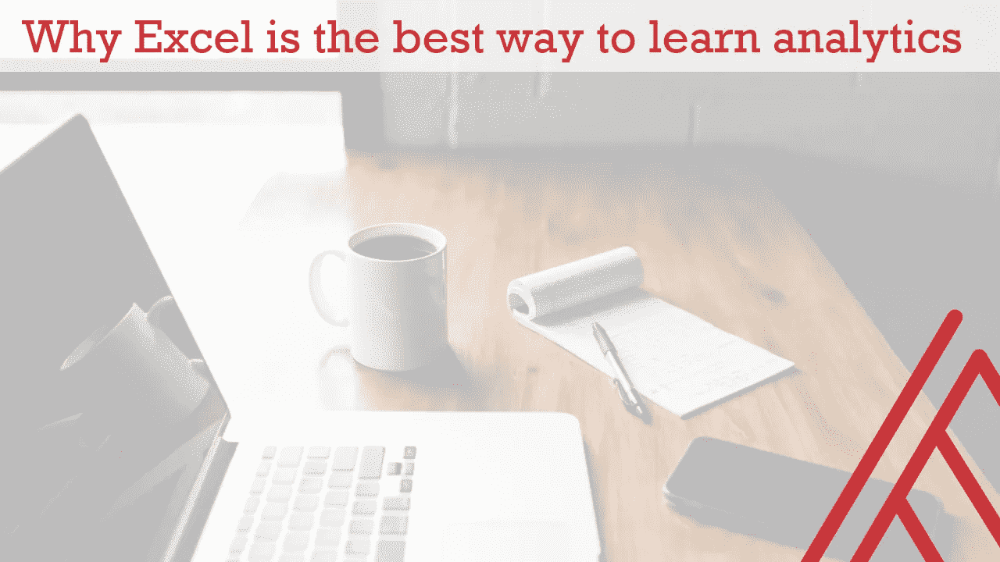

# 为什么 Excel 是学习数据分析的最佳方式

> 原文：<https://towardsdatascience.com/why-excel-is-the-best-way-to-learn-data-analytics-e3cd7018012b?source=collection_archive---------42----------------------->

[信用:安德鲁·尼尔/Unsplash](https://unsplash.com/photos/cckf4TsHAuw)

## 它是可视化的，透明的，并且让事情变得简单。

我越深入分析领域，就越觉得 Excel 是一种教学和原型制作工具。是的，当然，Excel 有它的弱点——但是作为学习的媒介，它是无与伦比的。

原因如下:

# 它减少了认知开销

[认知开销](https://thelivinglib.org/cognitive-overhead/)被描述为“为了理解或联系你正在看的东西，你的大脑必须进行多少逻辑连接或跳跃。”

分析学习之旅通常是这样的:

1.  学习一种全新的统计技术。
2.  学习如何使用全新的*编码*技术实现全新的技术
3.  进步到更高级的统计和编码技术，却从未对基础知识感到真正的舒适。

学习分析的统计基础已经够难的了。学习这个同时*也*学习如何编码会招致极高的认知开销。

现在，我确实相信通过编码实践分析有很大的好处。但是最好在掌握这些技能的同时，隔离这些技能集。

Excel 提供了学习统计技术的机会，同时不需要学习新的编程语言。这大大降低了认知开销。

[信用:安德鲁·尼尔/Unsplash](https://unsplash.com/photos/cckf4TsHAuw)

# 这是一个可视化计算器

第一个面向大众市场的电子表格叫做[visi calc](https://en.wikipedia.org/wiki/Visicalc)——字面意思是可视化计算器。我经常认为这是电子表格最大的卖点之一。

特别是对初学者来说，编程语言就像一个“黑匣子”——输入神奇的单词，点击“play”，然后*很快*就有结果了。很有可能程序做对了，但是对于一个新手来说，打开引擎盖看看*为什么*会很难。

相比之下，Excel 可以让您观察分析过程中的每一步。它可以让你直观地计算和重新计算。

眼见为实，对吗？

# 你不能走捷径

像 R 和 Python 这样的开源工具让您可以访问各种各样的包，这通常意味着您不必“从零开始”使用基本功能。

虽然有用于分析的 Excel 加载项，但其中许多都很昂贵。不过没关系！事实上，离开了 Excel 的基本构件，就有更多的机会面对面地了解正在构建的东西。

在 Excel 中，我们不能总是依赖外部包来为我们进行分析。我们必须靠自己的力量到达那里。

# 它迫使你变得敏捷

数据分析中的一个诱惑是首先建立最复杂的可能模型，然后反向工作找到有用的东西。最好反过来:从最小可行产品开始，从那里迭代。

在 Excel 中构建一个复杂的模型比在 Python 中要困难得多——当我们需要复杂的模型时，这是一个限制——但是作为一个原型开发工具，这很好，因为它迫使我们从小处着手。

# 我们不是在这里生产模型

我只是强调了在 Excel 中学习分析的一些好处。你能想到其他人吗？或者你不相信？

在 Excel 中进行分析的最大反对意见之一是它可能容易出错并且难以重现。

这是绝对正确的， ***但我们只是在这里学习*。我们不是在生产模型。**

不要因为 Excel 作为快速、可重复的分析工作流的缺点而放弃它作为教学工具的能力。

# 在 Excel 中学习分析:下一步是什么？

通过在 Excel 中进行实验，我学到了比其他工具更多的关于统计和分析的知识，我希望这种方法也能为你所用。

如果您想了解 Excel 对您的学习有什么帮助，请查看我在 MS Excel 多伦多免费在线会议上的演示，我将在那里演示 Excel 中的重要统计概念。 [**在此了解更多**](https://georgejmount.com/learning-statistics-with-excel-ms-excel-toronto-online-meetup/) **。**

对于演示 Excel 分析的大师班，请查看 John Foreman 的书 [*Data Smart:使用数据科学将信息转化为洞察力*。这本书使用简单的电子表格来介绍许多人只能通过编码来实现的算法。](https://www.wiley.com/en-us/Data+Smart%3A+Using+Data+Science+to+Transform+Information+into+Insight-p-9781118661468)

*你更喜欢如何学习统计和分析？你看到使用 Excel 的其他优点或缺点了吗？在评论里说吧。*

*原载于 2020 年 8 月 2 日*[*https://georgejmount.com*](https://georgejmount.com/why-excel-is-the-best-way-to-learn-data-analytics/)*。*