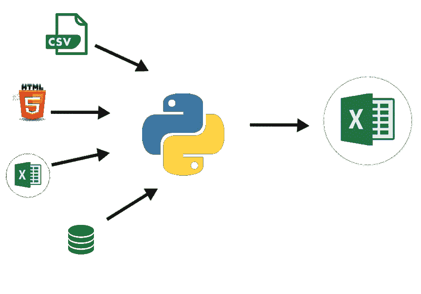

# Excel 用户为什么需要学习 Python

> 原文：<https://towardsdatascience.com/why-excel-users-need-to-learn-python-543d74a13008?source=collection_archive---------28----------------------->

## 面向 Excel 用户的 Python

## **如果你已经到了 Excel 无法再处理你扔给它的东西的地步，那么你可能需要开始考虑 Python 了**

我喜欢微软的 Excel。它(几乎)是我的数据分析工具库中最有价值的工具。嗯，差不多了。但是，尽管 Excel 功能强大，但很多时候我希望自己能做得更多，尤其是当我达到 Excel 的“极限”时——如果您每天都使用 Excel，您会注意到 Excel 的许多局限性很容易成为您的眼中钉。

我在这里不是要让 Excel 看起来很糟糕，不，Excel 仍然是最流行的数据操作工具——尽管规模有限。如果您使用 Excel 进行简单的数据分析和简单的仪表板报告，您可以轻松应对，没有任何顾虑。但是，如果你已经到了这样一个地步，你希望你可以自动化你的报告，以更好的速度和更少的阻力操纵大得多的数据集，或者执行更强大的计算，那么你很可能应该继续读下去。

# Python 不受大小限制

Excel 可以处理超过 100 万行(具体是 1，048，576 行)。但是，当超过 10，000 行时，您会注意到工作簿开始明显变慢。用更多的工作表尝试这种方法，你肯定会遇到令人讨厌的不稳定的工作簿崩溃。

然而，Python 可以毫不费力地处理数百万行，你只受到你的 PC 计算能力的限制。

# Python 不受内存的限制

遗憾的是，像 Excel 中的数组公式(CSE)这样的内存密集型计算很容易导致工作簿崩溃。微软通过 power tools (PowerQuery、PowerPivot、PowerBI 等)进行了许多改进，但内存限制并没有消失。另一方面，使用 numpy 和 pandas 等库的 Python 可以毫不费力地处理非常复杂的计算。

# Python 没有集成限制

没有任何数据分析工具比 Python 具有更强的集成能力。你可以连接到 CSV 文件，HTML 网页，SQL 数据库，甚至 NoSQL 数据库。开发人员不断编写更高效的工具和库，将他们的应用程序与 Python 集成在一起

# 遗憾的是，Excel 无法实现自动化

Excel 不是为自动化任务而设计的，所以要求 Excel 自动化是不公平的。使用任务调度工具，Excel 用户已经能够执行入门级的自动化，但这在很大程度上取决于用户 PC 中 Excel 的可用性。然而，Python 自动化任务的能力是无限的。您不必每周打开一个文件来运行您的分析，然后将结果附加到要发送的电子邮件中，您只需使用 Python 来自动化此工作流，并完全消除流程中的人工交互需求，剩下唯一需要的操作就是提供用于分析的源文档。

# 跨平台能力

您是否遇到过因为在 Windows 机器上进行分析而导致工作表中的一些公式无法在 Mac 上运行的问题？这在 Microsoft Excel 中很常见，但在 Python 中很少见。从一个版本到下一个版本，库可能有不推荐使用的函数(显然，所有软件升级都是如此)，但是跨平台兼容性不会影响 Python 中的数据分析

# 开源社区和支持

Python 是完全免费和开源的。无需许可费用、无需续订、无需财务承诺即可保持您的数据分析项目正常运行。有了大规模的社区支持，如果你遇到任何麻烦，你几乎不会被卡住。有很多资源可以让你轻松获得挑战的解决方案(Python 文档、堆栈溢出、Medium 等)

# 那么我应该抛弃 Excel 吗？

不，你不需要！像 pandas 这样的 Python 库被设计成可以轻松地将数据从 Excel 导入 Python，然后再导入 Excel。因此，您可以使用 Python 连接所有这些源工作簿进行分析，然后将您的分析结果导出回 Excel 以呈现给管理层，而不是尝试在 Excel 中创建“主表”来保存数百个源工作簿。有了 Python 的知识，您可以增强您的 Excel 分析和报告

照片致谢—作者

# 怎样才能开始学习 Python？

学习 python 就像安装 Python 和阅读文档一样简单。我承认这可能需要一些时间来适应，所以你可以在 Twitter (@kcemenike)、Github(https://github.com/kcemenike)上联系，或者你可以在 Telegram(https://t.me/PyDataCo)上参加#CodeAlong 初学者会议

Kelechi EMENIKE 是 Python 的传播者和数据战略家。您可以在 Telegram(https://t.me/pydataco)上参加他的现场初学者#CodeAlong 课程