# 为什么梯度下降和正规方程不利于线性回归

> 原文：<https://towardsdatascience.com/why-gradient-descent-and-normal-equation-are-bad-for-linear-regression-928f8b32fa4f?source=collection_archive---------14----------------------->

## 了解这个流行算法的实际应用

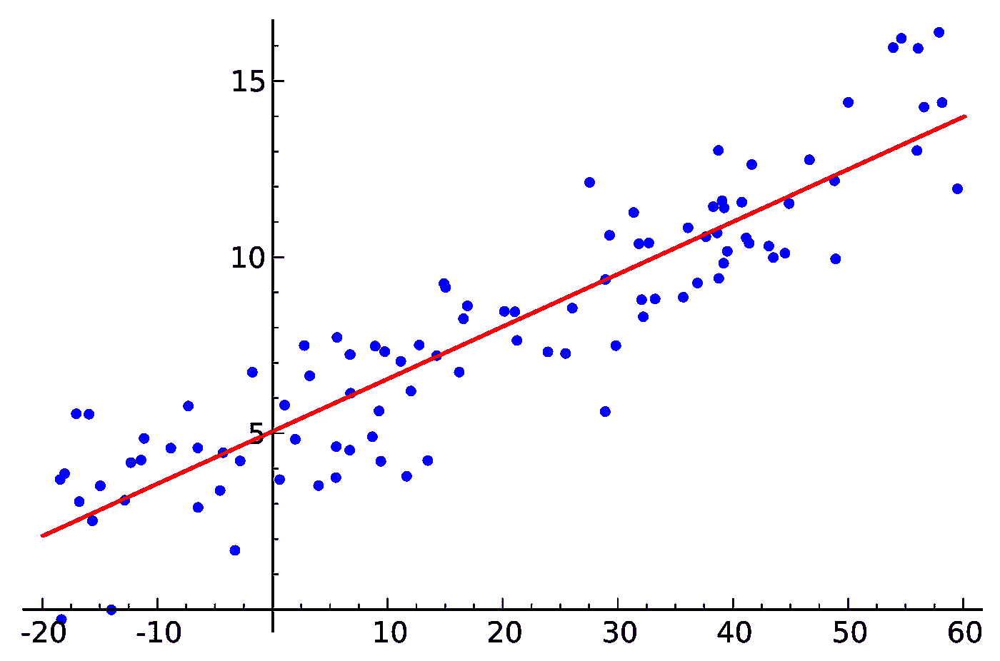

在实践中，线性回归不是用典型的教程方法完成的！([来源](https://en.wikipedia.org/wiki/Linear_regression#/media/File:Linear_regression.svg))

## **简介**

大多数 ML 课程从线性回归和梯度下降和/或这个问题的正规方程开始。可能最知名的吴恩达的课程也介绍了线性回归作为一种非常基础的机器学习算法，以及如何使用梯度下降和正规方程方法求解。不幸的是，通常情况下，这些都是非常糟糕的方法。事实上，如果你曾经使用过 Scikit-learn 的`LinearRegression`，你就使用过替代方法！

## **问题提纲**

在线性回归中，我们必须估计参数θ——回归项线性组合的系数(其中`x_0 = 1`和`theta_0`是自由项/偏差):

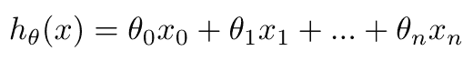

我们通过最小化残差平方和(RSS)来做到这一点，即模型输出和真实值之间的平均平方差:

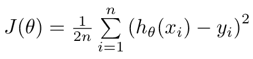

## **梯度下降法**

梯度下降是一种非常通用的函数优化方法，它迭代地逼近函数的局部最小值。由于线性回归的损失函数是二次的，它也是凸的，即存在唯一的局部和全局最小值。我们通过采取基于负梯度和选择的学习速率α的步骤来接近它。

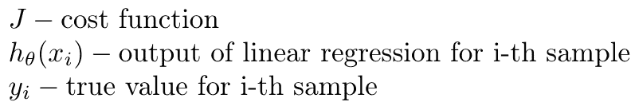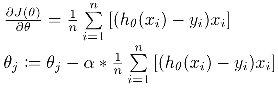

为什么这种方法在大多数情况下是不好的？主要原因是:

1.  **很慢** —迭代逼近最小值需要相当多的时间，尤其是计算梯度。虽然有加速这一过程的方法(随机梯度下降、并行计算、使用其他梯度方法)，但对于一般的凸优化来说，这是一种固有的缓慢算法。
2.  **它不会精确地到达最小值** —使用梯度下降，您肯定不会到达精确的最小值，无论是局部最小值还是全局最小值。那是因为你只和梯度和学习率α一样精确。如果你想要一个真正精确的解决方案，这可能是一个相当大的问题。
3.  **它引入了新的超参数 alpha** —你必须优化学习率 alpha，这是速度(更快地接近最小值)和准确性(更接近最小值)之间的权衡。虽然您可以使用自适应学习率，但它更复杂，并且仍然会引入新的超参数。

那么为什么我们还要为线性回归的梯度下降而烦恼呢？有两个主要原因:

1.  **教育目的** —由于线性回归如此简单，因此很容易用这种算法引入梯度下降的概念。虽然它在实践中不适合这个特定的目的，但它对神经网络非常重要。这很可能是为什么吴恩达在他的课程中选择了这种方式，而其他人都盲目跟随，没有明确指出你在实践中不应该这样做。
2.  **超大数据** —如果您有大量数据，并且必须使用并行和/或分布式计算，梯度方法非常容易使用。您只需将数据分成块，发送到不同的机器，并在许多核心/机器上计算梯度元素。大多数情况下，虽然你没有这样的需求或计算能力。

## **正规方程法**

二次成本函数最初被选择用于线性回归，因为它具有良好的数学性质。它很容易使用，我们能够得到一个封闭形式的解决方案，即θ参数的数学公式——一个正规方程。在下面的推导中，我们去掉了`1/2n`，因为在推导中它无论如何都会消失。

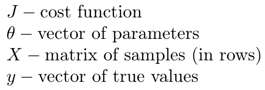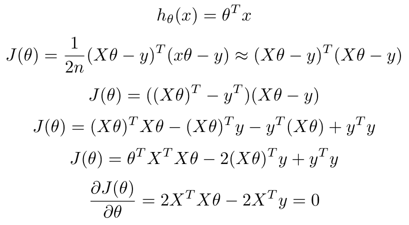

我们得到一个线性方程组，最后得到正规方程:

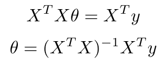

为什么这种方法也不好呢？主要原因是:

1.  **它很慢**——有一个简短、好的等式并不意味着计算它很快。矩阵乘法是 O(n)，求逆也是 O(n)。对于中等规模的数据集，这实际上比梯度下降要慢。
2.  **数值不稳定** —矩阵乘法`X^T * X`求矩阵的条件数的平方，后面我们还要把结果再乘以`X^T`。这可能会使结果极不稳定，这也是为什么这种方法几乎从不在笔和纸线性代数或统计课程之外使用的主要原因。即使与乔莱斯基分解和解也无法挽救这一局面。

这种方法绝不应该在机器学习的实践中使用。这对于数学分析来说很好，但仅此而已。然而，它已经成为 Scikit-learn 和其他库实际使用的方法的基础。

## **那么大家都用什么呢？**

正如我们在 ML 课程中看到的方法的缺点一样，让我们看看在实践中使用了什么。在 Scikit-learn `LinearRegression`中我们可以看到:

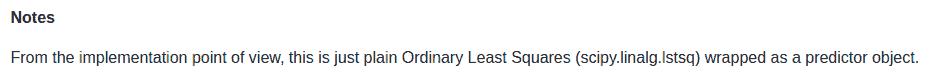

所以 Scikit-learn 并不关心它自己的实现，相反，它只是使用 Scipy。在`scipy.linalg.lstsq`中，我们可以看到这个库甚至没有使用自己的实现，而是使用 LAPACK:

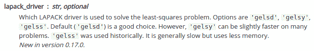

最后，我们得出英特尔 LAPACK 文档中的`gelsd`、`gelsy`和`gelss`条目:

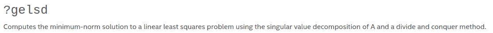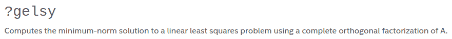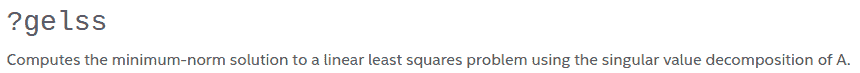

这 3 种方法中的 2 种使用奇异值分解(SVD ),这是数值方法和机器学习中非常重要的算法。你可能在 NLP 或推荐系统中听说过它，它被用于降维。事实证明，它也用于实际的线性回归，为计算线性回归核心的最小二乘问题提供了一种相当快速且非常精确的方法。

## **奇异值分解和摩尔-彭罗斯伪逆**

如果我们在正常方程之前停止一步，我们得到一个常规的最小二乘问题:

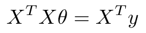

由于`X`几乎从来不是正方形(通常我们的样本比特征多，即“高瘦”矩阵`X`，这个方程没有精确解。相反，我们使用最小平方近似，即θ向量尽可能接近欧几里得距离(L2 范数)的解:

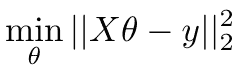

这个问题(OLS，普通最小二乘法)可以用很多方法解决，但事实证明，我们有一个非常有用的定理来帮助我们:

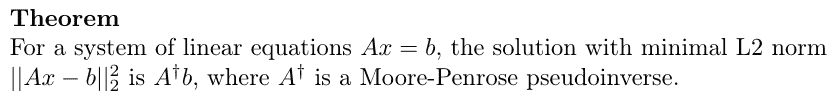

Moore-Penrose 伪逆是对任意矩阵的矩阵逆近似，甚至不是正方形矩阵！实际上，它是通过奇异值分解来计算的。我们将矩阵`X`分解成 3 个矩阵的乘积:

摩尔-彭罗斯伪逆则定义为:

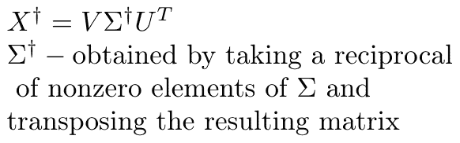

如您所见，如果我们有 SVD，计算伪逆是一个非常简单的操作，因为 sigma 矩阵是对角的。

最后，我们得出一个非常实用的线性回归系数向量公式:

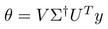

这是 Scikit-learn、Scipy、Numpy 和许多其他软件包在实践中使用的。当然，有一些优化可以提高性能，如分而治之的方法来加快 SVD 计算(默认情况下由 Scikit-learn 和 Scipy 使用)，但这些更多的是实现细节。主要思想仍然是——使用 SVD 和 Moore-Penrose 伪逆。

这种方法的优点是:

1.  **相当快** —虽然 SVD 的计算成本很高，但它还是相当快。多年的研究也促进了现代实现的速度，允许分解的并行化和分布式计算。
2.  **非常稳定的数值** —使用奇异值分解时，计算的数值稳定性不是问题。更重要的是，它允许我们对结果非常精确。
3.  **精确地到达全局最小值** —这种方法几乎和机器 epsilon 一样精确，所以我们真的有可能得到最好的解决方案。

但是要小心——这篇文章是关于线性回归的，**不是**关于像 LASSO 或 ElasticNet 这样的正则化版本！虽然这种方法对于线性回归很有效，但是对于正则化，我们没有好的最小二乘最小化，必须使用例如坐标下降。

## **总结**

在这篇文章中，你已经了解了在 Scikit-learn `LinearRegression`的面具下到底发生了什么。虽然梯度下降和正规方程有其应用(教育和数学性质)，但在实践中，我们使用具有 SVD 的 Moore-Penrose 伪逆来获得线性回归模型的准确预测。

来源:

*   [https://www.deeplearningbook.org/](https://www.deeplearningbook.org/)
*   [https://sci kit-learn . org/stable/modules/generated/sk learn . linear _ model。LinearRegression.html](https://scikit-learn.org/stable/modules/generated/sklearn.linear_model.LinearRegression.html)
*   [https://math . stack exchange . com/questions/1816364/the-SVD-solution-to-linear-least-squares-linear-system-of-equations](https://math.stackexchange.com/questions/1816364/the-svd-solution-to-linear-least-squares-linear-system-of-equations)
*   [https://math . stack exchange . com/questions/974193/why-SVD-provide-the-least-squares-and-least-norm-solution-to-a-x-b](https://math.stackexchange.com/questions/974193/why-does-svd-provide-the-least-squares-and-least-norm-solution-to-a-x-b)
*   [https://math . stack exchange . com/questions/218333/SVD-and-linear-least-squares-problem](https://math.stackexchange.com/questions/218333/svd-and-linear-least-squares-problem)
*   [https://docs.google.com/viewer?URL = https://github . com/royi avital/Projects/raw/master/SingularValueDecomposition/SVD . pdf](https://docs.google.com/viewer?url=https://github.com/RoyiAvital/Projects/raw/master/SingularValueDecomposition/SVD.pdf)
*   [https://stats . stack exchange . com/questions/278755/why-use-gradient-descent-for-linear-regression-when-a-closed-form-math-solution](https://stats.stackexchange.com/questions/278755/why-use-gradient-descent-for-linear-regression-when-a-closed-form-math-solution)
*   [https://stats . stack exchange . com/questions/278755/why-use-gradient-descent-for-linear-regression-when-a-closed-form-math-solution](https://stats.stackexchange.com/questions/278755/why-use-gradient-descent-for-linear-regression-when-a-closed-form-math-solution)
*   [https://stats . stack exchange . com/questions/1829/what-algorithm-is-used-in-linear-regression](https://stats.stackexchange.com/questions/1829/what-algorithm-is-used-in-linear-regression)
*   [https://stats . stack exchange . com/questions/160179/do-we-need-gradient-descent-to-find-the-coefficients-of-a-linear-regression-mode](https://stats.stackexchange.com/questions/160179/do-we-need-gradient-descent-to-find-the-coefficients-of-a-linear-regression-mode)