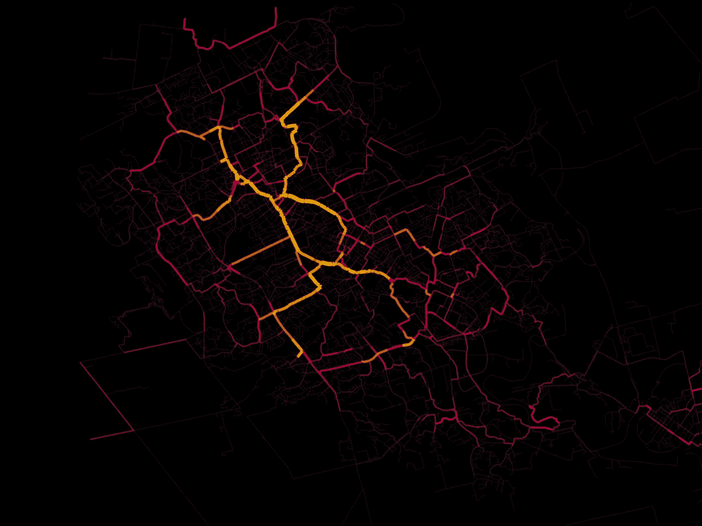
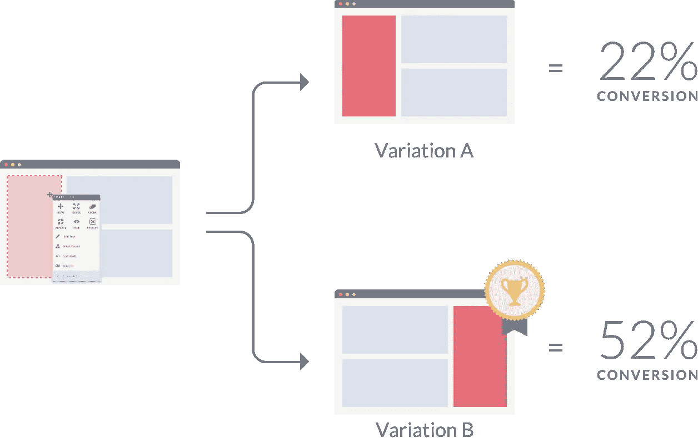
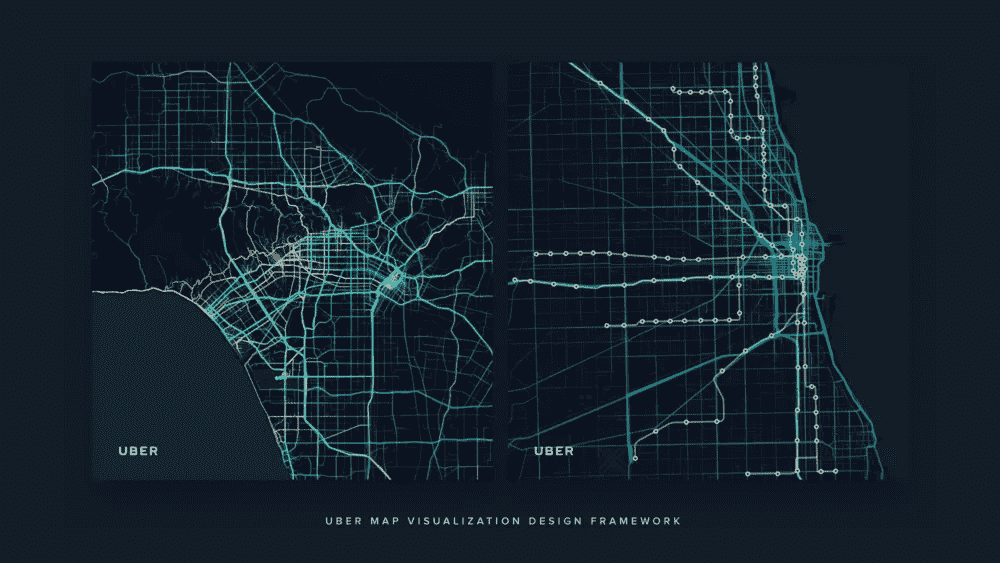
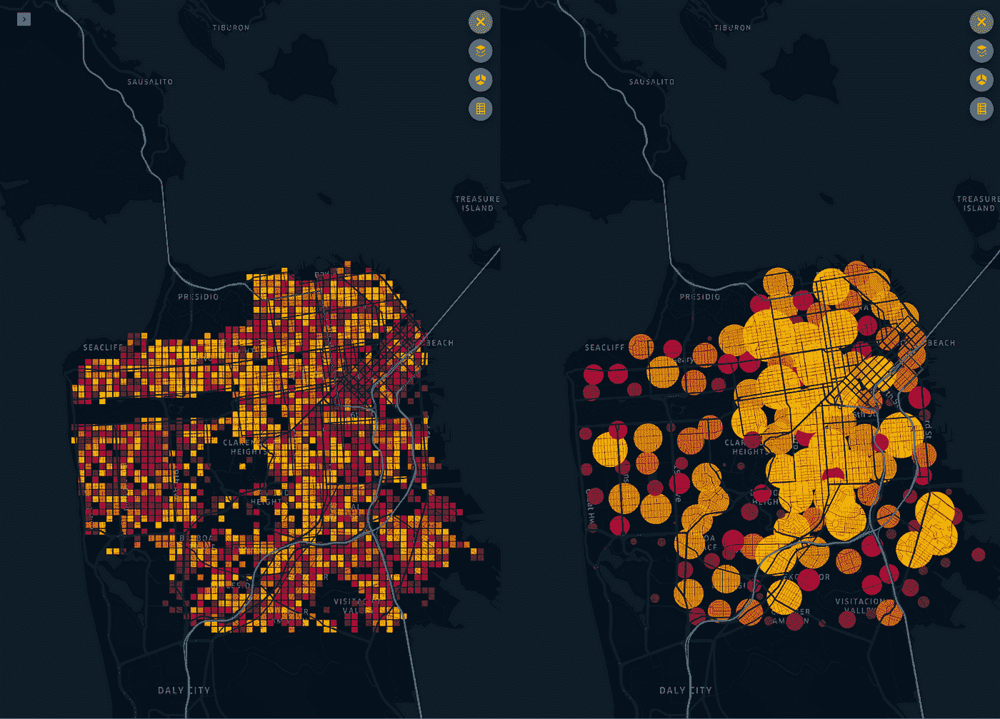
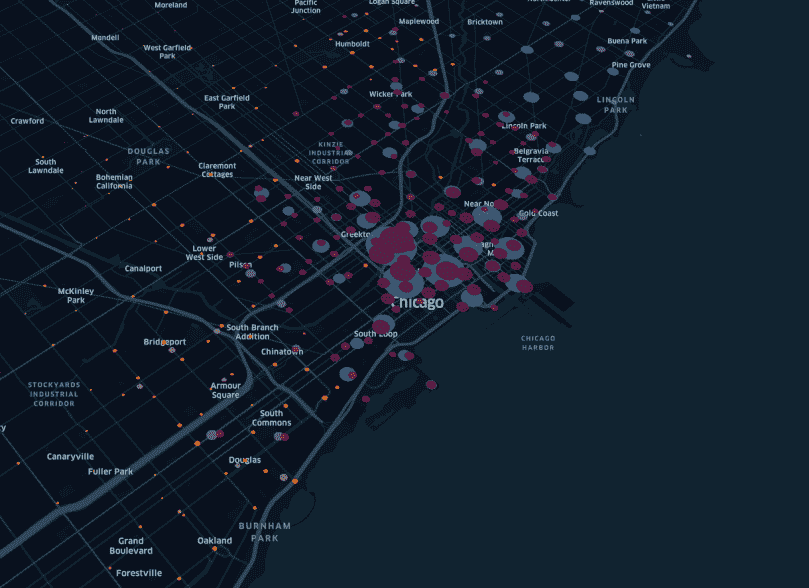
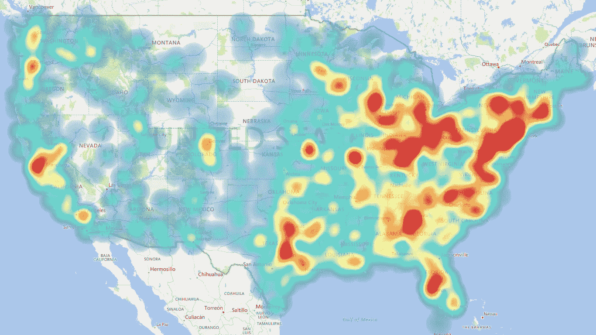

# 告别地理空间分析热图

> 原文：<https://towardsdatascience.com/why-heatmaps-dont-work-for-experimenting-geospatially-on-ground-75fabbe9b153?source=collection_archive---------37----------------------->

## 我们能从基于网络的实验中学到什么？

来源:Kepler.gl

> “我们在亚马逊的成功取决于我们每年、每月、每周、每天进行多少次实验。”——杰夫·贝索斯

# 网络实验

退一步说，网络分析在过去十年中的发展方式令人着迷！

网络分析工具已经使用户和产品分析大众化，因此使营销人员能够跟踪他们的网络应用程序的执行情况——比如用户在哪里搅动，漏斗看起来像什么，如何优化定价页面等等。

然后，就到了 A/B 测试工具时代。一旦你知道某些东西没有被优化，这些实验工具可以非常容易和快速地形成假设，做出改变，对一组用户进行测试，跟踪他们的行为，并随着时间的推移自动执行一些策略。

> 这使得营销人员和设计师可以测试每一个变化，从按钮的大小和颜色到促销语言！

这与创业公司在开发产品时宣扬的理念完全相同:形成一个假设，建立一个 MVP，然后看看用户如何使用它来迭代和发展！

A/B 测试。来源:尼尔·帕特尔

# 地面实验

如果说地面世界的实验和快速迭代，我们甚至还没有开始这样思考！我们对现实世界和地面运动知之甚少。

鉴于我们的“线下”世界如此混乱和多变(抗议、下雨、当地事件、事故、交通),这给了我们更多的理由去了解哪些策略在什么时间、什么地点有效！

网络分析帮助我们了解每个用户的行为以及他们的品味和偏好！

> *但是，了解我们的地面现实要求我们了解我们的用户(需求)、我们的地面合作伙伴(供应)，以及位置的特征(富裕程度、价格弹性类型)。*

例如，假设在任何时间点，需求和供给都不匹配。深入了解幕后发生的事情是有意义的:

*   *低价值客户和供应之间是否存在不匹配？*
*   *是因为合作伙伴被激励去的区域是高流量区域吗？*
*   *是因为合作伙伴很闲但还是不接单吗？*
*   *是因为店铺此刻负荷过重，无法迎合更多需求吗？*

资料来源:优步

> *基础现实是指您业务的所有不同方面(包括位置和时间)如何相互作用，在某些情况下还与外部事件(天气、当地事件、交通)相互作用。*

# 是时候开始对我们的实验进行“空间”思考了

假设我们需要在地面部署一个激增定价模块。这种激增不仅在时间和位置上是动态的，而且在该位置的用户上也是动态的！

如果你想了解更多关于 surge 如何使用供需分析的信息，请查看以下内容:

 [## 使用地理空间数据的实时供求差距

### 分析这些差距是弥补差距和优化机组经济性的第一步

towardsdatascience.com](/supply-demand-gaps-in-real-time-using-geospatial-data-b125a87119c1) 

举个例子，在一个价格敏感的地区，一波 3 倍的上涨表现将与在一个更富裕的地区完全不同。

> 在此之前，即使是考虑试验、自动化或预测，我们也需要首先分析正在发生的事情，并检测瓶颈。

来源:Kepler.gl

## ㈠监测

监控意味着实时跟踪和了解现场发生的情况，以便做出更具战术性的决策。

> *对于任何一种公司来说，监控都非常重要，因为这个世界本身就是一个不断变化的世界，需求和供给都是动态的。*

它使我们能够获得正在发生的事情的实时反馈，检测异常情况并采取行动！

例如，假设某天晚上 x 区的需求下降到 50%以下，或者 y 区 60%的骑手比平均水平更空闲。正是在这些时刻，你需要不断获得信息，以便你可以采取措施。

## ㈡检测

通过要求司机移动和/或发送营销促销信息，立即解决你的供需缺口，在短期内是有效的。

但是，如果我们知道每周四下午 4 点在 x 区，我们的用户会因为乘车不可用而下车。你必须调整你的策略，使之适合每个周四晚上。

同样，在周末晚上，哪些领域的订单交付时间更长？我的合作伙伴在哪些领域堵车时间最长？它在时间、合作伙伴类型或地点方面有什么模式吗？

> *虽然监控在战术决策上很有效，但一次又一次地检测或发现问题的模式，有利于做出战略决策。*

来源:Kepler.gl

## ㈢特征分析

今天，我们的想象力仅限于根据用户执行的操作创建不同种类的用户简档。例如，“将商品放入购物车但没有预订的用户”或“伦敦用户”或“音乐爱好者”。

> *但是，如何根据需求和供应在该位置的表现来创建位置配置文件呢？*

例如，假设我们创建了一个名为“高价值早餐订单区域”的配置文件。在这些档案的基础上，我们可以采取行动，进行实验并跟踪发生了什么！

富裕地区、办公区、住宅区、周末聚会场所是您可以创建的配置文件的一些示例。如果你知道人们每天在工作日的早上和晚上预定什么样的车，那么它可能是一个办公区。

## (四)跑步动作

这个想法是，当你已经创建了一套配置文件，你怎么能为他们运行非常语境化的策略？在网络世界中，你向一个非常活跃的用户发送的推广和向一个休眠用户发送的推广是不同的。

同样，在办公区，晚上 8 点后给乘客高额奖励也是没有意义的。

> 什么样的促销、SLA、激增、激励、折扣、送货费在不同的地区和不同的地方对你的企业起作用可能完全不同。

## ㈤测试和迭代

> *学习的唯一方法是形成明智的假设，测试并看看什么是可行的。*

我们也相信给予运营和供应团队调整和迭代的能力，因为他们对“他们的”领域的行为有最大限度的了解。他们应该能够将头脑中的知识(通常称为“抑制”数据)添加到所有的实验和策略中。

> *一旦他们确定了什么是有效的，就将它自动化，并让组织中的每个人都可以利用这些知识！*

# 向优秀的旧热图说再见

来源:微软

## 为什么我们不喜欢热图？

> 因为热图只是视觉表现，并没有量化区域。此外，它们违背了这些反馈回路的目的。

因为你不知道“什么”是表现不好的领域，所以很难做出决定。在现场，我们通过使用六边形网格系统来解决这个问题。

 [## 空间建模花絮:蜂巢还是渔网？

### 为什么我们在现场喜欢六边形网格！

towardsdatascience.com](/spatial-modelling-tidbits-honeycomb-or-fishnets-7f0b19273aab) 

*许多公司通过成功进行网络分析，增加了用户的获取、激活、转化和保留。在现场，我们正在创建通过地理空间分析和快速实验来提高单位经济性、每次交付成本和利用率的公司范例。*

点击此处了解更多关于我们的信息:

 [## 使用地理空间数据进行移动分析的产品

### 是什么让实时位置数据的分析与众不同？

towardsdatascience.com](/a-product-for-movement-analytics-using-geospatial-data-2aa95b18d693) 

*原贴* [*此处*](https://blog.locale.ai/making-location-based-experimentation-a-part-of-our-dna/) *。如果你想深入研究，请查看我们的* [*网站*](http://locale.ai/) *或联系我在*[*LinkedIn*](https://www.linkedin.com/in/aditi-sinha-6b774ba9/)*或*[*Twitter*](https://twitter.com/aditi1002)*上进行演示。*