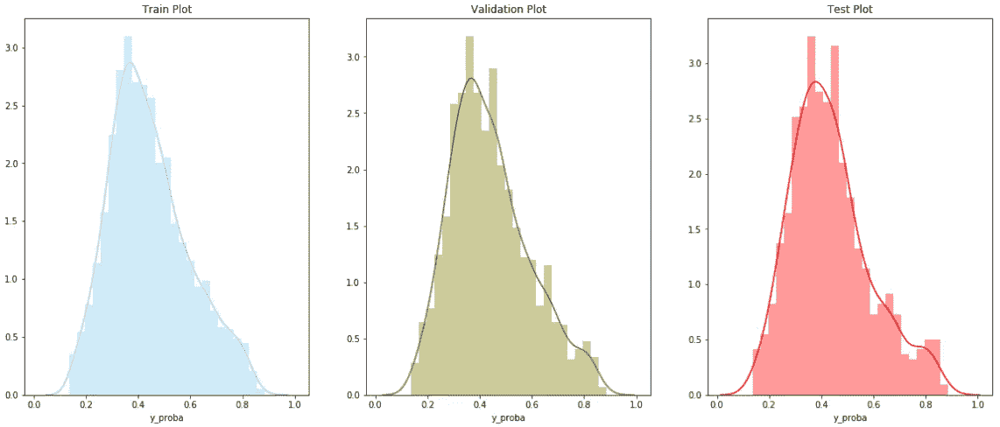
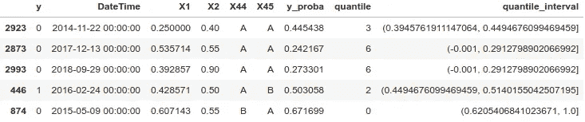
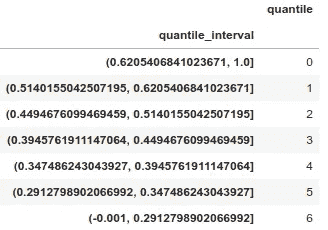
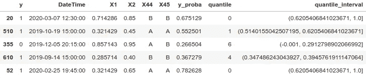
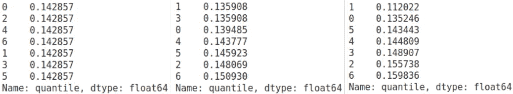

# 为什么&如何从机器学习预测中创建分位数| Python +代码

> 原文：<https://towardsdatascience.com/why-how-to-create-quantiles-from-a-machine-learning-prediction-python-code-da9071622db2?source=collection_archive---------28----------------------->

## 将机器学习预测的输出除以分位数是应用商业策略的一种好方法——对熊猫函数 qcut，cut & IntervalIndex 的研究。|熊猫版:熊猫==1.1.0

照片由[詹姆斯·L·W](https://unsplash.com/@fragilejames?utm_source=medium&utm_medium=referral)在 [Unsplash](https://unsplash.com?utm_source=medium&utm_medium=referral) 上拍摄

# 目录

1.  **为什么要创建分位数**
2.  **使用的数据**
3.  **在列车上创建分位数**
4.  **对新数据应用分位数**
5.  **结论**

# 为什么要创建分位数

当我们建立一个涉及机器学习组件的项目时，我们使用指标(如 AUC、RMSE 等)来选择哪个模型最适合我们的数据。然后，我们使用 sklearn `*predict()*`函数来获取回归的值，或者使用 sklearn `*predict_proba()*`函数来获取观察值等于类的概率(1 表示二元分类)。共同点是，它返回一个必须用于业务策略的连续输出。

建立一个商业战略通常比“如果概率≥ x 就采取行动，否则什么都不做”更复杂，比“对于连续产出的每个可能值，采取不同的行动”更简单。这就是为什么创建分位数是有意义的。更具体地说，这里有两个与回归任务和二元分类任务相关的例子。

示例 1:假设我们在一家零售服装公司的市场部工作，目标是预测数据库中每个客户一年的消费金额。基于这一点，商业策略将是为 15%消费最多的客户提供私人销售渠道，为 15%至 40%的客户提供折扣，为 40%至 60%的客户提供免费运输，并为其余客户提供简讯。

例 2:假设我们在一家房屋租赁公司的收款部门工作，我们有客户延迟付款的数据库，目标是预测哪个客户在月底仍会延迟付款。此外，我们知道，如果我们什么都不做，这些客户中的 50%仍然会延迟。考虑到容量和成本，代理可以给 10%的人打电话，给 30%的人发电子邮件，给 20%的人发短信，剩下的 40%什么也不做。

因此，创建分位数可以将这些策略应用于分布的每个部分，并利用机器学习模型的附加值。

# 使用的数据

在这篇文章中，我将使用一个与体育赌博相关的数据集，目标是给定 45 个特征，对“赢与没赢”进行分类。我将数据集分为训练、验证和超时测试，其中超时测试是 2019/2020 赛季，有 732 个观察值。训练分布为 70%,验证为 30%,长度分别为 3262 和 1398。target = 1(赢)是 44.3%、44.28%和 43.44%，因此在不同的集合中很平衡。我使用 Catboost 库训练了一个梯度提升算法，每个数据集的 *predict_proba* 具有这样的分布:

从视觉上我们可以看到，概率的分布似乎是相同的，Kolmogorov-Smirnov 双样本检验证实了这一点。因此，我们可以创造我们的分位数。

**小心！**具有相同分布的假设是强制性的，如果不是这样，分位数就不会被一般化，商业策略就会失败。

# 在火车上创建分位数

在这个用例中，我选择将我的分布分成 7 个分位数(100/7 = 14.23%)。一种可能的直觉是在每个 14.23%处创建一个箱，但是在不均匀分布的情况下，我们将在末端有很少的观察值，并且几乎所有的观察值都在中间。

所以这个想法是，给定一个分布，我们希望在每个分位数上有相同数量的观察值。pandas 对于该任务的作用是`*pandas.qcut(x, q, labels=None, retbins=False, precision=3, duplicated='raise’)*`，其中 *x* 是一维数组或序列； *q* 是分位数的个数； *labels* 允许为每个分位数设置一个名称{例如:如果 q=3，则低—中—高}，如果 *labels=False* 则返回分位数的整数； *retbins=True* 返回每个分位数的边界数组。

在下面的代码中，我们创建了特性“分位数”，而“边缘”是通过参数 retbins=True 获得的数组。“边缘”的值在区间[0.13653858；0.88398169]这是一个巨大的限制。的确，一个概率在[0；1]因此，在验证和测试数据集中完全有可能出现 y_proba = 0.094 或 y_proba = 0.925 的观察值。这就是为什么我修改了数组，将 0.13653858 的边界替换为-0.001(以便包含 0)，将 0.88398169 的边界替换为 1，同时保留数组中其他分位数的边界。如果没有这种变化，y_proba = 0.094 或 0.925 的分位数的值将为 NaN。

此外，qcut 按升序将 0 值与 x 的最低分位数相关联，但在一些行业(如信用评分)中，它是按降序排列的，所以这就是为什么我对它进行了重新排序，以使 0 分位数代表最高概率分位数。

现在我们有了一个边界数组，让我们把它转换成 IntervalIndex。

> `IntervalIndex`的关键特性是查找索引器应该返回索引器值所在的所有区间。`FloatIndex`是一个糟糕的替代品，因为[浮点精度问题](https://groups.google.com/d/topic/pydata/8aTLVKrPJfs/discussion)，还因为我不想用一个点来标记值。斯蒂芬·肖耶

我使用了熊猫`*pandas.IntervalIndex.from_breaks(breaks, closed='right', name=None, copy=False, dtype=None)*`的函数，其中 *breaks* 是之前定义的一维数组“ed”，*closed =‘right’*旨在表示区间的哪一部分是闭合的(right 意味着右边的值包含在区间中)，而 *dtype* 是推断的格式(在我们的例子中我让 None，推断的格式是 float64)。

现在，可以在 pandas 函数`*pandas.cut(x, bins, right=True, labels=None, retbins=False, precision=3, include_lowest=False, duplicates='raise', ordered=True)*`中使用区间索引对象。这里， *x* 是要 bin 的 1d 数组或序列， *bins* 是宁滨的标准，可以取整数、标量序列或 IntervalIndex*右*、*标签*、*包含 _ 最低*、*精度*和*排序*如果 bin 为 IntervalIndex 则忽略。在下面的例子中，我创建了一个新的特征“分位数间隔”,它基于 IntervalIndex 应用 y_proba 的切割。训练数据集如下图 1 所示。

为了完成分位数的创建，我将分位数值存储在一个名为 dict_inter_quantile 的数据帧中(见图 2)及其相关的 IntervalIndex。

图 1。训练数据集使用条柱切割=Interval_Index

图 2。分位数数据帧

现在已经解释了在训练集上创建分位数的方法，让我们看看如何将它们应用于新数据，比如验证、测试和任何新数据。

# 对新数据应用分位数

这一部分非常简单，因为所有的工作都已经完成了。因此，我们只需使用 cut 函数，以获得概率的 IntervalIndex，并将数据集连接到 dict_inter_quantile，以获得分位数的值。

提供图 3 输出的测试集(验证或任何新数据的相同过程)的例子。

图 3。基于训练集的 IntervalIndex 的具有关联分位数& quantile_interval 的测试数据集。

现在我们已经有了每个新观察值的预测概率的相关分位数，我们可以验证分位数的分布是否在验证和测试中与训练一样均匀分布。

图 4。训练值计数-验证-测试数据集

***那又怎样？*** 上面的图 4 显示了训练-验证-测试之间的分位数的观察百分比非常相似，这意味着数据没有移动，因此我们可以将训练数据集中的边界应用于测试数据集。此外，我们可以应用一种操作策略，如开始时的示例，我们可以检查 y = 1 在每个分位数中的百分比，以查看它是否按相同的顺序排列，和/或如果百分比在数据集之间相似，我们可以尝试改进分布的某些部分，…

# 结论

我们看到了为什么从预测中创建分位数与应用商业策略相关，如何从分布中创建分位数，以及如何在新的分布中使用分位数。只有当您的发行版相同时，这才有意义。你可以用 Kolmogorov-Smirnov 测试或更奇特的方法来检查它。