# 为什么以及如何使用 Bland-Altman 图进行 A/B 测试| Python +代码

> 原文：<https://towardsdatascience.com/why-how-to-use-the-bland-altman-plot-for-a-b-testing-python-code-78712d28c362?source=collection_archive---------21----------------------->

## 最初在医学领域用于比较两种不同仪器提供的两种测量值，本文展示了为什么以及如何将其应用于 A/B 测试——关于 pyCompare 函数 blandAltman | pyCompare 的版本:pyCompare==1.5.1 的研究

照片由[亚历克斯·布洛克](https://unsplash.com/@alexblock?utm_source=medium&utm_medium=referral)在 [Unsplash](https://unsplash.com?utm_source=medium&utm_medium=referral) 上拍摄

# 目录

1.  **为什么用布兰德-奥特曼的剧情**
2.  **使用的数据**
3.  **布兰德-奥特曼剧情如何构建**
4.  **如何解读 A/B 测试的 Bland-Altman 图**
5.  **结论**
6.  **参考文献**

# 为什么要用布兰德-奥特曼的情节

Bland-Altman 图来自医疗行业，用于比较两种仪器的测量值。约翰·马丁·布兰德和道格拉斯·奥特曼的第一个目标是回答这个问题:

> 这两种测量方法足够接近吗？—奥特曼和布兰德[1]

如果是这样的话，这意味着如果你有两台仪器，其中一台是最先进的，成本很高，另一台便宜 10 倍，那么用最便宜的方法得到的结果是否可以与参考值相比，是否可以以足够的精度进行替换？例如，作为心电图的结果，20 美元的联网手表提供的心率足够准确吗？第二个目标是产生一种方法，使非统计人员能够容易地理解结果。

在分析中，A/B 测试(众所周知的冠军挑战者)是一种常用的测试方法，用于比较人口 A 和人口 B 的新行动/新治疗/新设计的结果。一旦我们有了测试结果，就必须对它们进行分析，并提交给一个主要由非统计人员组成的决策团队。这就是为什么 Bland-Altman 图是相关的，因为它将在一个图上比较 A/B 测试的结果与以可理解的方式显示的所有统计测量。

在他们的论文中，他们还说明了为什么相关系数、均值比较的统计检验和回归不适合决定**两个测量值的一致性，这在我们的 A/B 测试案例中是决定挑战者与冠军相比的实力。**

# 使用的数据

在本文中，我将使用 Kaggle 上的一个数据集(来自 DataCamp 项目)，名为“用 Cookie 猫进行移动游戏 A/B 测试”。链接在参考文献部分[2]。

曲奇猫是一款流行的手机益智游戏，当玩家在关卡中前进时，他会遇到“关卡”,迫使他等待一段时间才能继续游戏或进行购买。在这样的行业中，保留是关键指标之一，如果第一个关卡从 30 级移动到 40 级，负责游戏的团队将会看到 7 天保留的影响。为了了解这种移动的行为，他们进行了 A/B 测试，并向我们提供了这些结果的数据集。我们将看到 Bland-Altman 图将如何回答以下问题:“当等待时间从 30 级到 40 级时，如何分析 7 天留存水平上的 A/B 结果？”

数据集由 90.189 行组成，其中有玩家的唯一 id、A/B 测试的版本(在 gate_30 / gate_40 的等待时间)、游戏回合的总和，如果玩家第二天回来，retention_1 是布尔值，如果玩家 7 天后回来，retention_7 是布尔值。为了有相关的数据来回答我们的问题，有必要做一些清理。我将只保留 retention_1 = True(因为如果 retention_1=False，retention_7 也为 False)的客户端，游戏回合数≥ 30(因为如果他们不到 30，他们将不会受到 gate 的影响)和游戏回合数< 170 (because if we consider the duration of a game = 5 minutes, if a player plays 2 hours per day during 7 day he will play 120*7/5 = 168 games. A higher number would be considered as an anormal usage). After this filter, the dataset is composed of 20.471 rows as Figure1 below. Moreover, the dataset is equally balanced between gate_30 & gate_40.

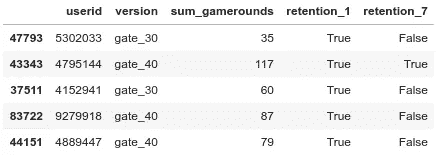

Figure1\. CookieCats dataset

# How is built the Bland-Altman plot

We will see on this section how to adapt the original Bland-Altman plot in order to apply it to an A/B test. First of all I am going to explain how is the plot built in its original version [1], [2] and then, I will explain how to build it with our A/B tests’ data.

Due that the original Bland-Altman plot compare the measurement of 2 instruments, they have the same length by design. For example, with the heart rate measurement between the $20 connect watch and the electrocardiogram, the measure are taken on the same time with the same conditions which lead to have the same number of measurement for the 2 methods. So we can represent each dataset’s row as an experience like on the example in the Figure2 below.

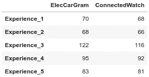

Figure2\. Instrument measure per experience

This is where we encounter the first “pain point”. **A/B 测试被视为独特的体验**，而正如我们在上面看到的，我们需要多次体验才能构建情节。为了绕过这个限制，我们将从 A/B 测试**中创建几个自举样本**，它们具有相同的&不同的长度。

我们生成 300 个 200 到 1000 之间的非唯一随机整数。这些整数将表示每个自举样本的长度，并且为了有利于自举的统计属性，每个非唯一随机整数被复制 50 次。使用这些数字是为了具有样本多样性，但它是任意的，并且长度取决于原始数据集的大小。这些长度在 200 和 2.000 之间的 15.000 (300*50)个自举样本是从原始数据集中用替换通过随机采样获得的**，并且它们被连接在一起。它可以表示为图 3。**

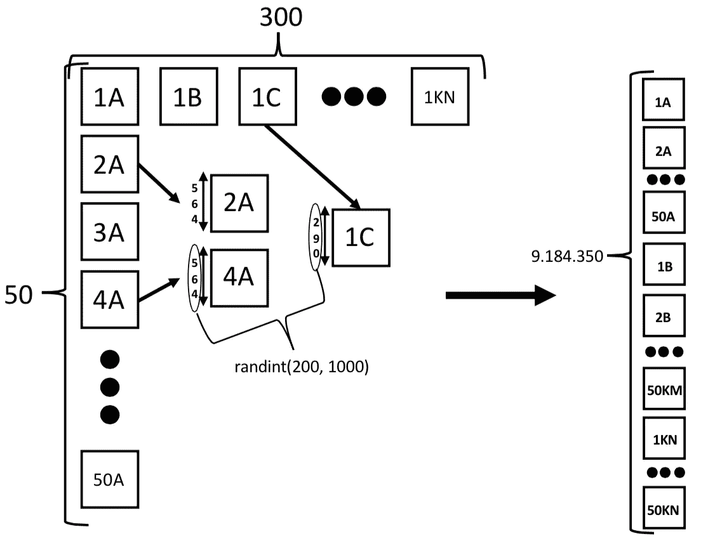

图 3。引导数据集构建

以下代码从原始数据创建引导数据集(请注意，这可能需要一些时间，因为引导数据集的长度为 9.184.350 行*{通过更改 random_state，我们将平均得到(((200+1.000)/2)*300*50 = 9.000.000 行}* )。

然后，我们按 n_sample(每个 15.000 自举样本的 id)、n_sample_2(每个自举样本的长度)和版本进行分组，以便得到每个入口 7 天的玩家保留总数，如图 4 所示。

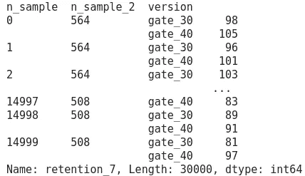

图 4。groupby 后的引导数据集

我们可以将该输出读作:自举样本 n 0/14.999 由 564 行组成，其中 98 个玩家仍在玩 7 天，等待时间在 gate_30，而 105 个玩家仍在玩 7 天，等待时间在 gate_40。

然后，我们使用 bootstrap 的一个统计特性，即**bootstrap 样本的均值是分布真实均值的良好估计值**。我们按照 n_sample_2 和版本进行分组，以便对于每个独特的样本长度，玩家的平均保留数为每个门 7 天，如图 5 所示。

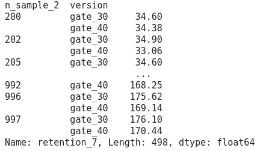

图 5。对于每个独特的样本长度和每个门，在 7 天内仍在玩的玩家平均人数

我们可以将此输出读作:当样本有 200 行时，平均有 34.60 个玩家仍在玩 7 天，等待时间在 gate_30，而有 34.38 个玩家仍在玩 7 天，等待时间在 gate_40。

然后我们拆分数据库，使数据集的格式更加清晰，如图 6 所示。

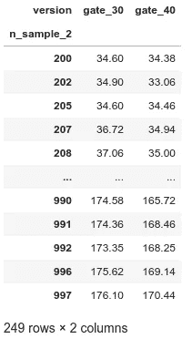

图 6。数据集的未堆叠版本

在这一阶段，我们有了构建布兰德-奥特曼图所需的所有信息，数据集的表示与上图 2 相同。

布兰德-奥特曼图由两个轴组成。**x 轴是比较**的两种方法的平均值。所以对每一行都是:(gate _ 30i+gate _ 40i)/2 | | |**y 轴是方法 A 和方法 B 的区别**。每行都是如此:(gate_30i - gate_40i) |||这是我们的第二个“痛点”。通过保持 y 轴不变，样本大小的增加将增加差异的可变性。因此，我们稍后将获得的统计度量将被最大的样本过度加权。为了绕过这个限制，我们将用百分比【3】来表示 **y 轴。为此，y 的计算是针对每一行的:((gate _ 30i-gate _ 40i)* 100/((gate _ 30i+gate _ 40i)/2)| | |数据集如图 7 所示。**

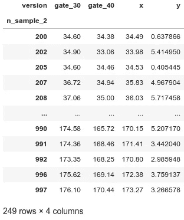

图 7。x 和 y 轴

我们必须检查 y 轴是否为正态分布，以便信任将要显示的置信区间。你可以用夏皮罗-威尔克测试或者至少用直方图来评估它。如果分布不正常，那么你可以做一个转换，如对数转换。在我们的例子中，我认为分布是正态的。

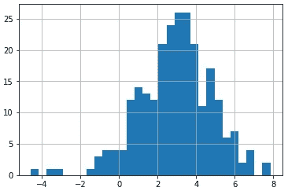

图 8。y 轴的直方图

Bland-Altman 由 3 条线组成(见图 9):

*   y 的**平均值**
*   **y 的置信区间**的上界(这里给定 1.96 为 95%)
*   置信区间的 **y 的下限(95%)**

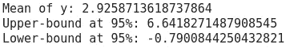

图 9。布兰德-奥特曼图的价值

我们将所有这些放在一起，pyCompare 软件包允许以非常简单的方式绘制布兰德-奥特曼图，而不必构建 *db['y']* :

它首先采用方法 A(冠军)，然后采用方法 B(挑战者)。然后，如果 *percentage = True* ，它会自动做我们上面做的演算。我们稍后将讨论一些其他参数。

# 如何解读 A/B 测试的 Bland-Altman 图

我们到了！下面是由上面的代码生成的 A/B 测试的 Bland-Altman 图:

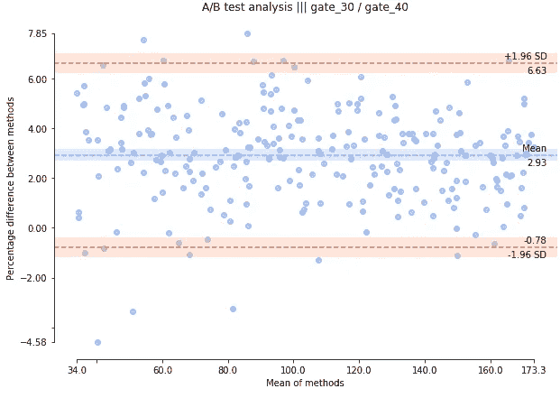

图 10。Bland-Altman 图应用于 A/B 测试

首先，平均值和平均值的置信区间(浅蓝色条纹)不同于 0(在我们的例子中更高)。这意味着**gate _ 30 和 gate_40 的保持水平**(原文中称为偏差)**明显不同**。由于 2.93 > 0，这意味着 A > B < — >冠军挑战者，因此 gate_30 上的等待期比 gate_40 上的等待期提供了更大的保留。

两个鲑鱼棒代表 95%的置信区间(原始论文中命名的协议限制)，表示我们确信 **95%的值将在[-0.78%之间；6.63%】**。在我们的例子中，这是非常强大的，因为我们可以说 gate_30 的保持力几乎总是大于 gate_40 的保持力。

正如你所看到的，上面的鲑鱼条纹上面有 2 个值，下面的有 4 个值，这是 6/300 = 0.02< 0.05 so due that we are certain that 95% of the values are within the 2 boundaries, 5% can be above or below and in our case it represents 2% then it is perfectly normal ;)

In the pyCompare package there is the parameter *limit of agreement*旨在改变信心的界限。这里，一个相关的问题是:“我能确定 30 号门的保持力将**总是**大于 40 号门的保持力的百分比是多少？”要回答这个问题，**最低边界必须等于 0** ，因此我们必须找到正确的值，以便得到 0，正如我们在下面提供图 11 的代码中看到的:

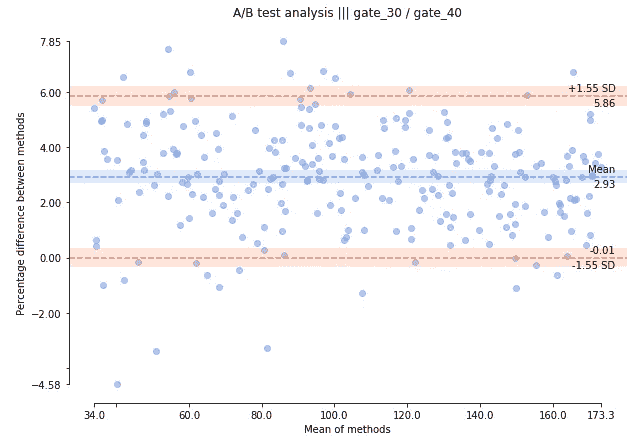

图 11。更改 limitOfAgreement 参数时的输出

我们看到当 *limitOfAgreement = 1.55* 时，边界几乎等于 0。然后，我们必须在正态分布表中检查 1.55 处的值，即 0.9394，因此我们可以确定在((1–0.9394)* 2)* 100 = 87.88%处，gate_30 的保留值将**始终**大于 gate_40 的保留值

最后要补充的一点是，无论样本的平均值是多少，它们在图上都是统一表示的**，这意味着无论样本的大小是多少，我们所做的解释都是通用的**。事实上，如果我们看到一种数值的二次曲线表示，我们可以得出结论，样本的大小对结果有影响，所以我们不能有一个有效的解释。

# 结论

我们看到了为什么使用 Bland-Altman 图是相关的，以便对简单图的 A/B 测试结果有一个看法，如何从 A/B 测试创建图，以及如何解释它。这仅在差异正常的情况下有效，但是有必要转换数据。

此外，我检查了应用程序，gates 似乎在 gate_40 上，而我们证明了 7 天的保留时间比 30 天更好。在这种情况下，它表明，与盈利能力相比，留存率可能不是最好的衡量指标！

# 参考

[1] D. G. Altman 和 J. M. Bland,《医学测量:方法比较研究的分析》,《统计学家》32(1983)307-317

【2】[https://projects.datacamp.com/projects/184](https://projects.datacamp.com/projects/184)或者 https://www.kaggle.com/yufengsui/mobile-games-ab-testing[或者](https://www.kaggle.com/yufengsui/mobile-games-ab-testing)

[3] D. G. Altman 和 J. M. Bland,《评估两种临床测量方法一致性的统计方法》,《柳叶刀》327(1986)307-310

[4] D. Giavarina，理解平淡无奇的 Altman 分析，生物化学医学 25(2015)141–151