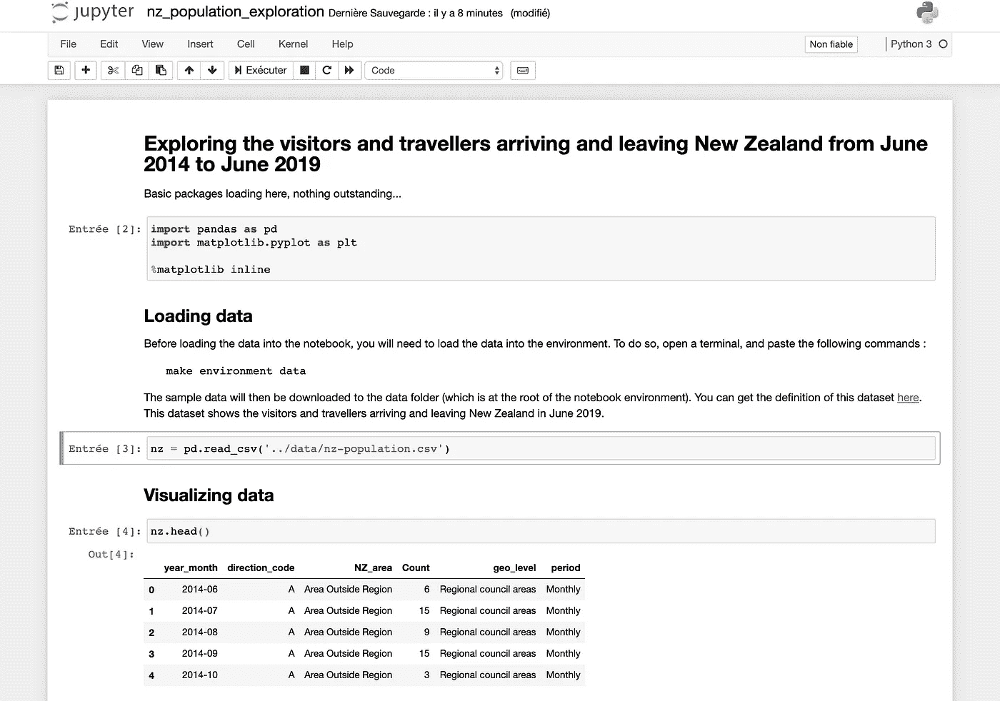

# 为什么我在数据科学项目中使用蓝图

> 原文：<https://towardsdatascience.com/why-i-use-a-blueprint-for-my-data-science-projects-cf1f22c2dd63?source=collection_archive---------44----------------------->

## 了解如何在数据科学项目中使用蓝图，以及从中可以获得多少速度和稳定性。


新西兰瓦纳卡的 Roys 山峰徒步旅行。[约书亚](https://stock.adobe.com/fr/contributor/208479706/joshua?load_type=author&prev_url=detail)在[土坯股票](https://stock.adobe.com/)上的照片

我经常想知道我可以/应该为我的数据科学项目使用什么样的结构。当然，我必须记住一些关键特性，例如:

*   能够可视化地探索数据
*   能够与团队中的其他成员合作，包括数据科学家和数据工程师
*   编写工程代码，代码剖析，单元测试…
*   能够在云中的 Docker 容器中部署我的项目

# 使用笔记本工作？

我有几个选择，第一个是使用 Jupyter 笔记本。笔记本电脑是高效的，因为它们允许用一个工具包来编码、记录和报告！

笔记本电脑的问题是很难与其他团队成员协同工作。此外，我一直认为笔记本不是执行单元测试的完美框架。最终，交付一台笔记本作为我项目的成果是非常诱人的，但大多数时候，这并不是我的老板/客户所期望的。人家买的是一个 app，笔记本不是 app。

# 烹饪刀具

我花了一些时间在互联网上寻找一个可以满足我所有需求的解决方案，过了一段时间，我终于找到了一个名为 *cookiecutter* 的小 python 包。

cookiecutter 所做的只是简单地使用项目的蓝图，并用 JSON 配置文件映射它。您的蓝图将为您的项目设置所有特定的变量。这种工作方式的巨大优势在于，您可以根据需要在多个项目中重复使用您的蓝图。你所要做的就是设置 cookiecutter 需要的变量，让这个蓝图成为你的项目。

您可以通过下面的链接访问 cookiecutter 的完整文档，但是您需要知道的只是如何安装它:)

[https://cookiecutter.readthedocs.io/](https://cookiecutter.readthedocs.io/)

# 构建我的数据科学蓝图

也就是说，我决定不再浪费时间，开始实施我的蓝图。我已经发布了，在 GitHub 上有:[https://github.com/mysketches/data-science-blueprint](https://github.com/mysketches/data-science-blueprint)

我还为我的蓝图写了完整的文档:[https://data-science-blueprint.readthedocs.io/](https://data-science-blueprint.readthedocs.io/)

我尝试开发一个模板，牢记:

*   最终能够构建一个健壮的项目
*   获得一些关于代码可靠性的信心
*   满足在生产环境中部署所需的要求
*   让数据科学家和机器学习工程师围绕一个公共代码库一起工作
*   能够毫不费力地将我的蓝图重新用于其他机器学习项目

经过几次实验，我认为我已经达到了那个目标，这就是我今天想与大家分享的。

# 蓝图的安装

在安装蓝图之前，你必须知道它大量使用 Docker。因此，您必须在机器上安装 Docker。你也必须有权利运行 Docker 没有管理员。如果不是这样，请看看我写的那段文档:[https://data-science-blue print . readthe docs . io/en/latest/installation/requirements . html](https://data-science-blueprint.readthedocs.io/en/latest/installation/requirements.html)

为了与蓝图交互，您还需要访问 *make* 命令，运行在 *Makefile* 文件中定义的指令。

安装蓝图有两个步骤。首先，您应该安装 cookiecutter 包。要安装 cookiecutter，请先安装 *git* 和 *pip* 。然后，您可以运行以下命令:

```
pip install cookiecutter
```

安装 cookiecutter 后，您可以安装我的数据科学蓝图:

```
cookiecutter [https://github.com/mysketches/data-science-blueprint](https://github.com/mysketches/data-science-blueprint)
```

Cookiecutter 将提示您设置蓝图参数的值。在您的控制台上，在安装蓝图的过程中，应该是这样的:

```
full_name [John Doe]:
email [john.doe@myemail.org]:
project_name [DS-blueprint]:
package_name [Awesome project]:
package_slug [awesome_project]:
project_short_description [No description]:
version [0.1.0]:
Select python_interpreter:
1 - python3
2 - python
Choose **from** 1, 2 [1]:
application_cli_name [awesome-project-cli]:
Select opensource_licence:
1 - MIT
2 - BSD
3 - ISCL
4 - Apache Software License 2.0
5 - Not open source
Choose **from** 1, 2, 3, 4, 5 [1]:
docker_base_image [jupyter/base-notebook:python-3.7.6]:
docker_image_name [awesome-project-env]:
docker_container_name [awesome-project-env-instance]:
docker_container_port [8888]:
```

这个过程是迭代的，一个问题接一个问题。就是这样！

# 构建您的环境

要从 Jupyter 笔记本和 shells 中获益，您首先需要构建您的环境。移动到项目的根目录，即 Makefile 文件所在的位置，并键入以下命令:

```
make environment-build
```

在您的环境构建完成后，您可以启动它，这将启动 Docker 容器，让您可以访问您的 Jupyter 笔记本和 shell。

```
make environment-start
```

# 使用一些示例数据

为了这个演示，我写了一堆 python 脚本来加载一些数据，让你玩玩。我猜这将有助于使这个蓝图成为你自己的，并使它更容易根据你的需要进行更新。

我决定研究 2014 年 6 月至 2019 年 6 月抵达新西兰的游客和旅行者的数据样本。在这里阅读数据集的完整描述:[https://www . stats . govt . NZ/information-releases/international-travel-June-2019](https://www.stats.govt.nz/information-releases/international-travel-june-2019)

我已经创建了一个 Jupyter 笔记本来呈现对数据的简要探索，以及一个对数据进行一些简单转换的脚本。

要加载数据，可以使用以下命令:

```
make environment-data
```

当然，如果您愿意，我们会邀请您更新/删除这些样本。

# 使用 Jupyter 笔记本环境

数据科学蓝图允许您加载 Jupiter 笔记本，您可以在其中创建您的探索/机器学习笔记本，并在您的项目中使用其余代码对它们进行版本化。

当您的环境启动后，您可以在浏览器上访问您的笔记本，访问以下 URL:[http://localhost:8888](http://localhost:8888)(默认端口为 8888)



与蓝图一起交付的笔记本样本

# 使用 shell 进行编码和测试

由于这个命令，您还可以访问可以插入的 shell:

```
make environment-shell
```

当您处于您的环境中时，您会看到提示发生变化。从终端，您现在可以访问一个 Python env，其中您的项目已经被部署为一个包。因此，您可以编写类似这样的脚本，并将您的项目作为一个包导入。

```
import pandas as pd
import awesome_project as packnz = pd.read_csv(‘../data/nz-population.csv’)reduced = nz.filter(items=[‘NZ_area’, ‘Count’, ‘geo_level’])
print(reduced.head())print(“\n”)reduced = pack.tolower(reduced, ‘NZ_area’)
reduced = pack.toupper(reduced, ‘geo_level’)
print(reduced.head())
```

# 将您的蓝图用作应用程序

蓝图还提供了命令行界面。然后，您将能够从终端调用项目的一些模块。不用打开 Python shell，您可以将项目安装为 Python 包，并直接调用您的模块，就像您启动了一个程序一样。

首先，您需要安装依赖项并打包您的项目。

```
make install
make package
```

一旦您的项目被部署为一个包，它就可以被部署它的机器上运行的所有 Python 脚本使用。出于本教程的考虑，我开发了一个小的命令行脚本来生成一个 *lorem ipsum* 文本的子样本列表。这是相当琐碎的，但是这个演示的目的只是向您展示调用它是多么容易。

完整的文档将更详细地介绍如何为您的项目设置端点。

您可以首先调用命令行并获得如何使用它的信息

```
awesome-project-cli --help
```

输出很简单

```
Usage:
    awesome-project-cli lorem <iterations> [--text-size=<text_size>]
    awesome-project-cli data <data-url> <data-location>
    awesome-project-cli (-h | --help)
```

数据操作让我们调用 lorem 命令并生成一些文本。

```
awesome-project-cli lorem 10 text-size=50
```

该程序将输出一个 lorem ipsum 列表…

```
['Lorem ipsum dolor sit amet, consectetur adipiscing', 'Lorem ipsum dolor sit amet, consectetur adipiscing', 'Lorem ipsum dolor sit amet, consectetur adipiscing', 'Lorem ipsum dolor sit amet, consectetur adipiscing', 'Lorem ipsum dolor sit amet, consectetur adipiscing', 'Lorem ipsum dolor sit amet, consectetur adipiscing', 'Lorem ipsum dolor sit amet, consectetur adipiscing', 'Lorem ipsum dolor sit amet, consectetur adipiscing', 'Lorem ipsum dolor sit amet, consectetur adipiscing', 'Lorem ipsum dolor sit amet, consectetur adipiscing']
```

# 运行单元测试和代码覆盖率

我认为给你机会用工具来测试你的代码是很重要的。使用 make 命令可以很容易地做到这一点:

```
make test
```

这将给你单元测试的输出

```
======================= test session starts ========================
platform linux -- Python 3.7.6, pytest-5.4.1, py-1.8.1, pluggy-0.13.1
rootdir: /data
collected 4 itemsawesome_project/tests/operator/test_data.py .                 [ 25%]
awesome_project/tests/operator/test_dataframe.py ..           [ 75%]
awesome_project/tests/operator/test_generator.py .            [100%]======================= 4 passed in 0.84s ==========================
```

你也可以做一些代码覆盖，来检查单元测试是否覆盖了你所有的代码

```
make coverage
```

这是您将看到的输出

```
Name                                               Stmts   Miss  
--------------------------------------------------------------------
awesome_project/__init__.py                          4      0   100%
awesome_project/operator/data.py                     6      0   100%
awesome_project/operator/dataframe.py                6      0   100%
awesome_project/operator/generator.py                4      0   100%
awesome_project/tests/operator/test_data.py          6      0   100%
awesome_project/tests/operator/test_dataframe.py    11      0   100%
awesome_project/tests/operator/test_generator.py     3      0   100%
--------------------------------------------------------------------
TOTAL                                               40      0   100%
```

# 测试代码的质量

多亏了 flake8 包，测试项目的编码约定成为可能。这对于确保遵守编码要求非常有用。这是非常有价值的，尤其是在和一个有很多工程师的团队一起工作的时候。

您可以使用以下命令启动代码分析:

```
make lint
```

如果您有编码约定错误，它们将自动在控制台中报告，如下所示:

```
./awesome_project/operator/generator.py:4:31: E203 whitespace before ':'
./awesome_project/operator/data.py:3:1: E302 expected 2 blank lines, found 1
make: *** [lint] Error 1
```

# 现在怎么办？

我正在制作的蓝图展示了一些特性，我想这些特性可能会让你感兴趣，尤其是如果你希望创建一个数据科学项目的话:

*   您的项目的一个包结构，随时可以构建
*   一个 dockerized 环境，允许你访问 Jupyter 笔记本，一个私有 shell，单元测试，代码剖析，代码覆盖
*   一套工具来打包您的项目，并将其嵌入到 Docker 映像或 PyPI 中

# 你能从这个蓝图中期待什么？

*   节省大量时间，并迭代尽可能多的项目
*   帮助数据科学家用笔记本工作，机器学习工程师用 Python 打包代码工作。
*   通过测试和代码分析增加项目的健壮性。
*   简化您的项目在生产基础设施上的部署

# 想了解更多？

我还花了一些时间为这个项目写了不错的文档，这样你就可以了解如何使用它的所有特性。你可以在这里获得完整的文档:[https://data-science-blueprint.readthedocs.io/](https://data-science-blueprint.readthedocs.io/)

但是对我来说最重要的是你可以把这个项目变成你自己的。这对我很重要，你可以派生它，接触源代码，并根据你的需要更新它。

下面是 Github 项目的链接:【https://github.com/mysketches/data-science-blueprint 