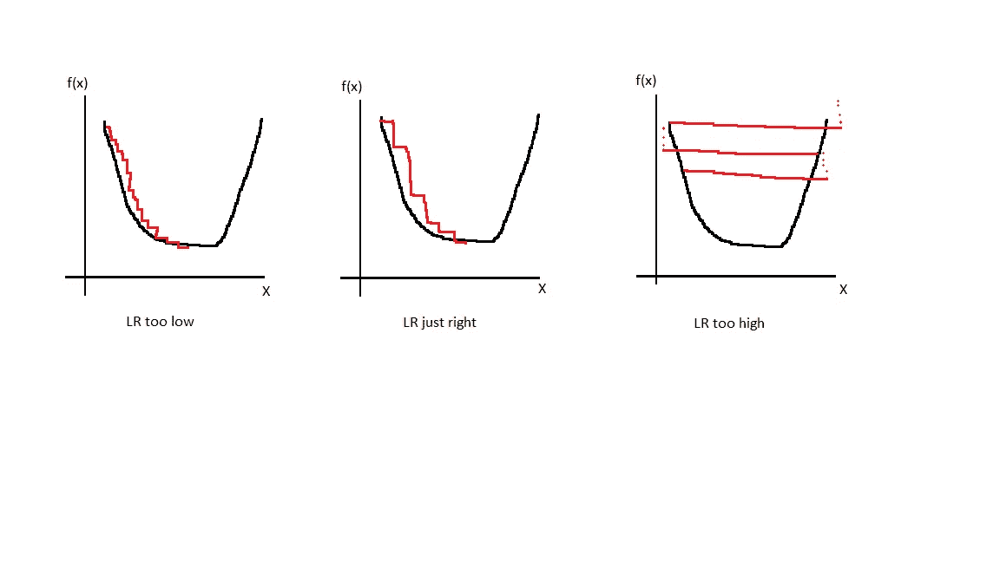
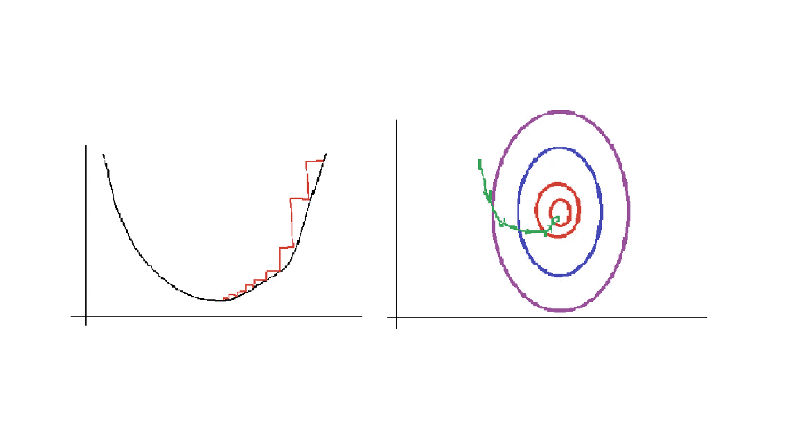
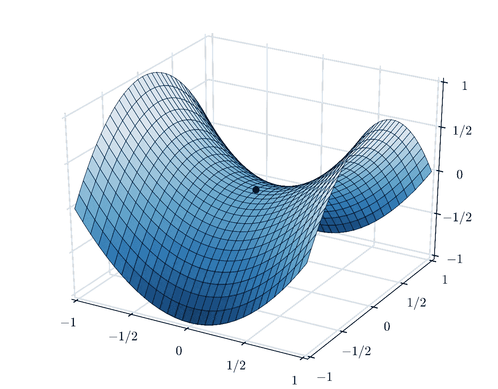
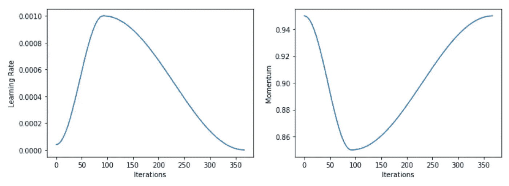
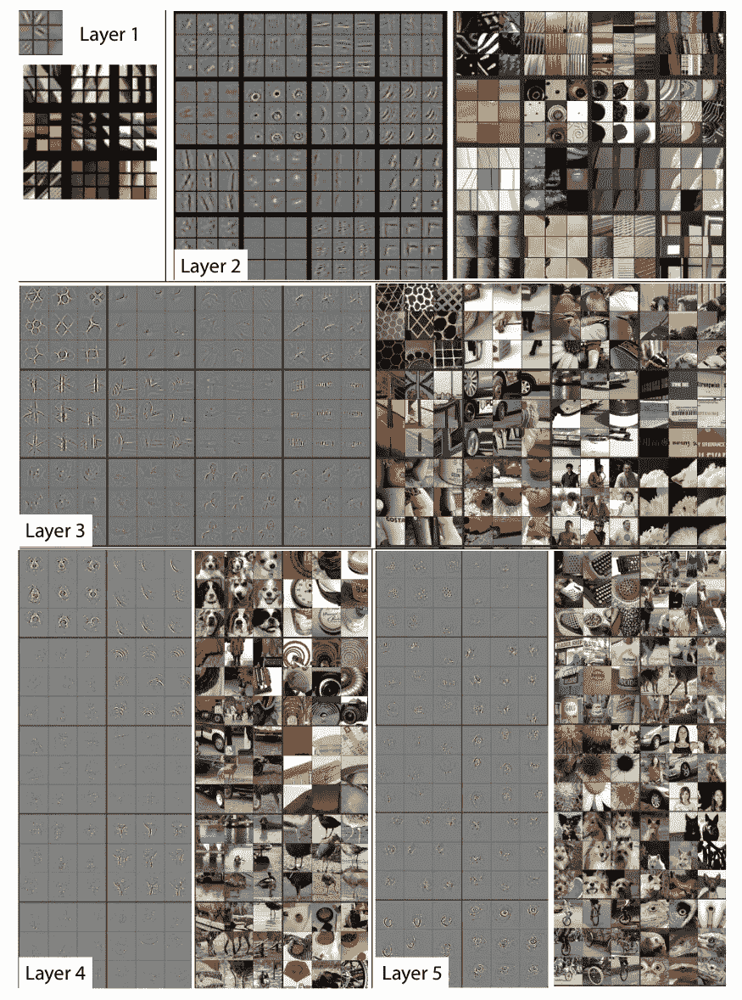
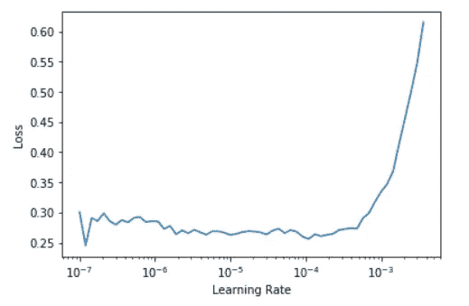

# 为什么我用 Fastai，你也应该用。

> 原文：<https://towardsdatascience.com/why-i-use-fastai-and-you-should-too-a421f6c99508?source=collection_archive---------29----------------------->

## 这是一个多部分系列的第 1 部分:关于我最喜欢的深度学习库 fastai，我最喜欢的事情。

# 这一集:学习率(LR)

## fastai 之前的 LR

找到最佳 LR 的一般共识通常是用不同 LR 的不同优化器完全训练模型，直到达到期望的度量。最佳 LR 和优化器的选择取决于它们在选择阶段的最佳组合。这是一种不错的技术，尽管计算量很大。

> 注:由于我是在深度学习生涯的早期被介绍给 fastai 的，所以我不太了解在没有 fastai 的情况下/之前事情是如何完成的，所以如果这有一点不准确，请让我知道，也不要完全相信这一部分。

# 快速方法

通向 LRs 的捷径受到了 Leslie Smith 论文[1]的影响。寻找最佳 LR 主要有 3 个组成部分，寻找用于训练的最佳 LR(在 LR 寻找部分中解释)，随着训练的进行，减少 LR(在 LR 退火部分中解释)，以及迁移学习的一些注意事项(在判别 LR 中解释)和一个周期训练(LR 退火的一部分)。



LR 和后果。图片由作者提供。

**我们的学习率应该是多少？** 这是一个要问的重要问题，因为学习率是驱动我们的模型参数达到最优解的因素。太低，学习时间太长。太高的话，模型*甚至*都学不会。我们需要一个在一定范围内的学习率，它能以合理的速度使参数收敛。

## LR 查找

LR find 是 fastai 寻找好的学习率的方法。他们首先选择一个非常低的 LR，在这个 LR 下训练一个小批量，然后计算损耗。以递增的更高 LR 训练下一个小批量，并且这个过程继续，直到我们达到模型明显偏离的 LR。

LR 是相对于损耗绘制的，我们可以看到下图。存在一个损耗最小的特定 LR，在此之后，再增加 LR 将使损耗恶化。

选择损耗最低的 LR 是错误的。我们需要损失减少最快的 LR。这也是图表中最陡的部分。Fastai 实现了一个函数来查找除以 10 的最陡和最小 LR(这也是一个很好的训练 LR)

```
learn.lr_find() [[docs]](https://docs.fast.ai/callback.schedule#Learner.lr_find)
```


LR 查找。图片来自 [fastiai 的 fastbook](https://github.com/fastai/fastbook) ，GPL-3.0 许可证

> 这种方法在计算上更便宜和更快，因为我们只需要 1 个时期(甚至不需要)来找到最佳 LR，而传统上我们将为 LR 的每个逻辑范围训练 1 个时期(肯定总共多于 1 个时期)。

## 低温退火

谜题的下一步是 LR 退火。最初，我们的参数是不完善的。它们与最佳参数相差甚远。但是随着我们训练，参数越来越接近最佳值。

当我们的参数非常远离最优(开始)时，我们希望在最优的大致方向上采取更大、更不精确的步骤。但是当我们越来越接近时，我们不希望采取大的步骤而意外地超过 optima，我们希望采取较小的步骤来获得精确的完美参数集。

> 这类似于高尔夫球。你不要试图一杆进洞，(你可以，但更多的是运气而不是技巧)，你只是试着在球洞的大致方向上尽可能远地高球。当你靠近时，你改变球杆以获得更高的精确度和控制力，并寻找更小的步伐，每一步都让你更靠近球洞。

这就是为什么在训练开始时，我们想要大的学习率，这促使我们努力快速地接近最佳参数，但当我们接近最佳参数时，我们想要降低学习率。随着我们的损失减少，我们希望采取更小的步骤，因此使用更小的 LR。

这种在训练期间改变 LR 的过程被称为 LR 衰减/ LR 退火。下图显示了较大的初始步骤与较小的最终步骤的对比。



Lr 退火。作者图片

## 适合一个周期

当前对基于 GD(梯度下降)的训练的难度的普遍共识是优化器可能陷入鞍点。这与我们过去认为的主要问题(局部最小值)不同。Leslie Smith 在[3]中表明，增加 LR 有助于避开鞍点并到达损失函数的良好区域，此后，我们再次降低 LR，原因在 LR 退火中解释。然而，Sylvain Gugger [在这里](https://sgugger.github.io/the-1cycle-policy.html)解释了拟合一个周期方法的最后一步，即将 LR 减少到最后几次迭代的最小 LR 的百分之一。也被称为湮灭。



鞍点。图片由尼科瓜罗——自己的作品，CC 由 3.0，【https://commons.wikimedia.org/w/index.php?curid=20570051 

步骤很简单，选择一个 LR，如本文的 LR 查找部分所述。这是最大可接受的 LR。我们还选择一个最小 LR，正如 Sylvain 所建议的，是最大 LR 的十分之一。现在我们在这个范围之间循环，其中循环长度略小于历元总数。最后，我们将 LR 降至最小 LR 的百分之一。

```
fit_one_cycle(**learn**:[Learner](https://fastai1.fast.ai/basic_train.html#Learner), **cyc_len**:int, **max_lr**:Union[float, Collection[float], slice]=***slice(None, 0.003, None)***, **moms**:Point=***(0.95, 0.85)***, **div_factor**:float=***25.0***, **pct_start**:float=***0.3***, **final_div**:float=***None***, **wd**:float=***None***, **callbacks**:Optional[Collection[[Callback](https://fastai1.fast.ai/callback.html#Callback)]]=***None***, **tot_epochs**:int=***None***, **start_epoch**:int=***None***) [[docs](https://fastai1.fast.ai/train.html#fit_one_cycle)]
```

安排 LR 时有两个主要参数可以使用，这就是我们在单周期策略中所做的事情。这些是动量和步长。更多关于 LR 如何安排的信息和进一步阅读，请点击[这里](https://fastai1.fast.ai/callbacks.one_cycle.html#The-1cycle-policy)。



一个周期左右。图片由 fastai 课程，Apache-2.0 许可。

## 辨别 LR(迁移学习期间)

迁移学习是使用为一项任务训练的神经网络，在最少的训练后做不同的任务的过程。这是非常有用的，原因我现在将解释。

泽勒和弗格斯发表了一篇令人惊叹的论文，名为《可视化和理解卷积网络》[2],他们在论文中展示了神经网络的不同层学习的内容，并将不同层学习的内容可视化。从下图中，我们可以看到第一层识别基本的线条、颜色和颜色渐变。第二层识别更复杂的形状，如边缘和圆形，然后到了第三层，网络开始识别模式。

现在，假设你有一个可以识别猫的猫检测器。你想做一个熊探测器。比起随机噪声，猫更像熊，猫探测器的大多数层已经学习了非常有用的参数。所以我们只需要微调模型，改变最后几层。



神经网络的不同层次看到了什么。来源:[可视化和理解卷积网络](https://arxiv.org/pdf/1311.2901.pdf)。

而 fastai 非常适合做这件事。fastai 迁移学习的方法基本上是两个步骤。

1.  我们首先冻结我们的模型，这意味着停止对早期层的梯度计算，只训练最后 2 层。
2.  然后我们解冻这个模型，这样渐变就会一直流回来。然而，我们已经知道早期的层不需要大量的学习，因为它们已经学习了重要的参数(像图像的线条这样的公共属性)。因此，我们需要较低的学习率用于早期层，较高的学习率用于后期层。Fastai 内置了这一功能。

用快速人工智能进行迁移学习的 4 行代码是

```
learn = cnn_learner(dls, resnet34, metrics=error_rate) 
#import a model of your choice, pretrained on imagenet (default)learn.fit_one_cycle(3, 3e-3) 
#train the last few layers of modellearn.unfreeze() 
#unfreeze the model, so we can train all layerslearn.fit_one_cycle(12, lr_max=slice(1e-6,1e-4))
# use a lr_max, which uses lowest value of LR for first layer
# and increments LR for later layers
```

下图是模型解冻后 LR 对损失的曲线图。正如我们所看到的，损失并没有急剧下降，这与我们的想法是一致的，即初始层已经学到了有用的信息。因此，即使在开始时损失也很低，并逐渐下降。

> 选择 LR 的方法保持不变，最小值/10 或最陡下降点



微调期间的 LR。图片来自 [fastiai 的 fastbook](https://github.com/fastai/fastbook) ，GPL-3.0 许可证

# 参考

[1]. [Leslie N. Smith](https://arxiv.org/search/cs?searchtype=author&query=Smith%2C+L+N) ，神经网络超参数的训练方法:第 1 部分——学习速率、批量大小、动量和权重衰减(2018 *)，* [arXiv:1803.09820](https://arxiv.org/abs/1803.09820)

[2].[马修·D·泽勒](https://arxiv.org/search/cs?searchtype=author&query=Zeiler%2C+M+D)，[罗布·弗格斯](https://arxiv.org/search/cs?searchtype=author&query=Fergus%2C+R)，可视化和理解卷积网络(2013)， [arXiv:1311.2901](https://arxiv.org/abs/1311.2901)

[3]. [Leslie N. Smith](https://arxiv.org/search/cs?searchtype=author&query=Smith%2C+L+N) ，训练神经网络的循环学习率(2017)， [arXiv:1506.01186](https://arxiv.org/abs/1506.01186)