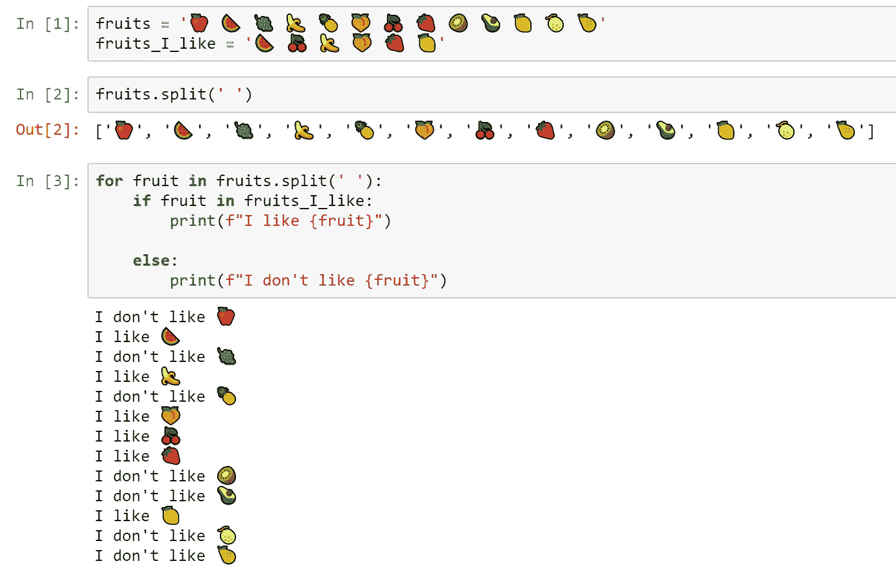
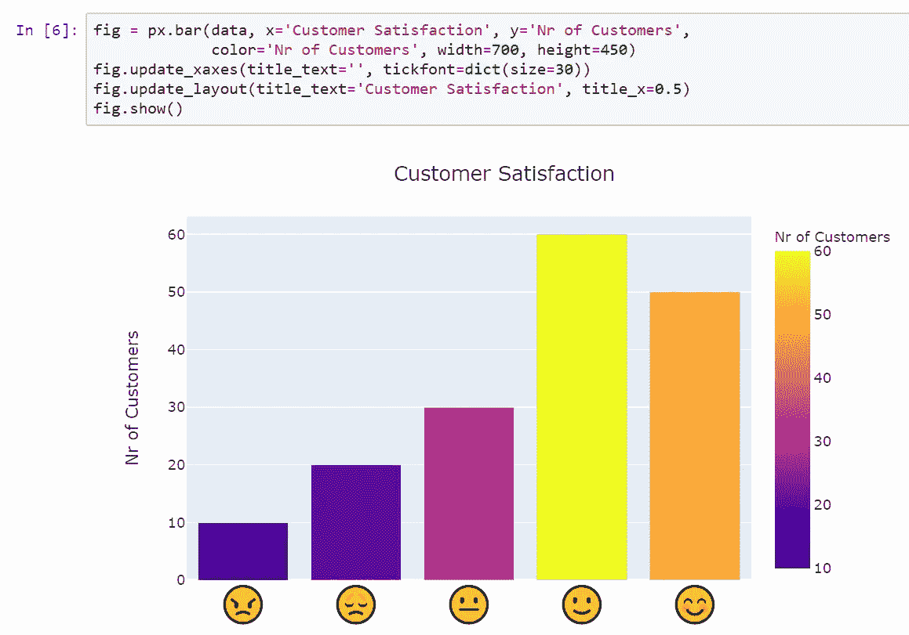
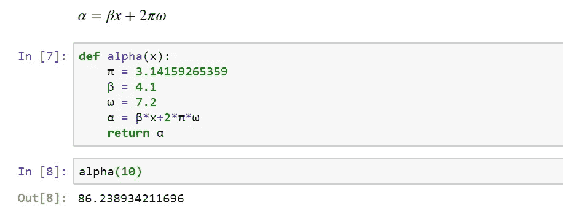

# 为什么我在 Jupyter 笔记本上用表情符号编码

> 原文：<https://towardsdatascience.com/why-im-coding-with-emojis-in-jupyter-notebooks-23f08585ed3d?source=collection_archive---------17----------------------->

## 你们中的一些人可能认为这是一个亵渎神明的想法。我不打算把我所有的 x，y，z 都换成笑脸。但是，这是一个很好的功能，可以为您的演示文稿增添一点亮点

图片改编自 [bruce mars](https://unsplash.com/@brucemars?utm_source=unsplash&utm_medium=referral&utm_content=creditCopyText) 在 [Unsplash](/s/photos/thinking?utm_source=unsplash&utm_medium=referral&utm_content=creditCopyText) 上的照片。

当我第一次意识到我们可以在代码中使用表情符号时，我非常惊讶。目前，表情符号不能用于定义 Python 中的变量或函数。**然而，它们可以用作列表、字典、熊猫数据框、绘图等中的字符串。**像希腊字母这样的其他字符也可以使用，不仅是字符串也可以作为变量！在大多数情况下，在代码中使用表情符号和非拉丁符号可能不是一个好的做法。然而，我认为在一些情况下，它们不仅是可以接受的，而且是可取的。

*   想象你是一名教师**正在向年轻的观众介绍代码**。
*   或者也许你正在向一个没有强大编程背景的观众展示你的作品。
*   或者也许你想**让你的数据图更吸引人**。
*   或者，也许你正在实现一篇充满数学表达式和大量希腊字母的论文。

在这种情况下，使用表情符号和非拉丁字符是更好地表达你的代码和吸引观众的好方法。

**以清晰、吸引人的方式交流想法对于数据科学家来说是一项非常重要的技能。**

我给你看三个例子！

# 1.教学代码

第一次学习代码可能是一次具有挑战性的经历。用表情符号让代码更加丰富多彩是促进学习的好方法。下图只是一个简单的例子。

*   首先我定义一个水果清单，一个我喜欢的水果清单。
*   接下来的练习是打印“我不喜欢”或“我喜欢”，然后是每种水果的水果图标。

用水果表情教循环和条件的例子。作者创造的形象。

这个例子很适合教循环和条件！我可以用字母表中的字母列表来代替，但是你必须同意这将是一个无聊的例子。**动机对学习非常重要，这就是为什么在概念呈现方式上向前迈进一步很重要。**

# 2.增强演示

表情符号是一个好主意的另一种情况是增强你的演示。在下面的例子中，我创建了一个客户满意度柱状图。看看**表情符号是如何传达对**形象的清晰解读的。没有必要为了理解意思而阅读文本标签。如果你正在与国际观众分享你的作品，对你来说是个好消息——**表情符号是一种通用语言！**

使用表情符号增强演示的示例。作者创造的形象。

这个图是使用 [Plotly](https://plotly.com/python/) 创建的。`data`变量是一个熊猫数据帧，它包含在`Customer Satisfaction`列中的表情图标和在`Nr of Custumers`列中的值。你可以在这个故事的结尾找到完整的 Jupyter 笔记本的链接。

# 3.数学表达式

科学文章经常有充满希腊字母的数学表达式。在代码中使用相同的字母是一个很好的方法，可以使代码看起来更接近原始表达式，更容易理解。在下图中，我展示了一个在函数中实现简单数学表达式的例子。我保留了函数名和通常的拉丁字符。**然而，在函数内部，使用非拉丁字符是为了更好地理解**，这对任何人都没有坏处。

使用希腊字母编码数学表达式的例子。图片由作者提供。

请注意，我可以将希腊字母写成 *alpha* 、 *beta* 、 *pi* 和 *omega* 。然而，对于不熟悉希腊字母的人来说，这将使代码变得更加冗长和难以理解。上面的例子很简单。没什么大区别。但是对于复杂而长的表达式，它可以使代码简洁并且在视觉上更有吸引力。

# 结束语

以清晰简洁的方式呈现代码是很重要的。**表情符号和非拉丁字符的使用有助于让代码成为更广泛受众的交流语言。在我们人类与技术紧密相连的世界里，这是一种分享思想的语言。**

以下链接提供了用于制作上述示例的 Jupyter 笔记本:

 [## code_with_emojis.ipynb

### 用于创建以上所有示例的笔记本。

github.com](https://github.com/mnpinto/jupyter_tutorials/blob/master/code_with_emojis.ipynb) 

我希望你觉得这个故事很有见地！😊

# 关于我

 [## 我的 3 年历程:从零 Python 到深度学习竞赛高手

### 自从 2017 年开始学习 Python 以来，我一直遵循的道路是成为一名独自参加 Kaggle 比赛的大师…

towardsdatascience.com](/my-3-year-journey-from-zero-python-to-deep-learning-competition-master-6605c188eec7) 

*感谢阅读！祝您愉快！*