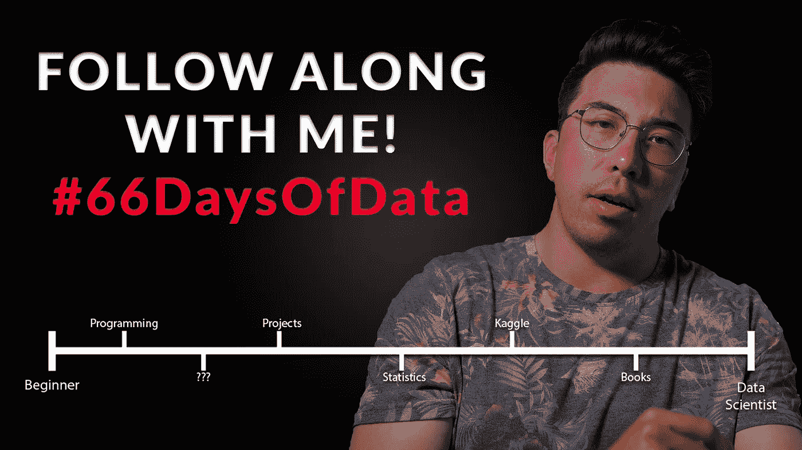

# 为什么我要重新开始数据科学？

> 原文：<https://towardsdatascience.com/why-im-starting-data-science-over-21bec8036ce9?source=collection_archive---------37----------------------->

## 介绍#66DaysOfData

我感觉卡住了。

在我目前的工作和我创建的内容(视频和博客)中，我感觉我已经开始停滞不前了。我的内容的大多数消费者都刚刚开始他们的数据科学之旅。我在这个领域呆得越久，就越感觉不到和他们的联系。

另一方面，在我的日常工作中，我不从事任何尖端的工作。我也没有进一步提高我的数据科学技能。一直夹在乱七八糟的中间，不喜欢。

是改变的时候了。

如果你喜欢视频:[https://www.youtube.com/watch?v=uXLnbdHMf8w](https://www.youtube.com/watch?v=uXLnbdHMf8w)

## 我要从头开始

我决定，让自己快速起步的最佳方式是从头开始重新学习数据科学。这也有助于我更好地与我的核心受众建立联系，制作更好的内容。

我开始意识到，我与数据科学相关的习惯开始萎缩。我想找到一种方法来加强这些。

在我对数据科学的追求中，我发现最有价值的两个概念是一致性和责任性。我想发起一场运动来促进这些地区的发展。

## 我的解决方案:#66DaysOfData

我想与他人分享我的数据科学学习之旅，并鼓励他们参与进来，而不是独自完成这项工作。我将于 9 月 1 日正式启动#66DaysOfData 计划。我选择 66 天是因为这是建立一个新习惯所需要的平均时间(我知道平均时间有很大的问题……但是请原谅我)。

这是一个非常简单的挑战。只有两个要求:

1.  连续 66 天每天至少花 5 分钟学习数据科学(一致性)
2.  使用#66DaysOfData(问责制)分享您每天将在自己选择的平台上工作的内容

欢迎你和我一起从头再来，也可以学习任何符合你目前兴趣的东西。

不和谐服务器为主动:【https://discord.gg/VXSUJYJ 

你也可以在这里追究我的责任:【https://twitter.com/KenJee_DS】T4

## 为什么你应该加入我

我认为每个人都可以从改进的数据科学习惯中受益。对我来说，习惯使我们不必努力工作。当我们的习惯发生作用时，我们就进入了自动驾驶状态，我们不需要对抗启动的阻力。

对我来说，动力一直是个大问题。我真的很喜欢一个项目或一个想法，并且毫不犹豫地花大量时间在上面。在我把它放下一两天后，我会努力重新捡起来，因为我觉得我必须从头再学一遍。每天工作(即使只有 5 分钟)，可以帮助你保持动力，避免停滞不前。

通过制作 YouTube 内容，我知道如果我告诉别人一些事情，我更有可能去做。我对我的目标和项目直言不讳，我认为这帮助我在平台上取得了一些适度的成功。我想与那些对这项倡议感兴趣的人分享问责的力量。这可能非常可怕，但也非常有益。

不仅你会被追究责任，而且这也会鼓励你分享你的工作。如果你读过我的文章或看过我的视频，你就会知道我认为在社交上分享你的作品有多重要。这是一个非常简单和低压力的方式，让你养成与社区分享你的项目和目标的习惯。

## 我将如何学习

同样，没有必要完全按照我正在做的去做。这项挑战更侧重于培养良好的习惯，并帮助您学习您感兴趣的确切的数据科学知识。

尽管如此，如果人们有兴趣从我开始，我已经在这个视频中分享了我将使用的资源和我将采取的步骤:[https://www.youtube.com/watch?v=uXLnbdHMf8w](https://www.youtube.com/watch?v=uXLnbdHMf8w)。

## 最后的想法

我认为这是一个打破常规的好借口。感觉没有动力和停滞不前是很常见的。我们可以用我们正在创造的习惯的力量打破这些感觉。

希望看到我从头开始，也能激励你重新拾起它！我认为这将是一个有趣的实验，我希望你们都和我一起参与进来！