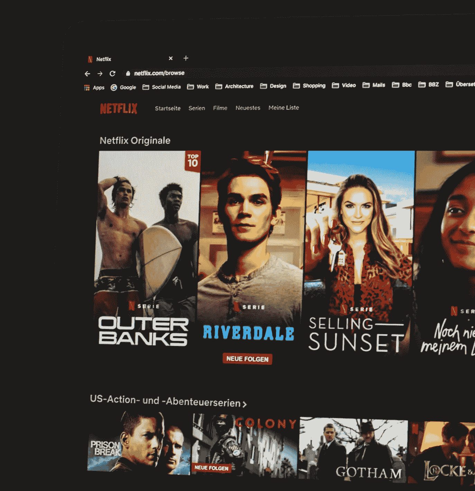
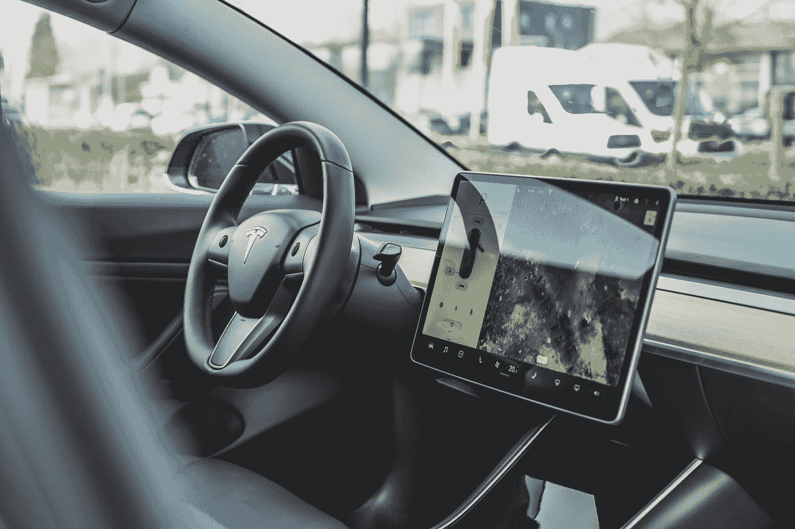

# 为什么物联网是人工智能革命的第一步

> 原文：<https://towardsdatascience.com/why-iot-is-the-first-step-in-ml-ai-revolution-aedab1b92e88?source=collection_archive---------34----------------------->

## 大家都忘记了最关键的环节

照片由 [Unsplash](https://unsplash.com?utm_source=medium&utm_medium=referral) 上的 [Jp Valery](https://unsplash.com/@jpvalery?utm_source=medium&utm_medium=referral)

有这么多关于人工智能和人工智能的炒作，以及它将如何彻底改变你周围的一切，有一个非常重要的环节人们往往会错过它的发生。这就是物联网，或者简称为**物联网**。

让我们来理解 ML 的基础，以及它是如何改变任何过程的。以网飞这样的在线流媒体服务为例。根据你的观看历史，它会推荐你接下来应该看的节目和电影。

在这样的推荐引擎出现之前，我们习惯于根据评分来决定。虽然收视率在区分好电影和荒谬电影方面做得很好，但它对你是否喜欢一部电影并没有太大帮助。你可能喜欢 6 星级的电影，但不会喜欢 8 星级的。

由于网飞有数百万用户通过其平台观看内容，他们有海量的数据，用户可以明确地(竖起大拇指和向下)和隐含地(观看完整系列，点击同一部电影或另一部电影的特定海报)告诉他们是否喜欢某部电影，网飞根据这些数据为你个性化推荐(*而不是某些评论家*)。

网飞还根据你和数百万其他人的观看历史预测每个用户会看什么，然后缓存(提前加载)到离这些用户最近的数据中心。网飞还需要处理大量的媒体处理(不同设备的不同格式和分辨率的视频转换)，这是一个昂贵的过程。因此，它通过根据可用服务器负载的历史数据再次预测未来的服务器负载来优化成本，并将这些任务分配给未充分利用的资源。

因此，你会看到机器学习为每个用户引入了个性化(这在以前是不可能的)，并且优化了所有流程，以实现更高的效率和对可用资源的更好利用。

## **那么，是什么让网飞能够个性化体验并优化所有资源呢？**

他们在一段时间内积累的客户行为和资源使用的数据。

只有拥有足够大和相关的数据，他们才能实现这一切。

但是网飞和所有其他平台有一个非常独特的优势。由于完整的生态系统是数字化的，他们的所有数据都被持续收集，任何个性化/推荐都可以提供。它的所有资源都是数字化的，并受到实时监控。但你周围的大多数过程却不是这样。

你的生活并不局限于你使用的数字设备。事实上，你的大部分活动都在屏幕之外。

## **物联网带来了什么？**

为了让人工智能和人工智能真正具有革命性，它必须改变你周围的流程。它必须在你生活的各个方面创造价值，而不仅仅是数字生活。

为了进一步理解，让我们考虑一下你生活中最重要的一个方面:**交通**。

## **自动驾驶汽车**

几十年来，人类一直在独自驾驶汽车，后来有一家公司想要改变这种状况。如果你一直生活在岩石下，那家公司就是特斯拉。他们的愿景是利用人工智能和人工智能创造无人驾驶汽车，无需任何人工干预。

但与网飞不同的是，驾驶不仅仅局限于数字世界。事实上，大多数汽车甚至都没有接近数字生态系统。缺少最重要的成分，即数据。

这就是物联网发挥作用的地方。自动驾驶汽车的第一步是制造一辆收集各种驾驶数据并可以数字化控制的汽车。这种新的数字汽车将使用雷达收集周围数据，人类司机的活动，汽车各部分的运行数据。这些数据将用于开发自动驾驶系统，然后不断改进该系统。

照片由 [Unsplash](https://unsplash.com?utm_source=medium&utm_medium=referral) 上的 [Bram Van Oost](https://unsplash.com/@ort?utm_source=medium&utm_medium=referral) 拍摄

这种汽车数字化是由物联网实现的。放在汽车中的附加硬件(传感器、处理器和数字控制器)弥合数字世界和物理世界之间的差距，是物联网的核心。

就像没有第一个物联网支持汽车就无法实现自动驾驶汽车的梦想一样，没有物联网首先支持行业的流程和产品，就无法实现用人工智能改造大多数行业的梦想。

物联网支持本身提供了大量价值，而不需要人工智能和人工智能，但它确实将事情向前推进了一步。

如果你对此感兴趣，并且想开始一个物联网项目，这将帮助你开始

 [## 开始构建物联网产品的全面指南

### 当我开始开发我的第一个物联网项目时，我希望我有这样的指南

towardsdatascience.com](/a-comprehensive-guide-to-start-building-an-iot-product-ba32dfb91c7a)