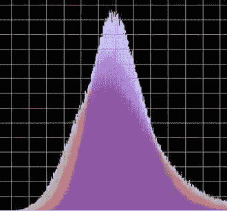
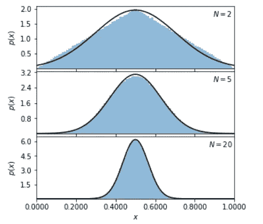

# 为什么中心极限定理对数据科学家很重要？

> 原文：<https://towardsdatascience.com/why-is-central-limit-theorem-important-to-data-scientist-49a40f4f0b4f?source=collection_archive---------9----------------------->

## 数据科学，统计学

## 中心极限定理是每个数据科学家/数据分析师每天所做的统计推断的中心。

自然界一切正常(图片来源:作者图片)

在本文中，我们将探讨中心极限定理，什么是中心极限定理，为什么它很重要，以及大数定律和中心极限定理之间的区别是什么？

**中心极限定理****【CLT】**是**统计**和**概率**的中流砥柱。该定理表示，随着样本规模的扩大，多个样本之间的平均值分布将类似于**高斯分布**。

我们可以考虑做一个试验，得到一个结果或者一个观察结果。我们可以再次重复测试，得到另一个独立的观察结果。累积的大量观察值代表一个观察值样本。

万一我们计算出样本的平均值，它将接近总体分布的平均值。在任何情况下，像任何估计一样，它不会是正确的，会包含一些错误。万一我们抽取大量独立样本，并计算它们的平均值，这些平均值的分布将形成高斯分布。

CLT 给出了我们估计的某种分布。我们可以利用这一点来询问我们所作估计的概率。例如，假设我们正试图思考一场选举将会如何结果。

我们进行了一项调查，发现在我们的样本中，30%的人会决定支持候选人 A 而不是候选人 b。显然，我们刚刚看到了总人口的一个小样本，所以我们更希望知道我们的结果是否可以说适用于整个人口，如果不能，我们希望了解误差可能有多大。

尽可能地，CLT 向我们揭示，万一我们一次又一次地进行调查，随后的理论将在真实人口值上呈正态分布。

CLT 从中心开始工作。这意味着在极小的可能性下，你假设接近中心，例如，大约三分之二的未来总数将落在均值的一个标准差内，即使只有很少的样本，你也是安全的。

然而，如果你谈论尾部，例如，假设整体超过均值的五个标准差几乎是不可想象的，你可能会感到尴尬，即使有相当大的样本。

当分布具有无限方差时，CLT 是令人失望的。这些案例很少见，但在某些领域可能意义重大。

CLT 经常被初学者误认为是**大数定律(LLN)** 。它们是不同的，它们之间的主要区别是 LLN 依赖于单个样本的大小，而 CLT 依赖于样本的数量。

LLN 表示，独立且不可区分分布的观察感知的样本均值尽可能地与某个值相结合。CLT 描绘了样本均值与值之间的差异分布。

CLT 在统计推断中起着重要的作用。它精确地描述了样本量的增加在多大程度上减少了抽样误差，从而告诉我们样本的统计估计值(例如百分比)的精度或误差幅度。

相对大量的独立随机变量的累积导致一个随机变量大致呈**正态分布**。

**统计推断**依赖于一种可能性，即可以想象从一个样本到总体的结果的广泛视角。我们如何保证在一个例子中看到的关系不仅仅是因为可能性？

**显著性测试**旨在提供一个目标衡量标准，为有关广泛观点有效性的决策提供信息。例如，我们可以在样本中找到教育和收入之间的负相关关系。然而，补充的信息对于显示结果不仅仅是因为可能性，而且是有统计学意义的是必不可少的。

CLT 断言**高斯分布**是一种自然的限制性分布。它使许多与统计学相关的理论合法化，例如，线性回归中误差项的正态性是具有有限方差或不可检测误差的许多随机变量的独立总体，我们通常可以期望它是正态分布的。

确实，当你对某些数据的分布毫无头绪时，你可以利用 CLT 来推测它们的正态性。

CLT 的缺点是，它经常被使用而不检查怀疑，这是相当长一段时间以来金融领域**的情况，假设回报是正常的，尽管它们具有**厚尾分布**，其特征是比正态分布具有更多的危险。**

当你处理相依随机变量的和，或者非不可分辨分布的随机变量的和，或者违反自治条件和不可分辨分布条件的随机变量的和时，CLT 没有任何重要的意义。

有额外的 CLT，放松了自治或无差别的分布条件。例如，有**林德伯格-费勒定理，**尽管一切，需要随机变量是独立的，但它放松了不可区分的分布条件。

CLT 用于均值推断。CLT 意味着有限方差分布的大样本均值具有估计的正态分布。在我们研究近似值之前，样本的大小已经足够好，这取决于分布，因此如果没有异常值，我们将使用样本平均值作为总体平均测量值来确定误差可能性。

CLT 是一种具有挑战性的直觉。当然，我们可以提供各种各样的故事，我们可以做很多技术演示，但 CLT 是非常神秘的。高斯是极限分布，绝对神奇。这是天性使然。在这方面，它几乎就像重力。CLT 不是人类发明的，但它肯定被人类证明了。

正态分布给出了一个非常基本的单峰对称模型。缩放和移动不变参数只需要重新缩放。它对于识别操作中的变化和缩放也是有用的。通过分析正态模型的方差，可以方便地检查许多均值漂移总体的许多比较(正态模型对偏离正态有弹性，而方差不变性对获得的结果有实质性影响)。

正态分布通常用作任何模型的误差模型，以使用所分析模型的剩余平方量来调查模型的适合度。例如，它也用于回归理论，以解释与假设模型的偏差，而其他模型则用于计数结果。

CLT 可能是所有科学中最常用的定理——从天文学到心理学再到经济学，绝大多数经验科学都以这样或那样的方式求助于定理。每当你在电视上看到调查结果和置信区间时，都会在幕后提到关键极限定理。

实际上，CLT 在每一个样本、调查、临床试验、实验分析、随机干预以及你能想象到的几乎所有其他种类的科学测试中都有应用。

[中心极限定理](https://github.com/sauravsingla/General/blob/master/CLT.ipynb)(图片来源:作者提供)

## 结论

CLT 的优势在于它是强大的，这意味着不管数据是否来自各种分布，如果它们的均值和方差是相等的，该定理现在甚至可以被利用。

CLT 注意到，随着样本量的增加，样本均值收敛于总体均值，它们之间的距离收敛于正态分布，方差等于总体方差。它在统计学的应用和对自然的理解中是重要的。

*现在，把你的想法放在****Twitter*******Linkedin****，以及****Github****！！**

****同意*** *还是* ***不同意*** *与绍拉夫·辛拉的观点和例子？想告诉我们你的故事吗？**

**他对建设性的反馈持开放态度——如果你对此分析有后续想法，下面* ***评论*** *！！**

**推文*[***@ SauravSingla _ 08***](https://twitter.com/SAURAVSINGLA_08)*，评论*[***Saurav _ Singla***](http://www.linkedin.com/in/saurav-singla-5b412320)*，还有明星*[***SauravSingla***](https://github.com/sauravsingla)*马上！**