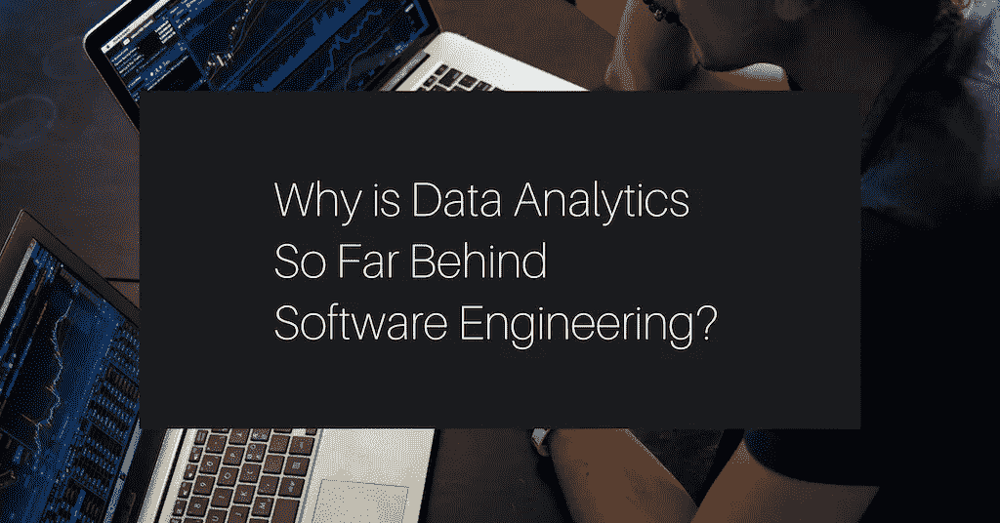

# 为什么数据分析远远落后于软件工程？

> 原文：<https://towardsdatascience.com/why-is-data-analytics-so-far-behind-software-engineering-7df85833cc81?source=collection_archive---------40----------------------->

亚当·诺瓦克斯基在 [Unsplash](https://unsplash.com/s/photos/data-analytics?utm_source=unsplash&utm_medium=referral&utm_content=creditCopyText) 上的照片

这篇文章中没有答案，只有两个为一个问题服务的轶事。

# 在热门的本地创业公司入职

前几天和一个软件工程师朋友聊天。他一直在观察他的合作伙伴开始从事数据分析师的新工作。

“交接相当可怕！”他绞着双手说。“他们给了她一个带有 SQL 查询的. txt 文件。无可奉告！“过去 30 天”的硬编码日期！这是在<name of="" well-known="" local="" ecommerce="" startup="">！”</name>

我笑了。“这其实很正常”，我说。“她有导师吗？”

“嗯，是的”，我的朋友说。"她被分配了一个，上升的过程相当缓慢."

“那还不算太坏。”

我向他解释说，数据部门不同于软件工程部门。

“与程序员相比，他们在流程和工具方面落后了。我不完全确定为什么。我给你举个例子:在数据领域，把一切都投入到版本控制中被认为是一个新颖的想法。”

现在轮到他笑了。“你不会是认真的吧！”

“好吧，问问你的搭档 txt 文件在 git 里吗？她是否获得了某个中央存储库的证书？”

事实上她没有。

# 帕兰提尔和其他人

几天后，我和另一个朋友聊天，这次是关于雪花公司的 IPO。这家数据仓库公司似乎已经吸引了金融和科技媒体中许多人的注意力；这无疑是近年来人们谈论最多的科技股 IPO。(关于宣传的更多信息，请查看这个 [Twitter 帖子](https://twitter.com/mariodgabriele/status/1304467670771826688))。

我的朋友在帕兰提尔待了很多年。他说，有效地说:“所有这些谈论雪花，当我真正想要的是代工。”

“代工是什么？”我问。

“这是帕兰蒂尔的数据。[此处](https://www.palantir.com/palantir-foundry/)。”他说，发给我一个链接。

我浏览了一遍，带着许多问题回来了。他勇敢地回答他们，好像我是一个被困在外面世界的菜鸟。

我的朋友向我解释说 Foundry 做了所有的事情:ETL、转换、血统、元数据中心、数据质量、可视化、存储。你说出它的名字；他们建造了它。

“它使用什么数据存储？”

“多重”我朋友说。

“所以你是在告诉我，Palantir 有一个多功能的工具，里面什么都有，而且你们已经卖了很多年了？”

“嗯……是的。”

# 为什么数据分析如此落后？

为什么数据分析落后于软件工程？为什么与商业智能相比，软件工程中的过程和工具走得更远？

我提到上面的两个轶事，因为我认为它们强调了一些有趣的想法——例如，如果我是一个局外人，我会认为 Palantir 的产品是商业智能工具的标准。相反，这是一个例外。

事实是我对此没有很好的答案。我们都不知道。当我们在 [Holistics](https://holistics.io) 放松下来，对数据进行哲学思考时，我们自己也经常对这种差异感到惊讶。

当我们在办公室的日常工作中在数据分析和产品开发之间跳跃时，数据和软件工程之间的差异就特别明显了——一方面，当处理数据时，我们要努力处理不太成熟、不太被广泛接受的最佳实践。(我们已经清楚地表明了我们对数据建模最佳实践历史的看法——我们认为它们都已经过时了)。然而，当我们在 Holistics 平台上进行产品开发时，我们使用 10 年前的开发方法，并且相信这种方法是可行的。在这两个领域之间工作感觉就像跨越了两个 GDP 差异很大的国家的边界。在过去的二十年里，软件工程已经有了过多的开发方法。敏捷宣言写于 2001 年。Github 创建于 2008 年。今天，我们或多或少知道了[什么可行，什么不可行。数据就不一样了。](https://www.holistics.io/blog/accelerate-measure-software-development/)

我的工作理论是这样的:我认为一个领域的发展与投入的资金数量相关。软件工程在 it 上的花费已经超过了数据分析。或者，更准确地说，软件工程是*有时*被视为利润中心，而数据是[几乎*总是*被](https://www.holistics.io/blog/career-dealing-with-cost-center/)视为成本中心。激励推动创新。

当然，这并不能解释一切。数据素养可能是这种差异的另一个原因——大多数组织发现承担软件工程更容易(我们现在在内部构建一些软件！)而不是数据驱动的思维(我们必须让*每个人*在决策中使用数据)。我怀疑 Palantir 之所以能把他们的工具造得如此之好，是因为他们卖给了情报机构和军事组织现有的数据文化。这些组织非常愿意使用数据来完成他们的工作，并愿意为此支付大笔费用，而在大多数公司中，数据素养和数据使用还不是一件大事。

正如数据科学家兰迪·奥[在谈到过去两次被解雇时指出的:](https://counting.substack.com/p/showing-value-as-a-support-data-scientist)

> *被解雇仅仅意味着组织愿意在一段时间内盲目飞行，而没有详细的分析见解。当某个地方的经理需要达到削减的配额时，做出错误决策的风险(总是可以通过补丁修复)不值得我的工资。*

有多少企业愿意打这个电话？我想有不少吧。

当然，我也不完全确定这些理由就是真相。其他整体论者有他们钟爱的理论。你可能有自己的一些理论。

我知道的是:如果有消费意愿，那么就应该有足够多的创新动力。对我们来说，幸运的是，如果雪花的 IPO 有任何迹象，那么未来的数据世界看起来很好。