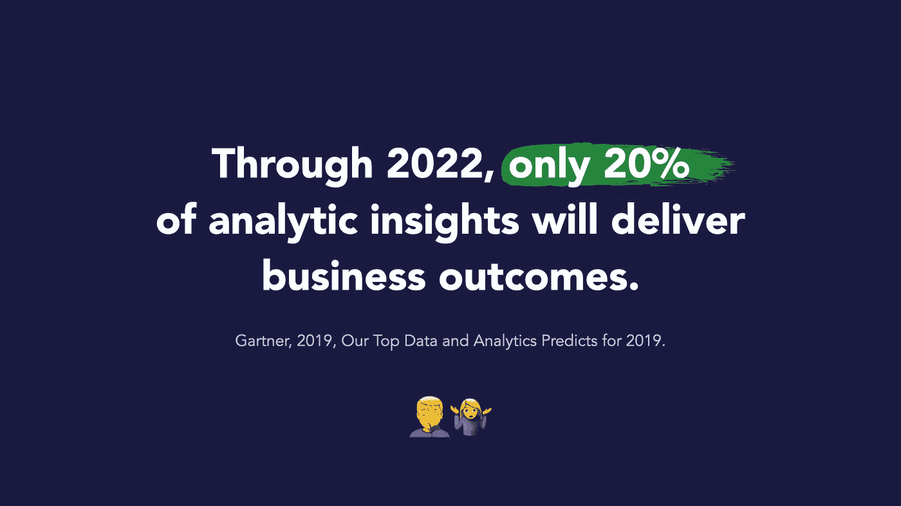
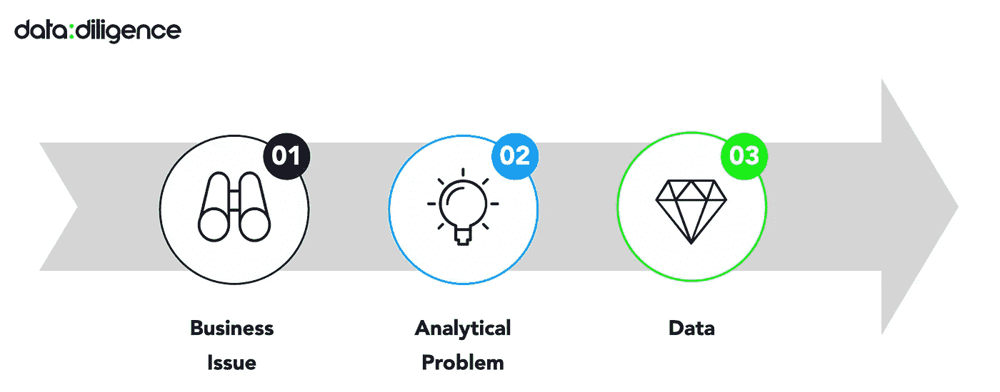
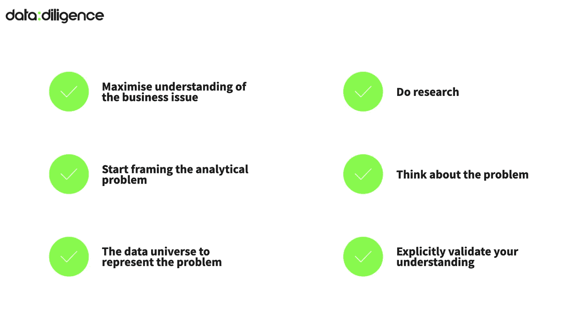
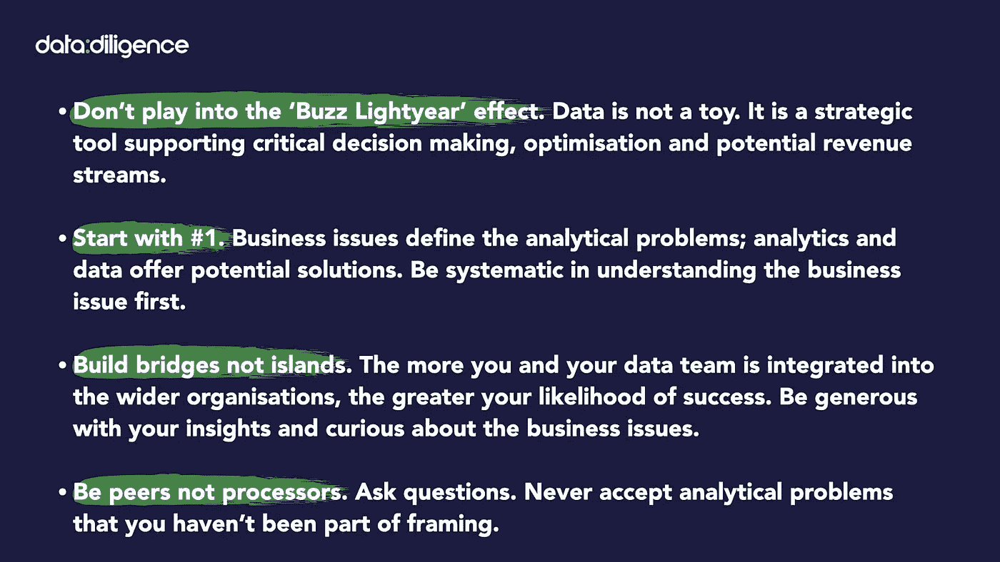

# 为什么数据科学无法解决正确的问题？

> 原文：<https://towardsdatascience.com/why-is-data-science-failing-to-solve-the-right-problems-7b5b6121e3b4?source=collection_archive---------19----------------------->

## [意见](https://towardsdatascience.com/tagged/opinion)

## 别慌，一切都没丢。数据科学家和高管都有解决方案。

来源:[https://blogs . Gartner . com/Andrew _ white/2019/01/03/our-top-data-and-analytics-predicts-for-2019/](https://blogs.gartner.com/andrew_white/2019/01/03/our-top-data-and-analytics-predicts-for-2019/)|作者图片

D ata 科学的*存在的理由*就是解决问题。然而，主要的声音(如 [VentureBeat](https://venturebeat.com/2019/07/19/why-do-87-of-data-science-projects-never-make-it-into-production/) 、 [HBR](https://hbr.org/2020/02/use-this-framework-to-predict-the-success-of-your-big-data-project) 或 [Gartner](https://blogs.gartner.com/andrew_white/2019/01/03/our-top-data-and-analytics-predicts-for-2019/) )表明，它在这一追求中失败了。作为一名数据科学家，我倾向于同意这个观点。但是，为什么呢？

让我从两个观察开始。

## **[**巴斯光年**](https://en.wikipedia.org/wiki/Buzz_Lightyear) **效果****

**我们是一个新的行业。闪闪发光。闪烁的灯光。可伸展的翅膀。每个人都想要我们！**

**但是我们也遇到了所有新生思想流派都熟悉的初期问题。是的，我们正沿着数据价值链快速前进。部署数据驱动的解决方案变得越来越容易。但是我们的许多假设仅仅是:假设。未经测试和证明。**

**因此，尽管机会很多，乐观情绪很高，但我们必须防止过度销售和夸张。数据不是玩具。**

## ****数据科学家正在解决错误的问题****

**我相信数据科学家更多时候是试图解决错误的问题。**

**与我对我们的行业热点和成熟度的观察不同，这一点是方法和/或态度的结果。虽然对我们的专业来说，不断推进数据的进化包络很重要，但我们也需要优化和利用现有的解决方案来解决今天的问题。这从准确识别手头的业务问题开始，并从那里系统地工作。**

> **商业问题是我们的试金石。不是数据。**

**重要的是，我们今天就能实现这一点。我们不必等待发明的翅膀。简单地说，答案在于加深商业和数据世界之间的理解(当然也可以说是共鸣)。**

**为了解决业务问题，数据科学家需要像企业主一样思考。我们需要对业务挑战感到兴奋，并充满热情来拓展我们的战略和运营技能。同样，我邀请我们的业务同事对这个新的数据世界更加好奇，并抓住与数据科学家交流和合作的机会——作为同行而不是处理者。**

**在这篇文章中，我提供了我的方法来解决正确的业务问题，同时提升数据的角色和业务影响。这种方法基于我在过去 10 年中参与的 100 多个数据项目。**

*****注:*** *当然，今天也有数据科学家，他们的项目正在交付商业价值。企业应该积极寻找这些人(不，他们并不总是拥有最好学校的博士学位或简历上的虚假信息)。同样，有抱负的数据科学家也应该观察这些先驱并向他们学习，寻求快速吸收他们的错误和成功。***

## **为什么数据科学家不能解决正确的问题？**

**如前所述，我认为我们总是无法识别正确的问题，因为我们没有参与更广泛的商业辩论。相反，我们就像一座孤岛，只有一座吊桥通往商业大陆。我们很少外出，除非受到邀请！**

**通常情况下，信息请求会落在我们的岛屿办公桌上，没有什么背景，但有明确的截止日期。因此，我们“拉起桥”希望加快进程，而不是降低我们的防御来质疑我们的同事，更好地了解需求或真正的业务问题。**

**这种孤岛现状毫无意义，尤其是考虑到我们对网络、共享基础设施和数字化的依赖和倡导。我们需要在交往中效仿斯德哥尔摩，而不是阿卡特兹。我们必须建立双向桥梁和关系堤道。**

**除非我们学会问更多的问题，否则我们总是会冒险投入时间、精力和才能去解决错误的问题。我们需要努力成为定义业务问题的讨论的一部分，并在确信我们有重要的事情要说时，准备好与我们的业务对手面对面交流。至关重要的是，我们还需要问一些令人羞愧的问题，这样我们才能快速学习，快速失败，并加速我们的迭代解决方案。**

# ****什么是正确的问题？****

**正确的问题是分析问题；业务问题的准确代理，其解决方案将影响最初的业务问题。**

## **1.商业问题**

**我用来找到“正确问题”的框架非常简单。它始于一个业务问题，例如:**

> **"我们需要增加每位顾客的平均销售额。"
> “我们需要停止客户流失。”
> “我们需要降低废品率。”
> “我们需要提高数字营销的投资回报率。”**

**商业人士非常了解这些。数据科学家？没那么严重。**

## **2.分析问题**

**数据科学家的真正工作是提出探索性的问题，将业务问题转化为明确定义的分析问题。现代科技有助于解决这个问题。学术论文和开源解决方案每个人都可以访问。越来越便宜的云存储和计算，以及 SaaS 现收现付的定价模式使得技术广泛可用。这里没有借口。**

## **3.数据**

**一旦你定义了分析问题，问:需要什么数据来解决它？**

**然后确定数据是否可用，质量如何，可访问性如何(或者，是否可以获取或收集)，获取数据的速度有多快，费用有多少。**

> ***业务问题定义问题；分析和数据提供了潜在的解决方案。***

**下面的简单模式概述了这个 3 步框架。但是不要被骗了。这是一个非常具有挑战性的过程。背景中的灰色箭头是杀手！虽然思考“哪个业务问题可以用令人兴奋的尖端方法解决”或“如何处理尘封数据库中的数据”很有诱惑力，但解决业务问题的系统方法都不是。你必须遵守纪律，从头开始，从 1 号开始。**

****

***业务问题定义了问题，分析和数据提供了潜在的解决方案。|* 图文作者**

# **这听起来很简单，为什么这么难呢？**

**因为我们是人。**

**在我们深入了解这个框架之前——多次遵循它并从我们的错误中学习——我们容易受到诱惑和捷径的影响。我们必须抵制回避困难对话的冲动，不要假装我们什么都懂，以免挫伤知识分子的自尊心。**

**让我分享几个有趣的例子，如果这个框架没有从左到右遵循，会出现什么问题。**

## **过快地转向分析解决方案**

**数据科学家热爱分析和技术。但是，众所周知，爱情可以是盲目的。意思是，我们经常只看到我们想看到的或听到我们想听到的。对于热恋中的数据科学家来说也是如此。例如，如果他们目前沉迷于*强化学习*或 *GPT-3，*他们会倾向于将它视为他们面临的每个问题的第一解决方案。**

## **未能证实理解**

**另一个问题是急于假设，而不是花时间去确认共同的理解。作为无畏的数据科学家，我们可能会假设:*“哦，那听起来像一个客户流失模型，明白了！”*构建了一个奇妙的模型后，却惊讶地发现它并不适用。别误会，模式是好的。其实很优秀。但是它没有解决实际的业务问题。**

## **没有发挥我们的优势…**

**很多次，我听到商业领袖告诉我，他们需要(举例来说)一个:'*推荐引擎，它考虑销售、客户评论和利润来对产品进行排名*'然而，分析问题(推荐引擎)和数据(销售、评论和利润)应该来自业务问题。**

**作为一名数据科学家和功能专家，我敦促你质疑每一个已经为你解决了分析问题的实例。如果一个业务领导未能让你满意地概述框架的每个步骤，那么建议的分析问题很可能不是业务问题的解决方案，而是浪费时间和资源。**

**数据也是如此。例如，一位企业领导人可能会在他们最喜欢的高管杂志上读到关于*的黑暗数据*，并要求他们的数据科学家:*“将黑暗数据减少 10%”*。或者指导他们:“*对用户评论数据做点什么*”。通过这样做，他们押注于数据科学家对正确的业务问题进行优先排序的能力，而所有这一切都发生在他们的孤岛上，吊桥顽固地升起。提问；你是专家。简单。**

## **“喜欢”的分析**

**同行压力是做所有“酷分析”的诱惑。初创企业尤其倾向于宣称“*人工智能驱动的”*，而大型企业则宣称“*拥抱数据机遇”。我通常质疑所有这样的宣言。***

**如果分析不是通过更好的决策、提高运营效率或创造新的收入流来实际解决业务问题，那就是公关。**

> **“数据”不是一种策略。**

**相反，数据使战略、创新、效率等得以实现**

## **桥，不是岛**

**我再怎么强调造桥的类比也不为过。只有将数据、数据团队和数据洞察整合到更广泛的组织中，才能做出更好的决策。请记住，不是组织中的每个人都一定会被数据的价值所驱使。他们可能不了解数据，也可能不了解分析方法及其提供的内容，即使是高层次的了解。每位数据科学家的一个重要职责就是宣传数据的作用和力量。**

**如前所述，你的桥梁必须承载双向交通。同样重要的是，数据科学家要更好地理解业务问题。因为，如果他们不这样做，他们将无法在交流解决方案和最终价值时解释他们的分析选择和假设。**

**我坚定地认为，这一挑战直接摆在我们——数据科学家面前。我们需要通过首先了解业务问题来赢得同事和客户的信任。不是*他们*的业务问题。*我们的*业务问题。**

**然后，我们精心设计专业的解决方案，清楚地阐明它们是如何工作的，并关键地解释它们为什么以及何时不工作。**

# **如何制定正确的问题？**

**现在让我分享一下我理解业务问题的方法，以确保我解决了正确的(分析)问题。**

## ****餐厅示例****

**想象一下，一位餐馆老板对你说，她需要正确处理库存，以避免原料耗尽或浪费过多。**

****

**照片由[左 eris kallergis](https://unsplash.com/@lefterisk?utm_source=medium&utm_medium=referral) 在 [Unsplash](https://unsplash.com?utm_source=medium&utm_medium=referral) 上拍摄**

**令人遗憾的是，餐馆生活并不是一场 [Kaggle](https://www.kaggle.com) 竞赛，餐馆老板没有为你准备好数据或评估标准。所以，我们先把这个业务问题变成一个分析问题。**

## **最大限度地了解业务问题**

**最初，我会问一些问题来理清问题，这样我就可以开始在脑海中构思一个潜在的解决方案。餐馆老板的挑战似乎很直观，但我们不要陷入假设陷阱！相反，比如我会问她:**

> **“你会如何描述你的餐厅？”
> “在餐饮业中，库存是如何运作的？”
> “你怎么决定今天点什么？”
> “做好订单最难的是什么？”
> “什么是更大的问题:配料用完还是点太多？”
> “订购流程是如何运作的？你多久能订购一次？而且提前多长时间？”**

**让我们假设我已经学会了以下几点:这是一个沙拉吧，所有的配料都必须是新鲜的。目前，她正在下订单，每周一次，下一周的每个星期五。根据每周的订单，每天都要交付配料。大多数沙拉都有相同的基本成分，如果特定的成分不够/用完了，顾客可以选择替代品。目前，如果她结束了前一周的食材短缺，减少了菜单，她会点更多的菜。相反，如果她有明显的浪费，她会少点一些。她的排序真的没有任何“科学”可言，而且每周都与前一周不同。**

## **开始构思分析问题**

**从这些信息中，我们可以开始组合一个*可能的*解决方案，也许是一个需求预测模型，预测每天的顾客数量。该模型需要对未来九天进行准确预测。**

## **代表问题的数据世界**

**下一步是就使用什么数据制定*假设*。同样，我会问这样的问题:**

> **"根据你的经验，是什么影响了顾客的数量？"
> “哪一天你的顾客最多:天气如何，当地有什么活动吗，还有什么能把食物带到你的餐馆的吗？”
> “工作日里餐厅有空的时候吗？”**

**我可能会了解到:这取决于天气(当天气寒冷或下雨时，顾客较少)；星期几；当地社交媒体美食页面上的评论；附近大学的活动；诸如此类。**

**同样，把你学到的任何东西都当作数据的假设。人们可能会告诉你，这似乎取决于天气，但没有人会说“10 毫米的早晨降水是关键！”即使他们知道，也要验证这个假设。**

## ****做一些研究，思考问题****

**然后做一些[案头研究](https://lmgtfy.app/?q=demand+forecasting+in+restaurants)了解其他人如何处理相同或相似的问题是有帮助的。你可能会找到一些有用的资源，例如[这篇文章](https://www.sciencedirect.com/science/article/pii/S2212827119301568)、[这篇博客](https://www.qsrweb.com/blogs/how-can-your-restaurant-forecast-demand/)或[这篇文章](https://www.restaurantdive.com/news/forecasting-for-the-future-what-restaurants-need-to-calculate/550215/)。**

**到现在为止，你应该对你头脑中的问题有一个坚实的理解。所以，重要的是你要概述和测试可能的解决方案。让思想伙伴挑战你的思维、假设和想法也是有帮助的。**

**我还会对可用的数据、格式和质量进行初步分析。但是在下一步之前没有什么太费时间的。**

## ****明确证实你的理解****

**现在，测试*潜在*解决方案是否基于*对业务问题的共同*理解是至关重要的。在你做任何事情之前，和餐馆老板再谈一次，向她解释你是如何构思这个问题的，你的假设是什么，你在做什么简化，你会考虑哪些关键影响因素。**

**确认输出的内容和格式也是非常有价值的。另外，她如何利用这些信息，技术上有什么限制等等。**

****

**作者提供的图片**

## ****解决问题****

**终于到了数据科学工作的时候了。继续获取数据，进行一些数据工程，训练和测试 ML 模型，部署它，创建 CI/CD 管道，将监控和触发置于适当的位置。**

**然后衡量业务影响，一次又一次地改进解决方案…**

**而且，尽管这一步显然是最基本的，但它也被许多受人尊敬的数据科学家广泛记录。站在他们的肩膀上，我想补充一句:数据科学是一门迭代的手艺。不要想多了。从某处开始。每重复一次，你会做得更好。**

## **所以，总结一下，这里是我的建议:**

*   **不要陷入“巴斯光年”效应。数据不是玩具。它是支持关键决策、优化和潜在收入流的战略工具。**
*   ****从#1 开始。**业务问题定义分析问题；分析和数据提供了潜在的解决方案。首先系统地了解业务问题。**
*   ****造桥不造岛。**您和您的数据团队融入更广泛的组织越多，成功的可能性就越大。慷慨分享你的见解，对商业问题保持好奇。**
*   **做同行而不是处理器。提问。永远不要接受你没有参与设计的分析问题。**

****

**作者提供的图片**

**在整篇文章中，我使用术语*数据科学家*作为任何使用数据解决业务或现实世界问题的数据工作者的占位符。当然还有很多数据职业。[麦肯锡用一个术语*analytics translator*](https://www.mckinsey.com/business-functions/mckinsey-analytics/our-insights/analytics-translator)*来形容将业务问题转化为数据问题的人。大型企业可能会在这方面发挥特殊作用。我相信每个数据科学家都应该磨练这个技能。***

****由我出色的商业伙伴* [*切尔西·威尔金森*](https://medium.com/u/7780d71b510?source=post_page-----7b5b6121e3b4--------------------------------) *合著。****