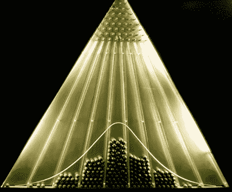
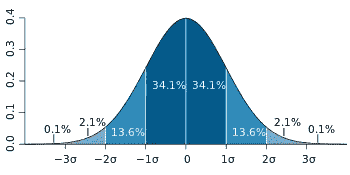
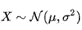
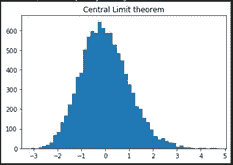
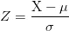
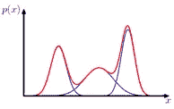

# 为什么高斯是所有分布之王？

> 原文：<https://towardsdatascience.com/why-is-gaussian-the-king-of-all-distributions-c45e0fe8a6e5?source=collection_archive---------20----------------------->

## 高斯分布的显著性

[来源](https://en.wikipedia.org/wiki/Normal_distribution):豆机被称为正态随机变量的第一生成器

## **高斯分布及其关键特征:**

*   高斯分布是一种连续的概率分布，其中心两侧对称。
*   它的均值、中值和众数相等。
*   其形状如下图所示，大部分数据点聚集在均值周围，具有渐近尾部。

[来源](https://en.wikipedia.org/wiki/Normal_distribution)

**释义:**

*   约 68%的正态分布值位于 1𝜎境内
*   约 95%的正态分布值位于 2𝜎境内
*   约 99.7%的正态分布值位于 3𝜎境内

## **我们从哪里找到高斯分布的存在？**

不管是不是传销从业者，我们几乎都在某个地方听说过这种最流行的销售形式。环顾四周，大多数过程都遵循近似高斯形式，例如年龄、身高、智商、记忆力等。

从轻松的角度来说，有一个众所周知的高斯分布的例子潜伏在我们周围，即评估期间的“钟形曲线”😊

是的，高斯分布经常与钟形曲线发生共振，其概率密度函数由以下数学公式表示:

高斯分布的概率密度函数

**符号:**

具有平均𝜇和方差𝜎的随机变量 x 表示为:

服从正态分布的随机变量 X

## **高斯分布有什么特别之处？为什么我们几乎处处都能找到高斯？**

每当我们需要表示分布未知的实值随机变量时，我们就假定它是高斯型的。

这种行为很大程度上归功于**中心极限定理(CLT)** ，它涉及到对多个随机变量之和的研究。

> **根据 CLT:多个随机变量的归一化和，不管它们原本属于哪个分布，随着和中项数的增加，收敛到高斯分布**。

需要注意的重要一点是，CLT 在 30 个观测值的样本量下是有效的，即，如果我们有 30 个观测值的最小样本量，可以安全地假设采样分布遵循高斯形式。

因此，许多独立过程的总和的任何物理量被假定为遵循高斯分布。例如，“在典型的机器学习框架中，可能存在多种错误来源——数据输入错误、数据测量错误、分类错误等”。所有这些形式的误差的累积效应可能遵循正态分布”

让我们用 python 来检查一下:

步骤:

*   从指数分布中抽取 n 个样本
*   归一化 n 个样本的总和
*   重复上述步骤 N 次
*   继续在 sum_list 中存储规范化的总和
*   最后，绘制归一化 sum_list 的直方图
*   输出严格遵循高斯分布，如下所示:

从服从高斯分布的指数分布中抽取的 30 个样本的归一化总和

类似地，还有其他几种分布，如学生 t 分布、卡方分布、f 分布等，它们对高斯分布有很强的依赖性。例如，与高斯分布相比，t 分布是高斯分布无限混合的结果，导致更长的尾部。

**高斯分布的性质:**

**1)**仿射变换:

这是一个简单的变换，将随机变量乘以一个标量“a ”,再加上另一个标量“b”。

得到的分布是具有平均值的高斯分布:

如果 X ~ N(𝜇，𝜎)，那么对于任意一个 a，b ∈ ℝ，

a.x+b～n(一个𝜇+b，一个.𝜎)

注意，不是所有的变换都导致高斯，例如，高斯的平方不会导致高斯。

**2)** **标准化:**

如果我们有两组观察值，每组都来自具有不同平均值和 sigma 的正态分布，那么我们如何比较这两组观察值来计算它们总体的概率？

因此，我们需要将上面提到的观察值转换成 Z 分数。这一过程被称为标准化，它根据原始观测值的平均值和总体标准差对原始观测值进行调整，并将其纳入一个共同的尺度

z 得分

**3)**

**4)集合的边际分布**也是高斯分布

**5)高斯分布是自共轭的**，即给定高斯似然函数，选择高斯先验将导致高斯后验。

**6)两个独立的高斯随机变量的和与差是一个高斯**

**高斯分布的局限性:**

1.  简单的高斯分布无法捕捉以下结构:

来自模式识别和机器学习的高斯混合

这种结构最好用两个高斯的线性组合来表征(也称为高斯混合)。然而，估计这种高斯混合模型的参数是很复杂的。

2)高斯分布是单峰的，即它不能提供对多峰分布的良好近似，从而限制了它能充分表示的分布范围。

3)自由度随着维数的增加而平方增长。这导致对如此大的协方差矩阵求逆的高计算复杂度。

希望这篇文章能让你先睹为快高斯分布的世界。

快乐阅读！！！

参考资料:

*   [https://stack overflow . com/questions/12616406/任何人都可以告诉我为什么我们总是使用机器学习中的高斯分布](https://stackoverflow.com/questions/12616406/anyone-can-tell-me-why-we-always-use-the-gaussian-distribution-in-machine-learni)
*   模式识别和机器学习，第 2.3 节，高斯分布