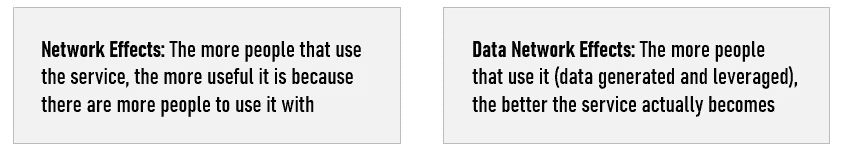
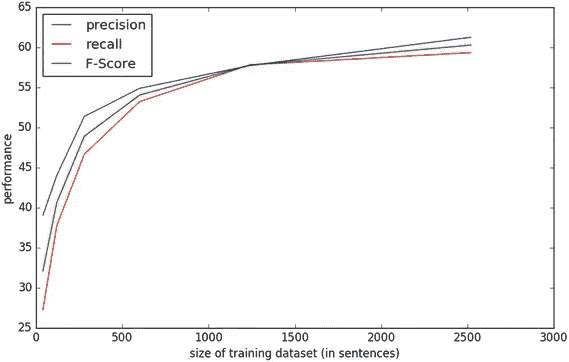
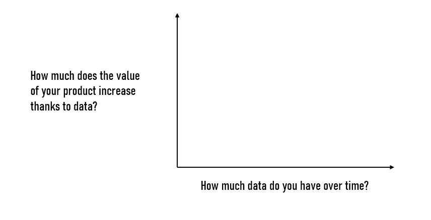

# 为什么很难建立人工智能和数据网络效果

> 原文：<https://towardsdatascience.com/why-is-it-hard-to-build-ai-data-network-effects-fa010497e2cb?source=collection_archive---------27----------------------->

## 用人工智能构建数据网络效果的局限性、陷阱和挑战

图片:马特·麦克莱恩/华盛顿邮报通过盖蒂图片社

在完成了几个 AI 任务后，我意识到大多数公司都在追逐同一件事:**数据网络效应**。很难想象有哪家企业不迫切需要数字化其运营模式，并通过更好地利用数据来应对新的威胁...

我想写这篇文章来强调达到这种数据水平是多么困难&人工智能成熟度以及一家愿意建立人工智能的公司需要完成什么。

事实上，对大公司来说，实现商业模式现代化和建立专有数据集已经成为当务之急。虽然科技公司正在人工智能工具包上投入大量资金以吸引云计算客户，但数据集正成为区分的战略要素。

> 数据网络效应是一种产品的属性，由于数据段之间的紧急关系，随着可用数据的增加而改善。

数据网络效应使公司具有防御性，因为一旦你领先，竞争对手很难再为用户增加同样多的价值，而**防御性创造价值**。此外，当数据网络效应产生效果时，转换成本会变得更高。这往往会造成客户**锁定**效应。

网络效应和数据网络效应通常是相互联系和相互加强的，因为每一种效应都使产品更有价值，从而吸引更多的客户和数据。

真正相关的数据优势不仅仅来自于收集最大量的数据。最佳数据策略与特定的问题领域密切相关，在该领域中，独特的、新的数据在为客户解决问题时具有复合价值。

我在物联网部门工作了很长时间，我可以向你保证，数据网络效应与长期防御能力尤其相关。的确，我们意识到，硬件往往或多或少是抄袭的。然而，物联网公司有机会从每个客户那里获得洞察力，这将越来越难以复制。**最终，真正的价值建立在软件和数据层面。**

> **所有数据战略都必须与更全面的产品、技术或商业故事相联系。**

# 数据壕沟

在讨论数据网络效应之前，有必要引入数据壕沟的概念。

> 数据壕沟描述了企业因其专有数据集而拥有的竞争优势。

简而言之，它是更传统的“护城河”的延伸，如供应商锁定、品牌、规模效率等。理想情况下，数据护城河可以保护赢得的市场地位免受竞争。我们通常认为强大的数据护城河是这样一个数据集:

-大型
-无法合成或统计复制
-其他公司难以收购。

# 为什么很难建立数据网络效果？

## 1.数据文化和期望

在我看来，首先出现的问题往往是缺乏真正的数据文化和不切实际的目标。我认为，如果没有一种以数据为中心的文化来优先考虑数据的有效使用，就不会有相关的数据网络效应。

> 没有正确的文化，数据是没有用的。

此外，重要的是要知道，人工智能驱动的运营模式通常需要一段时间才能产生类似于更传统的运营模式在规模上产生的价值的经济价值。根据我的经验，数据网络效应在达到临界质量之前几乎没有价值，大多数新应用的算法在获得足够的数据之前都会遭遇“冷启动”。

此外，如果数据对你的产品来说只是边缘性的，那么数据网络的影响就不会很重要。根据 James Currier 在《T2》上发表的文章，当网飞向你推荐一个节目时，这个算法是基于用户的观看数据进行推荐的。但是网飞的发现功能是边际的；它的真正价值来自于电视剧、电影、纪录片的库存。**所以网飞只具有边际数据网络效应。**

同样，**产品使用和收集的*有用的*新数据之间的关系可能是不对称的。Yelp 有一种数据网络效应，因为更多餐馆的更多评论使产品更有价值。但由于只有一小部分用户产生数据，其网络效应被削弱；大多数人从 Yelp 数据库中读取数据，但不会向其中写入数据。**

> 如果一个产品在增加的使用量和更有用的数据生产之间没有关系，那么就没有网络效应。

## 2.与数据和闭环系统的关系

**在构建数据网络效应时，企业往往过于依赖自己的专有数据。**实际上，目标应该是使用额外的数据源来改进您的模型。一般来说，您拥有的数据源越广泛，您就可以越准确地为您的环境建模并做出准确的预测。

根据您的领域，一个好的数据策略应该包括与您的产品或服务周围的世界(天气等)相关的数据。)，以及用户如何与您的产品交互的数据，尤其是与您可能已经建模为预期行为的相关数据。

这听起来可能很明显，但是当你收集数据并将其应用到你的产品中时，你是在预测用户的期望。从这个意义上说，系统不断地试图预测用户想要什么，并根据需要提出建议或定制。**因此，你增加价值的唯一方法就是知道之前的预测是否正确**。

**不用说，如果你没有通过这一部分，你将无法从数据网络效应中获益。**我们总是花时间确保我们有定义良好的指标。例如，如果您试图通过数据网络效应(通过修改数据和模型)来改进您的推荐系统，那么能够测量和评估新数据的积极或消极影响是关键。

## 3.改进与时间

需要记住的另一个有趣的元素是，当数据集达到一定大小时，随着数据集的增长，算法不再有意义地改进。**现实情况是，大多数数据网络效应都难以应对这一点。**

此外，数据网络效应减弱的临界点因领域而异。随着数据湖的增长和竞争对手缩小差距，可防御的护城河非但没有变得更强，反而被侵蚀了。

> 当你收集数据时，数据也会变得越来越没有价值。

如果您获得的一些新数据已经与您现有的数据重叠，那么数据将产生较少的价值。**新数据的优势下降。**

在某个点上，新数据的价值下降，要么直接对用户，要么对产品/模型开发(根据这个[研究](https://arxiv.org/pdf/1503.01508v1.pdf)，有时，更好的效果来自增加模型的复杂性，而不是来自注入更多的数据)。

在我们最新的项目中，早期的新数据应用于我们的整个客户群。然而，几个月后，收集的新数据只适用于与特殊用例相关的小子集。

> **随着数据集的扩大，任何数据规模效应护城河也会变得越来越没有价值。**

此外，随着时间的推移，保持现有数据优势所需的工作量会随着规模的扩大而增加。**成本结构可能会成为一个问题……**此外，合成数据可以帮助公司缩小差距。更广泛的数据可用性和处理数据的工具越来越受欢迎，使得数据收集网络效应不那么有吸引力，因为它需要更少的时间来破坏先发优势。

## 4.自动化和范围

从运营的角度来看，数据网络效应至少需要一定程度的自动化产品化。你在循环中加入的自动化越多，人工智能的良性循环就变得越有效。

此外，产品的范围越窄，机器学习驱动其价值的程度越大，就越容易将这些优势捆绑在一起，通过数据网络效应创造竞争优势。

## 5.数据类型

从新用户处收集的数据必须是正确的类型和足够的数量，以实现数据网络效果。这种学习必须得到足够有效的优化，以创造新的产品价值。而这个价值必须足够强大，足够好的产品化，才能吸引更多的客户。这个链条的任何断裂都意味着没有自我强化循环，因此没有学习效果。

> 实际上，我建议公司建立数据网络效应，并将其与市场营销和客户保持的投资相结合，以围绕其商业模式创建一条护城河。

## **6。学习曲线**

当你的产品的学习曲线足够长、足够陡，使你能够在一个较长的时期内提供递增的产品价值时，数据网络效应往往会更好地发挥作用。

事实上，建立在高度动态数据集上的产品更容易有永久的学习曲线。因此，它们总是可以通过数据得到有意义的改进。这类产品最适合寻求从数据网络效应中获益的公司。

## 7.数据冗余和偏差

在某些情况下，随着规模的扩大和网络的增长，每个新交互所贡献的新数据与目前已经收集的数据相比变得更加冗余。

此外，当处理物理世界时，您肯定会收集偏见，这些偏见通常会累积并最终开始对您的模型的性能产生真正的影响。

## **8。数量与质量**

即使数据被用于机器学习项目，数据集的大小也只是故事的一部分。**数据集的价值，数据护城河的力量，来源于上下文。**

事实上，一些业务问题需要模型被训练到很高的精确度，然后才能为客户提供任何价值，或者甚至得到管理层的批准，而其他问题则几乎不需要。此外，一些数据集是真正专有的，而另一些数据集很容易被复制。一些数据的价值会随着时间而衰减，而另一些数据集则不会。**应用程序决定了数据的价值和数据网络效应的强度。**

事实是，根据您的项目，数据网络效果可能无法实现。鉴于当前的技术水平，一些业务问题过于复杂，无法完全建模；在这种情况下，大量的数据将无济于事。添加数据可能会提高模型的性能，但很快就会遭遇边际收益递减。

另一个有趣的元素是模型稳定性。根据上下文的不同，数据集相关性会随着时间的推移而变化，如果模型不随之变化，模型将会衰退。

> **模型衰退**(也称**模型**故障)是对已经部署(运行中)的**模型**的病理的非正式描述，由此**模型**的性能可能会恶化到**模型**不再适用的程度。换句话说，模型的预测将不再可靠。

保持模型稳定需要以与环境变化相同的速率处理新的相关训练数据。**我们将这种数据采集速率称为稳定性阈值。**

易腐数据并不能构成一个很好的数据壕沟。另一方面，容易获得新数据可能是进入的战略障碍。

从战略的角度来看，需要更少数据来达到高精度和保持高性能的业务应用程序**并不具有很强的防御能力。**事实上，新进入者可以轻松积累足够的数据并匹配您的解决方案。

# 数据策略的重要性

构建可靠的数据策略非常复杂，不仅仅是收集数据。我认为最重要的问题是确定数据将如何对给定的产品做出贡献。**在现实中，选择算法或其他产品功能调整的影响远远大于仅仅拥有更多数据。**

数据护城河需要两个基本要素

在我看来，一个成功的战略是寻求数据网络效应的创造，以及对理解领域的坚实思考**。**

拥有更多数据并不一定会转化为价值，而且收集更多有用的数据并不总是容易的，即使数据是产品的核心。

数据网络效应可能会与规模带来的数据优势相混淆。你应该问自己的问题是:

-这些数据是否为客户/用户创造了有意义的价值？
-如果是，使用量的增加是否会带来更多有用的数据？

**如果你想了解更多关于数据网络效应和数据护城河的知识，我给你推荐几篇文章:**
-[-【https://www.nfx.com/post/network-effects-bible】](https://www.nfx.com/post/network-effects-bible)-[https://www.nfx.com/post/network-effects-manual](https://www.nfx.com/post/network-effects-manual)
-[https://techcrunch.com/2018/03/27/data-is-not-the-new-oil/](https://techcrunch.com/2018/03/27/data-is-not-the-new-oil/)
-[https://mattturck.com/the-power-of-data-network-effects/](https://mattturck.com/the-power-of-data-network-effects/)-
-[https://a16z.com/2019/05/09/data-network-effects-moats/](https://a16z.com/2019/05/09/data-network-effects-moats/)
-[https://outlast.me/robot-hiveminds-with-network-effects/](https://outlast.me/robot-hiveminds-with-network-effects/)