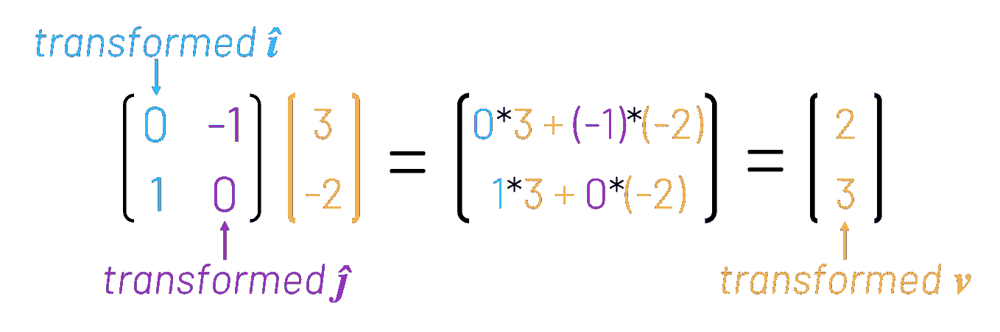

# 为什么线性代数教的这么差？

> 原文：<https://towardsdatascience.com/why-is-linear-algebra-taught-so-badly-5c215710ca2c?source=collection_archive---------0----------------------->

## 线性代数是机器学习的基石之一。这比你想象的更直观


我意识到用非平行线来说明一个关于线性代数的博客是一种讽刺。图像:[像素](https://www.pexels.com/photo/abstract-art-blur-bright-417458/)

这是给你的一道简单的数学题。如果你能把这两个矩阵相乘，请举手:


恭喜你，如果你说:


如果你知道*为什么*，请举手。我说的“为什么”并不是因为:


虽然在数学上是正确的，但这个公式更多地描述了“如何”，而不是“为什么”。就其本身而言，这个公式几乎缺乏直觉。

然而，这就是矩阵乘法几乎总是被教授的方式。记住公式。在考试中使用它。利润？这当然是我的经历，第一次学习线性代数是在 16 岁，然后在一所表面上世界领先的大学攻读数学学士学位。

还有一个问题给你:下面这个矩阵的行列式是什么？


如果你说 2，那恭喜你。但是你也许能猜到我要说什么。我们*知道*对于一个 2x2 矩阵，行列式由以下公式给出:


但是*为什么是*？就此而言，什么是行列式？我们被告知它有几个有用的特性(例如，如果你试图用降行来解线性方程组，0 的行列式就是一个危险信号)。但是在我大学选修的两个线性代数必修模块中(我怀疑该机构的声誉依赖于其在研究方面的卓越，而不是教学)，矩阵的行列式从未在表面水平之外的任何地方被语境化或解释过。

# 从“如何”到“为什么”

这种略显功利的线性代数教学态度显然是有问题的。数学是一门依赖于“增量”学习的学科——获取新知识通常需要你建立在你已经知道的基础上。如果你的理论基础是建立在死记硬背和将数字插入公式的基础上，而没有对实际发生的事情进行更深入的欣赏和理解，那么它们往往会在像机器学习这样沉重的东西的重压下倒下。

在这一点上，我要提到这个博客的灵感很大程度上来自格兰特·桑德森制作的一系列视频。对于那些不熟悉他的工作的人来说，桑德森创建了非常好的动画视频，使得复杂的数学主题对于受过教育的门外汉来说是容易理解的(他解释[神经网络](https://www.youtube.com/watch?v=aircAruvnKk)和[加密货币](https://www.youtube.com/watch?v=bBC-nXj3Ng4&t=604s)的视频非常值得你花时间)。

在其核心，桑德森的'*线性代数的本质*'系列试图介绍，激励和概念化线性代数方面的线性变换及其相关的可视化的许多基本思想。事实证明，这是一个非常有用的方法，可以让你了解许多核心的基本原理。

> “这里的目标不是试图教你所有的东西，而是你带着强烈的直觉离开…这些直觉让你未来的学习更有成效…”**—格兰特·桑德森**

# 矩阵乘法到底是什么？

在回答这个问题之前，我们先退一步，想想什么是线性变换。为了简单起见，让我们将事情保持在二维空间中(尽管以下内容也适用于更高维空间)。

线性变换是改变“空间”(在这种情况下，是 2D 平面)形状的一种方式，通过这种方式:

*   保持平行线平行
*   在原本等距的平行线之间保持相等的距离
*   将原点保留在原点

概括地说，这为我们提供了三种不同类型的线性变换:

*   旋转


*   缩放(减少或增加平行线之间的间距)。注意——这也考虑了 x 轴或 y 轴上的反射，它们只是具有负比例因子。


*   和剪切线(注意这如何保持平行线之间的相等距离)


这三种类型操作的任何组合就其本身而言也是线性变换(稍后将详细介绍这一思想)。

# 证明向量乘法

虽然上面的这些插图是为了演示线性变换影响整个 2D 空间的事实，但我们可以根据它们对两个“单位向量”的作用来描述它们，这两个“单位向量”分别称为*(I-hat)和 *ĵ* (j-hat)。*

**

*我们可以深入了解更多细节，但本质上，这是由这样一个事实驱动的，即您可以通过*和 *ĵ* 的线性组合到达 2D 平面上的任何点(例如，向量***v***【3】，-2】将简单地等同于 3 批*加上-2 批**ĵ*)。****

**

*假设我们想考虑一个线性变换，将所有东西逆时针旋转四分之一圈。我们的向量， ***v*** 会怎么样？事实证明，我们可以描述 ***v*** 发生了什么，纯粹是根据*和 *ĵ.发生了什么***

**回想一下 ***v*** ，【3，-2】，被给定为 3 手*加-2 手**ĵ*的。嗯，原来，转化的 ***v*** 相当于 3 手*转化的**加-2 手**转化的**ĵ*。********


用桑德森的话说，这行字:

```
transformed_v = 3*[0,1] + (-2)*[-1,0]
```

是“所有的直觉在哪里”。

具体来说，我们可以将“转换后的**和“转换后的 *ĵ* ”的向量放在一起，形成一个 2x2 矩阵，参考这个更“直观”的视图，看看*会发生什么，突然之间，我们就证明了向量乘法是正确的。***

******

# ***证明矩阵乘法***

***那么，我们之前研究过的两个 2x2 矩阵的乘法呢？***

******

***我们刚刚证明了一个 2x2 矩阵必然代表 2D 空间中的某种线性变换。特别地，对于一个给定的矩阵[[a，b]，[c，d]]，向量[a，c]和[b，d]分别代表'变换的*'*和'变换的 *ĵ* '的坐标。*****

**假设我们想一个接一个地做两个线性变换。为了说明，让我们假设我们执行我们之前看到的逆时针四分之一转，并在 x 轴上进行反射。这两种变换都可以用 2×2 矩阵来表示。我们已经知道了表示旋转的矩阵，那么反射呢？我们可以使用和以前一样的技术——观察*和*ĵ.会发生什么**

****

**当然，*⊙*不变， *ĵ* 变为负数。我们之前已经展示过，我们可以将这些“转换的**和“转换的 *ĵ* ”向量放在一起，形成代表整体转换的矩阵。****

**那么我们该如何思考两个变换相继进行的情况；先是旋转，然后是反射？我们可以用和以前一样的方法来处理这个问题——看看*和*ĵ.会发生什么**

**从前面我们知道，从[1，0]到[0，1]，旋转需要*T5。如果我们想要将反射应用到这个“转换的*T7”，我们只需要将代表这个反射的矩阵乘以代表“转换的*T9”的向量[0，1](回想一下，我们已经说明了将转换矩阵乘以向量描述了该向量在转换时会发生什么)。*****


当然，我们现在需要使用相同的推理*来观察 *ĵ* 发生了什么。*


现在我们知道了*和*以及 *ĵ* 在一个接一个地经历旋转和反射变换后会发生什么，我们可以把这两个向量放在一起，用一个矩阵来描述累积效应。


这看起来非常像矩阵乘法的标准公式。当然，你可以用任何序列的线性变换来尝试这个思想实验。通过跟踪发生在*和*和 *ĵ* 身上的事情，你可以有效地。

值得注意的是，通过从顺序线性变换的角度考虑矩阵乘法，证明矩阵乘法的标准规则是非常容易的。对于三个不同的矩阵 A、B 和 C，思考为什么以下属性成立:

*   A*B ≠ B*A
*   A*(B*C) = (A*B)*C
*   A*(B+C) = A*B + A*C

# 行列式呢？

在博客的开始，我展示了如何机械地计算行列式。然后我问为什么这个公式成立(就此而言，行列式甚至*是什么*)。[我在另一篇博客](/what-even-is-the-determinant-1180f036cec0)中提到了这一点，但是，剧透一下，一个 2x2 矩阵的行列式仅仅代表了 2D 空间中给定区域在矩阵变换后增加或减少的比例。

不无道理的是，YouTube 上桑德森关于行列式的视频评论充斥着许多人，他们困惑于为什么在教授时不经常提到这个问题，因为这是一个如此直观的概念。我不能责怪他们。


> *感谢一路看完博客！我很乐意听到任何关于上述分析的评论，或者这篇文章涉及的任何概念。欢迎在下方随意留言，或者通过*[*LinkedIn*](https://www.linkedin.com/in/callum-ballard/)*联系我。*