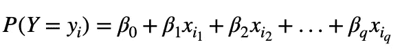
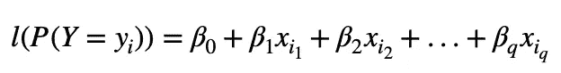
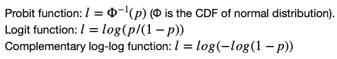
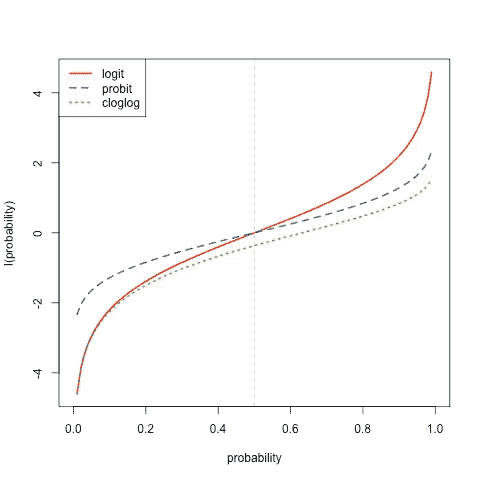
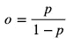
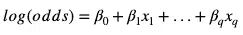
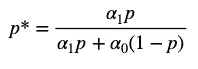
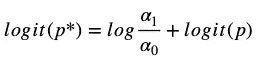

# 为什么 Logistic 回归是二项式回归模型的代言人？

> 原文：<https://towardsdatascience.com/why-is-logistic-regression-the-spokesperson-of-binomial-regression-models-54a65a3f368e?source=collection_archive---------20----------------------->

## 广义线性模型

## 浅谈二项式回归模型及其连接函数


菲尔·博塔在 [Unsplash](https://unsplash.com?utm_source=medium&utm_medium=referral) 上的照片

我们日常生活中的许多事件都遵循[二项式分布](https://en.wikipedia.org/wiki/Binomial_distribution)，该分布描述了一系列独立[伯努利](https://en.wikipedia.org/wiki/Bernoulli_distribution)实验的成功次数。

例如，假设[詹姆斯·哈登](https://en.wikipedia.org/wiki/James_Harden)投篮的概率是恒定的，并且每次投篮都是独立的，那么投篮命中率就遵循二项式分布。

如果我们想找出一个二项分布变量 Y 的成功概率( *p* )与一系列自变量 x*s 之间的关系，二项式回归模型是我们的首选。*

链接函数是二项式回归和线性回归模型之间的主要区别。具体来说，线性回归模型直接使用 *p* 作为响应变量。



线性回归

线性回归的问题是它的响应值没有界限。然而，二项式回归使用 *p* 的链接函数( *l* )作为响应变量。



带连接函数的二项式回归

链接函数将 *x* s 的线性组合映射到一个介于 0 和 1 之间但不会达到 0 或 1 的值。基于这样的标准，主要有三种常见的选择:



二项式回归链接函数

当链接函数是 logit 函数时，二项式回归就变成了众所周知的 [logistic 回归](https://en.wikipedia.org/wiki/Logistic_regression)。作为数据科学书籍中最早的分类器之一，逻辑回归无疑成为了二项式回归模型的代言人。主要有三个原因。

```
1\. Applicable to more general cases.2\. Easy interpretation.3\. Works in retrospective studies.
```

让我们详细检查一下。

## 极值分布？不完全是。

互补对数-对数模型的一个主要区别是，概率单位和对数函数是对称的，但互补对数-对数函数是非对称的。

```
**# R code**
eq = function(x){log(x/(1-x))}
curve(eq, xlab="probability", ylab="l(probability)",col="red",lwd=2)
curve(qnorm,add = T,lty="dashed",col="blue",lwd=2)
curve(cloglog,add=T,lty="dotted",col="green",lwd=2)
abline(v=0.5,lty="dashed",col="grey")
legend("topleft",legend=c("logit","probit","cloglog"),lty = c("solid","dashed","dotted"),col = c("red","blue","green"),lwd=2)
```



链接函数的曲线。对称:logit(红色)和 probit(蓝色)；不对称:绿色

具体来说，我们可以看到对称函数(logit 和 probit)在 *p* =0.5 的位置相交。但是 cloglog 函数在概率上有不同的趋近 0 和 1 的速率。有了这样一个特性，cloglog link 函数总是用在极端事件上，在这种情况下，事件的概率接近 0 或 1。

事实上，我们几乎不可能用有限的数据做出极值分布的假设。因此，在大多数情况下，二项式回归模型不选择 cloglog 链接函数。

换句话说，logit 和 probit 模型可以应用于比 cloglog 模型更普遍的情况。接下来让我们看看 logit 模型相对于 probit 模型的优势。

## Z 评分增加β单位？？奇怪。

逻辑回归比概率回归应用更广泛，因为它易于解释，这得益于优势的概念。

有趣的是，在我们的日常生活中，赔率有时比概率更频繁地被使用，因为它更好地代表了*机会，例如*NBA 季后赛的赌注。赔率( *o* )和概率( *p* )之间的关系可以用下面的等式来描述。



赔率和概率

逻辑回归可以改写为，



带优势的 logistic 回归模型。

上面的模型解读起来超级简单。例如，在所有其他独立变量固定的情况下，x1 增加一个单位会使成功的对数几率增加β1。

然而，概率单位模型的解释并不简单。概率单位链接函数计算概率的 Z 值。因此，对同一示例的解释应该是，在所有其他自变量固定的情况下，x1 增加一个单位会使 Z 得分增加β1。

如果季后赛投注网站说“湖人赢得半决赛系列赛的 Z 分是 1.65！”，很少有篮球迷会因为他/她的统计学专业而称赞网站跑者。

## 固定预测因子和观察结果？事实并非如此。

在大多数实际情况下，数据来自[回顾性抽样](https://en.wikipedia.org/wiki/Retrospective_cohort_study)而不是[前瞻性抽样](https://en.wikipedia.org/wiki/Prospective_cohort_study)。在回顾性研究中，结果是固定的，预测因子是观察和收集的，然而，在前瞻性研究中，预测因子是固定的，结果是观察的。

例如，如果我们对狗癌症和只吃狗粮之间的关系感兴趣，我们首先收集 10 只不同品种的狗，给一半的狗只喂狗粮，另一半喂混合食物。然后我们跟踪五年后这些狗的健康状况。这种类型的研究是前瞻性的研究，非常理想，但速度缓慢。

然而，一个更便宜和更快的方法应该是，我们找到一些患有癌症的狗，我们检查过去五年的喂养记录，并在我们的二项式模型中将它们与一组健康的狗进行比较。这种类型的研究是回顾性研究。

假设 *α1* 是狗没有患癌症时被纳入回顾性研究的概率，而 *α0* 是狗患癌症时被纳入的概率。在前瞻性研究中，我们总是可以假设 *α1 = α0* ，因为我们还没有看到结果。

*但在回顾性研究中，α1 通常远大于α0，情况并非如此。*

让我们用贝叶斯定理来描述一只狗得癌症的条件概率( *p** )假设它被纳入研究，和这只狗得癌症的无条件概率( *p* )之间的关系。



假设研究中包括了狗患癌症的条件概率

应用 logit link 函数后，我们有



条件概率的 logit 函数

上面的等式清楚地表明，前瞻性研究和回顾性研究之间的差异是 log( *α1/α0* )，它只影响二项式模型的截距项。

logit 链接函数的优势在于，即使在回顾性研究中，我们也不需要担心截距项，因为我们关注的是独立变量对几率的相对影响。

换句话说，即使在回顾性研究中不可能知道 log( *α1/α0* )(或对β0 的调整)，它也不能阻止我们估计 logistic 模型的系数(其他β)。此功能对于概率单位链接函数无效。

## 摘要

逻辑回归是二项式回归模型中的一种，它使用 logit 作为其连接函数。它优于其他链接功能，因为它的**易于解释**并且在**回顾性研究**中有用。

## 奖金

其他链接功能都没用吗？不，用下面的代码试试挑战者号的灾难数据，你会发现 cloglog 模型在有链接函数的二项式模型中获得了最小的 AIC。

```
**# R code** library(faraway)
data(orings)
logit_m = glm(cbind(damage, 6-damage) ~ temp, family=binomial(link = logit), orings)
probit_m = glm(cbind(damage, 6-damage) ~ temp, family=binomial(link=probit), orings)
clog_m = glm(cbind(damage, 6-damage) ~ temp, family=binomial(link=cloglog), orings)summary(logit_m)
summary(probit_m)
summary(clog_m)
```

我希望你喜欢阅读这篇文章。

## 参考

遥远，Julian J. *用 R 扩展线性模型:广义线性、混合效应和非参数回归模型*。CRC 出版社，2016。

 [## 概率回归| Stata 数据分析示例

### 样本大小:概率和对数模型都比 OLS 回归需要更多的案例，因为它们使用最大似然法…

stats.idre.ucla.edu](https://stats.idre.ucla.edu/stata/dae/probit-regression/) [](https://stats.idre.ucla.edu/r/dae/logit-regression/) [## Logit 回归| R 数据分析示例

### 逻辑回归，也称为 logit 模型，用于模拟二分结果变量。在 logit 模型中…

stats.idre.ucla.edu](https://stats.idre.ucla.edu/r/dae/logit-regression/) [](https://www.datasklr.com/logistic-regression/probit-and-complimentary-log-log-models-for-binary-regression) [## 二元回归的概率单位和互补双对数模型

### Logit:误差具有标准的逻辑分布 Probit:误差具有标准的正态分布…

www.datasklr.com](https://www.datasklr.com/logistic-regression/probit-and-complimentary-log-log-models-for-binary-regression) 

彼得·罗伊德在 [Unsplash](https://unsplash.com?utm_source=medium&utm_medium=referral) 上的照片