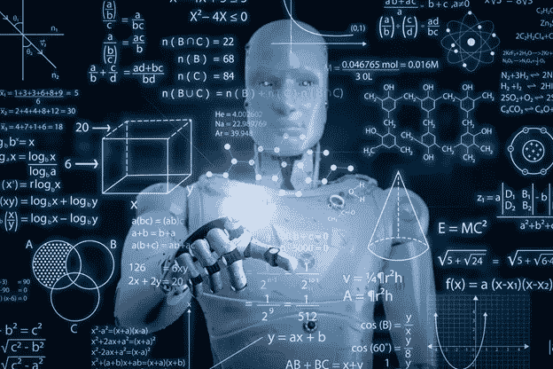
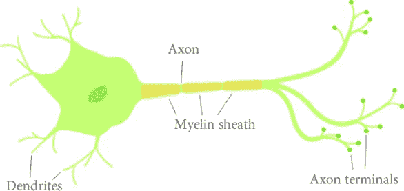
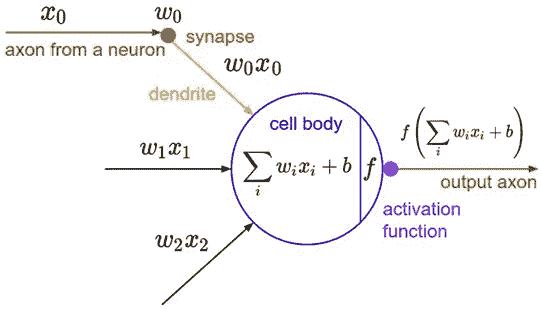
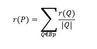
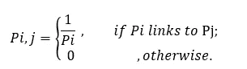
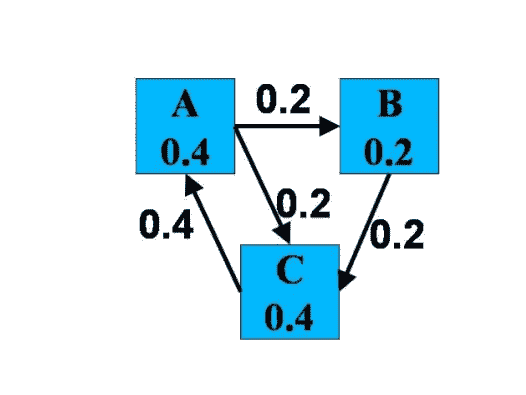
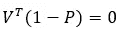
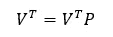
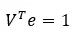
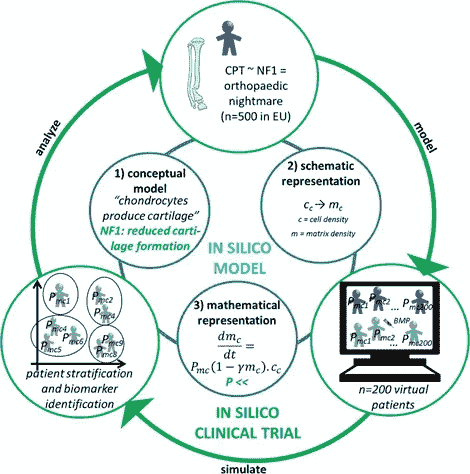

# 为什么数学对你的人工智能职业生涯至关重要？

> 原文：<https://towardsdatascience.com/why-is-mathematics-vital-to-thrive-in-your-ai-career-c11bd8446ddc?source=collection_archive---------4----------------------->

数学是上帝用来书写宇宙的语言——伽利略·伽利雷

我们在科幻电影里看到的未来就在这里。从虚拟现实到功能性小工具，人工智能已经以前所未有的方式入侵了我们的生活。在迅速发展的技术领域，人工智能工具和聊天机器人已经处于突破的边缘。

AI 不是魔法；只是数学而已。

思维机器背后的想法和模仿人类行为的可能性是在数学概念的帮助下完成的。

人工智能和数学是同一棵树的两个分枝。而如果你想在你的 AI 生涯中茁壮成长，你需要学习数学；仅仅是科幻迷是不够的。

如果你打算建立一个人工智能职业生涯，并在该领域的招聘中占据主导地位，那么和数学做朋友吧，它将震撼你的世界。

作为一名数学家和人工智能的粉丝，我想分享一下 AI 和数学之间的神奇联系。

让我们深入迷人的领域。

**人工智能和数学有什么联系？**

人工智能问题分为两大类:搜索问题和表示问题。紧随其后的是互连的模型和工具，如规则、框架、逻辑和网络。都是很数学的题目。

人工智能的首要目的是创造一个人类理解的可接受的模型。这些模型可以用不同数学分支的思想和策略来准备。

考虑**自动驾驶汽车**；他们的目标是识别视频图像中的物体和人。在这些汽车的背后，有着最小化程序和反向传播形式的数学。数学帮助人工智能科学家使用数百年来已知的传统方法和技术解决具有挑战性的深度抽象问题。

**人工智能用的是什么数学？**

在所有重大进步的背后，都有数学。线性代数、微积分、博弈论、概率、统计、高级逻辑回归和梯度下降的概念都是主要的数据科学基础。

数学有助于理解逻辑推理和对细节的关注。它增强了你在压力下思考的能力，增加了你的精神耐力。[数学概念给出假设或虚拟问题的真实解](http://rutcor.rutgers.edu/~amai/aimath04/AcceptedPapers/aimath-I.pdf)。它是关于结构和发展的原则，即使你对组件做了任何改变，这些原则仍然是正确的。

构成人工智能繁荣事业的三个主要数学分支是线性代数、微积分和概率。

**线性代数**

线性代数是应用数学领域，是人工智能专家离不开的。不掌握这个领域，你永远不会成为一个好的人工智能专家。正如斯凯勒·斯皮克曼所说，

**“线性代数是 21 世纪的数学。”**

线性代数有助于产生新的想法，这就是为什么它是人工智能科学家和研究人员必须学习的东西。他们可以用标量、向量、张量、矩阵、集合和序列、拓扑、博弈论、图论、函数、线性变换、特征值和特征向量等概念抽象数据和模型。

**矢量**

在线性规划中，为了符号的方便，向量被用来处理不等式和方程组。人工智能科学家使用不同的向量技术来解决回归、聚类、语音识别和机器翻译问题。这些概念还用于存储人工智能模型的内部表示，如线性分类器和深度学习网络。

**矩阵理论**

在科幻电影中，你通常会看到，通过执行一些类似于神经系统的计算结构，通过生成神经元之间的连接来匹配人脑的推理方式，从而产生了神经网络。矩阵的概念用于神经网络的研究。

通过在三层中形成人工神经元，可以在神经网络中实现非线性假设:

1.输入层

2.隐藏层

3.输出层

人工智能科学家根据隐藏层的数量和连接方式对神经网络进行分类。

**真实神经元**

**人工神经元**

这些人工神经元可以形成神经网络，这花了大约 20 年时间才发现。

**特征值和特征向量**

[搜索引擎排名的科学是基于数学科学](http://ilpubs.stanford.edu:8090/422/1/1999-66.pdf) **。页面排名**，这是谷歌作为一家公司的基础，是基于数学的角度。页面排名是一种算法，最初由拉里·佩奇和谢尔盖·布林在他们的研究论文**“大规模超文本网络搜索引擎的剖析”中提出。**几百年前就为人所知的主特征值和特征向量的基本概念的应用，被用于这一巨大突破的背后。

机器人爬虫首先检索网页，然后通过分配页面等级值对它们进行索引和分类。每个页面的可信度取决于该页面的链接数量。

给定页面 P 的等级 r (P)被假设为，

在哪里，

Bp =指向 P 的所有页面

| Q | =的外部链接数。

p 是带有项的矩阵，

为了找到收敛和收敛速度，矩阵 P 被调整。当行谷歌矩阵 P 达到和为 1 时，则称之为行随机矩阵。页面排名迭代表示马尔可夫链的演变，其中网络有向图被表示为转移概率矩阵 p。

它显示了在任何时间点随机浏览三个页面的概率。

首先，创建一个二进制邻接矩阵来表示链接结构，然后通过归一化将它转换成一个概率矩阵。

为了计算页面秩，必须解决线性系统的特征向量问题，

随机矩阵 P 的特征值可以假设为 1> λ1 ≥ λ2 ≥ … ≥ λn，

和 V1，V2，V3，…，Vn 是相应的特征向量。

在收敛过程之后，矩阵 P 的主导特征值应该是λ=1 以满足，

有了，

这是马尔可夫模型的稳态分布。

PageRank 收敛的过程如图所示，

Google 就是这样自动表征每个站点的页面排名值的。

**微积分**

微分学、多元微积分、积分学、通过梯度下降的误差最小化和最优化、极限、高级逻辑回归都是在[数学建模](https://www.sciencedirect.com/topics/engineering/mathematical-modelling)中使用的概念。生物医学科学中使用设计良好的数学模型，以高保真度模拟人类健康和疾病的复杂生物过程。

**In-Silico modeling，**是人工智能方法在生物医学中的应用，是一种完全自动化的模型，不需要人类样本、原始动物测试、临床试验或实验室设备。在该模型中使用微分数学方程来测试新的机制假设和评估新的治疗靶点。这是通过操纵数学模型参数来更精确地研究人体生理学、药物反应和疾病的最廉价和最方便的方法。

**针对儿童孤儿疾病的计算机临床试验**

**概率**

人工智能世界里有很多抽象的问题。你可能会经历多种形式的不确定性和随机性。概率论提供了处理不确定性的工具。为了分析事件发生的频率，使用了概率的概念，因为它被定义为事件发生的机会。

让我们考虑一个机器人。机器人只能向前移动一定的秒数，但不能移动一定的距离。为了让机器人前进，科学家在它的程序中使用数学。离散随机变量、连续随机变量、贝叶斯公式和归一化是一些概率概念，它们与线性代数的其他概念一起用于机器人导航和移动。

**建议阅读:**

 [## 机器人背后的数学

### 机器人研究一直呈指数增长，标志着一场新的工业革命。了解数学是如何…

medium.com](https://medium.com/datadriveninvestor/mathematics-behind-robotics-9d1790b33828) 

**最终判决**

无论你想从事机器学习工程师、数据科学家还是机器人科学家的职业，你都需要在数学方面表现出色。数学可以增强人工智能中至关重要的分析思维技能。人工智能科学家认为，人们对人工智能的看法是，它都是魔法，但它不是魔法，而是数学在所有发明背后创造了魔法。因此，要在当今人工智能驱动的世界中领先，你需要在数学方面有很强的天赋。