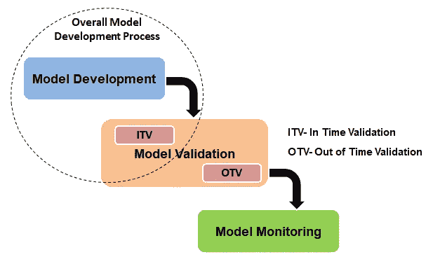
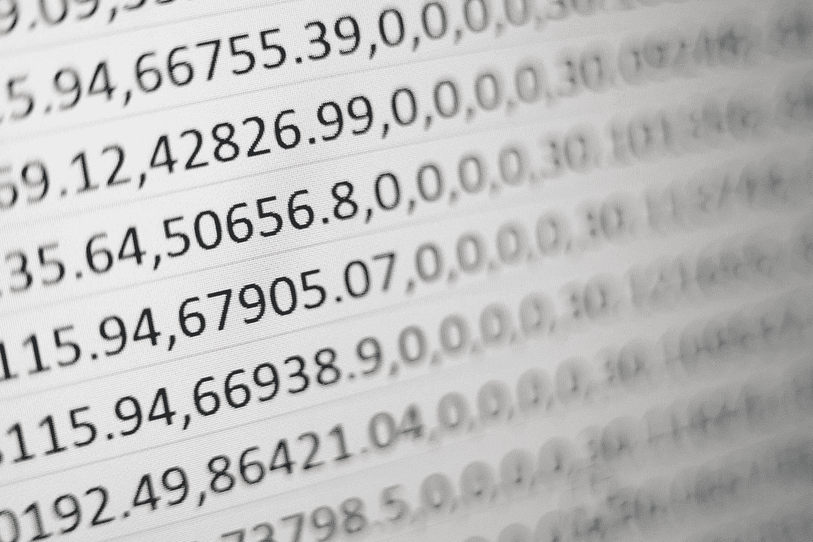

# 为什么模型验证如此重要，它与模型监控有什么不同

> 原文：<https://towardsdatascience.com/why-is-model-validation-so-darn-important-and-how-is-it-different-from-model-monitoring-61dc7565b0c?source=collection_archive---------13----------------------->

## 建模基础

## 模型开发过程的支柱

作者图片

一旦模型开发步骤完成，模型验证就开始了。事实上，模型验证是整个模型开发过程的一个重要部分。如果一个开发人员在开发模型上花费了 X 的时间，那么大部分时间他们会花费 X 甚至更多的时间来验证模型并确保它的健壮性和准确性。

在这篇文章中，我将强调模型验证过程的重要性，以及它与模型监控过程有何不同。

# 模型验证不当的后果

## 1.看不见的数据的模型性能差

米卡·鲍梅斯特在 [Unsplash](https://unsplash.com/?utm_source=medium&utm_medium=referral) 上的照片

如果模型没有经过适当的验证，那么它就不能很好地处理看不见的数据，而这正是预测模型的最终目的。有各种各样的模型验证技术，最重要的类别是时间内验证和时间外验证。

开发数据集的一部分被保留在一边，然后对模型进行测试，以查看它如何处理来自相似时间段的看不见的数据，这些数据最初是使用这些数据构建的*(即在时间验证中)。*

数据集来自不同的时间段，模型也在这个看不见的数据块上进行测试，以判断它对看不见的数据的响应*(即超时验证)。*

这些验证确保开发人员对模型的性能有信心。

## 2.可疑的稳健性

由 [KirstenMarie](https://unsplash.com/@24k?utm_source=medium&utm_medium=referral) 在 [Unsplash](https://unsplash.com?utm_source=medium&utm_medium=referral) 上拍摄的照片

正如上面所解释的，如果一个模型已经被正确验证，开发人员对它的性能有信心。已经完成验证过程的模型被认为适合在未来场景中稳健地运行。在验证过程中纳入了敏感性分析测试，以确保通过在一定程度上改变独立模型变量来解释经济起伏，因变量不会受到可能导致模型不可用的极端程度的影响。

## 3.无法适应压力情景

在 [Unsplash](https://unsplash.com?utm_source=medium&utm_medium=referral) 上由[埃斯特·扬森斯](https://unsplash.com/@esteejanssens?utm_source=medium&utm_medium=referral)拍摄的照片

在像衰退或当前疫情局势这样的极端情况下，预测模型很难适应和预测仍然足够好的预测，尽管存在波动。但是，如果模型验证过程也包括压力测试措施，那么它有助于将模型的一个版本投入生产，该版本已经过压力场景的良好测试，不会在任何灾难发生时突然失败。

## 4.不可靠的模型输出

如果模型没有通过基本的超时验证测试，那么模型可能是一个过度拟合的模型，它在开发样本上表现很好，但是在看不见的数据上失败了。为了避免这种情况，一定要验证！

# 模型验证与模型监控

为了开始理解这种区别，我们将涉及三个要点:目的、指标和时间段。

## 时间段:

模型验证与模型开发过程同步进行。很多时候，是一个迭代的过程。如果一个模型在验证阶段表现不佳，它将返回到开发阶段。这是紧接在模型开发之后。这是一个一次性的过程。

模型监控在模型进入生产阶段后生效。这是一个持续的过程。为每个模型确定一个特定的监控频率，然后对其进行评估，以确保模型符合标准，其结果可靠。此外，我们检查人口分布与开发时期相比不应有显著的不同，以确保模型仍然相关并且可以使用。

## 目的:

模型验证的目的是在我们已经有实际数据的过去数据的基础上检查模型的准确性和性能。

一旦部署了模型，模型监控过程就通过判断总体分布来确保模型的相关性，并且一旦开始输入数据就记录模型预测和实际数据之间的回溯误差百分比比较，以确保模型性能在可接受的范围内。

## 指标:

这是两个阶段最重要的区别。在模型验证阶段，我们主要关注可以为我们解码模型性能和响应的统计指标。而在模型监控阶段，我们既关注统计指标，也关注业务指标，以得出我们对特定模型的相关性和可靠性有信心的结论。

这就把我们带到了这篇文章的结尾。这是一个在面试中经常被问到的问题:你能解释一下模型验证和监控阶段之间的区别吗？我们在这篇文章中提到的内容足以作为答案。

我将继续发布更多的帖子，深入研究在模型验证和模型监控阶段使用的技术指标/技术。

观看此空间，了解更多关于数据科学、机器学习和统计的信息！

*快乐学习！快乐成长！:)*