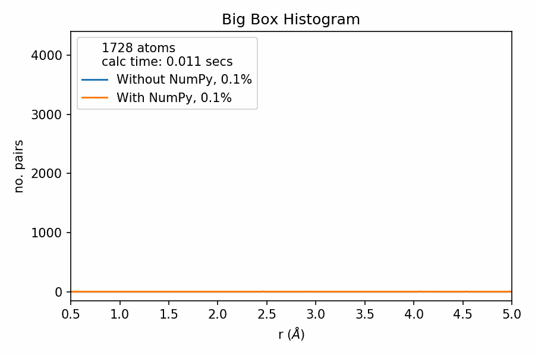
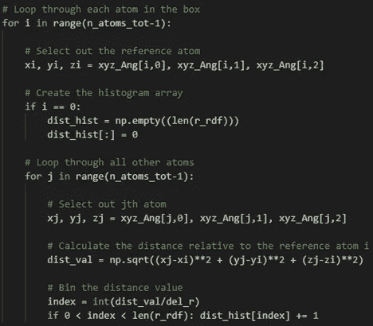
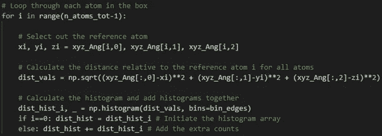

# NumPy 为什么牛逼？

> 原文：<https://towardsdatascience.com/why-is-numpy-awesome-3f8f011abf70?source=collection_archive---------30----------------------->

# 简短的回答

NumPy 速度很快，简化了你的代码。对于刚接触 Python 的人来说:尽可能多地使用 NumPy。在下面的例子中，NumPy 的魔力使我的 Python 代码快了 50 倍。

# 冗长的回答

## 背景

我在接近博士学位时开始使用 Python，当我有问题要解决时，我是学得最好的人，否则代码只是随机的文本。研讨会和讲座不是我的风格，只有在我获得一些经验后，我可能会感兴趣。我更愿意努力解决一个问题，然后求助于我的圣经: [StackOverflow](https://stackoverflow.com/) 。因此，只有当同事和主管看到我的代码并提出建议时，使用 Python 的高效方法才会生效。当我第一次开始使用 Python 时，我对使用现有的库(如 NumPy)进行数据操作有些抵触，主要是因为我不明白为什么我需要使用它。当同事告诉我它会改进我的代码时，或者当我找不到特定函数的替代品时(例如 [np.loadtxt](https://numpy.org/doc/stable/reference/generated/numpy.loadtxt.html) ())，我开始使用它。直到我遇到一个问题，它极大地改进了我的代码，我才明白为什么 NumPy 更好。这篇文章展示了这个真实世界的例子，直接来自科学。

## 问题是

在我的工作中，我们分析所谓的[对分布函数(PDF)](https://ocw.mit.edu/courses/materials-science-and-engineering/3-021j-introduction-to-modeling-and-simulation-spring-2012/part-i-lectures-readings/MIT3_021JS12_P1_L4.pdf) 。PDF 是一种原子间距离的直方图，在理解和解释原子结构时非常有效。 [PDF 可以从衍射数据](https://royalsocietypublishing.org/doi/full/10.1098/rsta.2018.0413)中测量，我们可以尝试通过建模来复制。一种特别有效的方法是[“大盒子”建模](https://www.annualreviews.org/doi/abs/10.1146/annurev-matsci-071312-121712)，它包括创建一个包含数十个原子的 3D 盒子，并重新排列这些原子，直到模型 PDF 与测量的 PDF 相匹配。

NumPy 与此有何关系？造型。我试着用一大盒原子计算 PDF，发现 NumPy 让我的代码快了很多。在这个例子中，我将只关注原子间距离直方图的计算，它将被称为总分布函数(TDF)。PDF 的计算需要更多的步骤。如果你有一个大盒子的原子，并想计算 TDF，你会进行以下步骤:

-计算所有原子间距离

-绘制这些距离的直方图

## 代码

进行计算时，首先想到的方法是遍历盒子中的每个原子，计算到剩余原子的距离，然后绑定这些距离。这方面的代码如下面的代码片段所示。

在这个代码片段中，xyz_Ang 是盒子中原子的 3D 坐标，r_rdf 是直方图仓的中点，n_atoms_tot 是原子的总数，dist_hist 是得到的 TDF。

当我在我的计算机上运行这个包含 1000 个原子的盒子的代码时，计算大约需要 5 秒钟。如果我把数量增加到 1728 个原子:15 秒。在‘大盒子’模型中，这是极小数量的原子和缓慢。

## 数字密码

NumPy 可用于显著提高计算速度。这是通过[矢量化](https://www.geeksforgeeks.org/vectorization-in-python/)和 [NumPy 内置的直方图函数](https://numpy.org/doc/stable/reference/generated/numpy.histogram.html)实现的。矢量化意味着我们不需要在数组运算中使用“for 循环”。对于复杂的计算，你可以使用 [np .矢量化](https://numpy.org/doc/stable/reference/generated/numpy.vectorize.html)。但在这种情况下，我们只是计算两点之间的距离，所以我们可以用每个数组写出计算结果。因此，我们可以生成一个距离数组(下面标记为 dist_vals ),而不是逐个计算单个原子之间的距离。从这里开始，我们可以使用 NumPy 直方图函数来对距离进行分类。这个新方法的代码片段如下所示。

在这个片段中，bin_edges 是我们的直方图箱的边缘。

这通过删除一个“for 循环”简化了我们的代码。当我在我的计算机上对一个有 1000 个原子的盒子运行这个程序时，计算大约需要 0.1 秒，比前面的代码快了 50 倍。如果我增加到 1728 个原子，时间是 0.3 秒。这是一个巨大的改进，允许实现更复杂的建模。这对于一个尺寸很重要的领域来说非常重要:你的盒子越大，你的统计就越好！

## 摘要

如果你有更多的锦囊妙计，你或许可以让代码运行得更快，但这很简单！我不认为我利用 NumPy 会使代码变得更复杂。这就是 NumPy 的强大之处:易于实现并能有效地加速代码。矢量化本身非常棒，因为您可以像输入标量算术一样输入数组算术。NumPy 为什么有能力做到这一点？它是由一群巫师开发的！如果你有机会，尽可能地使用它的功能。

如果你想亲自看看并尝试一下，我已经把上面例子的全部代码上传到 [GitHub](https://github.com/fredmarlton/Slow_Fast_TDF_calc/blob/master/slow_fast_tdf_calc.py) 了。