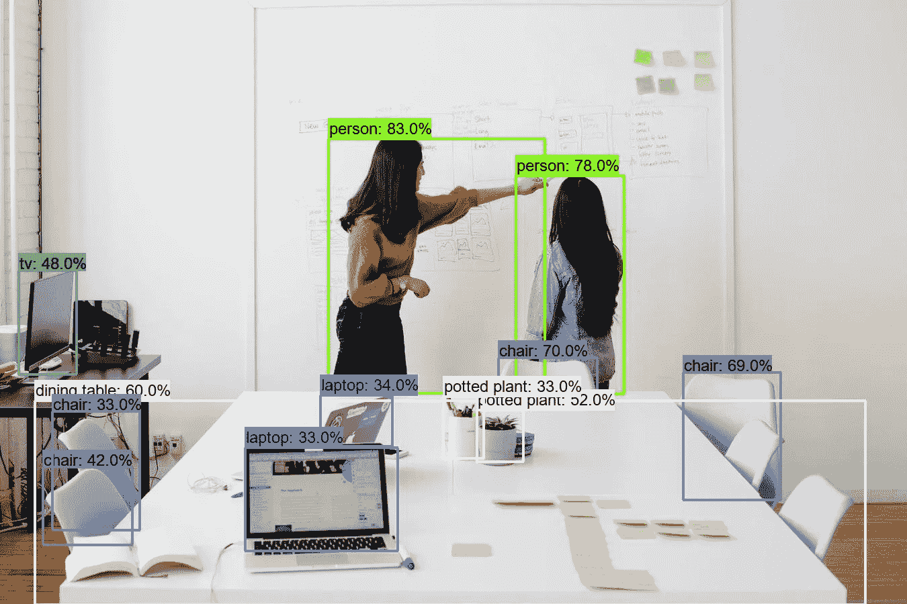
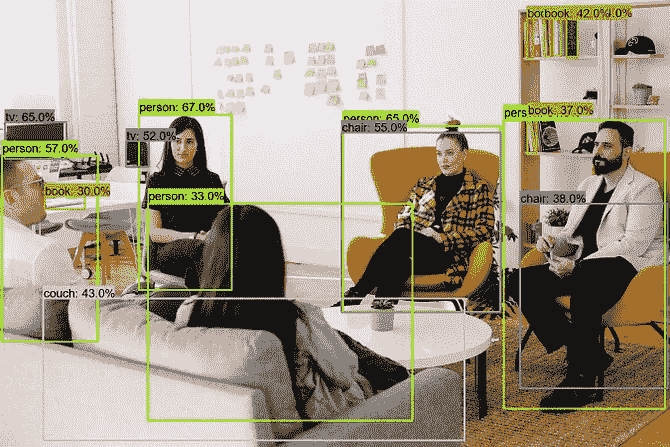
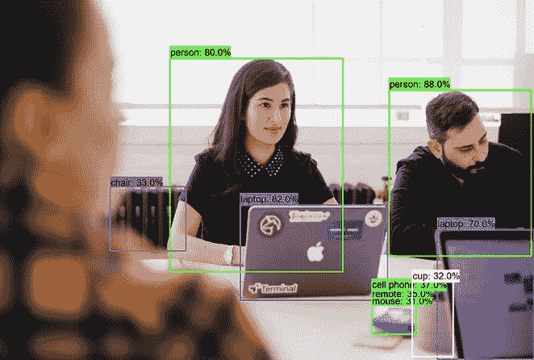
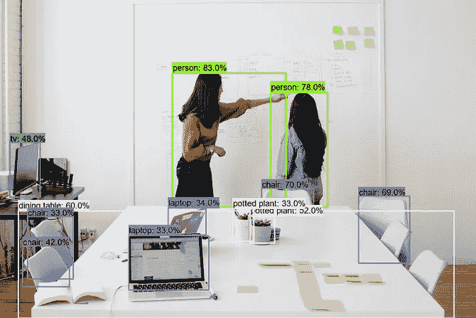
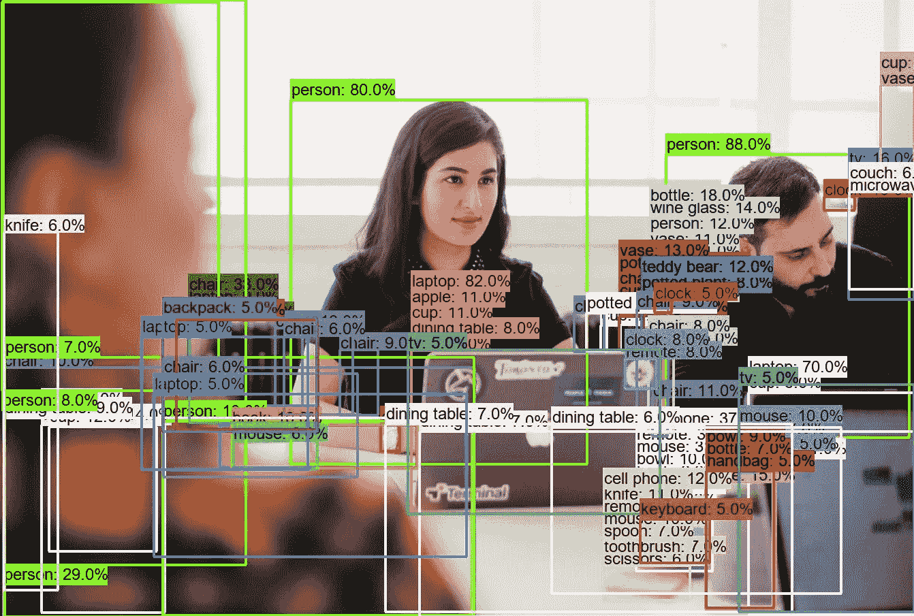
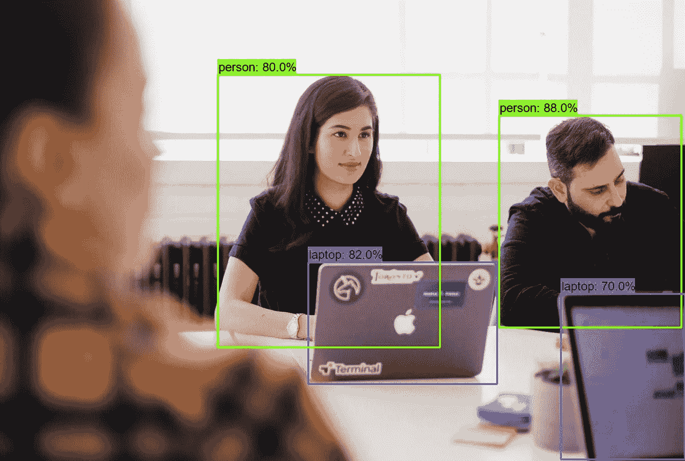
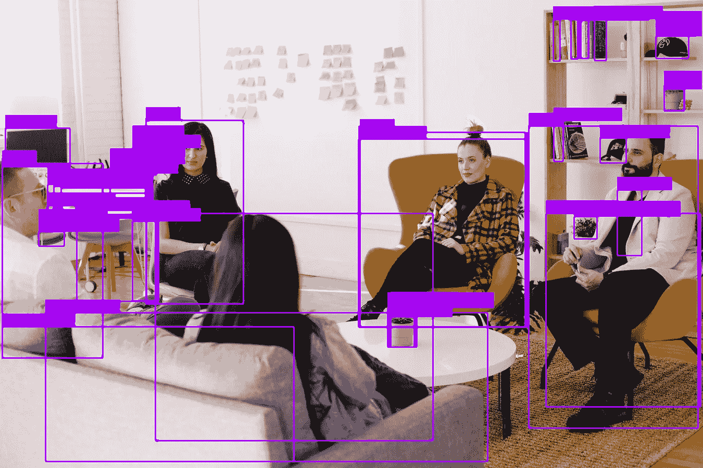
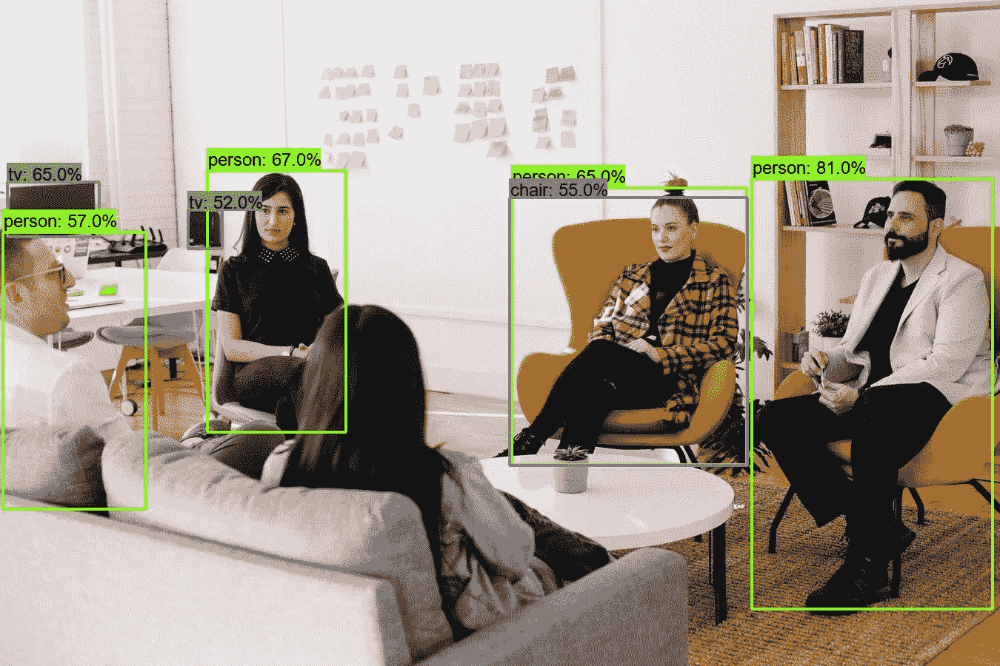
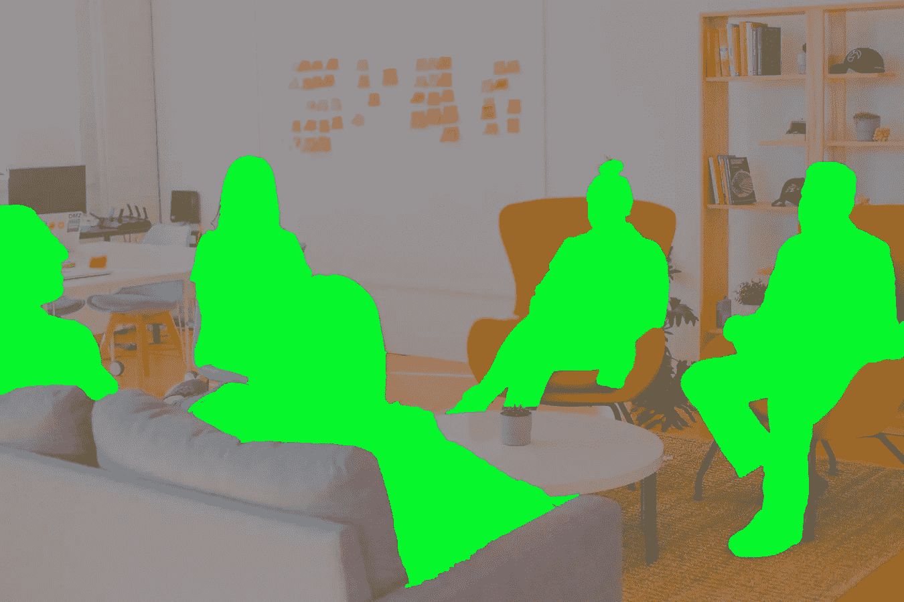
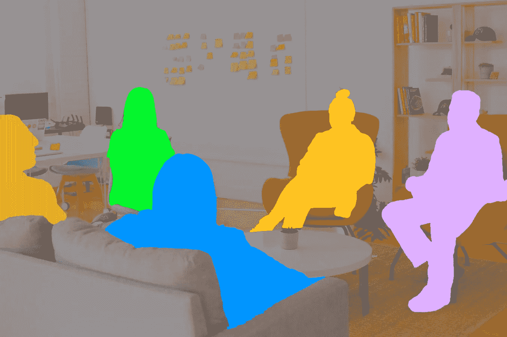

# 为什么物体检测这么乱？

> 原文：<https://towardsdatascience.com/why-is-object-detection-so-messy-6a91191579b8?source=collection_archive---------21----------------------->

## [人工智能图解指南](https://towardsdatascience.com/tagged/the-ai-illustrated-guide)

## TLDR:神经网络有固定大小的输出

[优 X 创投](https://unsplash.com/@youxventures?utm_source=medium&utm_medium=referral)在 [Unsplash](https://unsplash.com/?utm_source=medium&utm_medium=referral) 上的照片。

与神经网络一起工作的人知道物体检测技术有多复杂。难怪没有直接的资源来训练他们。您总是需要将数据转换成类似 COCO 的 JSON 或其他不需要的格式。这绝不是即插即用的体验。此外，没有图表能像 U-Net 或 ResNet 那样充分解释 R-CNN 或 YOLO 的速度更快。细节太多了。

虽然这些模型相当混乱，但对它们缺乏简单性的解释却相当直接。它可以用一句话来形容:

> 神经网络有固定大小的输出

在物体检测中，你无法先验的知道*一个场景中有多少物体。可能有一个、两个、十二个，或者一个也没有。下面的图像都有相同的分辨率，但对象的数量不同。*

[优 X 创投](https://unsplash.com/@youxventures?utm_source=medium&utm_medium=referral)在 [Unsplash](https://unsplash.com/?utm_source=medium&utm_medium=referral) 上的照片。每个图像都有不同数量的对象。

这个一百万美元的问题是:*我们如何从固定规模的网络中构建可变规模的输出？*另外，我们应该如何训练数量可变的答案和损失项？我们如何惩罚错误的预测？

# 实现可变大小的预测

为了创建大小不同的输出，两种方法在文献中占主导地位:“一刀切”的方法，一种广泛的输出，足以满足所有应用程序，以及“前瞻”的想法，我们搜索感兴趣的区域，然后我们对它们进行分类。

我只是编造了那些术语😄。在实践中，它们被称为“一阶段”和“两阶段”方法，这是一个不太明显的方法。

## 一阶段方法

*过食、YOLO、SSD、RetinaNet 等。*

> 如果我们不能有可变大小的输出，我们将返回一个很大的输出，它总是比我们需要的要大，然后我们可以修剪多余的部分

整个想法就是走贪婪路线。原始的 YOLO 检测器可以检测 448x448 图像的多达 98 个边界框。这听起来很荒谬——的确如此。自己看:

该死的。这是一个很大的检测。

这太乱了！然而，你可以看到每个方框旁边都有一个百分比。该百分比显示了算法对分类的“置信度”。如果我们将此阈值设为某个值，如 50%，我们会得到以下结果:

以 50%的置信度设定阈值效果很好。

好多了！这很好地总结了一阶段方法:生成大量(但固定的)检测集，并剪除杂波，通常混合阈值和非最大抑制(NMS)。

这种方法因其速度而备受推崇。单个网络可以一次性处理整个图像并输出检测结果。时至今日，只要速度是最重要的考虑因素，单级检测器就备受青睐。

*缺点是内存开销大，检测准确率较低。*每个盒子消耗的内存与类的数量成正比，盒子的数量与图像分辨率成二次方增长。当有许多类和高输入分辨率时，这种渴望的代价会很高。最重要的是，网络必须联合定位和分类对象，这损害了这两项任务的性能。

# 两级检测器

RCNN，Fast-RCNN，Faster-RCNN，，等。

> 如果我们不能获得可变大小的输出，那么让我们搜索感兴趣的区域，并单独处理每个区域

换句话说，这种方法将包围盒从检测中分离出来。在第一阶段，该算法提出区域。然后，我们使用专用网络对它们进行分类。早期阶段看起来如下:

两级检测器的区域建议

有了我们感兴趣的区域，我们可以一个接一个地处理它们，产生它们各自的类和用于最终修剪的置信度分数。结果如下:

我们玩具两级探测器的最终结果

现在，我们得到了一些优秀的检测和几乎没有杂波。与单阶段方法相比，该技术使用专用网络进行区域提议和区域分类。这种想法允许两个阶段独立开发，并且已经投入了大量工作来共享从第一阶段到第二阶段的见解，以实现更快的检测。

*这种方法的明显优点是它的准确性。*通过将定位与分类分离，这两项任务都由专门的网络处理。*另一方面，缺点是速度*，因为您需要中间区域提议步骤，并且您需要为每个提议运行分类器网络。因此，所用时间与检测次数成正比。

## 培训可变大小的输出

现在我们知道如何处理输出大小问题，最后的问题是，我们如何训练这样的网络。谢天谢地，在这两种情况下，程序大致相同。

训练对象检测算法就像抚养孩子一样。你得告诉孩子什么是对什么是错。然而，如果你表扬或抱怨太多，你会宠坏或伤害孩子。在异议检测方面，我们将只表扬最好的检测，只惩罚最严重的错误，而对其他的则只字不提。

考虑到基础事实对象的集合，我们将使用基础事实框来表扬交集/并集(IoU)大于 0.7 的检测，并惩罚那些小于 0.3 的检测。这将创建一个梯度信号，集中于真正好的检测，淡化真正错误的检测，并留下其余的检测。

您可以添加的一个简单的事情是淡化 IoU 仅在 0.1 和 0.3 之间的检测；因此，惩罚力度会小一点。您还可以平衡您认为阳性和阴性的盒子数量，平衡阳性和阴性样本的贡献。

更进一步是使用某种形式的*硬负挖掘*。总体思想是使用模型的损失从最差到最好对检测进行排序。这样，我们就有了一个更有原则的方法来选择表扬什么和惩罚什么。[这篇论文](https://arxiv.org/pdf/1604.03540.pdf)在这个问题上是一个有用的参考。

## 检测与分割

到目前为止，我们一直在处理对象检测:在场景中寻找对象的边界框。对于人类来说，这是一项简单的任务:我们可以轻松地检测事物，我们可以快速绘制矩形。更具挑战性的任务是细分。

图像分割就是画出勾勒物体轮廓的蒙版。例如，我们需要完整地描绘出一个人的轮廓，而不是一个矩形。这更难，因为画一个物体比画一个矩形更难，而且物体也可以和它们的背景融合在一起，这使得它更具挑战性。

然而，对于神经网络来说，这更容易。我们必须对每个像素进行分类，从而制作一个蒙版，而不是输出可变大小的图像。因此，每个输入像素需要一个输出像素。下面是一个由人物分割工具处理的上述场景的示例:

人群细分

它并不完全完美，但它是一个可爱的工作。从概念上讲，这是一个更加困难的问题。然而，在网络架构级别，它更易于管理。

如果我们同时利用这两个框架，我们可以很快得到所谓的“实例分割”，这是用不同的对象分割不同的对象的任务，如下所示:

实例分段示例

总的想法是分割每个边界框的结果。这样，边界框就是“实例”，分割就是分割:)。虽然这是简化的，但这是 Mask R-CNN 算法背后的一般思想。

在这篇文章中，我介绍了为什么物体检测算法比其他网络复杂得多，以及作者如何处理可变输出大小的问题。然后，我简要比较了图像分割模型如何看待这个问题，以及如何将这两种方法结合到一个实例分割框架中。

总的来说，我没有特别讨论任何架构。事实上，所有提出的概念都是出于教学目的的简化。每个模型都有一点不同，引入了锚、平滑和新奇损失等概念。如前所述，这可能会变得非常复杂。😔

如果你想继续阅读，[这篇论文](https://arxiv.org/pdf/1907.09408.pdf)是 2019 年末关于基于深度学习的对象检测技术的调查。

如果你对这篇文章有任何问题，欢迎评论或[联系我](https://www.linkedin.com/in/ygorreboucas/)。如果你是新手，我强烈推荐[订阅](https://ygorserpa.medium.com/membership)。对于数据和 IT 专业人员来说，中型文章是 StackOverflow 的完美组合，对于新手来说更是如此。注册时请考虑使用[我的会员链接。](https://ygorserpa.medium.com/membership)

感谢阅读:)