# 为什么正态分布这么正态？

> 原文：<https://towardsdatascience.com/why-is-the-normal-distribution-so-normal-e644b0a50587?source=collection_archive---------15----------------------->

paweczerwi ski 在 [Unsplash](https://unsplash.com?utm_source=medium&utm_medium=referral) 上的照片

## 超越中心极限定理

作为中心极限定理的结果，正态分布(或高斯分布)在统计学中广泛出现。具体来说，中心极限定理说(在大多数情况下*除了*股票市场)任何时候“一堆东西加起来”，将会产生一个正态分布。

但是为什么呢？为什么是这种分布？为什么特别？为什么不是其他发行版？还有其他统计分布会发生这种情况吗？

问题:答案是肯定的，有其他分布和正态分布一样特殊。正态分布仍然是最特殊的，因为:

*   它需要最少的数学
*   这是现实世界中最常见的情况，股票市场是个明显的例外

如果你感兴趣，请继续阅读！在深入研究常被遗忘的正态分布之前，我将给出一个中心极限定理的直观草图和一个快速证明草图。

# 中心极限定理

以下是一份简短的官方声明:

*   假设你有 n 个随机变量 X₁，X₂等等。代表来自具有总体均值μ和有限方差σ的某个总体的大小为 *n* 的样本。人口可以遵循任何分布。
*   我们感兴趣的是它们的均值 X，它本身就是一个随机变量。(这是随机的，因为每次我们抽取大小为 *n* 的样本，我们都会得到不同的结果)。
*   我们已经知道均值 X 会有均值μ和方差σ /n(独立性假设成立，是随机变量的一般性质)。
*   中心极限定理说，当 *n* 很大时(通常 40+在现实生活中足够接近)，均值 X 遵循正态分布，不管基础人口的分布是什么。

形式上，

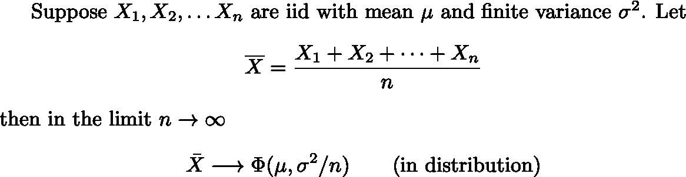

中心极限定理的形式陈述

其中φ代表正态分布，平均值和*方差*如下所示。(你可能习惯看到等价的*标准差* σ/√n 代替)。“in distribution”是一个关于聚合如何工作的技术术语。从现在开始我们将忽略这些技术细节。

## 为什么中心极限定理会出现

中心极限定理出现在现实世界中的各种场合。例如，一个非常合理的假设是，你的身高可以用一系列相关因素的总和来表示，其中包括:

1.  你 8 岁时每天喝多少牛奶
2.  你有多少条 X 和/或 Y 染色体
3.  你有哪一种 GH1 基因变体
4.  一大堆其他的基因
5.  你小时候是否睡在[的普罗克拉斯特床](https://en.wikipedia.org/wiki/Procrustes)

考虑一大堆因素，每个因素都会对你的最终(成人)身高产生微小的影响，然后，很快，你就会得到一个(大致)人类身高的正态分布！

请注意，我稍微作弊了——这里的变量不是独立同分布的，但独立性假设是一个合理的近似，还有更强版本的中心极限定理放宽了同分布假设。然而，我们确实选择了排除影响身高的极端遗传条件。

总之，任何时候你测量的东西是由一大堆更小部分的贡献相加而成的，你很可能以正态分布结束。

## 快速证明

这个证明必然是一个草图，因为，如果你想要一个包含所有分析和概率论的完整证明，去读一本教科书吧。我想说明的要点是，欧拉常数 *e* 出现是有原因的。

首先，我们需要一个高性能的数学工具。对于每一个合理的随机变量 X，都有一个*特征函数φ* ，它本质上是 X 的概率密度函数(PDF)的傅立叶变换。

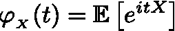

随机变量 X 的特征函数

为什么我们把我们非常好的，实值的，随机变量，放入复数，然后让它变得更复杂？因为某些原因，没有人能满意地向我解释，数学中的事物往往有两种看待它们的方式(“二元性”)。物理学也是如此:空间/动量，时间/频率。不管是什么原因，有时候看另一面会简单得多。

特征函数有两个我们需要的很好的性质。假设 A 和 B 是独立的随机变量， *c* 是标量常数。然后我们想知道和变量 A +B 和乘积 cA 的特征函数。你应该能用纸和笔很快地从定义中推导出这些:

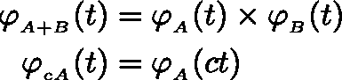

特征函数的便捷性质

φ在 t=0 时的导数也编码有价值的信息。设置 t=0 后，指数部分消失，我们得到一个足够简单的表达式来计算。(我再次向你保证，你可以用铅笔和纸在 2 分钟内自己完成这项工作。就用定义，做看起来对的事情)。

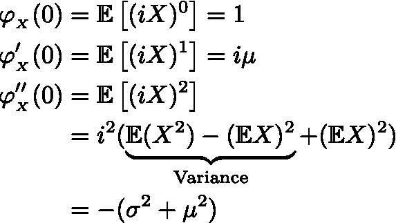

假设均值和方差有限，特征函数在 0 处的导数

现在我们准备好开始了。回忆一下我们的 X₁，X₂，…等等。，iid 个随机变量，每个都有均值μ和有限方差σ。让我们转移他们，所以我们得到

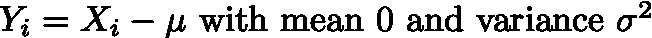

并定义

请说服自己，如果我们证明了*和* Y 是均值为 0、方差为σ的正态分布，那么我们已经证明了*均值* X 是均值为μ、方差为σ /n 的正态分布，这就是我们想要的。

现在我们只需要计算特征函数

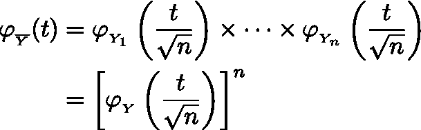

Y 和的特征函数

在这里，我们使用了上述随机变量的和与标量倍数的特征函数性质。Y 是 iid，所以它们都有相同的特征函数:重复乘法变成取幂。

现在我们把φ泰勒展开到二阶

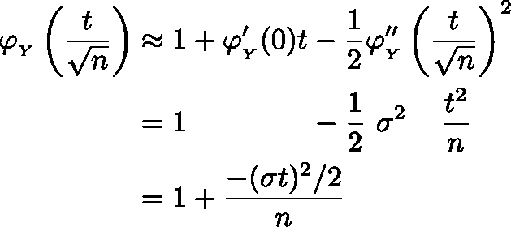

φ的泰勒展开

取极限为 n → ∞。你知道这个！是复利公式( [Pert！](https://en.wikipedia.org/wiki/Compound_interest#Continuous_compounding))利率 r =-σt/2

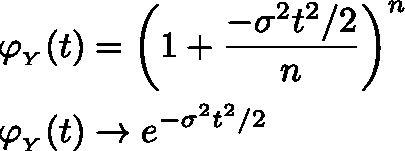

复利公式

我们得到的结果实际上是均值为 0、方差为σ的正态分布的特征函数。通过[李维连续性定理](https://en.wikipedia.org/wiki/L%C3%A9vy%27s_continuity_theorem)，我们完成了。我们可以看到为什么那个狡猾的欧拉常数 *e* 出现了！

# 超越中心极限定理

好吧，这一切的重点是找出为什么正态分布如此正常。我们所做的只是证明了中心极限定理，而没有真正得到为什么结果是正态分布的更深层次的解释。该付钱了。

我们看到中心极限定理如此普遍，因为它告诉我们当我们对一堆东西求和/平均时会发生什么。所以很自然的会问，一堆东西的总和/平均值会是什么分布？让我们把这些分布看作正态(高斯)分布的“表亲”。

## 无限可分分布

如果一个分布 Y 可以表示为任意多个 iid 分布 X 的和，那么它就是无限可分的。

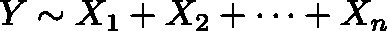

泊松分布、学生 t 分布和伽马分布是无限可分的，高斯分布和我们将在下面看到的分布也是如此。

## 稳定分布

然而，在我们认为一个分布是正态分布的“表亲”之前，我们想要求一个更强的条件。假设我们有发行版 x 和它的 iid 副本 X₁和 X₂.我们对这些拷贝进行线性组合，看看我们是否得到了和开始时一样的结果，除了可能被常数 c 缩放和被常数 d 移位，如果我们总是能做到这一点，我们说 X 是稳定的。

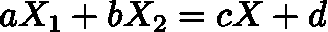

在上面无限可分分布的上下文中，这意味着我们可以将 Y 写成*本身*(适当缩放和/或移位)的 *n* 个副本的总和。粗略地说，对于像泊松分布这样的不稳定分布，添加越来越多的分布会让你越来越接近稳定分布。所以我们感兴趣的是稳定分布。

## Levyα-稳定分布

[α稳定](https://en.wikipedia.org/wiki/Stable_distribution)分布是唯一稳定的分布。早在 20 世纪 20 年代，法国人保罗·莱维就对它们进行了研究。他们的描述是 20 世纪 50 年代俄罗斯人格涅登科和科尔莫戈罗夫给出的广义中心极限定理的核心。反过来，它们提供了关于正态分布本质的正确观点。

每个 [α稳定](https://en.wikipedia.org/wiki/Stable_distribution)分布由 4 个参数表征。这是一个很大的参数。

1.  位置(本质上是平均值)
2.  刻度 *c* (与标准偏差相关)
3.  尾部尺寸，α。介于 0 和 2 之间，包括 2 但不包括 0。
4.  左/右尾比，β。介于-1 和 1 之间。

前两个参数非常合理:位置和规模。在正态分布的情况下，位置是平均值μ，标度可以是标准偏差σ。

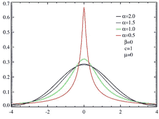

不同尾巴大小的比较(维基百科)。α=2 是正态分布。

第三个参数α(分布族的名字由此而来)控制尾部的大小。最小的尾部属于正态分布，峰度为 3(峰度为 0)。对于所有其他稳定分布，尾部较厚(“尖峰厚尾”)，峰度至少为 9。你可能已经从《黑天鹅》《T21》等书中熟悉了“胖尾巴”这个概念。简而言之，如果你认为事物是正态分布的，但事实上它们的尾部比你想象的要大，你会看到数量惊人的“反常”事件，比如股市崩盘(当然，这很常见)。我们一会儿将回到这个参数。

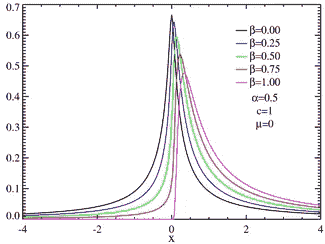

不同“偏斜度”设置的比较(维基百科)

最后一个参数有点无聊。它控制右尾巴与左尾巴的大小比例(直观地说，[歪斜](https://en.wikipedia.org/wiki/Skewness))。从图中可以看出，对于β=1，分布仅支持非负数。

从某种意义上说，我把参数给错了。它们控制一阶(位置)、二阶(标度)、三阶(偏斜度)和四阶(峰度)矩。希望这能给你一个直观的感觉。最后，我们来看看最重要的第四个参数，α。

## 帕累托分布

为了理解尾部大小，我们应该看看帕累托分布。帕累托分布有一个仅在 x≥1 时非零的 PDF，并带有一个参数α > 0，其作用与莱维分布相同。

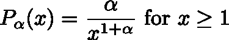

帕雷托分布的 PDF，α > 0

19 世纪晚期，意大利经济学家 T4·维尔弗雷多·帕累托·T5 首次研究了 T2 的帕累托分布。它是 80/20 法则的起源(20%的人口拥有 80%的财富；20%的工作完成了 80%的结果)。这显然也是墨索里尼法西斯主义的灵感来源，墨索里尼参加了他的讲座。

需要注意的一些关键点

*   对于α = 0(或更小)，分布不会被归一化:总概率不会加到 1(它会加到∞)。因此对α有约束。
*   对于α ≤ 1，分布连有限均值都没有！它的期望值 E(X)是∞。
*   对于α ≤ 2，分布不具有有限方差！它的方差是∞。
*   帕累托分布总是比正态分布有更宽的尾部，用峰度来衡量。在极限α→∞，峰度比正态分布多 6。

随着α变大，尾部变小(但保持比高斯大)。如果尾部太大，分布的均值和方差可能是无穷的！

好吗？如果你理解帕累托分布是典型的“厚尾”分布，有一个参数控制尾部的“大”，那么你就理解了α在 lévyα-稳定分布中的作用。

## 帕累托分布和莱维分布之间的关系

把所有东西放在一起，你可能已经注意到，我偷偷摸摸地还没有明确地说为什么中心极限定理不适用于α-稳定分布。

事实上，中心极限定理要求我们的分布具有有限的方差σ。但是对于方差无穷大的分布，中心极限定理就不适用了。而是对一堆样本进行平均，会得到一个α < 2 的α稳定分布。我们将在下面给出一些例子。

这也是我讲“位置”和“尺度”参数的原因。你对均值和方差的直觉非常适用，但并不是所有的分布都有明确的均值或方差。

概括/澄清一下，假设我们有一个基础分布 X，我们用大小为 *n* 的样本取平均值。我们想知道当 *n* 很大时，样本均值将遵循什么分布。

*   如果分布的尾部看起来像帕累托分布α < 2 after we go far enough, we will get an α-stable distribution with the same α. If the left tail and right tail have different α-parameters, the largest one wins and the smallest one dies: we end up with an α-stable distribution that only has a left or right tail (β = ±1). Otherwise β just sets the ratio between the two tails.
*   If the distribution’s tails look like a Pareto distribution with α > 2，或者它们比任何多项式下降得都快(比如说像高斯分布中的指数下降)，那么你将得到一个正态分布。
*   α = 2 的情况是特殊的。即使基础分布具有无限的方差，结果分布*仍然*是高斯分布。因此，α=2 *的莱威分布是正态(高斯)分布。*

α=2 的情况也很特殊，因为正态分布不能有任何偏度(所以β=0)，尾部大小是固定的(峰度= 3)。因此，不存在α > 2 的α稳定分布。相反，所有这些假设分布都被中心极限定理“捕获”,并在我们采样和平均时变成高斯分布。

α-稳定分布很重要，因为它们提供了“胖”尾情况下的中心极限定理。正如上面提到的，股票市场回报被认为遵循α-稳定分布，α≠2，这提供了一个现实生活中的例子，假设某个东西是正态分布的，你可能会输掉你的衬衫。

## 结论

有趣的是，除了少数特殊情况，封闭形式的概率密度函数(PDF)是未知的。一般只能写下特征函数φ。这是相当丑陋的，所以我不打算打扰。然而，可以对 pdf 进行采样和数值计算，并且可以在任何好的统计软件包中找到实现(比如 [scipy](https://docs.scipy.org/doc/scipy/reference/generated/scipy.stats.levy_stable.html) )。

让我们以一个例子来结束。如果生成标准随机正态变量 A 和 B，并考虑它们的*比* A/B，就会得到一个α=1 的柯西分布。作为一个练习，您可以生成 *n* 大的 *n* 数，并将正态分布和 Lévy-stable 分布拟合到样本均值的最终分布中。你应该看到正态分布不符合(尾部太肥)而 Lévy 分布符合α接近 1。如果改变 A 和 B 的均值和标准差会怎么样？

# 参考

除了文中的链接，我主要是通过新加坡国立大学孙荣峰[的](http://ww1.math.nus.edu.sg/staff.aspx?s=matsr)[课堂笔记](https://sites.google.com/view/rongfengsun/home/teaching/ma5259-proability-i?authuser=0)了解到这个话题的。

[1]有了四个参数，我可以让一头大象适应，有了五个参数，我可以让它扭动鼻子——冯·诺依曼

[2]然而，这些并不是实际的数字