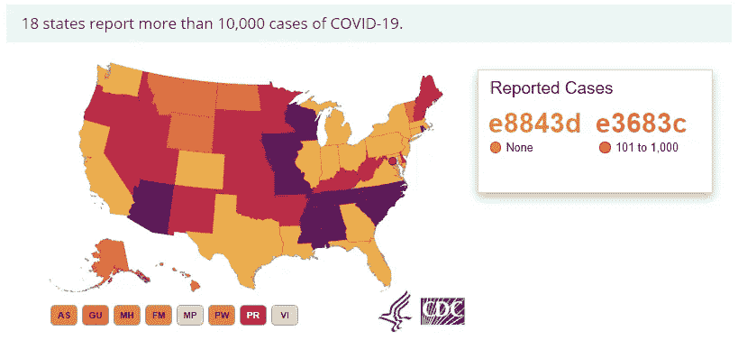

# 为什么这个图表不好？使用 GoDVE(数据可视化评估语法)进行数据可视化评估的最终指南

> 原文：<https://towardsdatascience.com/why-is-this-chart-bad-5f16da298afa?source=collection_archive---------9----------------------->

[“各种流行病的死亡人数占世界人口的比例[OC]”](https://www.reddit.com/r/dataisbeautiful/comments/fp76db/death_count_of_various_pandemics_as_a_ratio_of/)来自 [r/dataisbeautiful](https://www.reddit.com/r/dataisbeautiful/)

你难道没有看过不时疯传的图片并试图分析它们吗？我知道。大多数都是垃圾。但它们为什么是垃圾？是什么让糟糕的视觉效果变得糟糕？

今天，我将向您介绍**vis qual——可视化质量工具和用于评估数据可视化的标准**。

> 声明:如果你是来回答标题问题的，请直接跳到章节“**数据可视化评估的语法**”。

首先，让我们从几个例子开始，因为这是最好的学习方法！这是一个带有 epi-**-al 调色板的全球疫情案例图。**

****

**[“CDC 对 COVID 病例的颜色选择不当”](https://www.reddit.com/r/dataisugly/comments/gaaxtl/poor_color_choice_for_covid_cases_by_cdc/)来自 [r/dataisugly](https://www.reddit.com/r/dataisugly/)**

**这个图表有什么问题？嗯，是调色板让你**准确无误地理解一切**。也许本质上不是什么都没有，但至少它确实是“误导性的”。“无”，即没有病例和“10，001 或更多”病例之间的差异是巨大的(准确地说至少是 10，001)。但是颜色表示是相同的。是吗？不完全是。我用 GIMP 帮你查过了。**

****

**标尺上所选颜色的十六进制值。**

**是啊，非常不同。**

**但是让我们公平地注意到**地图已经被改变**。我确实避免使用“纠正”一词，因为问题仍然存在——虽然规模较小，但仍然存在。**

****

**来自 cdc.gov[的“修正”地图](https://www.cdc.gov/coronavirus/2019-ncov/cases-updates/cases-in-us.html)**

**如何区分“5001 到 10000”和“1001 到 5000”或者“10001 到 20000”？不要让我开始谈论色盲的话题，这个话题完全被政府的形象化忽视了。**

> **顺便说一句:世界上 12 个男人中有 1 个，200 个女人中有 1 个是色盲**

# **颜色说够了，让我们来谈谈比例和轴**

**颜色并不是 datavis 中唯一常见的错误。老实说，最常见的错误是关于刻度/轴的恶作剧。回想一下:
**标度**指的是纯粹的大小(例如条形图中的条)，而**轴**描述数据空间的“范围”，帮助您读取准确的值，并通常定义坐标系。**

**说到规模，我们来看看这个牲畜 vs 车辆的对比。**上次查了 300K < 4M** ，但是我是谁？带尺子的自作聪明的家伙？**

****

**["告诉我更多关于 Kanye 的 30 万美元牲畜的信息"](https://www.reddit.com/r/dataisugly/comments/hq8s73/tell_me_more_about_kanyes_300k_of_livestock/)来自 [r/dataisugly](https://www.reddit.com/r/dataisugly)**

**“下一个例子是关于**轴。**你知道什么比气候变化否认者更好吗？一个否认气候变化的人，他知道 150%的数据可视化。**

**在推特上看到完整的“论据”。**

**这是那条推文的第一个条形图。**

****

**1000%证明温度稳定和气候变化是一个骗局。**

**使用开尔文温标的问题是温度很少下降到绝对零度(在地球上)，通常在[68°C(90°F 或 205° K)](https://en.wikipedia.org/wiki/Lowest_temperature_recorded_on_Earth)和[56.7°C(134.1°F 或 329.85° K)](https://en.wikipedia.org/wiki/Highest_temperature_recorded_on_Earth)之间。所以“绝对零度”在这里可能有点不合适。不得不解释那件事，我感到有点反感。**

# **再举几个例子让你判断**

**我们可以继续下去，描述更多更可怕的例子…我知道你渴望看到一些仇恨，但为了不把这部分拖得太长，我会留下一些作为你的家庭作业。
猜猜那些有什么问题！如果你不确定，可以查看相关的 Reddit 帖子(以及整个社区，我非常感谢他们！)**

****

**[【鞋色频率】](https://www.reddit.com/r/dataisugly/comments/ey62bz/shoe_color_frequency/)来自 [r/dataisugly](https://www.reddit.com/r/dataisugly)**

****

**[“这就是为什么调查不使用(来自 r/任天堂 switch)](https://www.reddit.com/r/dataisugly/comments/6wqste/this_is_why_surveys_dont_use_writeins_from/)来自 [r/dataisugly](https://www.reddit.com/r/dataisugly)**

****

**这个对我来说是最棘手的。[r/dataisugly](https://www.reddit.com/r/dataisugly)中的“关于睡眠要求的一些真正有用的信息”**

# **咆哮部分到此结束。**

# **这是数据科学部分！**

**现在我们来谈谈真正的数据可视化。我们知道我们的前进方向 VisQual，一个数据可视化评估工具和标准
…但是我们从何而来？**

# **什么是**数据可视化**？(不要跳过这一部分)**

**正确的第一步是将整个数据可视化域放在某个超级域中。有人会说这是数据科学。我想对此提出异议。虽然，数据可视化的一部分肯定是数据科学的一个子域，但它的另一部分在于…艺术。**

****

**罗伯特·基恩在 [Unsplash](https://unsplash.com?utm_source=medium&utm_medium=referral) 上的照片**

**是的，艺术是指美术和应用艺术，两者都有涉及。这是一个模糊的定义，但数据可视化的整个定义也是模糊的。**

** [## 数据可视化|剑桥英语词典中的含义

### 数据可视化定义:1。将信息表示为图片、图表或图形的行为，或表示…

dictionary.cambridge.org](https://dictionary.cambridge.org/dictionary/english/data-visualization) 

**“将信息表现为图片、图表或者以这种方式表现信息的图片的行为”**，所以**简单来说就是任何东西**。任何“可视化数据”或“表示信息”的东西都是数据可视化。毕竟这是艺术，任何东西都可以成为艺术。

一幅画越“精致”，就越接近梵高或毕加索的艺术，反之亦然。如果你愿意的话，它越“应用”或“实用”，它就越具有数据科学性。

虽然，我们可能会争论，一个特定的图表是否更漂亮或更有用，我们可以评估它，这是关键的部分！VisQual 的主要假设是，我们可能会判断一个可视化，说它“好”或“坏”。然而，**我讨厌纯粹主观地看待它**。因此有精确的标准，我们最终会达到。
我们先来谈谈语法。等等，“语法”？是啊！图形的语法，数据合成的起源。

我们将提到两个大的组织者和他们的想法来自于另一个。

## **图形语法**

别担心，我们不会谈论形式语法，图灵机和自动机理论。Leland Wilkinson 在[Grammar of Graphics](https://www.springer.com/gp/book/9780387245447)中引入的概念将图形(如图表)分类为上下文无关的语法，该语法由以下元素组成:

*   **数据**
    假设我们有一些人的出生和死亡日期。
*   **变量**
    …是他们的年龄(死亡日期-出生日期)
*   **代数**
    …定义如何减去数字(这里是减去日期)。
*   **刻度**
    …定义我们的条形图的单位有多大。
*   **统计数据**
    如果我们想绘制一张平均寿命图，那就去做吧！
*   **几何图形**
    …告诉图形是否应该是条形图、散点图等。
*   **坐标**
    可能我们是在笛卡尔坐标下工作，但是见鬼，有时候是极坐标！
*   **美观**
    …定义条块之间的距离、轴的放置位置(左、右、上或下)以及其他美观方面。
*   **刻面**
    也许我们想根据人的国籍把我们的图表拆分成很多图表？
*   **指南**
    …基本上是可视化包含的所有“文本”(标题、轴标题、图例等。)

威尔金森的想法在形式和工程方法上都很出色，这是一个很好的基础。

## **图形的分层语法**

Hadley Wickham 在他的[图形的分层语法](https://byrneslab.net/classes/biol607/readings/wickham_layered-grammar.pdf)中提出了 Wilkinson 的概念，他将形式描述的方法转变为实际应用。在创建 ggplot 的第一个迭代时，他引入了他的概念，将图形分成多个层:

*   数据
*   绘图
*   Geom
*   斯达
*   位置
*   规模
*   坐标
*   方面

如果你想知道 GoG 和分层 GoG 之间是否有任何关系，或者，咳咳，*映射*——有！这就是韦翰的定义。

GoG-分层的 GoG 关系(改编自 Wickham 的《图形的分层语法》)

我们可以谈论 GoG 和分层 GoG 有多棒，但是……
但是**我们不是来创造或者分解图形的**。威尔金森和韦翰就是这么做的。**我们是来评价**他们的。图形语法或图形分层语法是为了设计/构建/分解图形而创建的。我们是来评估。所以把你的*元素*和*层*放在一边，让我们来谈谈……的*类别*

# **数据可视化评估的语法**

GoDVE(仍在进行简化)是讨论数据可视化评估的基础。**它由 11 个类别和 118 项标准组成，采用简单的是/否问题形式。要评估一个可视化，你只需回答问题。如果答案是“是”，那么一切都很好，但“否”意味着可视化有问题。**什么样的问题？我举个例子来解释一下——最好的学习方法！

[“各种流行病的死亡人数占世界人口的比例[OC]”](https://www.reddit.com/r/dataisbeautiful/comments/fp76db/death_count_of_various_pandemics_as_a_ratio_of/)来自 [r/dataisbeautiful](https://www.reddit.com/r/dataisbeautiful/)

让我们来看看来自 [r/dataisbeautiful](https://www.reddit.com/r/dataisbeautiful) 的一个非理想的可视化，并提及它可能引发的一些问题。“一些”，因为没人有时间。只在某些方面评价一个 datvis 是可以的。如果你想全部看完，那就继续吧！**(查看上一章介绍的工具！)**

我会试着解决每一个类别，让你对它们有个好印象。让我们开始吧！

## 数据

*数据来源是否提供？* ***是的***虽然大部分的新潮、病毒式的可视化都懒得去做，这一条居然在右下角提供了来源(“灵感”)。这已经是一个非常非常好的迹象。

## 美学

*信息是按照五个帽架组织的吗？* ***是***

 [## 五个帽架

### “五个衣架”的概念最初是由理查德·索尔·沃尔曼在他的书《信息焦虑…

infovis-wiki.net](https://infovis-wiki.net/wiki/Five_Hat_Racks) 

这些数据按时间顺序组织得很好。

*可视化是否服从阅读引力？* ***不***嗯，tbh，时间一般是从左往右过的。在这里，它“走向”观众，有些人(包括我)觉得不太直观。

所有轴的方向和形状都合适吗？ **否**
时间轴怪异且不必要的变形。从 200 到 300 的距离比从 1900 到 2000 要短得多。一个世纪就是一个世纪。

## 协调

*秤是否完整(未切割)？* **是的** 我提出这个问题是为了强调这是 datavis 中最常见的错误/操作之一。幸运的是，该轴是“完整的”，即没有年份/十年像下面令人厌恶的那样被“切断”:

[“所以荷兰人大约是菲律宾人的 3 倍”](https://www.reddit.com/r/CrappyDesign/comments/986791/so_dutch_people_are_about_3_times_as_big_as/?utm_source=share&utm_medium=web2x)出自 [r/dataisugly](https://www.reddit.com/r/dataisugly)

*是否有足够的轴或值引用？* **否**
没有轴表示因每例疫情死亡的人口百分比。

*所有使用的尺寸都是必须的吗？*

## 位置

*对准是否正确？*

*可视化是否恰当地利用了空间？* **不**
右边有很多空白的地方。

## 指导

*是不是标签不太多？* **没有**
在太多的地方有太多的引导。此外，一些超级关键的标签(如左上角关于体积百分比的注释)不够突出。

嗯，那是藏在角落里的相当重要的信息。

## 几何学

> 这当然是这个可视化中最恶心的恶心。我们开始吧…

*形状到数据的转换容易理解吗？* **没有**
卷对于人类来说不容易解读和比较。我们线性思考。我们比较长度容易，比较面积困难，比较体积……我们不能可靠地比较体积。

*形状是否便于数据比较？* **不** 看上面。

形状的额外尺寸是否显示了额外的信息？ **否**
体积呈现一条只需要一维的信息。因此，它可以减少，当然没有必要。

*这些形状不会妨碍读取数据吗？* **不**
一件事是有第三维度和整个*无法阅读那卷*的东西。第二个想法是视角。你认为这些球大小相似吗？我不知道，他们看起来很相似，但是…

这两个球一样大吗，ekhem，体积？它们标有大小不同的圆圈，只是表示。

让我们检查一下！
[公元 165-180 年发生安东尼斯瘟疫。这一时期的世界人口接近 1.9 亿。瘟疫期间，5 00 万人死亡。它占世界人口的 263%。COVID 怎么样？
我们将 35 00 万(根据可视化状态)除以 7 794 798 739，得到…**~ 0.45%，比**少了近 6 倍。但是球看起来几乎一样。是透视吗？是那个*看不懂那卷*的东西吗？我甚至不能。你可以说作者们尽了最大努力让数据看起来尽可能的花哨，同时又尽可能的让人看不懂。我们继续吧。](https://en.wikipedia.org/wiki/Antonine_Plague)

这些形状是否以适当的比例表示数据？ **没有**
我们甚至不知道数据是什么？体积代表因疾病致死的人口百分比。我们也被赋予了绝对值。现在，我将不得不检查给定时间内的世界人口，除，并且…可能意识到让我检查它丢失的数据的 datavis 没有实现它的目的。

*形状是否精确地代表了数据(没有近似值)？* **不**
哦好家伙。这里有人能估算出带飞行纤维的毛球的体积吗？(BTW，如果你要引用这篇文章，引用这句话)。

> 这里有人能估算出带飞行纤维的毛球的体积吗？

## 统计和方面

这些类别中没有适合可视化/有趣的问题，所以我们跳过它。

## 主题

它是亲蛋白的吗？ **是**
*它是对德国友好的吗？* **是**
*是 tritanopia 友好型吗？* **是**

颜色并不代表任何数据，所以…我只是想向所有人大声疾呼，不能用所有颜色来体验这个世界是多么不幸。

根据[色盲](https://chrome.google.com/webstore/detail/colorblinding/dgbgleaofjainknadoffbjkclicbbgaa?hl=en)的可视化色盲版本。(请注意，deuteranopia 和 protanopia 有点不同，例如后面的紫色球对后者来说更强烈一些)

## 操纵

*数据是以公正的方式显示的吗？* **是** *数据没有被操纵吗？* **是的** 很难百分之百准确的说出一个人的意图是什么。因此，这一类别通常非常“我认为/也许/可能……”。我认为很难证明作者有任何意图(或潜在利益)以有偏见/被操纵的方式展示数据。

*是否不含具有虚幻效果的物品？* **再没有**
的蛋蛋了。这是一个完美的方法，让人觉得东西(长/高)大 x 倍，而实际上它们(体积)大 x 倍。

## 主观的

我跳过了这一类，因为你可能已经得到了我对这张图表的印象。但是检查一下你将如何回答这些问题！

*   *这个可视化有意思吗？*
*   这个可视化效果比你见过的类似的要好吗？
*   你喜欢可视化的主题吗？
*   可视化是否美观？
*   你了解视觉化吗？
*   你喜欢它吗？
*   你从这种可视化中学到了什么吗？
*   *展示的信息有用吗？*
*   花在体验可视化上的时间值得吗？
*   你想看看类似的视觉效果吗？

# *最终单词*

每当你认为你做了一个糟糕的图表，记住可能有超过 30，000 人(T42 支持)不敢苟同。
上面的可视化对我来说很可怕，但总的来说并不可怕(也不优秀)。这是关于 VisQual 的最重要的线索:它帮助你评估可视化，并精确地指出错误。然而，它没有给出标记或分数。你不会得到 94/100 或 3/10。**即使你可以用正面回答的数量占问题总数的简单分数来计算最终分数，并与他人进行比较，你也不能这样做。**

> VisQual 不是一个理论上的标记工具，它是一个实用的反馈工具。

说到实用工具…

# **检查完整的 VisQual 并在线评估您的图表！**

想潜得更深吗？检查所有类别和问题，并使用 [VisQual online](https://visqual.herokuapp.com/) 评估您自己的可视化效果！** 

> **感谢 [@michbur](https://github.com/michbur) 的咨询。**