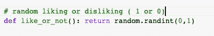

# 为什么你的脸书数据如此有价值？一种通过脸书相似度预测人类特征的方法。

> 原文：<https://towardsdatascience.com/why-is-your-facebook-data-so-valuable-a-method-to-predict-humans-traits-through-facebook-likes-e1ae036e80fb?source=collection_archive---------55----------------------->

## 为什么你的脸书数据如此有价值？一种通过脸书喜欢预测人类特征(性别，政治倾向，年龄)的方法。

随着选举时间的临近，我们将看到我们的脸书数据如何以及为什么对广告商和政治家如此有价值。脸书是世界上最大的社交网络平台，拥有超过 25 亿活跃用户。它以前所未有的规模处理数据，高度复杂的脸书人工智能算法以近乎人类的方式对数据进行筛选、分类和预测。


[https://unsplash.com/photos/HUBofEFQ6CA](https://unsplash.com/photos/HUBofEFQ6CA)

# 如何以及为什么

W hy:由于大量数据和处理能力的涌入，我们将探索如何仅使用一组脸书喜欢的东西来预测人类特征。为了实现我们的结果，我们将尝试复制分析来自[剑桥分析数据丑闻](https://en.wikipedia.org/wiki/Facebook%E2%80%93Cambridge_Analytica_data_scandal)的数据的流行论文。([纸在这里](https://www.pnas.org/content/110/15/5802))

H ow:为了建立一个预测模型，我们将利用[脸书广告类别数据集](https://www.propublica.org/datastore/dataset/facebook-ad-categories)。利用这一点，我们将尝试创建一个类似用户的稀疏矩阵，其中每个类别对应一个评级。(1 代表，用户喜欢的内容。0 代表，用户不喜欢的内容)

# 要求

*   Python 3.8
*   sci kit-学习
*   熊猫
*   Numpy

# 资料组

像任何 ML/数据挖掘项目一样，我们将从分析和生成数据集开始。


脸书广告类别数据集的预览。

如你所见，数据集非常广泛，因为它是众包的，这些条目是真实用户的。从数据集中可以明显看出，我们只需要**“name”**列。以此为起点，我们可以生成数据集的下一部分。

```
def generate_data(number_of_users=55000, cols=cols):"""Generates random data consisting of user's likes and dislikesArguments:number_of_users: intReturns:DataFrame"""assert number_of_users <= len(cols), "Number of users and cols should be less or equal."index = ["User {}".format(i) for i in range(1, number_of_users+1)] # Number of user# generic categoriescols = cols.tolist()data = {col: [] for col in cols}# random liking or disliking ( 1 or 0)def like_or_not(): return random.randint(0,1)for col in cols:#print("Adding for {}".format(col))for i in range(1,number_of_users+1):data[col].append(like_or_not())print("Data generation complete.")return pd.DataFrame(data=data, index=index), index, cols
```

为了生成我们的数据，我们提取“name”列，并为每个用户随机分配 1 或 0。



like_or_not 函数


用户数=5 时我们生成的数据集的预览

## 目标变量

到添加我们的目标变量，我们将关注“年龄”、“性别”和“政治”。这些是我们希望通过收集每个用户的脸书喜好来预测的变量。

```
def generate_target_variables(number_of_users=55000,target=['age', 'gender', 'political']):
  # for each target we will generate random data
  data = {"age":[], "gender":[], "political":[]}# for age (age ranged: 18 to 75)
  # regression
  data['age'] = [random.randint(18, 75) for x in range(1, number_of_users+1)]# for gender (m or f) ( 1 or 0)
  # classification 
  data['gender'] = [random.randint(0,1) for x in range(1, number_of_users+1)]# for political
  # classification (1 -> democratic, 0 -> republican)
  data['political'] = [random.randint(0,1) for x in range(1, number_of_users+1)]return data# adding target variables
data['age'] = target['age']
data['gender'] = target['gender']
data['political'] = target['political']
```


数据集中的目标变量

# 降维

由于我们的数据集包含约 52000+个产品的广告类别，我们将使用奇异值分解进行降维。(论文中也有提及)

对于那些不记得奇异值分解或主成分分析的人，我们将简要概述这一过程。

> [降维](https://en.wikipedia.org/wiki/Dimensionality_reduction)，或称降维，是将数据从高维空间转换到低维空间，使低维表示保留原始数据的一些有意义的属性，理想情况下接近其固有维度。

F 或 SVD，我们本质上使用**公式**来转换数据:


[https://en.wikipedia.org/wiki/Singular_value_decomposition](https://en.wikipedia.org/wiki/Singular_value_decomposition)

> 为了执行我们的降维，我们将使用 [sklearn TruncatedSVD](https://scikit-learn.org/stable/modules/generated/sklearn.decomposition.TruncatedSVD.html) 类，其中 n_components=100(根据论文。)

```
def dimen_reduce(values):

    reduced = TruncatedSVD(n_components=100)
    tr = reduced.fit_transform(values)
    return tr
```


在执行 dimen_reduce 时，我们得到了这个转换后的数据帧

```
def generated_reduced_df(df, index, number_of_users=55000):tr = dimen_reduce(df.values)# 100 componentsdimen_df = pd.DataFrame(data=tr, index=index)target = generate_target_variables(len(dimen_df))dimen_df['age'] = target['age']dimen_df['gender'] = target['gender']dimen_df['political'] = target['political']return dimen_df
```


我们最终的数据集

# 培养

如根据本文，我们用线性回归训练年龄目标变量，用逻辑回归(分类)训练其他参数。

> 论文提到了许多参数，但是由于计算的限制，我们只预测了三个变量(年龄、性别、政治)。

```
def split_dataset(df,test_size=0.2, stype="linear"):features_age, labels_age = df.drop(columns=['age']).values, df['age'].valuesfeatures_gender, labels_gender = df.drop(columns=['gender']).values, df['gender'].valuesfeatures_political, labels_political = df.drop(columns=['political']).values, df['political'].valuesif stype == 'linear':x_train, x_test, y_train, y_test = train_test_split(features_age, labels_age, random_state=42, test_size=test_size)return x_train, x_test, y_train, y_testif stype == 'clas_gender':x_train, x_test, y_train, y_test = train_test_split(features_gender, labels_gender, random_state=42, test_size=test_size)return x_train, x_test, y_train, y_testif stype == 'clas_pol':x_train, x_test, y_train, y_test = train_test_split(features_political, labels_political, random_state=42, test_size=test_size)return x_train, x_test, y_train, y_test
```

> 由于性别和政治目标变量是 1 和 0 的形式，我们使用 LogisticRegression 来训练我们的模型。我们使用线性回归以年龄作为目标变量来训练我们的模型。

答根据论文，我们根据奇异值分解对 100 个成分进行 10 重交叉验证。

```
# age
cross_val_score(linear_reg, x_train_linear, y_train_linear, cv=10)
cross_val_score(linear_reg, x_train_linear, y_train_linear, cv=10)# gender and political
cross_val_score(log_reg, x_train_gender, y_train_gender, cv=10)
cross_val_score(log_reg, x_train_pol, y_train_pol, cv=10)
```

# 结论

到总结，我们看到脸书的喜好是如何影响或预测重要的人类特质的。有了足够的数据(n=55000)，我们可以获得可接受的准确度作为测量的 ROC。随着数据的涌入，我们可以看到，如果组织能够访问脸书的数据，那么锁定特定人群是多么容易。

# 参考

**【1】**【https://www.pnas.org/content/pnas/110/15/5802.full.pdf】T21

# 链接

[1]Github:[https://github.com/aaditkapoor/Facebook-Likes-Model](https://github.com/aaditkapoor/Facebook-Likes-Model)

[2]Colab:[https://Colab . research . Google . com/drive/1k 75 odwkhenxirvdkzyybimpqngisjs 6？usp =共享](https://colab.research.google.com/drive/1k75ODwkhEnXirVDKzyyBImPqNGISqjs6?usp=sharing)