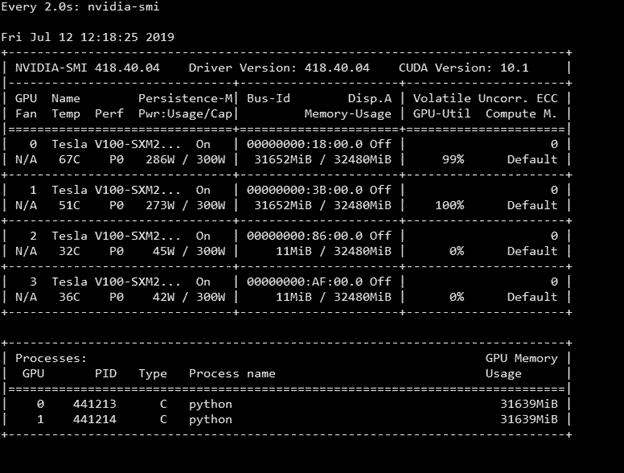

# 为什么你的 Horovod 比平时慢？

> 原文：<https://towardsdatascience.com/why-is-your-horovod-slower-than-the-usual-201b4b8574d5?source=collection_archive---------26----------------------->

[https://github.com/horovod/horovod](https://github.com/horovod/horovod)

本文讨论了如何使用 Horovod 进行更快的训练，以及在使用 Nvidia GPUs 作为加速器时可能导致训练速度下降的一些常见瓶颈。

[Horovod](https://github.com/horovod/horovod) 是一个大规模执行分布式深度学习训练的框架。它的目标是用仅仅五行代码将大规模分发到深度学习作业中(嗯，差不多，取决于你想做什么)。让你的深度学习工作分布式的提升在你这边非常低，至少用 [tf.keras](https://www.tensorflow.org/guide/keras) API 是这样。你自己用一个 MNIST 的例子来看看吧。

 [## 霍罗沃德/霍罗沃德

### 此时您不能执行该操作。您已使用另一个标签页或窗口登录。您已在另一个选项卡中注销，或者…

github.com](https://github.com/horovod/horovod/blob/master/examples/tensorflow_keras_mnist.py) 

以下几点可能有助于您在使用 GPU 时调试缓慢的 horovod 作业:

1.  **环境设置:**确保您已经安装了正确的环境。这包括使用无 bug 的 MPI，比如 OpenMPI。从 horovod 的[自述](https://github.com/horovod/horovod/blob/master/README.rst)中可以看出。

> 注意:Open MPI 3.1.3 有一个可能导致挂起的问题。建议的修复方法是降级到 Open MPI 3.1.2 或升级到 Open MPI 4.0.0。

使用深度学习框架的无 bug GPU 版本(至少在 TensorFlow 的情况下)总是有帮助的。我记得 tensorflow-gpu 1.13.1 有一个 bug，它会产生比所需数量更多的进程，使进程争夺没有有效完成任何工作的 gpu 资源。

**2。正确的绑定参数:**使用带有正确 MPI 参数的 **mpirun** 或 **horovodrun(取决于您使用的硬件)**可以提高性能。理想情况下，控制 GPU 的进程应该绑定到最近的 CPU 插槽。这是可变的，取决于您用来训练模型的服务器硬件。在[戴尔 EMC PowerEdge C4140](https://www.dell.com/en-us/work/shop/povw/poweredge-c4140) 上，最佳选项是— **按插槽映射**。不需要指定任何绑定选项。看起来大概是这样的:

**mpirun-map-by socket-NP x python pyfile . py--py options**

**3。每个 GPU 一个进程:**作业应该设置为一个 MPI 进程在一个 GPU 上工作。如果进程的数量超过 GPU 的数量，这些进程将会竞争计算资源，并且无法以良好的性能运行作业。在上面的例子中， **x** 应该是要使用的相同数量的 GPU。

要为每个 GPU 设置一个进程，使用 TensorFlow 的 ConfigProto()如下:**config . GPU _ options . visible _ device _ list = str(hvd . local _ rank())**

**4。**要检查使用 GPU 的进程数量，可以使用 GPU 的内存消耗**‘watch NVIDIA-SMI’**命令。这也允许查看功耗。

观看 nvidia-smi

**5。闲置 GPU:** 这是你工作变慢的一大元凶。如果你的图形处理器急需数据，那么工作很容易变慢。我见过需要数天/数小时培训的工作，如果数据管道处理正确，可以在不到一小时内完成。确保您的代码实现了数据流水线机制，如 [tf.data](https://www.tensorflow.org/guide/data) 或 [dali](https://docs.nvidia.com/deeplearning/sdk/dali-developer-guide/docs/examples/multigpu.html) 或任何能够在训练发生时进行更快预处理并准备好下一批的机制。

如果数据管道设置正确并且 mpirun 参数正确，一旦模型训练开始，GPU 利用率应该会持续超过 80-90%。偶尔降低到 10–25%的利用率是可以接受的，但是不应该太频繁。

**5。检查是什么让事情变慢了:**使用 [horovod timeline](https://horovod.readthedocs.io/en/latest/timeline.html) 和 [nvprof](https://devblogs.nvidia.com/cuda-pro-tip-profiling-mpi-applications/) 查看任何可能出现的瓶颈，来描述你的工作。瓶颈很可能是由以下原因之一造成的:

a) TF 数据管道没有设置好，因此在加速器空闲时花费了大量时间来准备数据。若要解决此问题，必须更正 tf 管道。查看 [tf 官方模型报告](https://github.com/tensorflow/models/tree/master/official/vision/image_classification)以获得建立高效数据管道的灵感。

b)通信可能没有使用正确的结构—确保您使用的是 [InfiniBand](https://www.mellanox.com/pdf/whitepapers/IB_Intro_WP_190.pdf) ，在运行 mpirun 时查看结构用法包括**–x NCCL _ 调试=信息**，如下所示:
**mpirun-NP 4—map-by socket-x NCCL _ 调试=信息 python something . py-{ params }**
或使用包含–x 绑定的**horovidun**。

**6。GPU 通信:**为了正确地实现分布，GPU 之间需要进行有效的通信。如果他们不能有效地沟通，这就会导致沟通瓶颈。要查看他们是否以最佳方式进行沟通，请使用以下流程:

1.  使用 **NCCL 调试=信息**可以向你展示图形处理器是如何说话的。如果 GPU 在说话:

**a.** 在节点内以一种最优的方式将看起来类似于这样:**GPU 002:1299562:1299573[0]NCCL 信息环 00 : 0[0] - > 1[1]通过 P2P/IPC**

**b.** 最优方式下的外部节点看起来将与此类似:

**GPU 028:149460:149495[0]NCCL 信息环 01 : 16 - > 0【发送】via NET/IB/0**

**GPU 009:164181:164216[0]NCCL 信息环 01 : 12 - > 8【接收】via NET/IB/0**

**GPU 009:164181:164216[0]NCCL 信息环 01 : 4 - > 8【接收】via NET/IB/0**

6。其他通用提示:设置批处理大小，使 GPU 内存几乎已满，但要加以限制，以免超出内存要求。重要的是要考虑完成学习率缩放的方式。学习率缩放的概念是，随着 GPU 数量的增加，学习率也必须乘以与 GPU 数量成比例的因子。这允许模型有效地收敛。这样，通过将最大数量的可能图像安装到 GPU 上，可以减少 i/o 操作的数量，而不会影响模型的收敛性。必须注意的是，在分布式工作负载设置中，学习率缩放并不总是改善模型收敛的最佳解决方案。
检查是否需要学习率缩放:

1.  a)以分布式模式训练具有和不具有学习率缩放的模型。
    b)如果没有学习率缩放的模型比具有学习率缩放的模型执行得更好，则不需要学习率缩放。
2.  特别是当训练收敛时，并不总是强制性的规则来适应每批图像的最高可能数量。数据科学家必须能够根据他们的使用案例，在批量大小和收敛(是否使用学习率缩放)之间做出权衡。
    同样，你可以使用**‘观看 NVIDIA-SMI’**来查看 GPU 内存的消耗。使用学习率调整时，通常会有预热阶段，如本文中[所述。](https://arxiv.org/abs/1706.02677)

3.安装最新的库。

分配你的深度学习工作有时会很有挑战性，特别是当使用的节点/GPU 数量不能有效地转化为相应的性能时。为确保从加速器投资中获得最大收益，请确保实施以下最佳实践:

*   正确的绑定选项已经就绪，
*   评估不浪费 GPU 内存的多个进程，
*   使用现代流水线方法，
*   查看 GPU 的剖析至少在作业运行的 80%的时间里被使用，
*   使用最新的 [CUDA](https://developer.nvidia.com/cuda-downloads) 相关库，比如 CUDA 驱动包括 [NCCL](https://developer.nvidia.com/nccl) 等。

如果你有更多的解决方案，我会很高兴听到。请评论。