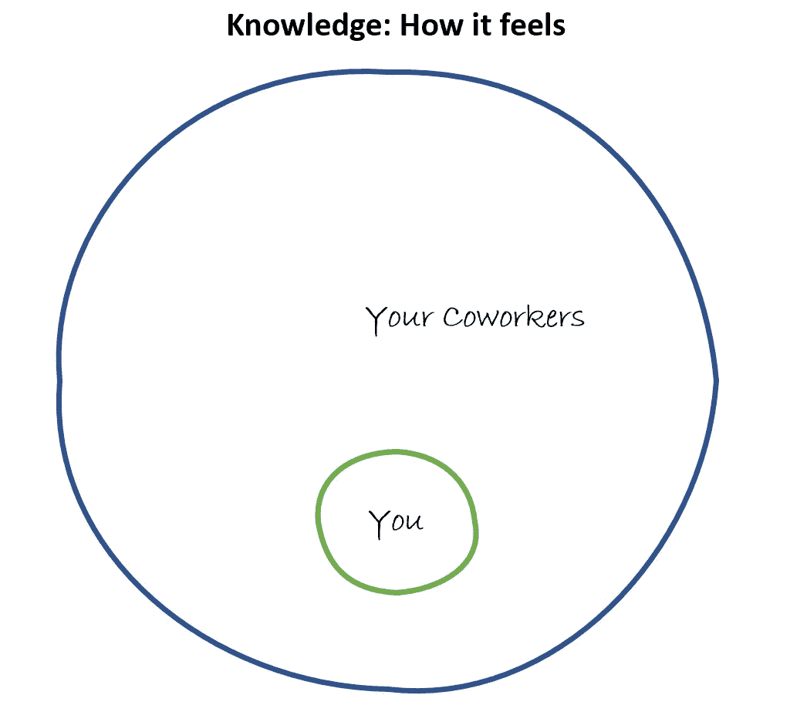

# 数据科学家，为什么感觉你的队友比你聪明

> 原文：<https://towardsdatascience.com/why-it-feels-your-coworkers-are-smarter-than-you-96763c72351e?source=collection_archive---------76----------------------->

## 你不明白你的同事在谈论什么以及你能做些什么的一个原因。

克里斯蒂娜@ wocintechchat.com 在 [Unsplash](https://unsplash.com/s/photos/meeting?utm_source=unsplash&utm_medium=referral&utm_content=creditCopyText) 上的照片

这是你作为一个新项目的数据科学家的第一天。你在之前的项目中表现出色，并被邀请加入这个在机器学习领域需要帮助的新团队。这是非常令人兴奋的，你已经准备好投入并开始行动了。你很乐观，尽管你心里有些紧张。当你开始一个新的角色时，紧张是很正常的，尤其是当你被提升到这个位置时。

你参加了你的第一次每日站立会议。你的新成员欢迎你。一些人提到他们非常钦佩你之前的工作。他们期待着你对这个项目的贡献。伟大的开始！

当您的新团队成员四处提供状态更新时，您会专注地倾听。数据分析师谈论最近 A/B 测试的统计意义。您的技术负责人讨论了一个线程问题，并提出了一种新的设计技术。项目经理讨论部署到生产所需的变更管理批准。架构师担心 LDAP 协议可能不适合他们的应用程序。 *LDAP？* *什么是* *那个*？渐渐地，你的头脑开始混乱，怀疑混入你的思想。

## **每个人知道的都比你多**

你变得越来越自我，开始怀疑自己是否有能力为这个项目做贡献。肯定有人会意识到你根本不知道他们在说什么。

下图可以说明这种情况的感受:每个人都比你聪明。

由作者创建

这种知识上的巨大差距感觉是不可逾越的。难怪你会感到不知所措，担心被揭穿是个骗子(典型的冒名顶替综合症)。

冒名顶替综合症不仅在新数据科学家和软件开发人员中很常见，在所有岗位上都很普遍。事实上，你的一些队友可能也有同样的感觉。

别着急，有好消息。

## 每个人知道的东西都比你不同

现实情况是，你的队友并不一定比你知道的更多。他们只是比你更了解不同的事物。团队中没有一个成员什么都知道，不管他们看起来多么自信。每个人都将自己的专业知识添加到最终产品中。

它可能会帮助你改变你的心态，就像这个插图所示。

请注意，所有团队成员共享的知识很少。在这个项目中，每个人都互相依赖。你带来了一套特殊的技能和专业知识，这将有助于最终的产品。

你的经理知道你有技能。这就是为什么他们选择你这个角色。他们相信你。现在是你相信自己的时候了。

## 后续步骤

你可以做很多事情来获得对工作的信心，朝着项目和职业目标前进。

首先，深呼吸，呼气。你的感觉是完全正常的。

知道不知道“一切”是好的。鉴于每天都有大量的新信息、研究和有趣的技术问世，这甚至是不可能的。

如果你有导师，这将是一个很好的话题。他们经历过类似的情况吗？如果是，他们是如何克服的？

你可能会发现，当你进入新的、更具挑战性的角色时，自我怀疑会再次出现。这是很常见的。一个诚实的部门主管可能会承认，至少在新职位的前六个月，他们经历了严重的自我怀疑。

拥抱你的新角色以及最初几天和几周的不确定性。很快你就会完全融入你的团队，并提供一些令人震撼的新功能。

互联网上有很多资源可以帮助你识别和克服冒名顶替综合症。瓦莱丽·杨的《克服冒名顶替综合症的 10 个步骤》就是这样一个资源。