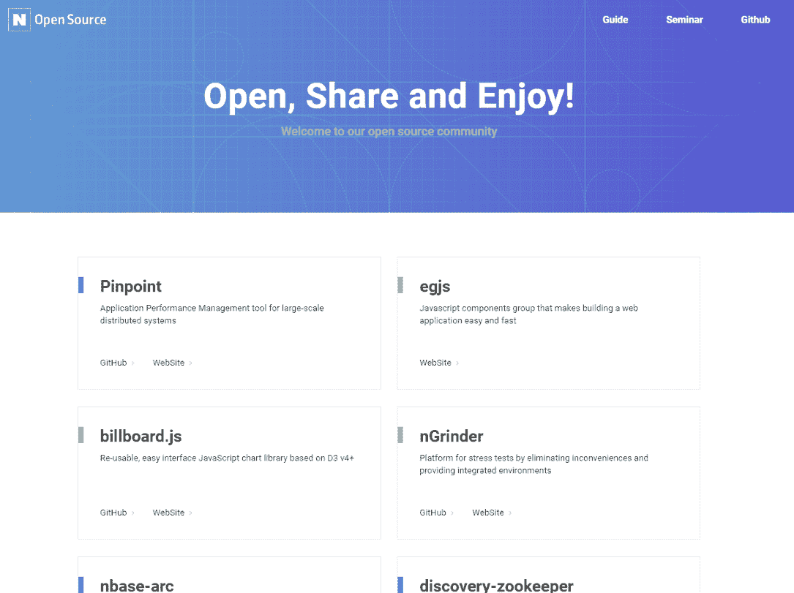

# 为什么用英语比韩语更容易分析社交媒体上关于寄生虫的讨论

> 原文：<https://towardsdatascience.com/why-its-easier-to-analyze-social-media-buzz-about-parasite-in-english-than-korean-and-how-open-9b3cd0ebff92?source=collection_archive---------60----------------------->

## 以及开源文化如何改变这种状况

由 Theo Goetemann&hyun jae Cho

> “换句话说，对于一个初学数据的科学家来说，用英语找到并使用开源库来分析围绕韩国电影《寄生虫》的基于文本的社交媒体比用韩语来分析更容易。”

**《寄生虫》不仅仅是商业上的成功，**它还是喜剧和语言上的挑战。影评人说，如果不是因为反映太平洋彼岸语义和文化的字幕质量，《寄生虫》不可能在美国大受欢迎。

图片来自[维基百科](https://en.wikipedia.org/wiki/List_of_accolades_received_by_Parasite#/media/File:Parasite_(film)_director_and_cast_in_2019.jpg)

将剧本翻译成英文字幕的美国电影评论家达西·帕凯说，翻译过程涉及许多电子邮件，甚至花了更多时间与奉俊浩和他的团队一起写作和修改。他和 Bong Joon-Ho 不得不做出艰难的翻译决定，从妙语的表达到翻译“jjapaguri”，这是 Jjapaghetti 即食黑豆面和 Neoguri 即食辣面汤的令人上瘾的组合，面向讲英语的观众。

“jjapaguri”怎么翻译成英文？Ram-don =拉面和乌冬。一个新颖挑战的巧妙解决方案。如果两位专家捕捉《寄生虫》中幽默的细微差别如此困难，想象一下，为了让算法捕捉同样的细微差别，我们还需要走多远。

图片来自 Geolee 在[istockphoto.com](https://www.istockphoto.com/photo/black-bean-sauce-noodle-gm1213217083-352494152?utm_campaign=srp_photos_noresults&utm_content=https%3A%2F%2Fwww.pexels.com%2Fsearch%2Fjjapaguri%2F&utm_medium=affiliate&utm_source=pexels&utm_term=jjapaguri)

**在数据科学和自然语言处理(NLP)中，**我们也面临着持续的[灰色选择](https://qz.com/1664575/is-data-science-legit/)；几乎没有黑色和白色。例如，在知道数据中存在潜在偏差的情况下，如何使用历史警察逮捕数据创建预测性分析？在为主题分类创建训练数据集时，您如何在短项目时间表和精确度之间取得平衡？甚至当您开始您的第一个数据科学项目时，您已经在权衡使用哪些库的利弊，并且在这个过程中，正在深入研究作者在创建库时所做的主观选择。

图片来自[克里斯蒂娜·莫里洛，佩克斯](https://www.pexels.com/photo/woman-programming-on-a-notebook-1181359/)

作为一名初学数据科学家，要充分探索这些细微差别和决策，课程和培训可能会有所帮助，但最终，它们无法取代对在线开源库海洋的单独探索。开源库是任何人都可以自由重用、修改和发布的代码库。代码的作者可以在不同的许可下发布他们的作品，这决定了他们的代码如何被重用(例如，用于商业项目)。许多这些库也是有经验的数据科学家的关键构建模块，允许他们快速原型化和构建最小可行的产品，以及作为更大、更复杂项目的基础。

使用 City78 数据放置身份快照。作者图片

**当 Hyunjae 和我第一次开始修改**[**city 78’**](https://city78.org/)**s 代码来分析韩语文本时，**我们期望构建一组模块化的脚本作为原型，并插入到我们现有的流程中。我们计划使用开源的韩国 NLP 库来分析 Naver，该平台的搜索引擎占韩国所有网络搜索的大约四分之三，利用该平台的地理定位零售和公共评论来创建社区的场所身份快照。然而，我们发现，许多开源文本分析工具(例如，情感分析、分词器)——在英语中我们认为理所当然的工具——在青少年时期以韩语开源库的形式存在，而不是我们预期的即插即用。

[Github，Naver](https://naver.github.io/) 截图

虽然像 Naver 这样的大公司在内部肯定拥有一系列令人难以置信的 NLP 资源，并且确实为开源社区、[包括 NLP 库、](https://github.com/naver/claf)做出了贡献，但这些库的可访问性和易用性对于鼓励它们在传统的非数据科学领域的实施以及学生对它们的使用至关重要。

> ***换句话说，对于一个初学数据的科学家来说，用英语找到并使用开源库来分析围绕韩国电影《寄生虫》的基于文本的社交媒体比用韩语来分析更容易。***

图片来自 [Arif Riyanto，Unsplash](https://unsplash.com/photos/G1N9kDHqBrQ)

**在我们尝试构建一个可以分析朝鲜语文本的快速原型的过程中，**我们了解到，对于许多刚刚进入朝鲜语自然语言处理领域的人来说，没有一条直接的道路。然而，随着用户生成的文本数据量继续以指数速度增长，自然语言处理技术对于理解消费者/公众/团体的观点、趋势等将至关重要。作为个人、社会和机构，我们有责任促进开源工具的发展，使学生和专业人士能够学习和创新。

本文旨在作为探讨机构和私营部门在围绕自然语言处理培养开源文化中的作用的对话起点，因为这一不断发展的学科的影响将塑造一代数据科学家、商业模式和世界各地处理文本数据的初创公司的可扩展性。

**我们希望您能加入我们的对话**，用非英语语言分享您自己的开源和 NLP 经验。