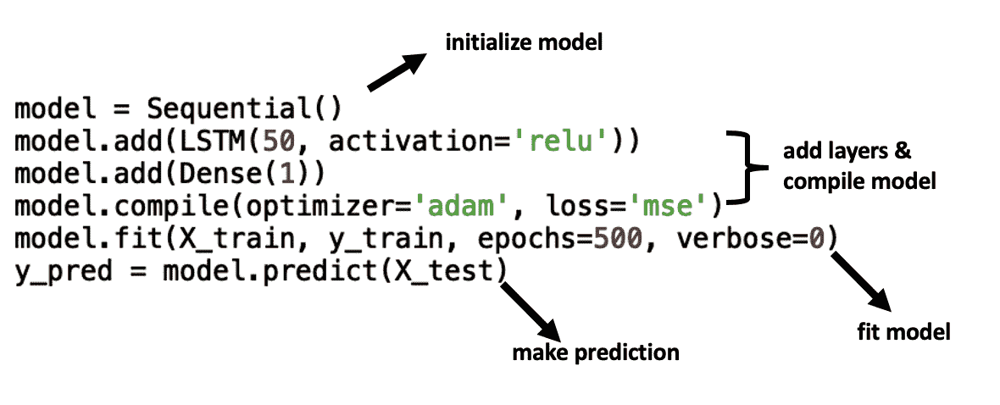

# 为什么 Keras 是领先的深度学习 API

> 原文：<https://towardsdatascience.com/why-keras-is-the-leading-deep-learning-api-31e00dfa012c?source=collection_archive---------56----------------------->

## 了解 Keras 深度学习库

塞巴斯蒂安·沃特曼在[的照片](https://www.pexels.com/photo/action-adventure-aerial-aerial-shot-312105/)

Keras 是一个开源、用户友好的深度学习库，由谷歌深度学习研究员 Francois Chollet 创建。Keras 背后的用户友好的设计原则使用户可以很容易地将代码快速转化为产品。因此，它在工业界和学术界都有许多应用。

Keras 团队的任务是让机器学习民主化。这意味着它是按照特定的标准设计的，旨在使其高效、可靠，并能为大量受众所接受。在这篇文章中，我想探索 Keras 的关键特性(正如在 [Keras 文档](https://keras.io/why_keras/)中概述的)，回答为什么 Keras 是领先的深度学习工具包的问题。特别是，我将讨论 Keras 的三个主要特性:用户友好的设计、跨多个平台的轻松部署以及可伸缩性。

**人性化设计**

Keras 为神经网络模型构建过程的几乎每个方面都提供了易于使用的模块，包括模型、层、回调、优化器和损失方法。这些易于使用的功能支持快速模型训练、健壮的模型测试、快速实验和灵活部署，以及许多其他功能。

模型 API 包含顺序模型类(限于单输入、单输出的层堆栈)、模型类(支持任意模型架构)、模型训练方法(用于拟合、编译和评估)以及模型保存方法。这些模型方法允许您轻松地使用模型参数细节(如损失函数、层、节点、优化器和激活函数)来扩充模型对象。此外，它允许您以直观和易于阅读的方式调用实例化模型对象上的 fit 和 predict 方法。

例如，通常用于图像识别的卷积神经网络可以用 12 行简单的代码进行初始化、分层、训练和测试:

另一个例子是实现 LSTM 模型，它可用于语音识别任务。该系统可以通过 6 行代码来实现这一点:

模型方法还允许您保存和重新加载模型权重，这避免了在相同数据上重复重新训练模型的耗时任务。

层方法使得层[的添加变得容易，这些层是神经网络](https://builtin.com/machine-learning/introduction-deep-learning-tensorflow-20)的构建模块。要了解这一点，以添加卷积和 LSTM 层为例，如上所示。要添加卷积层，只需在模型对象上调用“add()”方法，并传入 Conv2D 方法作为参数:

要添加一个 LSTM 层，你可以在你的模型对象上调用“add()”方法，并传入 LSTM 方法:

总的来说，layers 方法包含通常用于各种神经网络架构的密集层、LSTMs 层、用于卷积神经网络的卷积和汇集层、递归神经网络层等等。它还包含激活层、规范化层和正则化层。LSTM 层和递归层可用于建立神经网络，该网络用于涉及序列的各种预测任务。这些包括时间序列预测、语音识别、语法学习、手语翻译等等。卷积神经网络使用卷积层，因此得名。他们从事各种图像分类任务，如自动驾驶汽车中的面部识别和物体识别。激活层 API 对于激活函数的快速实验是有用的，激活函数在神经网络层中对神经元触发过程进行数学建模。根据您的使用案例和数据质量，一个激活函数可能比另一个更有用。能够快速测试几个激活功能允许您快速生成结果并更快地构建准确的模型。例如，如果您想尝试在 LSTM 图层中使用校正线性单位(“relu”)激活函数，只需在 LSTM 方法的参数中输入 activation =“relu”:

或者，您可以通过更改很少的代码来尝试使用双曲正切激活函数:

此外，标准化层有助于确保神经网络模型根据正负特征值进行训练，并且这些值对学习的影响程度相似。最后，正则化层有助于防止神经网络过拟合。

Keras 的回调方法也特别有用，它允许用户在训练期间执行各种动作。例如，ModelCheckPoint 类允许您在训练过程中保存模型权重，以防中断。您还可以使用这个类来继续您离开的地方，并进一步微调您的模型。EarylStopping 允许您在绩效指标停止改善时停止训练。如果不及早停止，您可能会在不再提高模型性能的培训中损失很多时间。如果使用正确，这些回调类可以节省数小时的训练时间和计算资源。

优化器方法允许您无缝地实现优化器，如随机梯度下降(sgd)、Adam、均方根传播算子(RMSProp)、AdaDelta 和 adagrad。对于可能不知道 sgd 和 adam 之间理论差异的新研究人员或开发人员，Keras 允许快速测试两者，从而更快地生成结果。

Keras 具有概率损失和回归损失的损失方法，这两种方法都包含易于访问的损失函数套件。假定损失函数建议神经网络的训练过程，能够用不同的损失函数运行快速实验能够实现快速模型开发。该网络包括二元交叉熵和稀疏分类交叉熵，两个流行的分类损失函数。对于回归，损失 API 包括均方误差、平均绝对误差、平均绝对百分比误差等等。在回归和分类任务的情况下，对这一套功能的容易访问使得快速原型和实验成为可能。

总的来说，易于使用的神经网络组件的 API 允许容易的实验、更快的结果、有效的研究和容易的产品部署。所有这些功能意味着 Keras 可以让您设计高度可定制的工作流程，轻松快速地从想法到产品。

**研究** **&产业**

Keras 在研究机构和行业中被广泛使用，大概是因为它的用户友好特性，可以实现高效的研究和原型制作。例如，具有最少编程和深度学习知识的研究和行业领域专家可以使用 Keras 快速构建和优化他们用例的模型。

在研究领域，CERN 和 NASA 等大型机构将 Keras 用于各种应用。CERN 通过深度学习将模式识别应用于粒子跟踪(研究单个粒子在介质中的运动)等任务，例如跟踪希格斯玻色子。CERN 还将深度学习用于一项名为 jet flavor tagging 的任务，该任务与粒子识别有关。美国宇航局将深度学习用于像系外行星发现、月球上的行星导航、智能机器人宇航员/机器人等等任务。

在纯粹的研究领域之外，Keras 也被证明在商业领域也很有用。像网飞这样的公司已经使用 Keras 建立推荐系统，根据过去的数据预测用户的偏好。对于网飞来说，这涉及到根据观众过去看过的电影和节目的数据训练一个神经网络，并随后预测用户可能喜欢哪个新节目或电影。优步还使用深度神经网络来预测骑手需求，估计接送的到达时间，寻找骑手/司机匹配，以及其他任务。此外，Uber Eats 使用基于神经网络的推荐系统向用户推荐吃饭的地方。其他公司，包括 Yelp、Instacart、Zocdoc 和 Square，也在各种应用程序中使用 Keras。

总的来说，虽然对于任何具有最低限度编程或深度学习经验的人来说，开始使用 Keras 都很简单，但 Keras 在研究和行业中的广泛采用表明，它能够实现许多强大的实际应用。

**部署在平台上**

Keras 也可以很容易地跨各种平台部署。例如，使用 Keras 构建的模型可以通过 Python 运行时部署在服务器上。像优步和网飞这样的公司使用 Node.js 来部署他们的许多深度学习产品，例如他们的推荐系统。Node.js 是一个 JavaScript 框架，对于希望使用 Keras API 进行模型开发而又不想学习新的编程语言的 JavaScript 开发人员来说特别有用。此外，Keras 模型产品可以部署在 Android、iOS、Raspberry Pi 等平台上。

Keras 在工业和研究领域的广泛采用使其成为深度学习领域的领先 API。此外，因为您可以跨多种平台部署 Keras，所以 API 非常灵活。Keras 相对平台不可知的事实意味着它可以用于各种 web 和移动应用程序。此外，Keras 的灵活性和用户友好性有助于软件应用程序开发的快速创新，特别是在数据驱动的行业。

**Keras 可扩展性**

Keras 是高度可扩展的，因为它本身支持 Tensorflow 分发策略 API。这使您可以轻松地在数千台 CPU 或 GPU 设备上运行您的模型。模型分发可以采取两种形式之一。第一个是数据并行，在多个设备上训练单个模型。第二种方法，模型并行，涉及在多个设备上训练单个模型的不同部分。Keras 支持分布式计算的数据并行性，这使得可伸缩的模型开发成为可能。可扩展的模型开发对于优化模型开发的生产率、最小化训练模型的成本、以及当单台机器上的资源稀缺时最小化人工介入或干预是至关重要的。

从产品开发的角度来看，可伸缩性对于产品的效率和质量至关重要。考虑一下网飞推荐系统的例子。随着网飞继续获得更多的付费会员，更多的人将使用该平台，这反过来增加了用于训练推荐系统的神经网络的计算负荷。随着用户数量的增长，需要存储更多的数据并用于训练神经网络模型。更多的用户意味着观看更多的电影和节目。这意味着观众偏好预测类型的数量增加，这将需要对更大的数据集进行更长的训练时间。测试也是如此。稳健测试成本高昂，可能需要大量的硬件资源。在这两种情况下，通过数据并行化进行扩展可以显著减少机器学习管道每个部分的时间和成本。

如果你正在用底层的深度学习技术创业，Keras 尤其棒，因为新业务具有最高的增长潜力。对于您的新业务，Keras 允许您通过分布式计算的本地支持来扩展计算。随着平台的不断增长，这允许您最大化模型开发的生产力，并最小化模型培训/测试的成本。

**结论**

Keras 是一个用户友好的工具包，大大降低了深度学习研究和开发的门槛。Keras 的低门槛是 Keras 团队为了使机器学习民主化而有意融入的设计原则。如果用 Keras 建立模型既不需要编程也不需要深度学习专业知识，那么来自各行各业、有不同想法和经验的人可以很容易地将深度学习应用于他们感兴趣解决的问题。Keras 在工业和研究中的广泛应用也说明了这些努力。例如，如果没有深度学习经验的化学物理学家想要将深度学习应用于化学中的一个新颖问题，他们可以很容易地学习如何使用 Keras 并开始测试想法。此外，如果一家缺乏数据科学团队的成长型零售公司试图使用消费者购买数据来预测对其产品的需求，他们可以很容易地开始使用 Keras。用户的低认知负荷、可扩展性以及易于访问和理解的功能是吸引大公司、初创企业和政府研究机构的研究团队的主要特征。我鼓励没有使用过 Keras 或者使用 Keras 的经验有限的读者了解更多关于这个库的知识，并尝试将它融入他们的工作和/或项目中。