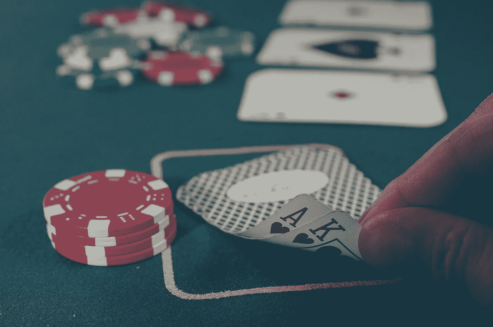
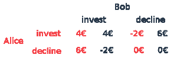

# 为什么知道未来会导致经济崩溃

> 原文：<https://towardsdatascience.com/why-knowing-the-future-would-crash-the-economy-92ba11b0768e?source=collection_archive---------32----------------------->

## 一个使用博弈论的思维实验解释了为什么我们不能知道自己的未来。

Michał Parzuchowski 的照片

T2:ame 理论是数学的一个分支，有很多应用。尤其是在经济学中，博弈论起着非常重要的作用。这就是为什么许多 T4 数学家被授予诺贝尔经济学奖的原因。一个广为人知的例子是约翰·福布斯·纳什，他的一生在电影《美丽心灵》中有所阐述。

正如“博弈论”这个名字所暗示的，这里涉及到一些种类的博弈。事实上“游戏”的定义非常宽泛。这意味着两个(或更多)完全理性的“玩家”必须做出某种决定。他们做出的决定决定了玩家的输赢。但是让我们来看一个实际的游戏。

# 让我们从简单的开始

有两个玩家，*爱丽丝和鲍勃以及一个游戏高手。*游戏工作原理如下。爱丽丝和鲍勃都可以选择要么给游戏主人 8 €，要么什么都不给。在不知道另一个玩家 **的决定的情况下，做出是否投资的决定*。***接下来，游戏管理员拿走所有投入的钱，如果 Alice 和 Bob 都什么都没给，则为 0 美元；如果 Alice 或 Bob 投入但另一个玩家拒绝，则为 8 美元；如果 Alice 和 Bob 投入并提高 50%，则为 16 美元。所有的钱，包括游戏主人的利益，在两个玩家之间平均分配。

假设两个玩家都投入了 8 美元，那么总共投入了 16 美元。游戏主持人将奖金提高了 50 %,达到 24 美元。爱丽丝和鲍勃平分这笔钱后，两人都赚了 4 美元。然而，让 Bob 和 Alice 都投资只是一种情况。也有可能是爱丽丝或者鲍勃或者两个人都拒绝了投资。在数学中，我们不喜欢只是玩这样的游戏，我们想完全理解和解决它们，所以我们永远不会再看它们。所以我们开始吧。下表列出了所有四种可能的结果，以及 Alice 和 Bob 相应的利润或损失。

Alice 和 Bob 的每项策略收益

但是坚持住。这幅插图看起来有些可疑。假设鲍勃投资。爱丽丝的最佳策略是什么？*没落！*好吧，那我们就说鲍勃谢绝了。爱丽丝现在的最佳策略是什么？*还在下降！*然而，同样对鲍勃来说，最好的策略是*永远拒绝*。

因此，在完全理性的数学世界里，鲍勃和爱丽丝不会投资任何东西，也不会赢得任何东西，尽管他们都有机会成为赢家。

有很多现实世界的场景可以用上面的游戏来部分描述。想一想学校里的一个团队项目，学生们因为害怕比别人做更多的工作而不愿意投入时间。然而，如果所有的学生都为这个项目做出贡献，他们将会从一个伟大的成果中获益。

# 再来一次！

现在，为什么我们的游戏是有趣的呢？这是爱丽丝和鲍勃的痛苦结局吗？还是在完全理性的世界里，他们有办法合作赚些钱？有，有！如果进行多轮游戏，神奇的事情就会发生。在这种情况下，可能的策略数量激增。例如，Bob 可以总是拒绝或总是投资，但是更复杂的策略也是可能的，比如每三次投资，每隔一次拒绝。因为 Bob 有很多策略可供选择，Alice 在不知道 Bob 的策略的情况下无法确定选择最佳策略。结果，出现了许多有时具有复杂模式的场景。

这个游戏要成功，最重要的要求是鲍勃和爱丽丝不知道最后一轮是什么时候。否则，我们将只剩下一轮比赛了。因为，比如说，我们打十回合，爱丽丝和鲍勃都知道。由于第一场提到的原因，他们都将在第十轮下降。因为第十轮基本上不存在，他们会在第九轮下降，等等。所以回合数必须保密。

这个游戏也发生在现实生活中。这是一个经济相互作用的理论模型，即社会市场经济中的就业市场体系，没有工作的人可以获得失业救济金。每个月一个人可以决定是否投资他们的时间。因为不知道哪一轮是最后一轮对我们的游戏很重要，在某种意义上，如果我们都知道我们的未来，我们的经济体系就会崩溃。

# 最佳解决方案

不管怎样，回到游戏本身。最佳策略的问题仍然悬而未决。存在无限数量的具有任何期望复杂性的策略。例如，策略可以是只有当当前回合数的质因数之和是 3 的幂时才投资。但是忘了那个吧。答案出奇的简单。

*   **首轮投资**
*   **在所有其他回合中，做对方在**回合之前所做的事情

为什么这是最优策略？假设鲍勃采用这种策略。如果爱丽丝总是拒绝，鲍勃只是在第一轮输了，但之后是安全的。如果爱丽丝总是投资，那么鲍勃也总是投资并赢钱。假设爱丽丝投资二十轮，然后拒绝二十轮，以此类推。Bob 的策略几乎与 Alice 的策略一致，唯一的区别是只差一轮。爱丽丝可以选择她想要的任何策略，在我们的策略下，鲍勃损失不超过 8 €，但如果爱丽丝也愿意投资，他就会赢钱。

觉得这个故事有趣？在 Medium 上关注我( [Marcel](https://medium.com/@mmsbrggr) )并查看下面的其他故事！请♡分享这篇文章吧！

[多句中的一句证明](https://medium.com/cantors-paradise/the-one-sentence-proof-in-multiple-sentences-ab2657efc576)