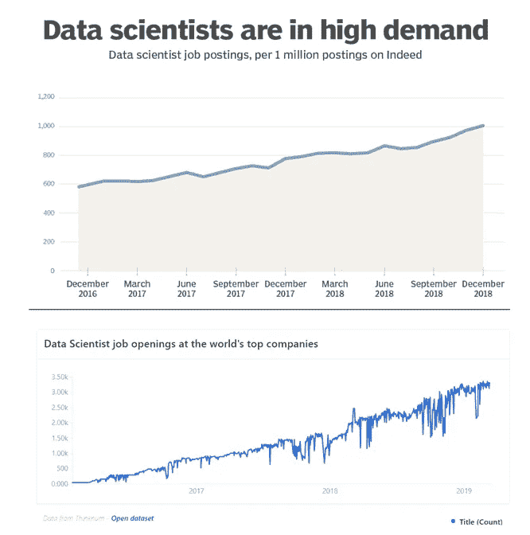
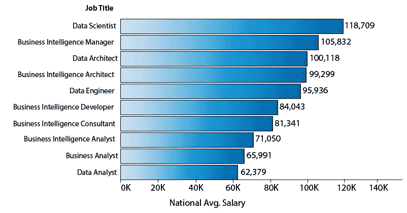
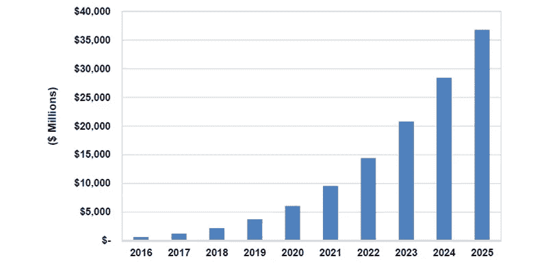
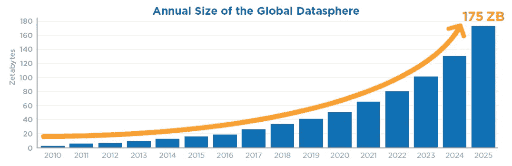
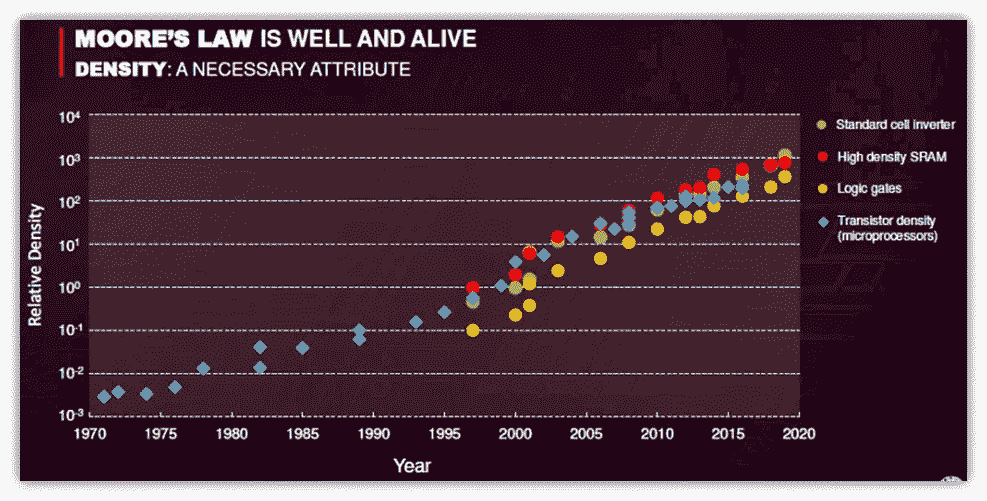
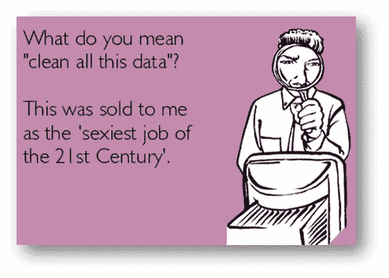

# 2020 年为什么要学数据科学？

> 原文：<https://towardsdatascience.com/why-learn-data-science-in-2020-d3f54123b2e4?source=collection_archive---------16----------------------->

## 为什么是现在？我真的能在这个领域建立事业吗？

图片来自[Unsplash.com](https://unsplash.com/)

*数据科学。大数据。机器学习。人工智能。这些都是强有力的词对。让我们看看真实的研究、数字和图像，为什么你应该考虑学习它们。*

# 为什么要学数据科学或者机器学习？

哈佛商业评论[将数据科学定义为 21 世纪最性感的工作*。全球知名求职网站 Glassdoor 将*](https://hbr.org/2012/10/data-scientist-the-sexiest-job-of-the-21st-century)*[数据科学评为 2019](https://www.glassdoor.com/List/Best-Jobs-in-America-LST_KQ0,20.htm) 美国**最佳工作。彭博将 [***数据科学家视为新的超级英雄***](https://www.bloomberg.com/news/articles/2015-06-04/help-wanted-black-belts-in-data) 。***

*数据科学家、机器学习工程师、数据工程师；所有这些头衔都有两个共同点:它们是目前最有吸引力的职业，它们都暗示着与数据打交道。*

## *-需求-*

*这些角色的需求在最近几年大幅增加，而且很可能会继续增加，如下图所示。*

**

*近年来对数据科学家的需求增加。[源顶](https://searchbusinessanalytics.techtarget.com/feature/Demand-for-data-scientists-is-booming-and-will-increase)。[源底](https://www.tecla.io/blog/the-high-demand-for-data-scientists-and-how-to-hire-for-them/)。*

*由于对这类人才的需求如此之高，在其中一个领域拥有足够知识的人可以在许多行业找到工作机会。*

****对能源市场感兴趣？*** 业内每一家知名公司都在寻找数据驱动的配置文件，以提高决策和流程效率。*

****享受顾问服务？所有的大公司(如麦肯锡、贝恩、波士顿咨询公司)都在招聘数据科学家和数据工程师来帮助他们的客户利用他们的数据。****

****想去科技公司工作？*** 谷歌、亚马逊、优步、脸书，都在寻求越来越多的数据奇才。*

## *-薪水-*

*根据 [Glassdoor](https://www.glassdoor.com/Salaries/data-scientist-salary-SRCH_KO0,14.htm) 的数据，美国数据科学家的平均工资为*117，345 美元/年，*远高于全国平均水平，如下图所示，其他相关职位也相差不远。*

**

*美国不同职位的平均工资。[来源](https://data-flair.training/blogs/why-learn-data-science/)。*

## *-这种美-*

*除了所有这些，这些工作还负责实施和构建正在彻底改变整个行业的技术，处于令人难以置信的新兴技术的核心，如自动驾驶汽车或先进的图像识别工具，这些角色将是工业和学术界许多即将到来的进步的关键驱动力。*

*人工智能市场是预期发展最快的市场之一，预计到 2025 年将达到 360 亿美元，如下图所示。*

**

*人工智能收入，世界市场。[来源](https://www.top500.org/news/market-for-artificial-intelligence-projected-to-hit-36-billion-by-2025/)。*

*所有这些进步都将对我们的社会非常有益，因此有机会在这些领域中的任何一个领域工作都意味着能够对世界和我们的生活质量产生很大的影响。有太多的事情可以而且将会用人工智能来完成，那些参与其中的人将会掌控塑造我们未来的方向盘。*

*总之，数据科学，机器学习和其他领域，是非常有前途的领域，令人兴奋，有趣，并有无尽的应用。*

*尽管有很多从业者，但这些领域缺乏合格的专业人员。如果你成为专业人士名单中的一员，你只能期待高质量和有挑战性的工作。*

*所有这些领域的需求都非常高，而且还在增长，薪酬也是一流的。*

# *好吧，但为什么这一切都发生在现在？*

*机器学习并不是一个新领域。它的起源可以追溯到上个世纪。数据科学家也以不同的名字存在了一段时间。*

***那么为什么是现在呢？为什么近年来会有这类技能的说法？有两个主要原因:***

***首先，正在生成和消耗的数据量惊人增长**。每天，越来越多的传感器收集各种数据，而我们，整天带着智能手机到处走，也是巨大的数据来源。互联网的不断成长也功不可没。*

**

*全球现有数据量的预期增长。[来源](https://www.datanami.com/2018/11/27/global-datasphere-to-hit-175-zettabytes-by-2025-idc-says/)。*

***现在产生的数据比以往任何时候都多**。如果不对这些数据进行分析或利用来为企业或组织提供价值，那么所有这些数据都是毫无用处的。它的正确处理允许更好的决策，过程自动化，洞察力发现，等等。*

*正因为如此，近年来，对能够很好地利用这些数据并最大限度地发挥其潜力的概要文件的需求急剧增长。*

***其次，可用计算能力的增加**使我们有可能构建能够高效处理所有这些数据的系统，从而在合理的时间内获得结果。*

**

*1970-2020 年**设备密度的摩尔定律图。[来源](https://www.nextplatform.com/2019/09/13/tsmc-thinks-it-can-uphold-moores-law-for-decades/)。***

*云计算、AWS、Cloudera、Microsoft Azure 等平台允许我们在世界任何地方的惊人大规模集群和机器上部署和构建智能解决方案，这也极大地促进了人工智能系统可行性的实际改善。*

# *我真的能学到足够的知识来建立自己的事业吗？*

*你当然可以。有数以百万计的在线和离线资源，在那里你可以学到在这些领域发展职业所需的任何基础知识。*

***不知道怎么编程？**不用担心，可以学习的地方有无限多，而且说实话，为了实现和构建机器学习模型，你不需要成为编程大师。*

***不懂数学或代数？**那也行！有了一些基本的代数概念，你就足以生存，然而扎实的数学背景会有所帮助。同样，如果你想学习，有大量令人惊奇的教科书和资源。概率知识也很有用，并且不难获得足够的背景知识来为自己辩护。*

***对数据科学或者机器学习一窍不通？**婴儿出生会走路吗？正如一切一样，学习这些领域是一个过程，你可以自己买书，做在线课程和程序，成为一名自学的数据科学家，或者你可以注册一个实际的学士或硕士课程。*

*每天都有越来越多的官方程序被提供，资源的数量几乎是无限的。有这么多的材料，有时很难区分好的和坏的资源，所以所有这些都必须小心谨慎。*

*这篇文章的目的不是列出好的资源或建议任何人如何学习，但是，如果你感兴趣，请随时联系我，我会尽力指导你。*

# *结束语*

*一如既往，我希望你喜欢这个职位，并且我已经说服你**至少考虑学习数据科学或机器学习。***

**如果你喜欢这篇文章，请随时在@jaimezorno* *的 Twitter 上关注我。还有，你可以看看我其他关于数据科学和机器学习的帖子* [*这里*](https://medium.com/@jaimezornoza?source=post_page---------------------------) *。好好读！**

**如果你想了解更多关于机器学习和人工智能的知识* ***请在 Medium*** *上关注我，敬请关注我的下一篇帖子！**

*在那之前，保重，享受人工智能！*

> *数据科学家(名词):根据那些知识可疑的人提供的不可靠数据进行精确猜测的人。**又见:**巫师，魔术师。*

**