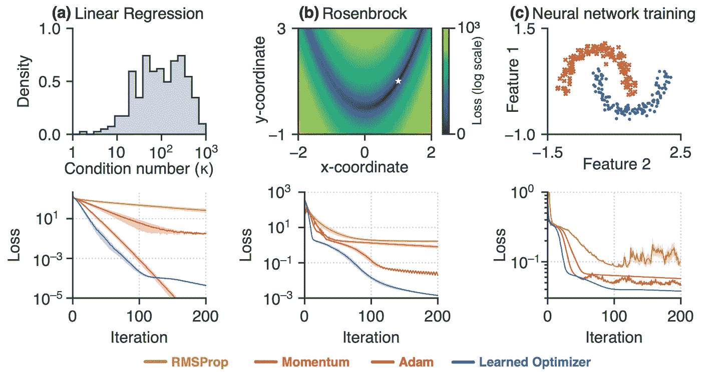
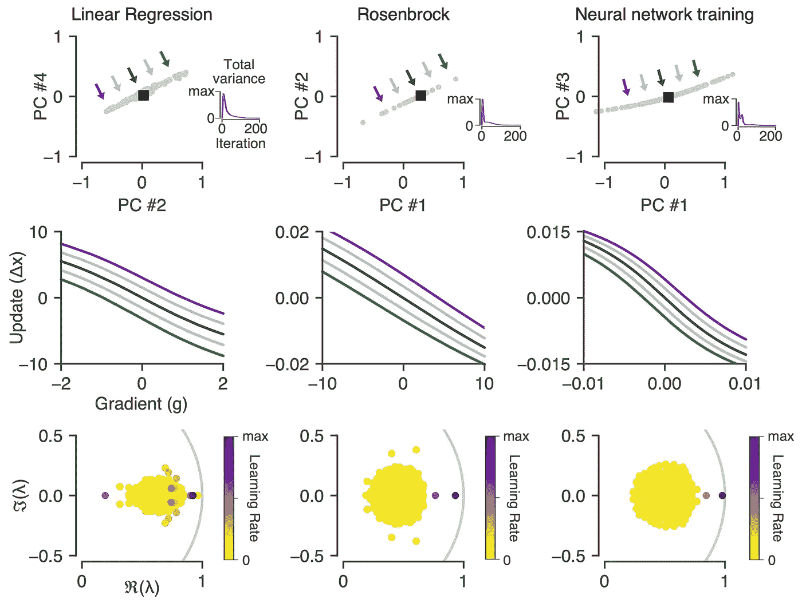
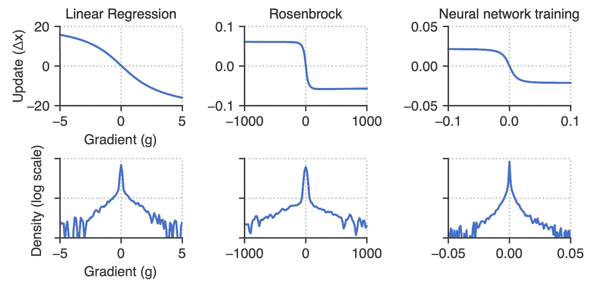
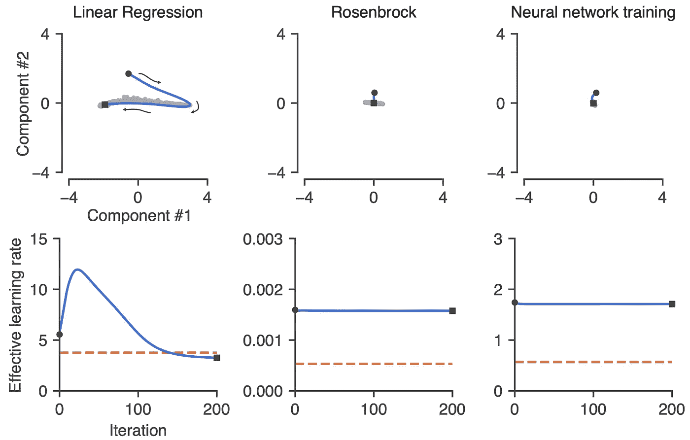
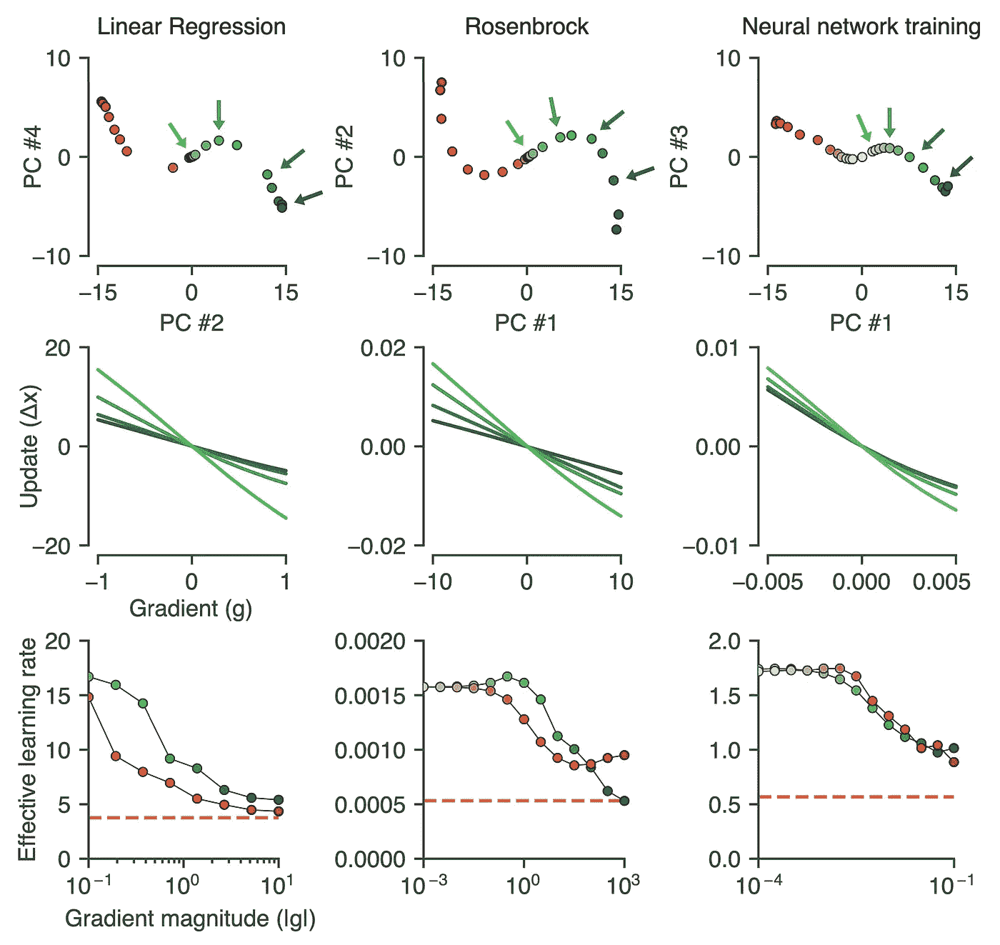

# 为什么有经验的优化者优于像 Adam 这样“手工设计”的优化者

> 原文：<https://towardsdatascience.com/why-learned-optimizers-outperform-standard-optimizers-like-adam-5f617b3035d?source=collection_archive---------32----------------------->

## 反向工程学习优化揭示了谷歌大脑已知的和新的机制

图片来自 [Pixabay](https://pixabay.com/?utm_source=link-attribution&utm_medium=referral&utm_campaign=image&utm_content=1868049) 的[像素](https://pixabay.com/users/pexels-2286921/?utm_source=link-attribution&utm_medium=referral&utm_campaign=image&utm_content=1868049)

优化器，如 momentum ( *Polyak，1964* )、AdaGrad ( *Duchi 等人，2011* )、rms prop(*tie leman&hint on，2012* )或 Adam ( *Kingma & Ba，2014* )是几乎所有机器学习的算法基础。结合损失函数，它们是使机器学习能够工作的关键部分。这些算法使用源自直觉机制和理论原则的简单更新规则，这是一种衡量预测错误程度的数学方法，并将其调整为更好。

最近的研究思路集中在基于学习的优化算法上；他们称之为习得优化。已经表明，通过直接参数化和训练任务分布的优化器，学习的优化器优于“手工设计的”优化器，如 Adam(*Andrychowicz 等人，2016；Wichrowska 等人，2017 年；吕等，2017；Bello 等人，2017；李&马利克，2016；梅斯等人，2019；2020* )。

尽管通过使用这些习得的优化器，性能得到了提高，但研究人员仍然缺乏对其工作原理的理解。研究人员强调，理解学习型优化器的底层机制可以提高鲁棒性( *Wichrowska 等人，2017；Lv 等人，2017* )、元训练( *Metz 等人，2019* )、学习型优化器的泛化( *Metz 等人，2020* )。识别它们的操作缺陷，同时加深我们对关键机器学习机制为什么有效以及如何改进它们的理解。

对于 momentum 和其他标准优化器，状态变量是低维的，因此它们的动力学很简单，描述其行为也很简单。但相比之下，有经验的优化器具有高维状态变量，因此这些系统学习复杂的非线性动力学，这对于提取有经验的优化器的行为的直观描述是具有挑战性的。

多年来，研究人员一直使用常见的优化技术来调整优化器，如动量、梯度裁剪、学习速率计划和学习速率适应等技术。这些是直观的机制，已被证明有助于最小化参数上的损失函数。

有经验的优化者只是在学习已知技术的巧妙组合吗？或者他们发现了优化文献中尚未提出的全新行为？

这个谷歌大脑研究团队试图揭示这个问题。该团队开发了用于隔离和阐明非线性、高维学习优化算法中的机制的工具。这篇名为[逆向工程学习优化器揭示了已知和新颖的机制](https://arxiv.org/abs/2011.02159)的论文目前正在接受 ICLR 2021 的审查。

研究人员在三个快速训练的任务上训练了学习过的优化器，这对于元优化来说特别重要，并且覆盖了一系列损失曲面(凸和非凸，高维和低维)。这些任务是:

*   随机线性回归问题(凸，二次)
*   最小化 Rosenbrock 函数(非凸和低维)
*   双月数据集(非凸高维)

他们将学习优化器的性能与调优的基线优化器 RMSProp、Momentum 和 Adam 进行比较。

在三个不同的任务上，有经验的优化者优于调整良好的基线。上排:任务示意图。底部一行:优化器性能。[ [来源](https://arxiv.org/pdf/2011.02159.pdf)

损失曲线中显示的优化器性能是 128 个随机种子的平均值、标准偏差误差。有经验的优化器在所有三个任务上都优于三个调优的优化器。

## 动力

在实验中，每个优化器收敛到动态的单个全局不动点。作者发现，有经验的优化者使用近似线性动力学来实现动量。当他们分析表现最好的学习优化器时，有一个在线性回归任务上的学习优化器表现稍差，但非常类似于经典动量。它恢复了特定任务分配的最佳动量参数。

有学问的优化者的动力。顶行:优化器状态在收敛点周围的投影。中间一行:沿着动力学的慢模式的更新函数的可视化。底行:在复平面中绘制的收敛固定点处的线性化优化器动态特性的特征值。[ [来源](https://arxiv.org/pdf/2011.02159.pdf)

## 渐变剪辑

随着梯度幅度的增加，学习优化器也使用饱和更新函数；这类似于渐变剪辑的一种柔和形式。事实上，削波效应的强度是与训练任务相适应的。例如，在线性回归问题中，学习的优化器主要停留在更新函数的线性区域内。相比之下，对于 Rosenbrock 问题，学习优化器利用更新函数中更饱和的部分。

学习优化器中的梯度削波。顶行:在初始状态计算的更新函数对于大的梯度幅度饱和。这种效果类似于渐变剪辑。底行:每个任务遇到的梯度的经验密度。[ [来源](https://arxiv.org/pdf/2011.02159.pdf)

## 学习费率表

随着优化的进行，我们经常调整学习率调度器来衰减学习率。作者发现，有经验的优化器可以使用自主动态实现调度器。当系统松弛到固定点时，它将特定的轨迹编码为迭代的函数。从下图中可以看出，在线性回归实验中，学习优化器最初会在 25 次迭代后提高学习率，然后线性衰减。

自主动力学调节的学习速率表。顶行:响应于零梯度(无输入)的已学习优化器的动态的低维投影。这些自主动态允许系统学习学习率时间表。底行:有效学习率是顶行中自主轨迹期间迭代的函数。[ [来源](https://arxiv.org/pdf/2011.02159.pdf)

## 学习速率适应

学习率自适应的目的是在遇到大梯度时降低优化器的学习率。这是通过根据当前梯度改变系统中的固定点来实现的。作者发现这些点在所有任务中形成一条 S 曲线；曲线的一个臂对应于负梯度，而另一个臂对应于正梯度。更新函数的斜率类似于 RMSProp 状态变化时观察到的变化。这允许优化器对于较小的梯度幅度增加其学习速率。

学习优化器中的学习速率适应。顶行:为不同梯度计算的动力学的近似固定点揭示了 S 曲线结构。中间一行:更新沿 S 曲线不同点计算的函数。底行:显示沿 S 曲线每条臂的有效学习率的汇总图。【[来源](https://arxiv.org/pdf/2011.02159.pdf)

# 摘要

人们对有经验的优化者如何工作知之甚少。在这项工作中，提出的分析表明，学习优化能够学习几个有趣的优化现象；这些是常用的直观优化机制。理解学习型优化器是如何工作的，可以让我们在一个环境中训练学习型优化器，并且知道何时以及如何将它们应用到新的问题中。我们可以使用从更普遍的学习优化器和元学习算法的高维非线性动力学中提取洞察力。

 [## 利用脑-机接口和机器学习改进青光眼评估

### 我的研究使用多任务学习来提供快速的护理点诊断，以检测周边视觉损失

towardsdatascience.com](/improve-glaucoma-assessment-with-brain-computer-interface-and-machine-learning-6c3b774494f8)  [## 人工智能和神经科学之间的迷人关系

### 他们如何相互激励、共同进步、相互受益

towardsdatascience.com](/the-fascinating-relationship-between-ai-and-neuroscience-89189218bb05) 