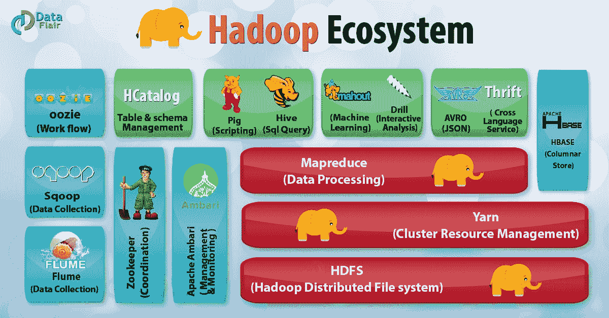

# 为什么学习 Java 是未来大数据开发人员的起点

> 原文：<https://towardsdatascience.com/why-learning-java-is-a-starting-point-for-big-data-developers-of-the-future-9a9b6d240dea?source=collection_archive---------18----------------------->

## Java 是大数据科学家和开发者的好朋友。在这里，我要告诉你为什么会这样

弗兰基·查马基在 Unsplash 上的照片

考虑到过去 2-4 年大数据令人印象深刻的增长速度，很明显，数据科学的这一子集将主导未来的技术。在这篇文章中，我决定仔细看看大数据项目中广泛使用的技术。

在处理大数据项目时，Java 是一种领先的语言。下面是一个初学者学习 Java 来处理复杂的 BD 任务的原因和方法。

# 关于大数据目标的几句话

在讨论 Java 对未来大数据的影响之前，让我们来看看数据科学家在未来 3-5 年内将关注什么类型的项目。以下是我个人对大数据在不久的将来将会成熟的看法。

# 1.它将与分析融合

现在，企业可以收集每一个用户的万亿字节数据，跟踪现场行为、交流偏好和其他相关指标，公司比以往任何时候都更受鼓励投资分析。

举个例子，Gartner 预测，如果企业所有者在年底前不投资于报告工具，到 2021 年底，该公司将不再具有竞争力。

采用大数据算法将提高分析的精确度，并让企业主对品牌声誉和客户关系有更全面的了解。决策树、线性回归和其他可视化和预测方法的引入将帮助企业主预测客户需求，并提高品牌互动的质量。

# 2.大数据将有助于应对气候变化

虽然气候变化的影响是真实的，但科学家们对人类在未来 20 年将面临的最直接的威胁缺乏了解。大数据是研究界整合工作并通过一系列可靠的实时洞察保持联系的一种方式。

不用说，大数据工具处理大型数据集的能力将提高近似值的精确度以及人们基于这些见解制定应急计划的效率。

# 3.数据云的影响将会增长，但不会占据主导地位

[据统计](https://hostingtribunal.com/blog/cloud-computing-statistics/#gref)，预计到 2021 年底，全球云计算市场价值将超过 6230 亿美元。现在，越来越多的公司正在从内部解决方案转向云。

话虽如此，完全迁移到云是一个复杂的过程，更不用说信任拥有庞大数据集的在线第三方供应商所带来的安全问题了。

在大数据环境中，混合环境是一种常见的解决方案，云工具用于托管动态数据集，本地存储用于跟踪静态数据集。

# 为什么 Java 仍然是大数据项目的最佳选择？

如果你是一名考虑从事大数据职业的软件开发人员，学习 Java 应该是你的起点。让我们看看为什么说“Java 是大数据”并不夸张。

# 1.面向 Java 的大数据工具是可访问的

在考虑大数据实施时，大多数企业主都在寻找尽可能最便宜的技术组合。由于大数据中使用的大多数 Java 工具(Hadoop、Spark、Mahout)都是开源的，所以这样的技术栈是免费的，并且高度灵活。因此，大多数寻找大数据工程师的员工会关注 Java 熟练程度和使用该语言的工具的工作知识。

# 2.Java 是类型安全的

几乎所有的数据科学家都会确认，当要处理的信息非常庞大时，能够理解您在项目中处理的数据类型是至关重要的。作为一种类型安全的语言，Java 是相当一部分开发人员和企业所有者的首选，因为类型安全允许在单元测试上花费更少的时间，并且便于代码库维护。

# 3.Java 是可伸缩的

大数据专业人士从事的大多数项目都雄心勃勃，设计时都考虑了扩大规模。由于其健壮性、广泛的工具包、巨大的社区和跨平台兼容性，Java 在可扩展性方面是其他语言无法比拟的，非常适合设计复杂的大数据基础架构。

# 4.广泛的内置特性(更不用说库和框架了)

如果说大多数其他语言才刚刚开始认识到机器学习和数据科学的重要性，那么 Java 是第一个跟上潮流的语言。因此，与大多数替代方案相比，它拥有更多用于 DS 项目的工具，仅举几例:

*   [Weka](https://www.cs.waikato.ac.nz/ml/weka/)
*   [深度学习 4j](https://deeplearning4j.org/)
*   [Java-ML](http://java-ml.sourceforge.net/)
*   [MLib](https://spark.apache.org/mllib/)

除了库，这种语言在每个新版本中都变得更适合数据科学。比方说，Java 8 的 Lambdas 有助于使代码简明扼要，第九版重新引入了 REPL，使迭代开发更快、更有效。

无论你喜欢 Hadoop 还是 Spark，了解 Java 对于精通这两个平台都是至关重要的。为了充分利用 BD 工具，开发人员经常需要在源代码中添加新的特性——这就是 Java 知识至关重要的地方。

# 回顾大数据项目的 5 大 Java 工具

在解释了企业主从选择 Java 进行大数据项目中获得的好处，以及为什么开发人员应该以确保 Java 熟练程度作为数据科学职业生涯的起点之后，让我们来看看在大数据项目中使用最广泛的 Java 工具。

# 1.Apache Hadoop

通过 Data-flair.training 了解 Hadoop 生态系统及其组件

Hadoop 是大多数企业主的首选大数据处理技术，有几十个库和工具专门用于整理和存储大型数据集。尽管它很受欢迎，但在人才经理中，Hadoop 开发职位空缺被认为是最难填补的，因为大多数开发人员对 MapReduce 缺乏深入的了解。

尽管 Hadoop 是最复杂的技术之一，但精通它的收获绝对值得付出。据统计，Hadoop 开发人员的平均年薪是 103，000 美元。

# 2.火花

Spark 是一种常见的 Hadoop 替代方案，由于其高速度、灵活性和平滑的学习曲线，对开发人员很有吸引力。通常，对于大规模 SQL 项目、数据流和机器学习任务，Spark 比 Hadoop 更受青睐。

值得一提的是，Spark 并不完全是用 Java 编写的，而是用 Scala 编写的——然而，两种语言的接口是相似的(作为一名熟练的 Java 开发人员，你不需要花很多时间来掌握 Scala 的诀窍)。

至于工作机会，Spark 是一项需要掌握的有利可图的技术，因为一些技术领域的知名人士正在寻找该领域的专业人士——脸书、微软、苹果或 IBM。

# 3.象夫

来自[鲍曼国家图书馆](https://ru.bmstu.wiki/index.php?title=Apache_Mahout&mobileaction=toggle_view_desktop)维基

由于大数据项目与机器学习紧密交织在一起，大数据开发人员经常与 Mahout 相遇，Mahout 是一个基于 Java 的开源 ML 工具库。由于其可伸缩性和大型数据处理工具集，Mahout 获得了大量的追随者。

通常，开发人员在了解 Hadoop 的功能后开始学习 Apache Mahout，这是有意义的(该库的基础设施中有相当一部分是由重新设计的 Hadoop 代码组成的)。

# 4.暴风雨

与 Hadoop 或 Spark 相比，Apache Storm 是一个较窄的大数据工具集，主要专注于实现实时分布式数据流。该平台配备了处理高容量和速度数据的功能，因其高可扩展性和容错能力而多次受到称赞。

除此之外，Storm 与大多数流行的排队和数据库系统的兼容性使得学习如何使用该平台成为大数据开发新手的必备技能。

# 5.深度学习 4j

Deeplearning4j 是神经网络开发人员所信赖的基于 Java 的工具。这个平台在很多方面都做得很好，从易用性到文档质量。Deeplearning4j 是可扩展的——你可以将其与 Apache Spark 集成，或者在 GPU 上运行该平台。该工具还支持微服务项目——它是少数几个拥有强大微服务基础设施的平台之一。

# 学习面向大数据的 Java 的资源列表

如果你打算在大数据领域发展事业，精通 Java 是必不可少的。然而，由于周围有如此多的语言学习资源，开发者常常很难区分好的和坏的。

下面是我多年来为我的学生整理的资源清单——在我看来，这些都是你从一个 Java 新手到专业人士所需要的工具。

# 编码游戏和课程:

## 1. [Codegym](https://codegym.cc/)

Codegym 是一个面向初级和高级 Java 学习者的游戏化平台。使用游戏化和实际任务来解释语言的核心概念，这个工具是你从第一天开始编码的方式。我的学生们一再称赞这个平台，说它提高了知识的保持力，并让他们清楚地知道他们所学的概念在工作中是如何有用的。

## 2.[代号战斗](https://codecombat.com/)

尽管 Code Combat 并没有给编程学习者提供一个坚实的理论框架，但是这个工具非常适合使用你的技能来完成现实生活中的任务。结合高质量的图形和智能情节，代码战斗是一个令人愉快的 RPG 游戏，你不会介意与你共度周末。

## 3.[编码游戏](https://www.codingame.com/)

作为一名数据科学家和程序员，需要协作和团队精神。如果你对在办公室与同事协调感到焦虑，看看《编码游戏》。该产品背后的想法既简单又雄心勃勃——团结来自世界各地的开发者一起打造一款游戏。

当谈到向最好的 Java 开发人员学习并得到顶级员工的注意时，CodingGame 是一个不错的资源。

## 4.[机器代码](https://robocode.sourceforge.io/)

乍看之下，这款复古风格的游戏似乎很基础——然而，这场机器人大战并不仅仅是它展示的那样。就个人而言，我喜欢这个平台，正是因为它是如此的原始和简单。除了享受机器人战斗，你还可以加入硬核挑战，并通过专门的论坛与其他开发者聊天。

## 在线课程

*   [LinkedIn 学习 Java 教程](https://www.linkedin.com/learning/topics/java)
*   [Java 深度](https://www.udemy.com/course/java-in-depth-become-a-complete-java-engineer/)
*   [Udemy 上完整的 Java 大师班](https://www.udemy.com/course/the-complete-java-9-masterclass-beginner-to-expert/)
*   [Java 程序初学者 250 步](https://courses.in28minutes.com/p/java-tutorial-for-beginner-in-250-steps)。

**学习大数据 Java:**

*   [Hadoop 的终极实践](https://www.udemy.com/course/the-ultimate-hands-on-hadoop-tame-your-big-data/)
*   [Hadoop 的构建模块](http://pramodgampa.blogspot.com/2013/06/the-building-blocks-of-hadoop.html)
*   [面向绝对初学者的大数据和 Hadoop](https://www.udemy.com/course/hadoop-and-big-data-for-absolute-beginners/)
*   [Hadoop MapReduce 深入探讨](https://www.udemy.com/course/hadoop-mapreduce-in-depth-a-real-time-course-on-mapreduce/)
*   [Hadoop 平台和应用框架](https://www.coursera.org/learn/hadoop)

# 书

**学习 Java 基础知识**

*   [Head-First Java:一个对大脑友好的指南](https://www.amazon.com/Head-First-Java-Brain-Friendly-Guide-ebook/dp/B009KCUX3S)
*   [核心 Java 第一卷—基础知识](https://www.amazon.com/Core-Java-I-Fundamentals-11th-Horstmann/dp/0135166306)
*   [Java —完整参考](https://www.amazon.com/Java-Complete-Reference-Herbert-Schildt/dp/0071808558)
*   [用 Java 思考](https://www.amazon.com/Thinking-Java-4th-Bruce-Eckel/dp/0131872486)
*   [有效 Java](https://www.amazon.com/Effective-Java-Joshua-Bloch/dp/0134685997)

**学习大数据 Java:**

*   [编程配置单元](https://www.amazon.com/Programming-Hive-Warehouse-Language-Hadoop/dp/1449319335)
*   [实践中的 Hadoop](https://www.manning.com/books/hadoop-in-practice)
*   [学习火花:快如闪电的大数据分析](https://www.amazon.com/Learning-Spark-Lightning-Fast-Data-Analysis/dp/1449358624)
*   [掌握阿帕奇风暴](http://shop.oreilly.com/product/9781787125636.do)

# 论坛和社交媒体

*   [r/java](https://www.reddit.com/r/java/)
*   [堆栈溢出 Java 论坛](https://stackoverflow.com/questions/5564701/java-blog-and-forum-implementation)
*   [r/learnprogramming](https://www.reddit.com/r/learnprogramming/)
*   [甲骨文 Java 论坛](https://www.oracle.com/technetwork/java/community/index.html)

**为大数据学习 Java**:

*   [r/datascience](https://www.reddit.com/r/datascience/)
*   [r/hadoop](https://www.dezyre.com/article/r-hadoop-a-perfect-match-for-big-data/292)
*   [r/bigdata](https://www.reddit.com/r/bigdata/)
*   [r/Apache spak](https://www.reddit.com/r/apachespark/)

# 结论

就我个人而言，Java 和大数据总是结合在一起的。虽然我也承认 Python 的潜力，但根据我的经验，一个成功的数据科学家不应该选择其中一种——相反，你应该学习如何处理两种语言，并利用它们各自的优势。

由于 Java 是网上教得最好的语言之一，我相信，只要有足够的决心和对基本编程概念的理解，你就能很好地将它的工具用于 DS 项目。

希望我上面链接的资源将是一个很好的起点，为初学者的旅程提供燃料。祝您好运，发现 Java 的全部潜力，并在您的项目中使用该语言。