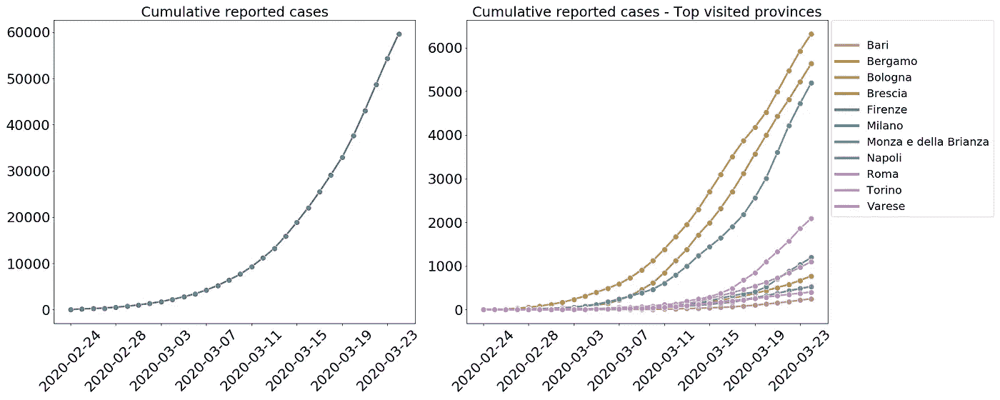
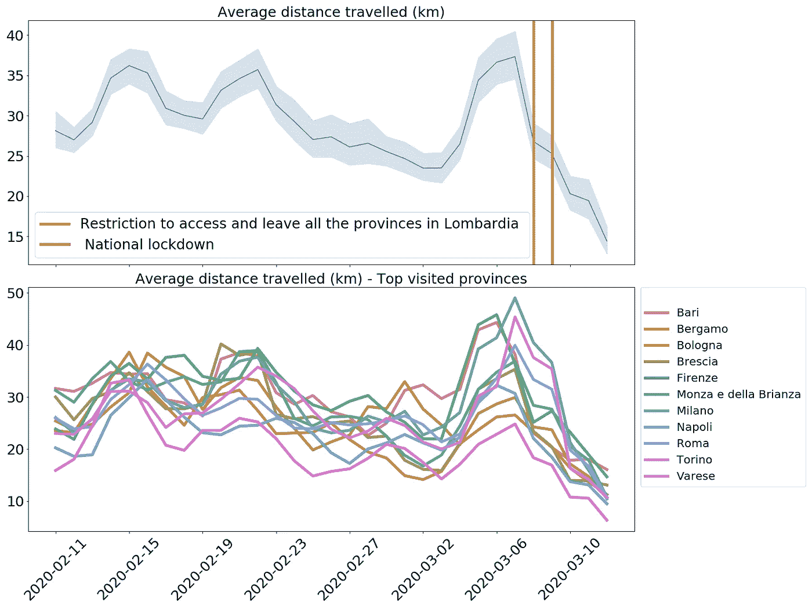
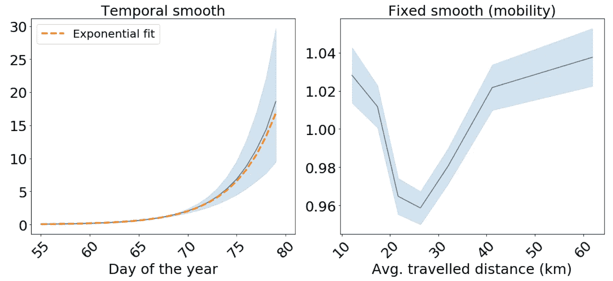

# 为什么封锁很重要:探索意大利的人口流动数据

> 原文：<https://towardsdatascience.com/why-lockdown-matters-exploring-human-mobility-data-in-italy-8f60db04c022?source=collection_archive---------28----------------------->

## 关于新冠肺炎在义大利的传播，人口流动数据告诉了我们什么

2019 年底在中国武汉市出现的新型新型冠状病毒冠状病毒继续跨境传播。该流行病是近年来最大的健康危机之一，其后果仍不可预测，已蔓延到 160 多个国家，确诊病例近 500，000 例，死亡人数超过 22，000 人(截至 3 月 26 日)。这场流行病的规模是我们这个相互关联的社会近年来面临的最大挑战之一。

# 新冠肺炎教在意大利的传播

意大利一直是世界上受影响最严重的国家之一，自伦巴第省 Codogno 发现首例病例以来，报告病例呈指数增长。我们可以使用来自[意大利民事保护局](http://www.protezionecivile.gov.it/)的[数据](https://github.com/pcm-dpc/COVID-19)在下图中清楚地看到这一点。

图片来源:CARTO。来源:[意大利民事保护局](http://www.protezionecivile.gov.it/)。

尽管对这种病毒仍知之甚少，但很明显，中国实施的封锁政策减缓了传播速度，避免了卫生系统的崩溃。自 3 月 19 日以来，中国的新增病例已连续五天降至零。

封锁政策之所以有效，是因为它们限制了人类的流动性，而人类的流动性被认为是最重要的病毒盟友，因为潜伏期很长([潜伏期中值](https://www.ncbi.nlm.nih.gov/pubmed/32150748)估计约为 5 天)，并且可能有很大比例的[无症状](https://cmmid.github.io/topics/covid19/severity/global_cfr_estimates.html)病例(但仍非常不确定)。政府如何面对这一巨大挑战？意大利和随后其他国家采取的第一步是减少大部分人口的流动性。

# 使用人员移动数据进行分析

在本帖中，我们使用了来自我们的合作伙伴 [Unacast](http://www.unacast.com/) 的人员流动数据，分析了意大利疫情爆发前几周报告病例与旅行距离之间的关系。

查看数据，我们可以看到各省的平均行驶距离在 2 月 23 日开始下降。这与观察到当地疫情的所有城市实施第一批限制性措施的时间相关，包括关闭学校，伦巴第和威尼托暂停公共活动，以及建议远程工作。

图片来源:CARTO。来源:[未发布](http://www.unacast.com/)。

类似地，我们可以看到在封锁前平均行驶距离的增加，这是预料之中的，但直到 3 月 8 日才正式宣布，然后随着限制的实施，平均行驶距离急剧下降。

分析人群在流行病期间如何流动至关重要，这不仅是政府审查封锁政策有效性的监测工具，也是研究人类流动性和病毒传播之间关系的工具。

# 使用时空模型

接下来，使用 Unacast 提供的各省的平均旅行距离 *i* 和一年中的某一天 *t* ，d *ij，*以及各省的 it*报告案例，我们可以拟合贝叶斯时空模型来表征它们之间的关系。*

实现这样一个模型需要一些假设。首先，我们将假设这种关系不是瞬时的，因为潜伏期和测试的延迟。由于世卫组织[在疫情开始时估计中国的中位报告延迟为 12 天，因此 *t* 日的报告病例数将与 12 天的滞后平均传播距离相关。此外，由于我们在此的目的是估计滞后流动性和报告病例之间的关系，而不是做出预测，我们将重点关注截至 2 月 19 日的期间(滞后流动性数据为 2 月 7 日，就在完全封锁之前)。](https://www.who.int/docs/default-source/coronaviruse/whochina-joint-mission-on-covid-19-final-report.pdf)

此外，我们需要考虑重要的人口统计学混杂因素:鉴于意大利政府实施的检测有限，在报告的病例中很可能存在年龄相关的偏倚。事实上，检测主要限于患有中度至重度症状的人，这些症状在某些年龄段发病率较高。为了估计各省的预期病例数，我们假设按年龄层划分的发病率与中国报告的发病率相同

其中 p *ij* 是从[意大利国家统计局](https://www.istat.it/)获得的 *i* 省的[人口](http://dati.istat.it/Index.aspx?DataSetCode=DCIS_POPRES1)和年龄层 *j* 。观察到的计数被假定为有条件独立(零膨胀)的泊松变量，均值为 E*I*exp*E*(η*it*)，对数相对风险采用贝萨格、约克和莫利( [BYM](https://link.springer.com/article/10.1007/BF00116466) )模型对空间分量和时间相关性的非参数趋势进行建模

在哪里

*   μ是总截距
*   *f* 是一个平滑函数，用于测量特定区域滞后迁移协变量的任何可能的非线性效应，假设在系数之前进行 2 阶随机游走
*   *v* 是代表非结构化随机效应的零均值高斯(区域 ii 的 IID 项)，而 *u* 是表示附近区域相似的空间分量，由一阶固有高斯马尔可夫随机场模型给出( [Rue and Held，2005，第 3 章](https://www.crcpress.com/Gaussian-Markov-Random-Fields-Theory-and-Applications/Rue-Held/p/book/9781584884323))。在这里，根据 [Simpson 等人(2017)](https://repository.kaust.edu.sa/bitstream/handle/10754/623413/euclid.ss.1491465621.pdf?sequence=1) ，我们使用了 BYM 模型的不同参数化，这使得参数可解释，并有助于分配有意义的惩罚复杂性(PC)先验
*   γ *t* 表示由 2 阶先验随机游走定义的时间平滑结构效应，ϕ *t* 是一年中某一天的 IID 项 *t*

使用集成嵌套拉普拉斯近似(INLA)及其相关 R 包 [R-INLA](http://www.r-inla.org/) 拟合模型。

如果我们观察时间平滑对时间的依赖性，我们可以看到类似指数的依赖性，通过将指数关系拟合到平滑平均值来证实。另一方面，如果我们观察流动性平滑，我们可以看到，对于 25 km 以上的平均行驶距离，行驶距离和对数风险之间存在正相关关系。相反，对于较小的旅行距离，对数风险和人类流动性的相关性是负的，这可能表明与人类流动性无关的其他因素，如当地公共卫生反应，可能作为隐藏的混杂因素发挥作用。

图片来源:CARTO

最后，我们可以绘制(平均)估计风险的动画地图

图片来源:CARTO

# 主要发现

利用最新的流动性数据，我们已经展示了人类流动性可能如何影响传染病的传播，例如新新型冠状病毒病毒。虽然这一初步分析的目的不是预测未来的病例数量，但它表明，人类的流动性与疾病的传播有关，最近的流动性模式应纳入任何用于预测疫情演变的流行病学模型。

# 你在回应或分析新冠肺炎的影响吗？CARTO 是来帮忙的

我们全力支持我们的社会，用我们的技术和服务战胜这场危机。我们已经组建了一个由空间数据科学家和工程师组成的专门团队，随时准备与公共和私营部门组织合作，抗击冠状病毒的爆发。位置情报不仅在了解新冠肺炎如何在我们的领土和社会群体中传播，而且在定义和执行响应运动以更好地管理卫生基础设施、确保更快的响应以保护我们最脆弱的公民以及改进社会距离政策的执行和遵循方面发挥着重要作用。

我们还积极地[与地方和国家管理部门合作，开发用于自我诊断和数据收集的网络和移动应用](https://carto.com/blog/carto-develops-app-against-coronavirus/),以减轻已经饱和的应急通信方法的压力，并给出明确的行动建议。

最后，我们正在通过我们的[资助项目](https://carto.com/grants/)，向调查冠状病毒爆发的公共和私营部门组织提供其平台。

*本文原载于* [*CARTO 博客*](https://carto.com/blog/) 。