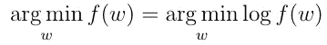

# 为什么对数在机器学习中如此重要

> 原文：<https://towardsdatascience.com/why-logarithms-are-so-important-in-machine-learning-6d2ff7930c8e?source=collection_archive---------10----------------------->

蒂姆·福斯特在 [Unsplash](https://unsplash.com?utm_source=medium&utm_medium=referral) 上的照片

如果你住在一栋大楼的第 10 层，你是走楼梯还是乘电梯？

这两种情况的目标是一样的:在漫长的一天工作后，你想回到你的公寓。

当然，如果你是一个忙碌的人，没有时间去健身房，想把楼梯作为有氧运动的简化版，走楼梯会更好。但是，除此之外，你更有可能乘电梯。

我们再举一个例子。

假设你正试图去你的工作场所。不堵车的时候，开车 10 分钟，走路 50 分钟。

你可以选择开车或走路。你仍然会到达同一个目的地，但你想节省时间。你每个工作日都去工作，而不是一生中只去一次。因此，你可能需要定期就此做出决定。

你希望能够更快地去上班，这样你就可以有更多的时间和家人朋友在一起。你想开始那个副业。阅读你在当地书店买的书。观看你一直想要的讲座。

你不想花那么多时间去同一个目的地，而是想坐汽车或公共汽车去那里。这样，你就有更多的时间去做其他的事情。

# 使用对数的好处的例子

**使用对数也是一样:**你需要找到使损失函数最小化的参数，这是你在机器学习中试图解决的主要问题之一。

假设您的函数如下所示:

如果我们找到它的一阶导数，我们最终会得到下面的表达式:

有时，我们甚至需要找到二阶导数，因为我们需要知道函数是否是凸的。当一个函数是凸的，我们知道它只有一个极小值，所以每个局部极小值实际上都是全局极小值。

在我们的表达式中，我们将有以下内容:

如你所见，它变得相当杂乱，对吗？

而且，很繁琐。

同一函数的对数的一阶导数要简单得多:

二阶导数也更简单:

当你实际使用对数时，你不会得到相同的函数。

你不需要在走路和开车时走同一条路线。你有与行人分开的车道。但你实际上并不在乎。

这并不是说你对所有的兼职商店都很关心。你已经在家里吃了一点小吃，想直接去你的工作场所，这意味着他们无论如何都不重要。

你想最小化某些参数的损失函数。你需要最小化损失函数的参数。这正是一个函数和该函数的对数的共同之处:使损失函数最小化的相同参数。

你对这个函数和它的对数求导，就可以得到损失函数的最小值。

# 数学证明

让我们证明最小化一个函数的参数等于最小化那个函数的对数的参数。

让我们假设一个点 ***w**** 是 g(w) = log f(w)的局部极小值，这意味着在 ***w**** 的一个近邻中的任何参数 ***w*** 我们都有 g(w*)≤ g(w)。现在，既然 ***e*** 也通常表示为 ***exp*** 保留了单调性，我们就有:

换句话说， ***w**** 也是函数 f 的最小值，这是我们想要证明的。

这意味着当我们将对数应用于任何函数时，我们保留最小值或最大值(即，使函数最小化或最大化的参数，但不是函数的实际值)。

我们还需要证明取对数并不能消除函数的极小值，但我们在这里跳过了这一点。

正如我们在上面的例子中看到的，这导致了更简单的计算和更好的稳定性。

如果你对此理解有困难，那么我们用一些情节来说明这一点。

让我们以下面的函数为例:

其图表的一部分如下所示:

它的对数是:

其图表的一部分如下所示:

正如你所看到的，在这两种情况下，当 x = 0.3 时，我们得到了函数的最大值。

是的，我们没有得到相同的函数，但我们仍然有相同的临界点，帮助我们最小化损失函数。

仅这一点在训练机器学习模型时就非常有帮助。

***跟我上*** [***推特***](https://www.twitter.com/fatosmorina/)