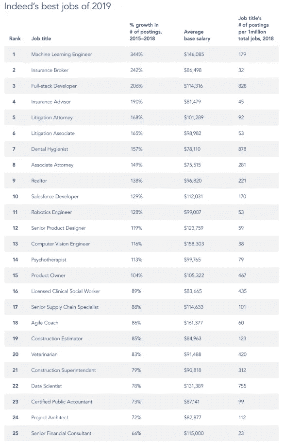
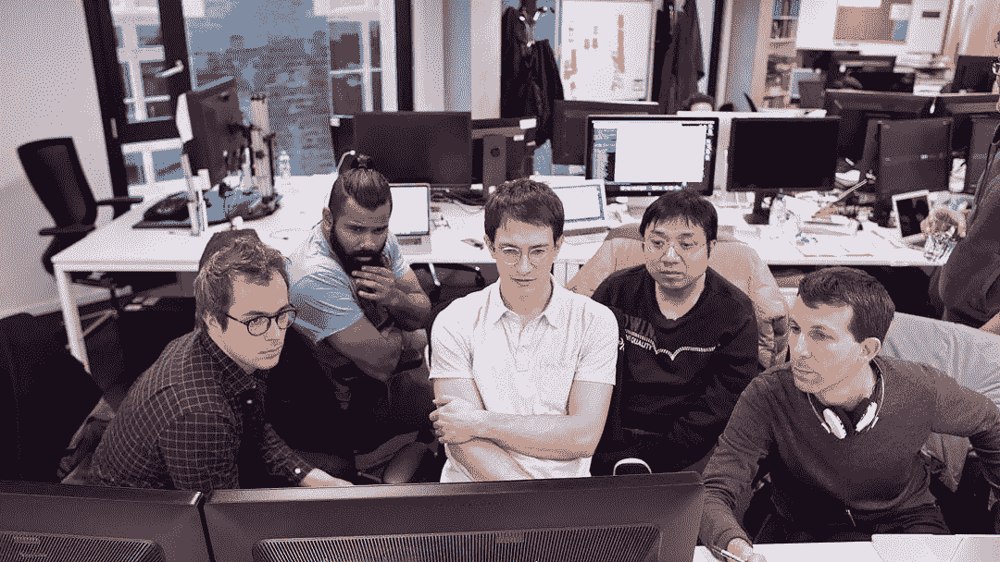

# 为什么机器学习工程师(或数据科学家)不是这场秀的主角

> 原文：<https://towardsdatascience.com/why-machine-learning-engineers-or-data-scientists-are-not-the-stars-of-the-show-d91ec9c5256b?source=collection_archive---------36----------------------->

朱利叶斯·德罗斯特在 [Unsplash](https://unsplash.com/s/photos/magic?utm_source=unsplash&utm_medium=referral&utm_content=creditCopyText) 上的照片

## 意见

## 但仍然是任何成功员工不可或缺的组成部分

T 他的文章并不是对所有机器学习工程师或数据科学家的攻击。我是一名人工智能/计算机视觉工程师，这篇文章基于我在人工智能行业的观察和经验。

本文中的陈述都是基于观点的。

既然如此，我们可以开始了。

## 炒作是真实的

数据科学家的角色被称为 21 世纪最性感的工作，对人工智能工程师的需求在过去几年里呈指数增长。2019 年，job site 确实将计算机视觉工程师( *13* )、ML 工程师( *1* )和数据科学家( *22* )的角色列为美国前 25 名最佳工作。

[美国最佳工作:2019 年](http://blog.indeed.com/2019/03/14/best-jobs-2019/)

炒作是真实的，也是非常合理的，因为很明显，机器学习技术嵌入到几乎所有东西中，从车辆、智能手机甚至冰箱。

大肆宣传，需求，巨额工资和所有的关注可以使任何职业 ML 从业者感觉像一个超级巨星。

在实际的劳动力中，ML 从业者是珍贵的，尤其是当他们在工作中真的很有天赋的时候。也就是说，我们作为 ML 工程师的角色只是拼图的一小部分。

拼图是最终产品。

在大多数 ML 从业者的研究和学习阶段，我们被困在笔记本和 python 脚本中。

对于一些人来说，他们项目的范围是拥有一个可消费的 rest API 作为机器学习模型功能的接口。

但是在笔记本和 API 之前和之外还有一个世界。

## 以前的世界

在 ML 工程师或数据科学家参与项目之前，已经有几个其他的工作角色被包括在决策和其他过程中。

让我列举几个:

*   [市场研究员](https://www.allaboutcareers.com/careers/job-profile/market-researcher):分析产品针对的目标受众和消费者的数据。他们的工作决定了最终产品的形状或形式。
*   [it 业务分析师](https://www.cio.com/article/2436638/project-management-what-do-business-analysts-actually-do-for-software-implementation-projects.html):将业务需求转化为可操作的 it 规范。他们负责采取项目经理和利益相关者制定的一般行动，并将其转化为工程团队可执行的任务。
*   [CEO](https://www.investopedia.com/terms/c/ceo.asp) :一把手。
*   产品设计师:在实际开发开始之前，负责概述产品界面(UI)和交互(UX)的可视化。
*   [软件工程师](https://hiring.monster.com/employer-resources/job-description-templates/software-engineer-job-description-sample/):使用各种工具和编程语言创建软件产品，具体取决于产品将在哪个平台上运行。
*   [产品负责人](https://www.scrum.org/resources/what-is-a-product-owner):负责执行和监控关键利益相关者同意的产品关键功能的开发。

在项目的生命周期中，ML 从业者可能永远不会接触到与上面列出的角色相关的个人。

如果我们再看一下美国最受欢迎的 25 个角色。这些角色是所列角色的一部分，产品负责人、产品设计师和开发人员也是顶级角色。

他们为我们 ML 工程师和数据科学家设置了竞技场/舞台。

世界之外的角色

## 超越的世界

没有什么比实现一个模型并将其训练到在测试数据上使用时具有高水平的准确性和高效性能更好的感觉了(*加分，如果您的模型足够小，可以在边缘设备上工作*)。

不要从 ML 从业者那里拿走任何东西，但是商业产品的客户不会直接利用你的模型。事实上，他们很可能忘记了产品中涉及某种形式的机器学习。

朱利叶斯·德罗斯特在 [Unsplash](https://unsplash.com/s/photos/magic?utm_source=unsplash&utm_medium=referral&utm_content=creditCopyText) 上的照片

这不应该是一个惊喜。谷歌工具套件或网飞个性化系统背后的 ML 技术并没有被公开。倾向于有几个接口来创建产品复杂性的抽象。

是的，用户可能会对谷歌推荐了一篇关于他们之前对话的新闻感到震惊；或者惊讶于网飞再次通过推荐合适的可以狂欢的电视连续剧来吸引观众。

但典型的最终用户通常不会想知道嵌入式人工智能系统产品背后的语音识别或个性化算法是什么。

传销从业者是推动者。我们支持更广泛的产品生态系统。

如果我们成功地完成了我们的工作，对最终用户来说，这几乎就像魔术一样。

除了 ML 角色之外，在我们作为 ML 从业者扮演好自己的角色之后，还有其他几个角色紧随其后。质量保证测试人员、软件工程师、产品发布团队和市场营销人员，只是对产品或项目的成功做出贡献的其他角色的例子。

## 那么，谁是明星？

如果你已经走到这一步了，我告诉你谁才是真正的明星才是公平的。实际上有两颗星。

人工智能产品和产品背后的团队。

为了说明我的观点，即谁是“*秀*的真正明星，我将使用一家专注于人工智能的公司作为例子，但请注意，这一逻辑适用于大多数基于人工智能的公司或初创公司。

听说过 [DeepMind](https://deepmind.com/) 和他们的人工智能系统 [AlphaGo](https://deepmind.com/research/case-studies/alphago-the-story-so-far) 和 [AlphaZero](https://deepmind.com/research/case-studies/alphago-the-story-so-far#alphazero) 吗？+60 deep mind 团队和他们的人工智能产品是备受瞩目的实体。

DeepMind 团队无疑受到了一些关注，请注意，我没有提到团队中某个特定的人或角色。DeepMind 团队已经成为一个独立的实体，可以独立于成员而存在。也就是说，团队的好坏取决于其成员，DeepMind 拥有业内最优秀的人工智能人才。

[deep mind 的一些团队成员](https://deepmind.com/about)

人工智能领域的天才们把这个行业推进了一点点。他们很受尊敬，他们的贡献和工作将被人们铭记多年。但是有一个实体无论在哪个时期都没有改变也没有消失。

**而实体就是人工智能。**

> 人工智能是这部剧的明星，而且一直都是。
> 
> 有时候，人工智能背后的团队会分享聚光灯。

## 闭幕词

这篇文章并不是要贬低人工智能行业内任何人所做的工作。

目的是向更广泛的受众强调，基于人工智能的产品只有在个人和跨职能团队之间有效合作的情况下才有可能实现。

我们机器学习工程师和数据科学家是不可或缺的一部分。我们不是这部剧的主角，而是这部剧的*明星*的一部分。

不管是什么样的表演。

如果你喜欢这篇文章，下面还有一些你可能会感兴趣的文章。

 [## 人工智能中的算法偏差需要讨论(和解决)

### 你在这件事上有责任…

towardsdatascience.com](/algorithm-bias-in-artificial-intelligence-needs-to-be-discussed-and-addressed-8d369d675a70)  [## 机器学习工程师和研究人员之间的 7 个关键区别(包括工资)

### 包含有关期望薪资、工作量、可交付成果以及更多重要差异的信息。

towardsdatascience.com](/7-key-differences-between-machine-learning-engineers-and-researchers-salaries-included-b62c3aaebde9) 

# 希望这篇文章对你有用。

要联系我或找到更多类似本文的内容，请执行以下操作:

1.  订阅我的 [**YouTube 频道**](https://www.youtube.com/channel/UCNNYpuGCrihz_YsEpZjo8TA) 视频内容即将上线 [**这里**](https://www.youtube.com/channel/UCNNYpuGCrihz_YsEpZjo8TA)
2.  跟着我上 [**中**](https://medium.com/@richmond.alake)
3.  通过 [**LinkedIn**](https://www.linkedin.com/in/richmondalake/) 联系我